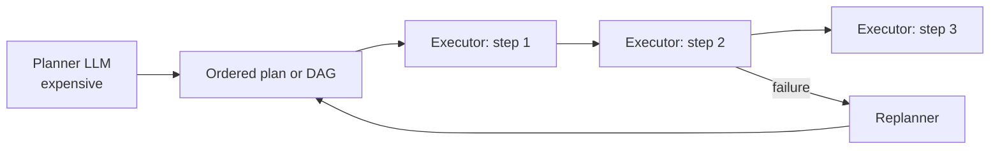
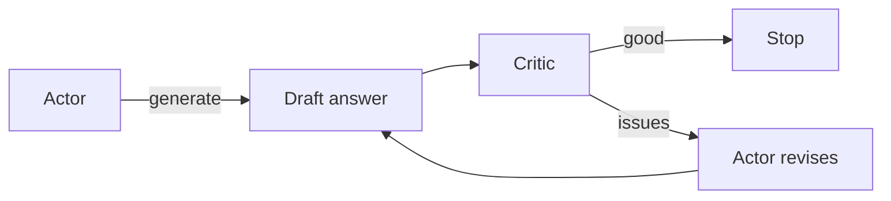

# Foundations: Loops, Tools, Failures

The three control flows (ReAct, Plan-and-Execute, Reflection) plus the production-grade tool layer that all of them depend on.

!!! tip "Rapid Recall"
    **ReAct** = Thought / Action / Observation, repeat. 2026 implementation uses native tool-calling APIs, not text parsing. **Plan-and-Execute** = expensive planner LLM produces a full plan, cheap executors run each step, replan on failure. Wins on cost and parallelism (DAG); loses when tasks can't be pre-planned. **Reflection** = actor generates, critic evaluates, actor revises. Always cap with `max_iterations`. **Tool design**: name, description (the most important field), typed parameter schema; describe what it does, what it returns, when NOT to use it. **Parallel tool calls** are the 2026 default. **Failure handling**: distinguish transient vs permanent vs programming bugs; exponential backoff + jitter for transient; structured error messages for the LLM; idempotency keys for writes.

## §1 — From chatbots to agents: the loop

The difference between a chatbot and an agent isn't sophistication. It's the **loop**. The whole field, ReAct, plan-and-execute, reflection, multi-agent, DeepAgents, is variations on this loop.

### ReAct: Reasoning + Acting (Yao et al. 2022)

The original agent loop. Interleave **Thought → Action → Observation**, repeat until done.

```
Thought:     "User wants weather in Delhi for tomorrow."
Action:      get_weather(city="Delhi", date="2026-05-20")
Observation: {"high": 38, "condition": "clear"}
Thought:     "I have enough to answer."
Final:       "Delhi tomorrow: high 38°C, clear."
```

**One thing to clear up**: in 2022, ReAct was implemented by parsing free-form text outputs ("Action:" prefix, regex extraction). In 2026, ReAct is implemented via **native tool-calling APIs** (OpenAI, Anthropic, Gemini all emit structured tool calls). The pattern is the same; the implementation is cleaner, faster, and more reliable. **Do not implement text-parsing ReAct in 2026.** Use native tool calling.

### Strengths of ReAct

- Trivially simple, fits in 20 lines.
- Transparent, every step shows up as Thought / Action / Observation.
- Works for dynamic tasks where you can't pre-plan.

### Weaknesses

- **Local optima**: greedy step-by-step. No global view.
- **Infinite loops**: agent calls the same tool over and over. Need a step cap.
- **Cost**: N steps = N LLM calls. 10-step task on Claude Opus = real money.
- **Brittle on long horizons**: 30+ steps and the context gets noisy.

### Production form

In real code with native tool calling, the LLM emits a structured `tool_call` block; your runtime executes the tool and appends a `tool_result` message; the LLM sees it on the next turn. The skeleton:

Same ReAct loop as 2022; only the *transport of the tool call* changed. Don't hand-roll the old mechanism in 2026:

| 2022 — text-parsing | 2026 — native tool calling |
|---|---|
| Model *types* `Action: get_weather` as free text | Model *emits* a structured `tool_calls` object |
| You regex/parse the string | Already a parsed dict: `{"name", "args", "id"}` |
| Args are unstructured text → malformed JSON | Args arrive schema-validated as a real object |
| Brittle, no type safety, burns prompt tokens teaching format | Model fine-tuned to produce valid calls; parallel calls as a clean list |

You give the API a tool list with JSON schemas up front; the model returns calls in a dedicated field; you do a dict lookup and return a `ToolMessage`. Modern LangChain: `model.bind_tools([...])` + `ToolNode` — the text-parsing layer is gone.

```python
from anthropic import Anthropic
client = Anthropic()
messages = [{"role": "user", "content": query}]
for _ in range(MAX_STEPS):
    resp = client.messages.create(model="claude-sonnet-4-6", tools=TOOLS_SCHEMA,
                                  messages=messages, max_tokens=2048)
    if resp.stop_reason == "end_turn":
        return resp.content[-1].text
    # Else: tool_use. Execute the tool, append tool_result, continue.
    for block in resp.content:
        if block.type == "tool_use":
            result = TOOLS[block.name](**block.input)
            messages.append({"role": "assistant", "content": resp.content})
            messages.append({"role": "user", "content": [
                {"type": "tool_result", "tool_use_id": block.id, "content": str(result)}
            ]})
```

That's a complete production ReAct agent. Every framework, LangChain `create_agent`, LangGraph's `create_react_agent`, OpenAI Agents SDK, DeepAgents, is some variation of this loop with extras.

## §2 — Plan-and-Execute and Reflection

ReAct is greedy. It picks one step, executes, observes, picks the next. Perfect when you can't predict what comes next, wasteful when you can.

### Plan-and-Execute

**Idea**: an expensive planner LLM produces a full plan upfront. A cheap executor model runs each step. Replanner kicks in only on failure.



**Wins**: cost, you spend the big model's tokens once, not N times. **Parallelism**, independent steps in a DAG can run concurrently (`LLMCompiler`). **Auditability**, the plan is a visible artifact.

**Loses**: real tasks usually can't be fully pre-planned. Bug-fixing, exploratory research, conversation, all need the agent to react to what it sees mid-task. Plan-and-Execute is for **knowable workflows**, not exploratory ones.

**Variants**:

- **LLMCompiler**, plan as a DAG, run independent nodes in parallel.
- **ReWOO** (Reason Without Observation), plan uses placeholders (`#E1`, `#E2`) for tool outputs; the worker fills them in. Cuts roundtrips because the planner doesn't have to wait for each observation.

### Reflection (Self-Critique)

**Idea**: an actor generates an answer; a critic evaluates it; the actor revises based on the critique. Stop when the critic is satisfied or max iterations hit.



**Wins**: catches errors the actor can't see in one shot. Especially powerful when there's a clear success criterion (code compiles, tests pass, schema validates, regex matches).

**Loses**: oscillation, actor and critic can ping-pong without converging. Always set a hard `max_iterations`. Cost, each iteration is 2x the LLM cost (gen + critique).

**Variants**:

- **Self-refine** (same model critiques itself, cheaper, but blind spots overlap).
- **Actor-Critic** (different models, better, costs more).
- **Reflexion** (lessons from past failures stored in episodic memory).

```python
def reflect_and_revise(query, llm, max_iters=3):
    answer = llm.complete(query)
    for _ in range(max_iters):
        critique = llm.complete(f"Critique: {answer}\nReply with issues or 'GOOD'.")
        if "GOOD" in critique:
            return answer
        answer = llm.complete(f"Answer: {answer}\nCritique: {critique}\nRevise.")
    return answer
```

### Tradeoffs at a glance

| | ReAct | Plan-and-Execute | Reflection |
|---|---|---|---|
| Setup cost | Low | Medium | Medium |
| Per-task cost | High (N LLM calls) | Medium (1 plan + N cheap executor calls) | High (2x per iteration) |
| Parallelizable | No | Yes (DAG variant) | No |
| Best for | Dynamic / exploratory tasks | Known workflows, batch tasks | Quality-critical with eval signal |
| Worst at | Long horizons, cost | Tasks where plan changes mid-flight | Tasks without clear success criterion |

### Decision rule

> **Default to ReAct.** It's the simplest baseline that handles dynamic tasks. Wrap in **Plan-and-Execute** when the plan is stable and steps can run in parallel (research 50 papers, refactor 20 files). Add **Reflection** as a layer on top of either when there's a clear success criterion. **Never** add reflection without a `max_iterations` cap.

!!! note "Interview note"
    When asked "ReAct or plan-and-execute?", the answer is never "one or the other." It's: "ReAct for exploration, plan-and-execute when the plan is knowable, often together: a top-level plan-and-execute with ReAct in each step where exploration is needed."

### CoT vs Self-Reflection vs ReAct — three different shapes of reasoning

| Technique | Shape | Core idea |
|---|---|---|
| **Chain of Thought** | Linear reasoning | Generate intermediate steps before the answer. More tokens = more compute; each step conditions the next. **2026 note**: now largely trained-IN via RL (o-series, R1, extended thinking) — shifted from prompt trick to built-in behavior. |
| **Self-reflection** (Self-Refine / Reflexion) | Critique loop | Generate → critique own output → revise. Works because verification < generation. Reflexion adds memory of past failures. Risk: reinforces its own mistakes if the critique is also wrong. |
| **ReAct** (Reason + Act) | Action loop | Thought → Action(tool) → Observation → Thought → … The foundation of most *agents*; grounds reasoning in real observations → less hallucination. CoT is reasoning-only; ReAct is reasoning + acting on the world. |

One line: **CoT** = think step-by-step (now often trained-in); **Self-reflection** = generate, critique, revise; **ReAct** = think-act-observe loop that powers agents.

### The planning capabilities debate — what to actually say

The "can LLMs plan?" thread is one interviewers love. The defensible 2026 position:

- **2022–23**: "LLMs can't plan." Kambhampati / ASU PlanBench / Blocksworld — GPT-4 abysmal, success drops as complexity rises. Framing was "approximate retrieval, not principled reasoning." Self-critique didn't rescue it.
- **2024**: the LLM-Modulo compromise. Even skeptics: "LLMs can't plan, but can *help* planning." Use the LLM as idea-generator / translator / critic + an external verifier or classical planner for guarantees.
- **Late 2024 – 2025**: reasoning models (o1/o3, R1) shift the ground — even skeptics' own re-runs call o1 "a quantum improvement … still far from saturating." The jump is real.
- **2025–26**: line moved, gap persists. Still lag classical planners on hard combinatorial problems; new long-horizon and spatial benchmarks show failures moved to harder regimes ("systemic deficiency in long-term action representation").

Where consensus sits today: (1) capability is real but **degrades with horizon and complexity** — the most robust finding. (2) Split: *autonomous one-shot planning* = weak; *plan-with-scaffolding* (ReAct, verifiers, replanning) = where wins are. (3) **The verifier insight**: planning works reliably when there's a sound verifier to check the plan (which is why coding and math advanced faster — cheap to verify); unreliable when correctness rests on the model's own judgment. (4) Unresolved: "real reasoning vs sophisticated retrieval" is partly empirical, partly definitional.

One-liner for the interview: "From 'can't plan' to 'plans well on short-horizon and verifiable tasks with the right scaffolding,' but autonomous long-horizon planning with guarantees is still unsolved — so production agents pair reasoning models with verifiers + replanning loops rather than trusting one-shot plans."

## §3 — Tool design: schemas, descriptions, parallel calls

A tool is a typed function the LLM can decide to invoke. **A poorly designed tool is the #1 source of agent failures**, the model can't fix a bad tool, but a well-designed tool lets the model recover from almost anything.

### The anatomy of a tool

Every tool has three parts:

1. **A name** the LLM uses to call it.
2. **A description** the LLM reads to decide *whether* to call it.
3. **A typed parameter schema** the LLM uses to format its arguments.

```python
{
  "name": "search_flights",
  "description": "Search for available flights by origin, destination, and date. "
                 "Returns a list of {flight_id, airline, departure, price}. "
                 "Use this when the user asks about flight availability or prices. "
                 "Does NOT book flights, use book_flight for that.",
  "parameters": {
    "type": "object",
    "properties": {
      "origin": {"type": "string", "description": "IATA airport code, e.g. BLR for Bangalore"},
      "destination": {"type": "string", "description": "IATA airport code"},
      "date": {"type": "string", "format": "date", "description": "YYYY-MM-DD"},
    },
    "required": ["origin", "destination", "date"],
  },
}
```

### Description quality matters more than name

The LLM **routes between tools by reading descriptions**, not names. A great name with a terrible description fails; a clear description with a meh name works fine. Three things make a description good:

1. **What it does** in one sentence.
2. **What it returns** (the shape, not just "the result").
3. **When NOT to use it** (the boundary against similar tools).

That last bullet is the most-missed. With 10+ tools, the LLM picks the wrong one *most often* because two tools have overlapping descriptions and no boundary. Always answer: "What's the closest other tool, and how is this one different?"

### Where tool calling actually comes from — it's not magic

A tool call is just **text in a specific format** the model emits, which your runtime intercepts and executes. The training problem isn't "teach a new skill" — it's "reliably produce well-formed, schema-valid format-text instead of prose." The stages stack:

| Stage | Contribution |
|---|---|
| **Pretraining** | Raw JSON/code syntax literacy (emerges for free from code in the corpus) |
| **Special tokens + chat template** | Standardized parseable structure: tool-call markers, `tool` role, result separators |
| **SFT (the core)** | Format + argument extraction + when-to-call, from synthetic *verified* traces. Includes negatives (don't over-call), ambiguity, parallel calls, error-recovery. Data is heavily synthetic, filtered for: does JSON parse? do args match schema? right function? |
| **RL (especially verifiable rewards)** | Sharpens selection, arg accuracy, restraint. Tool correctness is *programmatically checkable* → clean reward (a big reason agentic models improved fast) |
| **Constrained decoding (inference, not training)** | Guarantees syntactic validity by *masking* tokens that violate the schema at each step (Outlines, XGrammar, GBNF) |

**Division of labor**: training makes the model *want* the right structure and content (which tool, what args); constrained decoding *guarantees* the output parses. You need both — perfect JSON with wrong args is useless, and a right call with broken JSON is useless. No new architecture; same next-token engine, just shaped by data and constraints.

### Parameter types matter for reliability

| Type signal | Why |
|---|---|
| Use `enum` when values are constrained | LLM can't hallucinate an invalid value |
| Use `format: date` / `date-time` / `email` | Validators reject malformed input before the tool runs |
| Use Pydantic models for nested args | Schema generation + validation for free |
| Required vs optional fields | The LLM defaults optional fields, asks for required ones |
| Defaults baked into the schema | Reduces the cognitive load on the LLM |

### Parallel tool calls — the 2026 default

Modern APIs (Anthropic, OpenAI, Gemini) can emit **multiple tool calls in one turn** when they're independent. Your runtime should execute them in parallel and return all results together.

```
Bad (sequential):              Good (parallel):
get_weather("Delhi")           get_weather("Delhi")     ──┐
↓ wait                         get_weather("Bangalore") ──┤── all return together
get_weather("Bangalore")       get_weather("Mumbai")    ──┘
↓ wait
get_weather("Mumbai")          → 1 round-trip, not 3
```

Anthropic's research-system blog (June 2025) explicitly tells lead agents to use parallel tool calls when spawning subagents:

> *"You MUST use parallel tool calls for creating multiple subagents (typically running 3 subagents at the same time) at the start of the research, unless it is a straightforward query."*

```python
async def execute_parallel(tool_calls, tools):
    tasks = [tools[tc.name](**tc.args) for tc in tool_calls]
    return await asyncio.gather(*tasks, return_exceptions=True)
```

### Side effects and idempotency

Tools that *read* (search, fetch, query) are safe to retry. Tools that *write* (send, create, charge, delete) are not, retrying after a partial failure can cause double-sends, double-charges, duplicate database rows.

**Two ways to handle this:**

1. **Make the tool idempotent.** Accept an `idempotency_key` that the runtime sets per call; the underlying service deduplicates. (Stripe, AWS APIs work this way.)
2. **Require explicit approval before destructive calls.** The agent proposes the action; a human-in-the-loop confirms; only then does the runtime execute. The 2026 default for anything involving money, deletion, or external messaging.

### Tool selection at scale

With 50+ tools, the LLM's tool-selection accuracy drops sharply. Three fixes:

| Fix | How |
|---|---|
| **Tool retrieval** | Embed tool descriptions; on each turn, retrieve top-K relevant tools and only show those to the LLM |
| **Tool namespacing** | Group tools: `gmail.send`, `gmail.search`, `calendar.create`. The LLM picks the namespace first |
| **MCP servers** | Discovery becomes standardized; the LLM doesn't need to know all tools upfront |

!!! note "Interview note"
    A question that catches candidates: *"You have 100 tools, accuracy drops. What do you do?"* The wrong answer is "use a bigger model." The right answer is **tool retrieval**: embed descriptions, retrieve top-5 per query, only show those. Same trick as RAG, applied to tools.

## §4 — Tool failures and retry logic

Tools fail. Networks blip. Rate limits trip. Auth tokens expire. APIs change their response shapes. The question is not *whether* your tools fail, it's whether your agent recovers gracefully or spirals.

### Three error categories

| Category | Examples | Right response |
|---|---|---|
| **Transient** | 5xx errors, network timeouts, rate-limit 429s | **Retry with backoff** |
| **Permanent** | 400 bad-request, 404 not-found, validation error | **Don't retry. Tell the LLM what went wrong.** |
| **Programming bugs** | KeyError, TypeError, IndexError in your tool code | **Don't hide. Fix the tool.** |

Conflating these is the #1 source of broken agents. Retrying a 400 just hammers the API; not retrying a 5xx makes the agent give up too early.

### Exponential backoff

For transient errors, retry after waiting `base × 2^attempt` seconds. **Add jitter** (random 0-1s on top) to avoid the thundering-herd problem when many agents retry simultaneously.

```
attempt 1: wait 1s + jitter
attempt 2: wait 2s + jitter
attempt 3: wait 4s + jitter
give up after 3-5 attempts
```

After max attempts, **surface the failure to the LLM as an observation**. Don't silently swallow it, the LLM can decide whether to try a different tool, ask the user, or give up.

### Idempotency: the prerequisite for safe retries

Retrying a `GET` is safe. Retrying a `POST` is dangerous unless the API supports idempotency keys.

```python
import uuid
def send_email(to, subject, body, idempotency_key=None):
    key = idempotency_key or str(uuid.uuid4())
    return api.send(to=to, subject=subject, body=body, Idempotency_Key=key)
```

The first call sends. A retry with the same key, even if you don't know the first one succeeded, gets a deduplicated response. Stripe, AWS, Twilio, and most modern APIs support this. Use it.

### Surfacing errors to the LLM (not hiding them)

The biggest mistake: wrapping every tool in a try/except that returns `"Error"` and nothing else. The LLM can't recover from "Error", but it can recover from a *specific* error message:

```python
try:
    result = tool.run(**args)
except RateLimitError:
    result = {"error": "RateLimitError", "retry_after_seconds": 30,
              "suggestion": "Wait or use a less frequent tool"}
except NotFoundError:
    result = {"error": "NotFound", "message": f"No record with id={args['id']}",
              "suggestion": "Verify the id is correct"}
except Exception as e:
    result = {"error": type(e).__name__, "message": str(e)}
```

A well-formed error observation lets the LLM reason about it. A bare "Error" causes infinite retries or premature failure.

### Fallbacks: when retries aren't enough

For critical paths, define a fallback tool. Primary `web_search` (paid, high quality) → fallback `duckduckgo_search` (free, ok quality). The LLM only sees the unified interface; the wrapper picks which backend to use.

### Putting it together

The production pattern for tool execution:

```
1. Validate args against schema           → permanent error if invalid
2. Apply idempotency key for writes
3. Call the tool with timeout
4. On transient failure → exponential backoff + jitter, up to N retries
5. On permanent failure → return structured error message
6. On success → return result
7. Always return something the LLM can parse
```

### Tool calling security

Treat tool descriptions as **untrusted** if they come from external sources (MCP servers). Malicious descriptions can prompt-inject. Always whitelist tools, require explicit user consent for destructive actions (delete, send, pay).

## Interview Questions

**Q1: Walk through a ReAct loop for "book a flight to Bangalore tomorrow morning."**

Thought: "Need flight options for BLR on 2026-04-19 morning." Action: `search_flights(dest="BLR", date="2026-04-19", time="morning")`. Observation: 5 flights. Thought: "Ask for preference." Action: `ask_user("cheapest or direct?")`. Observation: "cheapest." Thought: "Book cheapest." Action: `book_flight(id=X)`. Observation: confirmation. Final answer.

**Q2: Your ReAct agent loops on the same tool call. What do you add?**

Three things: (1) hard step cap (10–15 iters), (2) dedup check, same action + args twice triggers reflection, (3) tool-call history in context so model sees its own repetition. System prompt: "If you've called this tool already, try something different."

**Q3: When would you pick plan-and-execute over ReAct?**

When the plan is knowable upfront and steps can be parallelized. Examples: batch refactoring 50 functions, researching 10 known topics. ReAct wins for bug fixing, exploratory research, dynamic conversation. Plan-and-execute wins for deterministic workflows.

**Q12: Trap — someone designs a reflection loop with no stopping criterion.**

Will run forever or until token budget blows up. Reflection needs: (a) explicit `max_iterations` cap, (b) critic output format that clearly signals "done" (e.g., "GOOD ENOUGH"), (c) early-stop heuristic (if critique is vague or repeats previous critique, stop). Without these, observed production incidents: 50+ iterations of minor rewording, 20x expected cost.

---
