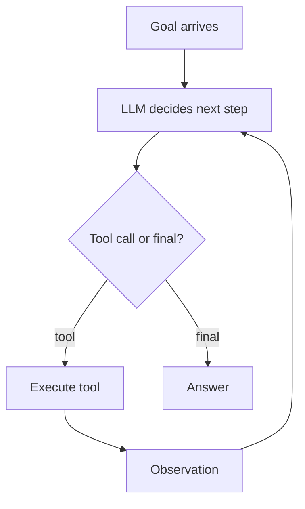
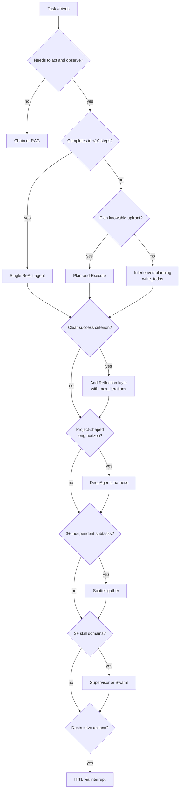

# Agents & Orchestration

How LLMs think, plan, remember, and coordinate. The whiteboard layer most Tier-1 AI interviews spend time on in 2026.

!!! tip "Rapid Recall"
    An **agent** is an LLM in a loop: take goal → decide next step → call tool → observe → decide again. Three core loops: **ReAct** (greedy, dynamic), **Plan-and-Execute** (knowable workflows, parallelizable), **Reflection** (quality-critical, needs success criterion). Memory is a hierarchy: working / short-term / long-term / episodic / semantic / procedural, distinct lifetimes and stores. Always filter long-term memory by `user_id` at the DB layer. Multi-agent costs ~**15x** more tokens than single-agent (Anthropic) — only use it when value justifies it. Four patterns: **supervisor**, **swarm**, **scatter-gather**, **hierarchical**. Wrap destructive actions in **HITL** via LangGraph `interrupt`. At any production scale, the server is **async** with streaming and durable checkpointing.

## The agent loop

A chatbot takes a message and produces a reply. An **agent** takes a goal, decides what to do, takes an action, observes the result, and decides again, until the goal is reached or something stops it.

The whole field — ReAct, plan-and-execute, reflection, multi-agent, DeepAgents — is variations on this loop.

### Why the loop matters more than the LLM

A common mistake: thinking "agents = smarter LLM." False. The same LLM, *with* a loop and *with* tools, can solve problems no amount of single-shot prompting can solve, because:

1. **It can take actions in the world.** Read files, query databases, send emails, write code. A chatbot can only output text.
2. **It can observe results.** Did the API call work? What did the database return? Was the test green? Single-shot prompting can't react to anything.
3. **It can self-correct.** Wrong answer → realize from the observation → try again. Chatbots can't.
4. **It can compose.** Five tools used in sequence produces behavior no single tool could produce alone.

## The agent design decision tree

You now have the vocabulary for every common decision in agent design. The order to walk through them:

## Section guide

| Page | Covers |
|---|---|
| [Foundations](foundations.md) | ReAct, Plan-and-Execute, Reflection, tool design and schema, parallel tool calls, failure modes and retry |
| [Memory, Routing, Planning, HITL](memory-routing-planning.md) | Six memory types, consolidation, privacy, model/tool/agent routing, `write_todos` planning, LangGraph interrupts |
| [Sync, Async & Multi-Turn State](sync-async-state.md) | Four execution modes, why agents must be async at scale, streaming, background jobs, multi-turn state and the three failure modes |
| [Multi-Agent Topologies](multi-agent-topologies.md) | When multi-agent is worth 15x cost, supervisor, swarm, scatter-gather, hierarchical, Anthropic research system, DeepAgents, custom handoffs |

For graph mechanics (reducers, `Command`, `Send`, checkpointers, time-travel) see the [LangGraph](../langgraph/index.md) section. For protocols (MCP, A2A) and coding agents see [Protocols & Coding Agents](../protocols/index.md). For evaluation, serving, monitoring, and guardrails see [Evaluation & Monitoring](../eval/index.md) and [Serving, Infra & Guardrails](../serving/index.md).

## Layer Checklist

- [ ] Can you describe ReAct, plan-and-execute, reflection each in 30s with use cases?
- [ ] Can you design a four-layer memory system for a stateful chat assistant?
- [ ] Can you define a tool schema and explain why description quality matters?
- [ ] Can you write a LangGraph StateGraph with conditional edges and a reducer?
- [ ] Can you explain checkpointing and why v1.0 requires TypedDict not Pydantic?
- [ ] Can you list the four multi-agent patterns and pick the right one for a use case?
- [ ] Can you name three v1.1 middleware types and when to use each?
- [ ] Can you spot three failure modes in a candidate's multi-agent architecture?

## Numbers worth remembering

| Number | What | Context |
|---|---|---|
| **15x** | Token cost of multi-agent vs single-agent | Anthropic blog, justifies multi-agent only for high-value tasks |
| **90.2%** | Improvement of Opus-lead + Sonnet-subagents over single-Opus | Anthropic research evals |
| **3-10** | Tool calls per subagent on fact-finding | Anthropic scaling rule |
| **2-4** | Subagents for comparison tasks | Anthropic scaling rule |
| **10+** | Subagents for complex research | Anthropic scaling rule |
| **25** | Default `recursion_limit` for supervisor graphs | Higher = suspicious of looping bug |
| **4K-8K tokens** | When to summarize-buffer conversation | Prevents context overflow |
| **3-5 retries** | Max for transient errors with exponential backoff | Don't retry permanent errors |
