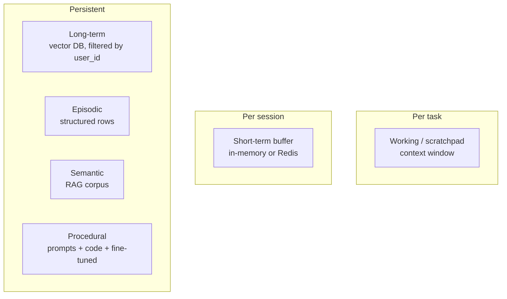
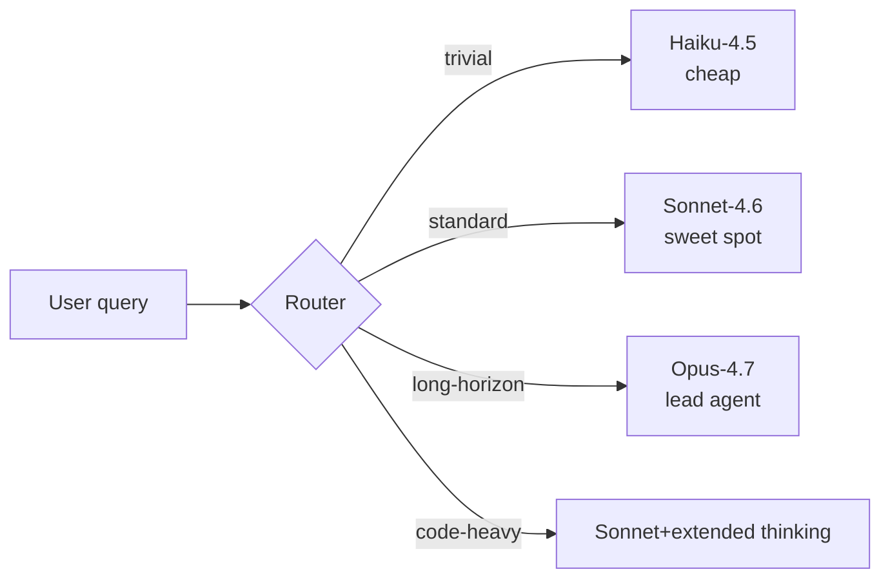

# Memory, Routing, Planning, HITL

The four cross-cutting capabilities every production agent needs: a memory hierarchy that doesn't leak between users, routing that picks the right model/tool/agent, planning that keeps the agent coherent over long horizons, and human-in-the-loop for high-stakes actions.

!!! tip "Rapid Recall"
    **Memory hierarchy** has six types varying on two axes: **lifetime** (turn/session/forever) and **structure** (text/vector/row/code). Don't cram everything into one vector store; each type has a different access pattern. **Privacy**: filter by `user_id` at the database level, not the application level. **Routing** has three flavors (model, tool, agent) and three implementations (LLM picks, classifier, conditional edge). Use a classifier when you have 10+ tools or need cost-controlled model routing. **Planning as context engineering**: `write_todos` is a no-op tool, the value is anchoring the agent's own reasoning. Interleaved planning is the 2026 default for long tasks. **HITL** via LangGraph `interrupt`: pause for hours/days, fully durable, resume on `Command(resume=...)`. Use for destructive, money-moving, external messaging.

## §5 — Memory taxonomy: working, short-term, long-term, episodic, semantic, procedural

LLMs are stateless. Every API call starts fresh, nothing carries over unless you put it in the prompt. **An agent that needs to do anything across more than a single turn needs to manage its own memory.** This is unintuitive and skipped by most tutorials.

Memory in production agents is not one thing, it's a hierarchy, just like in cognitive science.

### The six types you'll be asked about

| Type | What it holds | Lifetime | Where it lives | Cost |
|---|---|---|---|---|
| **Working / scratchpad** | Current task: thoughts, intermediate results, draft outputs | This task only | Context window (in the prompt) | Free, but eats tokens |
| **Short-term** | Recent conversation messages | Current session | Context window or in-memory cache | Free, but eats tokens |
| **Long-term** | Persistent facts, user preferences, past conversations | Indefinite | Vector DB + structured DB | Storage + retrieval cost |
| **Episodic** | Discrete past events with timestamp + outcome | Indefinite | Structured DB (Postgres, BigQuery) | Storage |
| **Semantic** | General knowledge / concepts (think: the corpus in a RAG system) | Indefinite | Vector DB | Same as RAG |
| **Procedural** | How to do things, learned routines, "skills" | Indefinite | Code + prompts, sometimes fine-tuned | Storage + maintenance |

Don't get lost in the labels. The thing to internalize is the **two axes** they vary on:

1. **Lifetime**, does this last for one turn, one session, or forever?
2. **Structure**, is this a chunk of text, a vector, a row in a table, or actual code?

### Memory taxonomy at a glance



### Working memory (scratchpad)

The LLM's "thinking out loud" within a single task. Holds intermediate calculations, the plan, partial drafts. **Lives in the context window**, usually as the running message history, or in a structured `state` dict in LangGraph.

```python
class AgentState(TypedDict):
    messages: list           # the running message history
    plan: list[str]          # the agent's plan, populated by a planner node
    intermediate_results: dict
    draft_answer: str
```

### Short-term memory (conversation buffer)

The last N messages of the current chat session. Three strategies for managing it as it grows past the context budget:

| Strategy | How | Trade-off |
|---|---|---|
| **Buffer window** | Keep last N messages, drop the rest | Simple. May lose important early context |
| **Summary buffer** | Summarize older messages into one "summary so far" system message; keep recent N verbatim | Preserves gist, loses precise wording |
| **Token-bounded** | Track total tokens; drop oldest until under budget | Most precise control |

**Production default**: summary buffer once you cross ~4K tokens, with the summary regenerated every N turns. The 2026 LangChain middleware has a `SummarizationMiddleware` that does this automatically.

### Long-term memory

User-specific persistent facts: preferences, past interactions, learned patterns. **The structure is RAG, applied to a per-user index** rather than a corporate document corpus.

```
On every turn:
  1. Embed the user's message
  2. Retrieve top-K relevant memories for this user_id
  3. Inject them into the system prompt as context
  4. Run the agent
  5. Maybe consolidate new memories
```

Privacy is critical: **always filter by `user_id`**. Don't reuse a single embedding index across users without strict per-user partitioning, or you'll leak data between accounts.

### Episodic memory

Structured records of specific events. Not text chunks, **typed rows** with timestamps and outcomes. Used for:

- **Reflexion-style learning**: store lessons from failures, retrieve them when similar tasks come up.
- **Trajectory replay** during debugging.
- **Audit trails** for compliance.

```python
class Episode(BaseModel):
    timestamp: datetime
    user_id: str
    task: str
    actions_taken: list[str]
    outcome: Literal["success", "failure", "partial"]
    lesson: Optional[str]
```

The discriminator between episodic memory and a log: **a log is write-only (a human reads it offline); memory is read back at inference (the agent reads it and acts differently)**. The test for every candidate use case: *"Will the agent look this up later and change its action?"* If no → it's a log with extra steps.

Cases that genuinely pass the test:

- **Failure avoidance** — "last time in this env, `sudo` failed → use `pip --user`." The agent skips known dead ends. The strongest case.
- **Cross-session personalization** — learns "this user wants type hints, prefers pytest" over weeks.
- **Self-mined few-shot** — stores a successful trajectory, retrieves the closest one as a dynamic in-context example for a similar task.
- **Long-horizon resumption** — reconstruct "what did I already try and conclude" after context is gone.
- **Loop-breaking** — "I've tried 4 things in this family, all failed → escalate."

When *not* to bother: single-turn / short-session agents, when a semantic fact store suffices, when the lesson is universal (just hardcode it), pure debugging (that's a log).

### Procedural vs episodic — the consolidation pipeline

**Episodic** = a record of a specific past event, kept as an instance, retrieved by similarity — answers *"what happened?"* **Procedural** = a generalized routine distilled from many events, kept as reusable know-how (prompt text, code, a skill file, fine-tuned weights) — answers *"how do I do this?"* Procedural is what you get when you compress many episodes into a skill and throw the instances away.

<figure class="diagram diagram-dark" markdown="0">
<svg viewbox="0 0 760 170" xmlns="http://www.w3.org/2000/svg">
  <defs><marker id="arr4" markerwidth="9" markerheight="9" refx="7" refy="4.5" orient="auto"><path d="M0,0 L9,4.5 L0,9 Z" fill="#e0a64b"/></marker></defs>
  <rect x="30" y="55" width="190" height="60" rx="10" fill="#211d15" stroke="#a892c4" stroke-width="1.5"/>
  <text x="125" y="80" text-anchor="middle" class="svg-title">Episodic</text><text x="125" y="98" text-anchor="middle" class="svg-sub">specific instances</text>
  <rect x="290" y="55" width="170" height="60" rx="10" fill="#16140f" stroke="#e0a64b" stroke-width="1.5"/>
  <text x="375" y="80" text-anchor="middle" class="svg-title" style="fill:#f4c06a">Consolidation</text><text x="375" y="98" text-anchor="middle" class="svg-sub">distill + prune</text>
  <rect x="530" y="55" width="200" height="60" rx="10" fill="#211d15" stroke="#6fb3a8" stroke-width="1.5"/>
  <text x="630" y="80" text-anchor="middle" class="svg-title">Procedural + Semantic</text><text x="630" y="98" text-anchor="middle" class="svg-sub">reusable rules &amp; facts</text>
  <line x1="220" y1="85" x2="286" y2="85" stroke="#e0a64b" stroke-width="2" marker-end="url(#arr4)"/>
  <line x1="460" y1="85" x2="526" y2="85" stroke="#e0a64b" stroke-width="2" marker-end="url(#arr4)"/>
  <text x="375" y="140" text-anchor="middle" class="svg-sub">the value is the flow between them</text>
</svg>
<figcaption>Episodes are the raw material that consolidation distills into procedures and semantic facts. The flow is the value.</figcaption>
</figure>

Procedural is the higher-leverage workhorse (cheap, reliable repeated work — Claude's Skills are procedural memory). But episodic is **non-optional** because (1) it's the distillation source — no episodes, nothing to learn from; (2) irreducibly instance-specific recall (this user, this paused task); (3) concrete-example retrieval. Priority order in practice: **semantic facts > procedural routines > episodic.**

### Claude Dreaming — consolidation as a feature

Anthropic launched **Dreaming** in May 2026 (research preview): a scheduled **background** process that reviews an agent's past sessions and rewrites its memory store — removing duplicates, replacing stale entries, surfacing new patterns. It does *not* touch model weights; it updates the external memory layer.

In the memory vocabulary above: **Dreaming is not a memory type — it's the consolidation operation between types.** Input = episodic (session transcripts, up to ~100 per dream). Process = reflection and distillation. Output = procedural + semantic (preferences, recurring task patterns, learned facts, corrected beliefs), plus pruning of the stored set.

The name mirrors REM-sleep consolidation: the brain replays the day's events and turns hippocampal episodic traces into cortical semantic and procedural knowledge. It's exactly the episodic → procedural pipeline, run offline.

The design lesson is model-agnostic: **capture and consolidation are separate stages**. Experience *capture* is cheap and inline (sessions write episodes); experience *consolidation* is expensive and batched (the "dream" rewrites the durable store). You can prototype the whole loop yourself.

### Semantic and procedural — the often-skipped pair

**Semantic memory** is shared general knowledge. In an enterprise agent, it's the company's documentation corpus, exactly what we built RAG over. The line between "long-term memory" and "semantic memory" is fuzzy: long-term = user-specific, semantic = world/domain knowledge.

**Procedural memory** is *how to do things*. Procedures the agent has learned: how to file an expense report, how to escalate a ticket, the steps in a deployment workflow. In practice this lives as **prompt templates + code**, not vectors. Some teams fine-tune small models on procedural data to bake it in.

### The architectural mistake to avoid

Don't put everything in one giant vector store. Each memory type has a different access pattern:

- Working memory needs **read/write per step** → in-memory state.
- Short-term needs **append + window** → list with summarization.
- Long-term needs **similarity search filtered by user_id** → vector DB.
- Episodic needs **structured queries on timestamps and outcomes** → SQL or document DB.

Cramming all four into one vector store gives you slow, fuzzy retrieval for queries that should be exact lookups.

## §6 — Memory consolidation, retention, and privacy isolation

Storing everything is bad. Storing nothing is bad. Memory management = **deciding what's worth keeping**, and **getting rid of what isn't**.

### When to promote something to long-term memory

Not every message in a chat deserves to live forever in the user's memory store. Four promotion heuristics:

1. **Explicit signal**, user says "remember this" or "from now on, prefer X."
2. **Repetition**, same thing mentioned 3+ times.
3. **High-value event**, task completion, explicit correction, preference statement.
4. **LLM judgment**, at the end of a session, ask a small model "is anything here worth remembering long-term?"

The combination is strongest. Always store explicit signals. Use the LLM judge for the rest.

### Retention policy

| Memory type | Retention rule |
|---|---|
| Working | Discard at task end |
| Short-term | Drop after session expires (e.g. 24 hours of inactivity) |
| Long-term | Retain indefinitely, but tier: hot (recent + frequent) vs cold (archive) |
| Episodic | Retain by regulation: financial data 7 years, support tickets 1 year |

The cold-tier trick saves a lot of money at scale. Move memories older than 90 days from your hot vector index to a cheaper store (S3, archive table) and re-promote them on miss.

### The privacy isolation pattern

The single most important rule: **every retrieval against long-term or episodic memory MUST filter by user_id at the database level, not the application level.**

```python
# WRONG — application-level filter
memories = vector_db.search(query_embedding, k=5)
memories = [m for m in memories if m.user_id == current_user]  # leak risk

# RIGHT — database-level filter
memories = vector_db.search(
    query_embedding, k=5,
    filter={"user_id": current_user}
)
```

Why does the wrong version leak? Because `k=5` from the unfiltered search might return 5 *other users'* documents. The application-level filter then returns an empty list, but a logging system or a tool that captured the unfiltered results has already seen them.

### Memory hallucination — a real failure mode

If your agent uses an LLM to summarize and store memories, it can hallucinate facts into the memory store. Three turns later, the same user gets a confidently wrong "I remember you mentioned X", except they never did.

**Defenses**:

- Validate factual claims before writing (does this quote actually appear in the conversation?).
- Store memories with provenance: which message did this come from?
- Periodically audit by sampling memories and checking against source.

!!! warning "Interview trap"
    Candidate proposes "the agent summarizes the conversation at the end and stores the summary as a memory." Ask: *what stops the summary from being wrong?* Right answer: validation against the source transcript, plus provenance tracking.

## §7 — Routing: model, tool, and agent routing

"Routing" in an agent system means choosing one of N options given the current state. Three flavors, all with the same shape:

| Routing type | Choices | Example |
|---|---|---|
| **Model routing** | Cheap vs. premium LLM | Trivial query → Haiku; complex reasoning → Opus |
| **Tool routing** | Which tool to call | Refund question → policy DB; weather question → API |
| **Agent routing** | Which subagent / specialist to invoke | Code change → coding agent; research → research agent |

All three are decisions made *during* the agent loop. The same routing primitives apply to all three.

### Router topology



### Three ways to implement routing

#### 1. The LLM itself routes (tool-call routing)

The simplest pattern, the 2026 default for tool routing. The LLM sees all tools in the prompt and emits a tool call. No separate router code.

**Wins**: zero extra latency; the LLM's intent is visible.
**Loses**: with 50+ tools, accuracy drops; no way to constrain the choice from outside.

#### 2. Explicit classifier in front of the LLM

A small/cheap model (or a fine-tuned classifier) maps the user query to a category, and the application picks the model/tool/agent.

**Wins**: deterministic, fast, cheap. You can train it on your data.
**Loses**: another moving part; classifier must be kept in sync as categories evolve.

This is what "**Adaptive RAG**" is: a router decides whether to skip retrieval, do a single retrieval, or enter a corrective loop.

#### 3. Conditional edges in a graph (LangGraph)

A function on the agent's state returns the name of the next node. The graph executes accordingly.

```python
def route_by_intent(state):
    if state["intent"] == "refund": return "refund_agent"
    if state["intent"] == "billing": return "billing_agent"
    return "general_agent"

builder.add_conditional_edges("classifier", route_by_intent,
                              {"refund_agent": "refund_node",
                               "billing_agent": "billing_node",
                               "general_agent": "general_node"})
```

This is how multi-agent supervisors work.

### Model routing — the cost lever you'll be asked about

In 2026, the smartest single decision in cost optimization is **route easy queries to cheaper models**:

| Query type | Route to | Why |
|---|---|---|
| Trivial classification, simple lookup | Haiku 4.5 / GPT-4o-mini | ~1/10 the cost |
| Standard reasoning, RAG, single-agent work | Sonnet 4.6 / GPT-5.x | Sweet spot |
| Long-horizon planning, multi-agent leadership | Opus 4.7 / GPT-5 Pro | Worth the premium for the orchestrator |
| Code generation, complex reasoning | Sonnet 4.6 with extended thinking, or Opus | Quality matters most here |

The Anthropic research-system blog explicitly used **Opus as the lead agent and Sonnet as the subagents**, the lead does the harder thinking, subagents do the bounded fetches. They report this beats a single Opus call by 90.2% on research evals at meaningful but bounded cost.

!!! note "Interview note"
    *"How would you cut your agent's bill in half?"* The right first answer is "**model routing**, classify queries by complexity, send the easy ones to a smaller model." Caching and trimming come next, but routing usually wins biggest.

### A tactical anti-pattern: routing for the sake of routing

Adding a classifier *before* a capable LLM that could route itself is wasteful when:

- You only have 2-3 tools.
- Latency budget is tight.
- The classifier's accuracy isn't measurably better than the LLM's intrinsic tool selection.

**Default: let the LLM route tools.** Add an explicit classifier when (a) you have 10+ tools, (b) you want cost control via model routing, or (c) you need an audit log of every routing decision.

### Classifier vs cross-encoder — different tools for different routing shapes

The category error to avoid: **a cross-encoder *is* a classifier** — a pairwise one. The real question is *what you score against*.

- **Classifier** scores `query → label` over a *fixed closed set*, one forward pass, jointly-trained decision boundaries.
- **Cross-encoder** scores `(query, candidate) → relevance` for *arbitrary candidates* (concatenated, full cross-attention), one forward pass *per candidate*. No fixed label set.

| | Closed, small, stable destinations | Large / open / changing pool |
|---|---|---|
| **Use** | Classifier (or LLM structured output) | Cross-encoder rerank on a cheap first-stage retriever |
| **Example** | Billing / tech / sales intent | Tool selection from a dynamic catalog (e.g. a quote subagent) |
| **Cost** | 1 forward pass total | 1 pass per candidate (so narrow first) |

A large or changing tool catalog is a retrieval problem (retrieve-then-rerank), and a new tool is just an *input*, not a retrained class. The edge case: if routes grow large and dynamic (hundreds of specialists), routing *becomes* retrieval and the cross-encoder becomes right for routing too.

The real ladder in practice: **LLM structured-output router** (default, flexible, `Literal[...]`) → **trained lightweight classifier** (cheap and fast at volume on fixed routes) → **cross-encoder rerank** (destinations are a large or dynamic pool).

## §8 — Planning patterns: write_todos as context engineering

We covered plan-and-execute as one of the three core agent loops. This section goes deeper on a related but distinct idea: **planning as context engineering**, which is the trick that powers Claude Code and DeepAgents.

### The write_todos pattern (the Claude Code trick)

Here's the surprising thing. Claude Code's planning tool is, mechanically, a **no-op**: it doesn't execute anything. It's a tool the agent calls to write down a todo list, mark items complete, and adapt the plan. The "tool" stores the plan in the agent's own state.

So why does it work?

Because **the act of writing down a plan, in the context window, changes the agent's subsequent behavior.** Three effects:

1. **Anchoring**: subsequent reasoning is grounded against the written plan. The agent doesn't drift.
2. **Progress tracking**: marking items complete frees the agent to focus on what's left, instead of re-deriving what's done.
3. **Long-horizon coherence**: across 50+ turns, the plan stays visible. The agent doesn't lose the thread.

This is what "context engineering" means in 2026. **The plan isn't for the user, it's for the agent itself.** You're shaping its working memory.

DeepAgents bakes this in: every agent gets a `write_todos` tool. It's not optional. Combined with the filesystem (offload large results) and subagents (isolate sub-task context), it's how a single agent stays coherent over hour-long tasks.

### Three planning styles

| Style | Plan when | Replan when |
|---|---|---|
| **Plan-then-execute** | Once, upfront | Never (or on full failure) |
| **Interleaved** (write_todos) | Upfront, *and* updated after each step | Continuously |
| **Reactive** (pure ReAct, no plan) | Never | N/A |

**Plan-then-execute** is best for batch workflows where the plan is stable (refactor 50 files; run 10 fixed checks).

**Interleaved** is the 2026 default for long, complex, exploratory tasks. The Claude Code / DeepAgents style.

**Reactive** is best for short, dynamic tasks where pre-planning would be wasted (one-shot questions, simple tool chains).

### Plan revision

The planner needs to know when its plan is wrong. Three signals:

1. **Tool failures**, a step failed, can we route around it?
2. **Unexpected results**, observation contradicts the plan's assumption.
3. **New information**, discovered something that requires a different approach.

In practice, after each step, the agent calls `write_todos` again to update the plan based on what it just learned. This is *cheaper* than the user thinks, the model already has the full context loaded, the tool call is essentially free, and the explicit re-write keeps the plan fresh.

### Plan-and-execute as a DAG (LLMCompiler)

For genuinely independent steps, you don't need to execute them in sequence. Build a DAG, run independent branches in parallel:

```
research_topic_A ──┐
research_topic_B ──┼──→ aggregate ──→ write_report
research_topic_C ──┘
```

LLMCompiler does this automatically: the planner emits a DAG, the executor runs branches in parallel. **Anthropic's research system uses this pattern.** The lead agent spawns 3+ subagents in parallel (parallel tool calls), each researches one topic, all return to the lead which aggregates.

!!! note "Interview note"
    *"What's the difference between a plan-and-execute agent and DeepAgents?"* DeepAgents is a *harness*, not a pattern. It bakes in the **interleaved** planning style (`write_todos`), a filesystem for context offloading, subagents for isolation, and a Claude Code-style system prompt. The "plan" in DeepAgents is the running todo list, not a one-shot DAG.

### Failure modes of planning

| Failure | Cause | Fix |
|---|---|---|
| Plan is wrong, agent follows it anyway | No revision step | Force re-plan after every step (interleaved) |
| Plan oscillates (rewritten every step with no progress) | Critic too strict, or success criterion unclear | Add cooldown, don't re-plan unless progress stalled for 2+ steps |
| Plan is too granular (50 todo items) | Planner over-thinks | System prompt: "plan in ≤7 high-level steps" |
| Plan is too coarse (1 todo: "do everything") | Planner under-thinks | System prompt: "break into 3-7 concrete steps before executing" |

Most planning bugs are prompt bugs. Tune the planner's prompt before tuning the code.

## §9 — Human-in-the-loop with LangGraph interrupts

Some agent actions cost real money or affect real people: sending an email, charging a card, deleting a file, deploying code. For these, you don't want the agent to "decide and execute" in one motion, you want it to **decide, pause, get human approval, then execute.**

This is human-in-the-loop (HITL). LangGraph's `interrupt` primitive makes it elegant.

### The mechanism

A node can call `interrupt(payload)`, the graph pauses, the payload is returned to the caller, and the agent's state is **checkpointed** to a durable store. Hours or days later, a separate process calls the graph again with a `Command(resume=human_input)`, the graph picks up where it left off, with the human's input substituted for the interrupt's return value.

```mermaid
flowchart TD
  P[propose_action node<br/>state has proposed action] --> H[human_approval node<br/>interrupt payload]
  H -. graph pauses, state persisted .-> UI[front-end shows action<br/>human approves or rejects]
  UI -. graph.invoke Command resume .-> H2[human_approval resumes<br/>decision = resume value]
  H2 --> E[execute_action only if approved]
```

The graph doesn't hold a thread or process while waiting. The state is **fully persisted**. A pause can last hours, days, even weeks, the graph just resumes when the human clicks the button.

### When to use HITL

| Trigger | Example |
|---|---|
| Destructive actions | Delete a file, drop a table, cancel an order |
| Money-moving actions | Send a payment, issue a refund, place an order |
| External messaging | Send an email, post to social media, message a customer |
| Sensitive content review | Agent's draft about a delicate topic before it goes out |
| High-stakes decisions | Approve a contract, file a legal document |
| Onboarding | Verify user identity, collect missing required data |
| Cost-bounded escalation | Agent has spent $X on retries, confirm before more |

### When NOT to use HITL

| Anti-pattern | Why |
|---|---|
| Every tool call requires approval | Defeats the agent's purpose; user fatigue → rubber-stamp approval |
| Approval on read-only actions | Adds latency, no risk to mitigate |
| Approval AFTER the side-effect has happened | The horse has bolted |

### The four interrupt patterns

1. **Approve / reject before action**, most common.
2. **Edit the proposed action**, human modifies the agent's draft, then runs.
3. **Switch to human handoff**, agent recognizes it's out of depth, escalates to a human operator.
4. **Inject missing info**, agent paused because a field was missing; human fills it in.

### Failure modes

| Issue | Mitigation |
|---|---|
| Stale interrupts (pause for too long, business state changes) | TTL on threads; re-validate before executing approved actions |
| Approval bypass via prompt injection | The interrupt is structural, not text-based, but the approved action's args still need validation |
| Notification fatigue | Batch approvals, use confidence threshold (only interrupt if confidence < X) |
| Human-in-the-loop becomes the bottleneck | Confidence-based: interrupt only on high-stakes OR low-confidence actions |

!!! note "Interview note"
    *"How would you let an agent send emails on a user's behalf?"* The answer interviewers want: **agent drafts, human approves; never auto-send.** Use LangGraph interrupts, persist drafts with a TTL, validate the recipient list against an allow-list before final send. Bonus points: confidence threshold so low-risk drafts (say, "reply with thanks" to a known contact) auto-send but anything novel goes through approval.

## Interview Questions

**Q4: Design memory for a chat assistant that users return to across weeks.**

Four layers: (1) working, current task scratchpad, lives in one request. (2) short-term, conversation buffer with summary-buffer strategy (summarize when over 4K tokens). (3) long-term, per-user vector store of consolidated preferences and facts, retrieved top-5 by relevance each turn. (4) episodic, structured DB of significant events (corrections, preferences stated) for Reflexion-style learning. Privacy: strict `user_id` filter on all retrievals.

---
