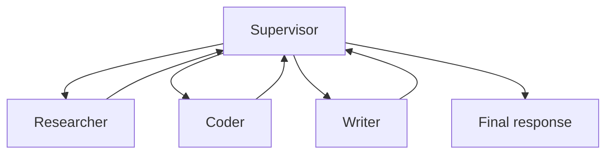
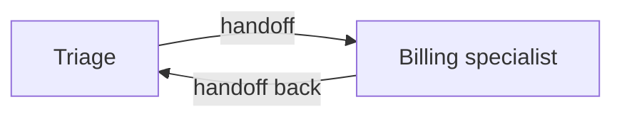
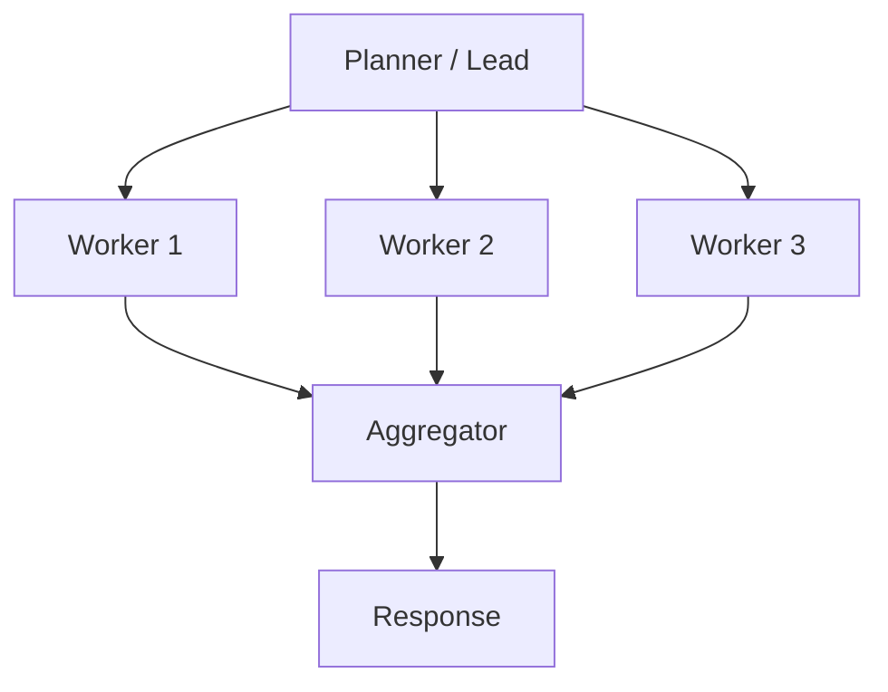
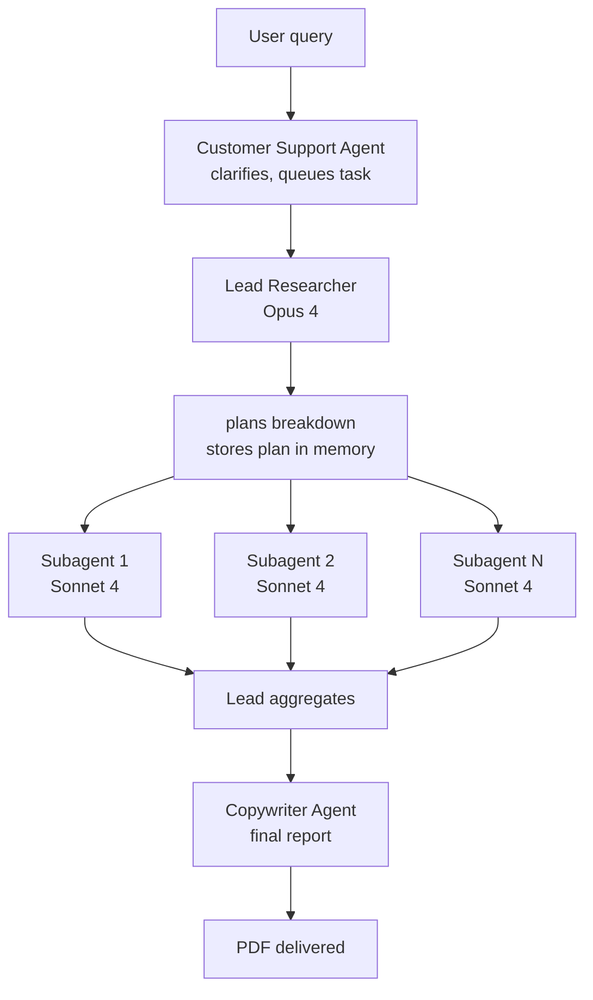

# Multi-Agent Topologies

Single agents hit limits: context exhaustion, tool-selection paralysis, quality ceiling. Multi-agent systems partition responsibility. Four canonical patterns plus DeepAgents as the batteries-included harness.

!!! tip "Rapid Recall"
    **15x cost rule** (Anthropic): multi-agent uses ~15x more tokens than single-agent. Only reach for it when the value of the task justifies it. **Patterns**: supervisor (hub-and-spoke, 3–7 specialists, default), swarm (peer handoffs, persona-style UX), scatter-gather (parallel independent subtasks, map-reduce), hierarchical (10+ specialists in teams). **Anthropic's research system**: Opus lead + Sonnet subagents, plan stored in memory not context, scaling rules embedded in the lead's prompt, parallel tool calls mandatory. **DeepAgents** = Claude Code's architecture generalized: detailed system prompt + planning tool (`write_todos`) + filesystem + subagents in a single `create_deep_agent()` call. **Handoffs**: state transfer is as important as control transfer; custom handoff tools that pass task descriptions, not full history.

## §12 — Why multi-agent: when one agent isn't enough

Multi-agent is the answer to "why isn't my single ReAct agent working?", but it's also the answer to a hundred problems that don't actually need it. **Know the cost before you reach for it.**

### Anthropic's 15× cost rule

From the June 2025 Anthropic engineering blog on their multi-agent research system:

> *Multi-agent systems use about 15x more tokens than chat. For these systems to make economic sense, the application has to involve tasks where the value of completing the task justifies the increased cost.*

Fifteen times. That's the number to memorize.

Why so much? Because each subagent:

- Has its own system prompt.
- Runs its own ReAct loop.
- Generates its own intermediate reasoning.
- Returns its results to the lead, which generates more reasoning to integrate them.

A query that would take one Sonnet call ($0.005) becomes a coordinated dance of one Opus lead + three Sonnet subagents, each making 5-10 tool calls = maybe $0.075. **You're paying for breadth and depth.**

So: don't reach for multi-agent unless you're delivering 15x more value than a single agent.

### When multi-agent genuinely beats single-agent

| Use case | Why multi-agent wins |
|---|---|
| **Research**, explore many angles in parallel | Parallel breadth, 3 subagents researching simultaneously is 3x faster (in wall-time) and finds more |
| **Distinct skill domains**, research + code + writing in one task | Specialization, each subagent has a focused prompt + tool set, fewer tool selection mistakes |
| **Cross-doc aggregation**, summarize 50 customer interviews | Scatter-gather is the natural pattern |
| **Quality-critical with eval signal**, code that must pass tests | Actor-critic, with the critic genuinely catching mistakes |
| **Context isolation needed**, subtasks generate a lot of noise | Each subagent has its own clean context window |

Anthropic reports their multi-agent research system **outperformed a single Opus agent by 90.2% on internal research evals.** That gap justifies the 15x cost — for that workload.

### When single-agent is the right call

| Use case | Why single-agent wins |
|---|---|
| Most chatbots and customer support | A well-instrumented single ReAct agent with good tools handles 95% of queries |
| Single-fact RAG | A retrieval pipeline + one LLM call is enough |
| Short-horizon tasks (5-10 steps) | Coordination overhead exceeds the value |
| Cost-sensitive | 15x is a lot, only justified for high-value tasks |
| Tasks without parallel-able subtasks | Sequential dependencies kill the speedup |

### Failure modes Anthropic explicitly called out

Worth memorizing, these come up in interviews verbatim:

1. **Spawning 50 subagents for simple queries**, fix: scaling rules embedded in the lead's system prompt.
2. **Subagents duplicating each other's work**, fix: precise, non-overlapping task descriptions per subagent.
3. **Endless web searches for nonexistent sources**, fix: max-tool-calls budget per subagent.
4. **Subagents distracting each other with excessive updates**, fix: structured outputs only; no chatty messages between subagents.

### Scaling rules embedded in prompts (Anthropic pattern)

> *Simple fact-finding: 1 agent, 3-10 tool calls.*
> *Direct comparison: 2-4 subagents, 10-15 tool calls each.*
> *Complex research: 10+ subagents, divided responsibilities.*

These get **written into the lead agent's system prompt** as policy. The agent reads its own rules and bounds itself.

## §13 — Supervisor pattern

One coordinator agent routes work to specialists. The supervisor decides *which* agent handles the task; the specialists execute.



After a specialist finishes, control returns to the supervisor, which decides what to do next.

### When the supervisor is the right call

| Signal | Why supervisor |
|---|---|
| 3+ distinct skill domains (research, code, writing) | Specialization helps; clean routing |
| User talks to one persona (the "assistant") | Single voice; routing happens behind the scenes |
| Routing decisions need LLM reasoning | Hard-coded rules can't capture "which agent should answer this?" |
| Need audit trail of who did what | Supervisor's decisions are all visible in trace |

### The library: `langgraph_supervisor`

```python
from langgraph_supervisor import create_supervisor
from langgraph.prebuilt import create_react_agent

researcher = create_react_agent(
    model=model,
    tools=[web_search, fetch_page],
    prompt="You research topics and return findings.",
    name="researcher",
)
writer = create_react_agent(
    model=model,
    tools=[],
    prompt="You write clean reports from research findings.",
    name="writer",
)

supervisor = create_supervisor(
    agents=[researcher, writer],
    model=model,
    prompt=("Delegate research tasks to the researcher; then send findings to the writer. "
            "When the user's request is fully addressed, finish."),
).compile(checkpointer=checkpointer)
```

A `recursion_limit` on `invoke()` is essential, without it, a supervisor that mis-routes can loop forever. Default to 25; alarm if you hit it.

### The four production-bugs you'll see

| Bug | Symptom | Fix |
|---|---|---|
| Supervisor tries to do the work itself | Skips specialists | Give the supervisor zero specialist tools; only "route" or "finish" |
| Supervisor loops between specialists | Two agents each say "talk to the other one" | Stricter prompt + `recursion_limit` alarm |
| Supervisor's prompt grows unbounded | Token cost blows up | Trim handoff messages, `add_handoff_back_messages=False` |
| Routing accuracy decays over time | Wrong specialist picked too often | Build a routing-accuracy eval *before* shipping; gate prompt changes on it |

## §14 — Swarm pattern: peer-to-peer handoffs

The supervisor sits in the middle of every transition. **The swarm eliminates the middle.** Each agent has the ability to hand off directly to a peer; whichever agent is "active" handles the user's turn.



The user experience is different: they "talk to" whichever agent is currently active. In customer support: triage takes the call, hands off to billing, billing solves it and hands back. The user feels they're talking to "a person" who may have transferred them.

### When the swarm is the right call

| Signal | Why swarm |
|---|---|
| User naturally "talks to" specialists directly | Persona handoff matches the mental model |
| Latency-sensitive, supervisor adds too much hop overhead | One fewer LLM call per transition |
| Domain experts know who to hand off to better than a coordinator | Distributed decision-making |
| Customer support, sales call routing, multi-persona dialog | The canonical use cases |

> **Default**: start with supervisor. Graduate to swarm only when latency data shows the supervisor is the bottleneck **and** your agents rarely misroute. The supervisor is easier to debug, every transition shows in one trace.

### Under the hood: handoffs are `Command` objects

When an agent calls a handoff tool, the tool returns a `Command` that tells LangGraph to redirect execution to a different node:

```python
return Command(
    goto="billing",                # which agent to switch to
    graph=Command.PARENT,           # navigate in the parent graph, not the subagent's
    update={"messages": [tool_message]},  # what state to update
)
```

There's no central node deciding routes; the handoff tools themselves contain the navigation.

### Quick comparison

| | Supervisor | Swarm |
|---|---|---|
| Topology | Hub-and-spoke | Mesh |
| Per transition | 2 LLM calls (specialist + supervisor) | 1 LLM call (next agent) |
| Routing accuracy | Higher (full context, one decider) | Lower (distributed decisions) |
| Latency | Higher | Lower |
| Debuggability | Easier | Harder without good tracing |
| User mental model | "I'm talking to one assistant" | "I got transferred to a specialist" |
| **Start here** | Yes | No, only graduate when needed |

## §15 — Hierarchical and Scatter-Gather + Anthropic's research system

### Scatter-Gather (a.k.a. Map-Reduce)

A planner decomposes the task into N independent subtasks. N workers run in parallel. A gatherer aggregates results.



**When**: subtasks are truly independent. "Research these 10 startups", "Process this batch of 50 documents", "Compare these 5 products on price + warranty + reviews."

**Wins**: near-linear speedup in wall-time. Each worker has clean context. Naturally combines with parallel tool calls.

**Loses**: aggregation is often the hard part. Five workers each return 2KB of text; aggregator needs to deduplicate, resolve conflicts, prioritize. Pure scatter-gather only works when results compose simply.

### Hierarchical

A supervisor of supervisors. The top layer routes between *teams*; each team has its own supervisor routing between *specialists*.

```
            [ Top supervisor ]
              ┌────┴────┐
              ▼         ▼
     [Research team] [Code team]
       sup → specialists  sup → specialists
```

**When**: 10+ specialists, with natural team groupings. Without hierarchy, a single supervisor choosing between 15 specialists makes routing mistakes constantly.

**Loses**: each layer is a hop, latency adds up. Two-LLM-call cost per transition becomes 4-LLM-call cost per top-level decision.

### Anthropic's research system — the canonical scatter-gather case study



Several engineering choices worth internalizing:

1. **Opus as lead, Sonnet as subagents.** Asymmetric cost, the lead does the hard thinking; subagents do the bounded fetches. Result: 90.2% improvement over single Opus.
2. **Plan is stored in memory, not just context.** The task is large enough that the plan would get truncated; explicit persistence keeps the lead aligned across the hour-long task.
3. **Scaling rules in the lead's prompt.** Simple query → 1 agent, 3-10 calls. Comparison → 2-4 subagents, 10-15 calls each. Complex research → 10+ subagents with divided responsibilities. **The lead reads its own rules to bound itself.**
4. **Parallel tool calls mandatory.** The lead must spawn subagents in parallel, sequential spawning would defeat the whole point. The system prompt enforces this.
5. **Strict subagent prompts.** Each subagent gets: an objective, an output format, tool guidance, and clear task boundaries. Vague instructions caused duplicate work in early iterations.

### Pattern selection

| Pattern | Best for | Gotcha |
|---|---|---|
| Supervisor | 3-7 specialists, clear domains | Supervisor becomes bottleneck |
| Swarm | 2-3 personas, user talks to specialists | Hard to debug; routing mistakes |
| Scatter-gather | Independent parallel subtasks | Aggregation is the hard part |
| Hierarchical | 10+ specialists, team groupings | Latency stacks per layer |

!!! warning "Interview trap"
    Candidate proposes "flat" multi-agent (every agent can call every other) for production customer support. Push back: emergent behavior is unpredictable, token costs unbounded, hard to debug. Flat is a research pattern, not a production one. Use supervisor + specialist subgraphs + HITL for approvals, boring is right.

## §16 — DeepAgents: the batteries-included harness

DeepAgents is, in one sentence, **"Claude Code's architecture, extracted and generalized."** Released open-source by LangChain in mid-2025, it took off because the existing answer ("write your own LangGraph harness") was too much work for too many teams.

### What problem it solves

Single-agent ReAct (`create_agent`) is a "shallow" agent, it's just a tool-calling loop. Production-grade agents like Claude Code, Cursor, and Devin have four extra capabilities that turn shallow agents into deep ones:

| The four pillars | What it does |
|---|---|
| **Detailed system prompt** | Teaches the agent how to behave in specific situations, far longer and more specific than typical prompts |
| **Planning tool** (`write_todos`) | Lets the agent maintain a running plan in its own state. Crucially, the tool is a no-op, it's context engineering |
| **Filesystem access** | `ls`, `read_file`, `write_file`, `edit_file`, `glob`, `grep`. The filesystem is the agent's working memory beyond the context window |
| **Subagent spawning** | A `task` tool that creates a specialized subagent with its own isolated context |

DeepAgents bundles all four into a single `create_deep_agent()` call. Same building blocks as `create_agent`, but with the harness pre-wired.

### The minimal API

```python
from deepagents import create_deep_agent

def web_search(query: str) -> str:
    """Search the web."""
    return f"[results for {query}]"

agent = create_deep_agent(
    model="anthropic:claude-sonnet-4-6",     # any LangChain chat model
    tools=[web_search],                       # your custom tools
    system_prompt="You are a research assistant.",  # added to the built-in DeepAgents prompt
)

result = agent.invoke({
    "messages": [{"role": "user", "content": "Research multi-agent eval frameworks"}]
})

# Result includes the full message history AND any files the agent wrote
print(result["messages"][-1].content)
print(list(result.get("files", {}).keys()))   # files the agent created during the task
```

Three lines to get an agent with planning, filesystem, subagents, and context management. That's why it took off.

### When to reach for DeepAgents

| Use case | DeepAgents |
|---|---|
| Long-horizon research tasks (hours of work) | ✓ ideal |
| Complex code generation with file edits | ✓ ideal |
| Multi-step analytical workflows | ✓ ideal |
| Short Q&A | ✗ overkill, use `create_agent` |
| Pure routing chatbots | ✗ overkill, use `create_agent` |
| Custom non-ReAct topology | ✗ drop to raw LangGraph |

### How it stacks against `create_agent` and raw LangGraph

```
                         Cost / complexity →
   raw LangGraph    create_agent (LangChain)    DeepAgents
   ▲                       ▲                       ▲
   custom graphs           simple ReAct agent      batteries-included harness
   any topology            single-agent loop       planning + FS + subagents + prompt
   most work               little work             least work, when task is a "project"
```

Pick:

- **Raw LangGraph** when the agent loop isn't ReAct-shaped (custom multi-agent, weird state machines).
- **`create_agent`** when you have a ReAct agent with a handful of tools, nothing exotic.
- **DeepAgents** when the task is a *project*, long horizons, file edits, planning, delegation.

The three compose: a LangGraph CompiledStateGraph can be passed in as a subagent to a Deep Agent. So you can use DeepAgents as the top-level harness and drop into raw LangGraph where needed.

### The "filesystem" — it's the agent's extra brain

This is the underappreciated bit. When an agent's context approaches the limit, DeepAgents writes intermediate results to a (virtual) file and reads them back later. Pluggable backends:

| Backend | Use |
|---|---|
| In-memory state | Default, fastest |
| Local disk | Persistent across runs |
| LangGraph store | Cross-thread persistence (long-term memory) |
| Sandboxes (Modal, Daytona, Deno) | Isolated code execution |
| Composite routing | Combine multiple, e.g. memory + sandbox |

!!! note "Interview note"
    *"What's the difference between DeepAgents, LangGraph, and `create_agent`?"* All three are layers in the same stack. **LangGraph** is the runtime (state machine, checkpointer, durable execution). **`create_agent`** is a minimal ReAct harness on top of LangGraph. **DeepAgents** is an opinionated harness on top of `create_agent` with planning, filesystem, subagents, and a detailed system prompt baked in. Use DeepAgents when the task is long and complex; drop down only when needed.

## §17 — Handoffs: state transfer, context compression, custom handoff tools

Whether in a supervisor (specialist → supervisor → next specialist) or in a swarm (peer → peer), handoffs are how state moves between agents. Get them right and the system feels coherent; get them wrong and each transition feels like a fresh conversation.

### What "handoff" actually means

A handoff is two things at once:

1. **Control transfer**, execution moves from agent A to agent B.
2. **State transfer**, what agent A knew, agent B now also knows (or, importantly, *doesn't*).

LangGraph implements both via the `Command` object, `Command(goto=...)` is the control transfer, and the optional `update={...}` is the state transfer.

### The default behavior

When you create a handoff tool with `create_handoff_tool(agent_name="X")`:

- The full message history of the supervisor / current agent is passed along.
- A `ToolMessage` indicating successful handoff is appended.
- The receiving agent sees everything.

That's fine for short conversations. It breaks at scale.

### Three problems with the default

#### 1. Context bloat

By the time the third specialist sees the conversation, it includes the supervisor's reasoning, the first specialist's full ReAct trace, the supervisor's next routing decision, the second specialist's full ReAct trace, and so on. That's 5,000+ tokens of "stuff that doesn't matter to me." The third specialist now reasons over a polluted context.

#### 2. Privacy / scope creep

Specialist B doesn't need to see Specialist A's internal scratchpad reasoning. Sometimes A handled sensitive data (a customer's account number) that B shouldn't have. The default "pass everything" leaks.

#### 3. Specialist confusion

Specialist B's tools are described in B's system prompt. But the message history is full of A's tool calls. The model can get confused, "wait, can I use that tool? Was that my call or A's call?"

### Custom handoff tools — the fix

You can override `create_handoff_tool` to:

- **Pass only a task description**, the supervisor distills A's findings into a clean task for B.
- **Pass only filtered state fields**, share `current_task` and `findings`, hide `internal_scratchpad`.
- **Strip prior agents' tool calls**, keep messages, drop ToolMessages from other agents.

```python
def create_clean_handoff(agent_name: str, name: str, description: str):
    @tool(name, description=description)
    def handoff(
        task_description: Annotated[str, "Clean, self-contained task for the next agent"],
        state: Annotated[dict, InjectedState],
        tool_call_id: Annotated[str, InjectedToolCallId],
    ):
        tool_message = ToolMessage(
            content=f"Handing off to {agent_name}: {task_description}",
            name=name, tool_call_id=tool_call_id,
        )
        return Command(
            goto=agent_name,
            graph=Command.PARENT,
            update={"messages": [tool_message], "current_task": task_description},
        )
    return handoff
```

### Decision rules for what to pass

| State item | Pass to next agent? |
|---|---|
| Original user message | Yes, always |
| Prior agents' ToolMessages | No, adds noise |
| The current task description | Yes, this is the new agent's brief |
| Findings / structured results from prior agents | Yes |
| Working scratchpad of prior agents | No, private to that agent |
| Memory retrieval results | Maybe, re-retrieve if relevant for the new context |

### Handoff failure modes

| Bug | Symptom | Fix |
|---|---|---|
| Receiving agent doesn't know what to do | Re-asks the user for context | Supervisor's handoff includes an explicit task description |
| Receiving agent re-does work | Repeats research the prior agent did | Pass findings explicitly; don't rely on the model to scan history |
| Conversation loops | A → B → A → B | Track handoff count; alarm if > 3 between same pair |
| Lost context after long handoff chain | Final agent has no idea what the user originally asked | Always preserve the *original user message* across handoffs |

!!! note "Interview note"
    *"How do you keep multi-agent context manageable?"* Three answers, in order: (1) custom handoff tools that pass task descriptions, not full history. (2) `add_handoff_back_messages=False` to avoid supervisor re-reading transfer messages. (3) For very long chains, periodically summarize the running state.

## Interview Questions

**Q7: Compare supervisor pattern vs scatter-gather for "research the top 10 AI startups."**

Supervisor: one coordinator routes each startup research to a specialist, but all 10 are the same kind of task, so specialization is wasted. Scatter-gather: spawn 10 parallel workers, each researches one startup, aggregator ranks. Scatter-gather wins here, subtasks are identical and independent. Supervisor wins when the 10 tasks needed different skills (1 research, 3 code, 6 writing).

**Q8: Your multi-agent system works in dev but has non-deterministic outputs in prod. Diagnose.**

Likely causes in order: (1) missing reducers on shared state keys, parallel nodes racing. (2) Non-deterministic LLM calls (temperature > 0 without seed). (3) External tool responses vary (search results, timestamps). (4) Checkpoint recovery picking up stale state. Fix: audit reducers, pin temperature/seed for reproducibility tests, snapshot tool responses in integration tests.

**Q9: Trap — candidate proposes flat multi-agent chat for production customer service.**

Push back. Flat patterns have emergent behavior, unpredictable token costs, hard debugging, no clear failure modes. Production customer service needs deterministic routing (supervisor), clear escalation paths (human-in-the-loop), and cost caps. Flat is a research pattern. Use supervisor + specialist subgraphs + HITL for approvals.
