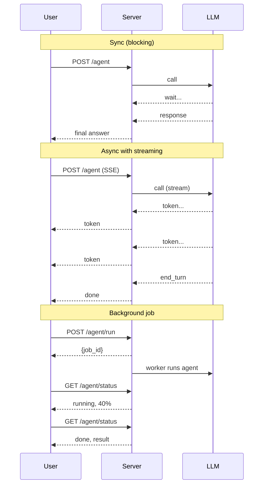

# Sync, Async, Streaming, Background, Multi-Turn State

Two ideas that decide your serving layer: execution mode (sync/async/streaming/background) and how multi-turn conversations actually keep state across requests.

!!! tip "Rapid Recall"
    **Four execution modes.** Sync for dev or single-user; async for any concurrent server; streaming for chat UIs (drops TTFT from full-latency to ~200ms); background jobs for tasks over 30 seconds. Async is mandatory at production scale because of parallel tool calls and concurrent users. **Multi-turn state**: persist message history (or summary), agent working state, and a `thread_id`. LangGraph checkpointers handle all three. Three failure modes: context overflow (fix with summary-buffer), stale state (TTL + re-validate), lost-thread (server-side thread_id, never trust client).

## §10 — Sync vs async: when to reach for each

You don't need to deeply understand asyncio to build agents. You do need to understand **what each mode is for**, so you can make the right call when designing a serving layer.

### The four execution modes

| Mode | What | When to use |
|---|---|---|
| **Sync (blocking)** | Call → wait → return | One agent, one user, simple chatbot |
| **Async** | Call → yield → other work → resume | Parallel tool calls; concurrent users; mixing slow I/O |
| **Streaming** | Server emits tokens / events as they happen | Chat UIs (TTFT matters); long agents (show progress) |
| **Background jobs** | Submit → return immediately → poll / webhook later | Long-running agents (research, code generation runs of minutes-to-hours) |

### Sync vs async vs streaming sequence



### Why async matters for agents specifically

Two cases where sync is *measurably* worse:

#### 1. Parallel tool calls

When an LLM emits three independent tool calls in one turn (`get_weather(Delhi)`, `get_weather(Mumbai)`, `get_weather(Bangalore)`), executing them sequentially means waiting 3x the per-call latency. With async (`asyncio.gather`), they run concurrently, total time ≈ max of the three.

3x speedup on N=3, scales linearly with the number of independent tool calls.

#### 2. Concurrent users on one server

A sync FastAPI server with one worker handles one request at a time. While Agent A is waiting on a tool response, Agent B can't even start. With async, the server multiplexes, Agent A waits on its tool, Agent B's LLM call is in flight, Agent C's response is streaming back.

**At any meaningful production scale, your agent server is async.** It's not optional.

### When sync is fine

- **Dev / debugging**, sync is easier to reason about.
- **Notebooks**, Jupyter has its own event loop quirks. Sync demos run cleanly.
- **One-off scripts**, batch processing where you process items in a loop.

### Streaming — orthogonal to sync/async

Streaming is about *the response format*, not the execution model. You can stream from sync code (chunked HTTP) or async code (SSE, WebSockets). The thing that streaming buys you:

- **Time-to-first-token (TTFT)** drops from full latency to ~200ms, users feel the agent is "thinking" instead of frozen.
- **Progress visibility** on long agents, show which subagent is running, what tool was just called.
- **Cancellation**, user can hit stop mid-stream and abort the agent.

LangGraph supports three stream "modes":

1. `stream_mode="values"`, emit full state snapshots after each node.
2. `stream_mode="updates"`, emit only the state diff per node (lighter).
3. `astream_events()`, emit fine-grained events (tokens, tool calls, completions).

### Background jobs — for when latency budget is "minutes"

A research agent that hits 50 web pages and writes a report doesn't fit in a request-response. Pattern:

```
POST /agent/run  →  returns {"job_id": "abc"} immediately
                    backend kicks off the agent in a worker

GET /agent/status/abc  →  returns {"state": "running", "progress": 0.4}
GET /agent/status/abc  →  returns {"state": "done", "result": {...}}
```

LangGraph's checkpointer plus a job queue (Celery, RQ, Temporal) is the standard recipe.

!!! note "Interview note"
    *"Sync or async for a multi-user agent backend?"* Always async, plus streaming for the user-facing channel, plus background jobs for anything >30s. The 2026 stack: FastAPI (async) + LangGraph with PostgresSaver + Server-Sent Events for stream + a worker queue for long jobs.

## §11 — Multi-turn conversations: keeping state across turns

A "multi-turn conversation" is what every user actually wants. The LLM doesn't remember previous turns natively, every API call is stateless. So you have to manage the conversation yourself.

This sounds trivial. It mostly is. But there are three failure modes that catch every team at least once.

### What "managing state" actually means

Between turns, you persist:

1. **The message history** (or a summary of it).
2. **The agent's working state**, current plan, partial results, anything not in the messages.
3. **A pointer** (`thread_id`, `conversation_id`) that ties together this user's conversation.

In LangGraph, all three are handled by **checkpointers**. Pass a `thread_id` in the config; the graph reads + writes state to the checkpointer; on the next turn with the same `thread_id`, the state is there.

```python
config = {"configurable": {"thread_id": "user-123-conv-7"}}
result1 = graph.invoke({"messages": [user_msg_1]}, config=config)
# ... time passes ...
result2 = graph.invoke({"messages": [user_msg_2]}, config=config)
# result2 has access to everything from result1 — same thread_id.
```

In LangChain (without LangGraph), you compose a `RunnableWithMessageHistory` and pass a session ID; same idea, lower-level.

### Three failure modes

#### 1. Context overflow

Each turn appends to the history. By turn 20, the context is bloated. By turn 50, it's truncated and the agent loses early context.

**Fix**: summary-buffer strategy. Once total tokens cross a threshold (e.g. 4K), have a small LLM summarize the older messages into a single system message, drop the originals, keep the recent N verbatim.

```
[system: agent prompt]
[system: SUMMARY OF PRIOR CONVERSATION — "User wants to book flights, prefers cheapest..."]
[user: latest message]
[assistant: ...]
[user: latest message]
```

LangChain 2026 has `SummarizationMiddleware` that does this automatically.

#### 2. Stale state

Day 1: user says "my email is samarth@example.com". Day 30: email has changed. The agent re-uses the old value from memory.

**Fix**: TTL on facts; re-validate at action time. For anything user-stated, ask the user to confirm before acting on facts older than N days.

#### 3. Lost-thread bug

Bug class: user opens a new tab/device; the front-end forgets the `thread_id`; the agent starts from scratch. User says "as I mentioned earlier...", the agent has no idea what was said earlier.

**Fix**: `thread_id` is server-side, tied to user + conversation. Don't trust the client to provide it. Front-end fetches the active `thread_id` from a server endpoint on app load.

### What goes in the system prompt vs the conversation

A common confusion: what's in the system prompt, what's in the running history?

| Goes in system prompt (re-injected every turn) | Goes in conversation history |
|---|---|
| Stable instructions ("you are a customer support agent") | The actual back-and-forth |
| User profile facts (preferences, role, language) | Tool calls and observations |
| Long-term memories retrieved this turn | Drafts and revisions |
| Available tools (handled by the tool-calling API) | The current task's scratchpad |

Mixing these up costs tokens and confuses the LLM. The system prompt should be **stable across the conversation**. Dynamic per-turn context (RAG retrievals, long-term memory) goes into a *separate* system message that gets refreshed each turn.

### The 2026 production pattern

```
[stable system prompt: identity + tools]
[dynamic system prompt: relevant memories + RAG context for this turn]
[summary of older conversation if any]
[recent N message exchanges, verbatim]
[user's new message]
```

That's it. Every turn, you reconstruct this. The agent emits its reply, tool calls happen, and the state goes back to the checkpointer.
