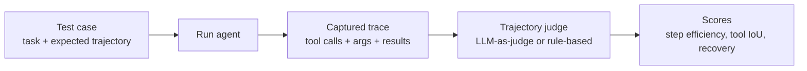

# Agent Eval

Agents are harder to evaluate than chat models. Trajectories matter. Tool calls matter. Final state matters more than text.

!!! tip "Rapid Recall"
    **Three flavors of agent eval**: (1) **Functional correctness** = did the agent actually accomplish the task (final state matches expected). (2) **Trajectory eval** = step efficiency, tool selection accuracy, unnecessary actions, recovery. (3) **Tool-call eval** = right tool, right arguments, right order, with IoU-style metrics. **Elo** for multi-version comparison. **SWE-bench Verified** is the canonical coding-agent benchmark (real GitHub issues with hidden tests; top agents at ~50-70% pass rate early 2026). **LangSmith + agentevals** is the 2026 stack: tracing automatic via `LANGSMITH_TRACING=true`, evaluators as Python functions, pytest gating.

## Why agent eval is hard

Agents have **trajectories**, not just outputs. A chat model produces one answer; an agent produces a sequence of tool calls, observations, and reasoning steps. Evaluation needs to consider:

- The final answer.
- The path taken to get there.
- Whether intermediate tool calls were correct.
- Whether the agent recovered from failures.

Plus the reward signal is often sparse — many agent tasks have one binary success criterion at the end (tests pass / don't pass), with no per-step grading.

## Agentic functional correctness

For agent systems: **did the agent actually accomplish the task?** Binary outcome, not text quality.

### Examples

| Task | Text quality metric | Functional correctness |
|---|---|---|
| "Book a flight" | Does response say it booked? | Is flight actually booked in system? |
| "Refund customer" | Does response confirm refund? | Did refund process in payment API? |
| "Fix the bug" | Does code look good? | Do tests pass? |
| "Write the report" | Is it readable? | Does it contain all required sections + correct data? |

### Implementation

Build a mock environment with instrumented tools. Tools log success/failure. Eval harness compares final state to expected state.

```python
class MockEnv:
    def __init__(self):
        self.state = {"flights_booked": [], "refunds_issued": []}

    def book_flight(self, flight_id):
        self.state["flights_booked"].append(flight_id)
        return {"status": "success", "confirmation": "ABC123"}

    def assert_task_complete(self, expected):
        return self.state == expected

def eval_agent(agent, task, expected_final_state):
    env = MockEnv()
    agent.run(task, tools=env)
    return env.assert_task_complete(expected_final_state)
```

### SWE-bench — the canonical agentic eval

Real GitHub issues with hidden tests. Agent gets issue description + repo. Runs, makes changes. Pass if tests pass. Hard benchmark, top agents (Claude 4, GPT-5) hover around 50-70% pass rate on SWE-bench Verified as of early 2026.

## 2026 benchmarks and the gaming problem

The structural shift: benchmarks the industry relied on two years ago are **saturated**. MMLU went from ~35% in 2021 to 99% in 2026 → measures nothing. GSM8K, HumanEval, basic MMLU are in the graveyard. **Old benchmarks are dead**; what carries signal in 2026:

| Domain | Live benchmarks |
|---|---|
| Reasoning / knowledge | **GPQA Diamond** (grad science), **HLE** (Humanity's Last Exam, built to stay unsaturated, <50%, damning calibration: confident when wrong), ARC-AGI-2/3 |
| Coding | **SWE-bench Verified** (real GitHub issues, ~80% frontier), **LiveCodeBench** (contamination-resistant via post-cutoff date-stamping) |
| Math | AIME 2025 / 2026 |
| Human preference | Arena Elo (LMSYS) |

Agent benchmarks are a distinct category:

- **GAIA** — general assistant, multi-step web/file/reasoning (~75% top agents).
- **τ²-bench** — tool-agent-user with policy adherence; the *reliability* benchmark (even top models <50%, `pass^8` <25%).
- **OSWorld** — real desktop computer use. **WebArena** — browser. **Terminal-Bench** — DevOps.
- **METR HCAST / Time Horizons** — longest task an agent finishes 50% of the time.

### The four gaming mechanisms — don't conflate them

1. **Contamination** — test set leaks into training. Removing contaminated GSM8K dropped accuracy up to 13%. Defense: post-cutoff / held-out benchmarks.
2. **Scaffold / harness inflation** — same model swings 30+ points by orchestration (Opus 4.5: 80.9% Verified vs 45.9% Pro / SEAL — same model, the harness differs). Vendor numbers aren't directly comparable.
3. **Benchmark design flaws** — Berkeley got ~100% on several by exploiting validation infra (public answers on HuggingFace, agent code runs in the evaluator's environment). SWE-bench-Verified: a wrong patch can still pass tests.
4. **Selective reporting** — best-of-N, best scaffold, single favorable runs inflate by 5–15 points.

**How to read them.** Benchmarks are diagnostic tests, not verdicts (a cholesterol test doesn't predict blood pressure). No single benchmark — use a *portfolio*, and the only one that matters for *you* is a **custom eval of 100–200 cases from your real workload**. Extra traps: effective context is only 50–65% of advertised (RULER finding); single-run success ≠ reliability (`pass^k` collapse). Use public benchmarks to *shortlist* and a custom multi-run domain eval to *decide*. Progress is real; the magnitude in any vendor launch is inflated.

## Trajectory evaluation

Between text quality and functional correctness: evaluate the **path** the agent took.

Metrics:

- **Step efficiency**: # steps vs optimal.
- **Tool selection accuracy**: did the agent pick the right tool at each step?
- **Unnecessary actions**: did it do redundant work?
- **Recovery**: after a failure, did it adapt or get stuck?

Useful for agent debugging even when functional correctness passes, an agent that "works" but takes 20 steps when 5 would do is a cost disaster.

### Trajectory eval pipeline



## Tool-call evaluation: right tool, args, order

Three sub-metrics:

| Metric | What it asks | How to measure |
|---|---|---|
| **Tool-name IoU** | Of the expected tool calls, what fraction did the agent make? | `|expected ∩ actual| / |expected ∪ actual|` over tool names |
| **Argument correctness** | Were the arguments to each tool call correct? | LLM judge on (expected_args, actual_args) per call |
| **Order correctness** | Did the agent call tools in the right sequence? | Edit distance between expected and actual order |

```python
def tool_call_iou(expected_calls, actual_calls):
    """Set IoU over (tool_name) tuples."""
    e = {(c["name"]) for c in expected_calls}
    a = {(c["name"]) for c in actual_calls}
    return len(e & a) / max(1, len(e | a))
```

For coding agents, this maps cleanly to: did the agent run the right `view`/`grep`/`edit`/`bash` sequence to fix the bug?

## Parallel vs sequential analysis

When an agent emits multiple tool calls per turn (parallel), evaluation must check:

- **Were they actually parallelizable?** (no data dependencies between them)
- **Did the agent parallelize when it should have?** (anti-pattern: serializing 3 independent web searches)
- **Did it serialize when it should have?** (data dependency missed → race condition)

## LLM-as-judge for trajectories

```python
from agentevals.trajectory.llm import create_trajectory_llm_as_judge

trajectory_judge = create_trajectory_llm_as_judge(model="openai:gpt-5-mini")

score = trajectory_judge(
    outputs=actual_trajectory_messages,
    reference_outputs=expected_trajectory_messages,
)
# score["score"] in [0, 1]; score["comment"] explains the rating
```

The judge sees the full message history (system, user, assistant tool calls, tool results) and rates: did the agent's path make sense, did it use the right tools, did it recover from failures?

## Elo rating for multi-version eval

Classic win-loss rating from chess. Elo converts a **rating difference** into an **expected win probability**, then nudges ratings by the *surprise* (actual − expected). Big surprise → big change; expected result → tiny change.

```
Expected:  E_A = 1 / (1 + 10^((R_B − R_A)/400))   # every 400 points = 10× the odds; equal ratings = 0.5
Update:    R_A_new = R_A + K · (S_A − E_A)        # S_A: win=1, loss=0, tie=0.5; K = learning rate
                                                  # (S_A − E_A) is the surprise; Elo is zero-sum
```

Worked example: both at 1500, K=32, A beats B → `E_A=0.5`, `R_A=1516`, `R_B=1484` (A gains 16, B loses 16). A 1700 model *tying* a 1300 model actually *loses* points (was expected to win, scored only 0.5).

Applied to LLM systems:

1. Collect queries (production traffic or golden set).
2. For each query, run two or more candidate systems.
3. Have a judge (LLM or human) pick winner.
4. Update Elo ratings.
5. After 1000+ comparisons, ratings stabilize.

**Why it beats absolute scoring:**

- Sensitive to small differences (A is 55% preferred to B is meaningful).
- Unified scale across many variants.
- Robust to judge calibration drift (comparisons are relative).

### Two wrinkles when you use Elo on a fixed offline set

Sequential Elo is **order-dependent** — bad for a fixed test set. Two fixes:

- **Shuffle and average over many orderings** (what LMSYS Arena does).
- **Use Bradley-Terry / logistic regression** — the order-independent batch MLE of the same model. Elo is the online SGD approximation; Bradley-Terry is the closed-form MLE.

With only 2 models, Elo is overkill — just report win-rate + confidence interval. Elo earns its keep with many models. And watch LLM-judge bias (position, length, self-preference) — Elo faithfully propagates it.

```python
def update_elo(rating_a, rating_b, outcome, K=32):
    """outcome: 1 if A wins, 0 if B wins, 0.5 if tie."""
    expected_a = 1 / (1 + 10**((rating_b - rating_a) / 400))
    new_a = rating_a + K * (outcome - expected_a)
    new_b = rating_b + K * ((1 - outcome) - (1 - expected_a))
    return new_a, new_b
```

Used in LMSYS Chatbot Arena, Copilot Arena. **Your edge in interviews:** propose Elo for multi-version rollouts.

## The LangSmith + agentevals stack

Because LangGraph is a LangChain product, LangSmith integration is essentially free — set two environment variables and every graph run is traced automatically:

```python
import os
os.environ["LANGSMITH_TRACING"] = "true"
os.environ["LANGSMITH_API_KEY"] = "ls-..."
# Now graph.invoke(...) produces a full trace in LangSmith:
# every node, every LLM call, every tool call, with timing + tokens.
```

No manual instrumentation, the Pregel runtime emits a span per node automatically.

### Regression suite pattern

```python
from langsmith import Client
from agentevals.trajectory.llm import create_trajectory_llm_as_judge

client = Client()
dataset = client.create_dataset("agent-regression")
client.create_examples(dataset_id=dataset.id, examples=[
    {"inputs": {"question": "weather in Delhi"},
     "outputs": {"reference_answer": "38C clear"}},
])

trajectory_judge = create_trajectory_llm_as_judge(model="openai:gpt-5-mini")

def run_agent(inputs):
    return graph.invoke({"messages": [HumanMessage(inputs["question"])]})

client.evaluate(
    run_agent,
    data="agent-regression",
    evaluators=[trajectory_judge],
    experiment_prefix="v2-prompt-change",
)
```

### Pytest gating

```python
import pytest
from langsmith import testing as t

@pytest.mark.langsmith
def test_agent_books_correct_flight():
    result = run_agent({"question": "cheapest flight BLR to BOM tomorrow"})
    t.log_outputs(result)
    score = trajectory_judge(outputs=result["messages"], reference_outputs=...)
    assert score["score"] > 0.8
```

Set thresholds, fail the pipeline when scores drop, bringing the same rigor as deterministic unit tests to agent quality.

## Production sampling: online evaluators

LangSmith's online evaluators run on a sampled % of production traces. You configure them in the LangSmith UI, pick a sample rate, attach an evaluator, get continuous quality signals on real traffic. No code in your graph.

## What's uniquely testable in LangGraph

| What | How LangGraph makes it easy |
|---|---|
| **Did the right node run?** | Trace shows every node execution |
| **Did the router decide correctly?** | Router is a pure function, unit test it |
| **Trajectory (which path through the graph)** | The sequence of nodes is in the trace |
| **Tool-call correctness** | Tool nodes are traced with args + results |
| **Did the loop terminate correctly?** | Step count + recursion limit visible in trace |
| **State at each step** | Checkpointer history = every intermediate state |

The last one is powerful: because the checkpointer stores every superstep's state (time travel), you can replay exactly what the agent saw at each decision point during debugging.

## Interview Questions

**Q5: Explain Elo rating and why it's better than absolute scoring for LLM eval.**

Elo updates ratings based on pairwise win/loss outcomes. Applied to LLMs: run candidate A and B on same query, judge picks winner, update ratings. Advantages: sensitive to small differences (A preferred 55% of the time is meaningful), relative scale robust to judge calibration, unified across many variants. Example: LMSYS Chatbot Arena uses Elo with human voters; internal eval can use LLM-as-judge head-to-head.

**Q7: Agentic functional correctness vs text quality — when does each win?**

Text quality wins for conversational AI where the outcome is "user feels helped." Functional correctness wins for agentic systems with measurable outcomes: booking, purchasing, fixing code, processing data. Rule: if the task has a ground-truth final state, measure functional correctness. If the task is open-ended (write an essay, explain a concept), measure text quality with LLM-as-judge or human eval.

**Q10: Design eval for a multi-agent system end-to-end.**

Three planes. (1) Per-agent unit eval: each agent on its specific task with golden samples. (2) Trajectory eval: did the system reach correct final state? Measure functional correctness, step efficiency, tool selection accuracy. (3) Interaction eval: count unnecessary handoffs, redundant work, failure recovery. Layer it with: offline golden set on every PR, shadow A/B on production traffic, weekly human review sample, daily dashboard on CSAT + resolution + cost + latency.

---
