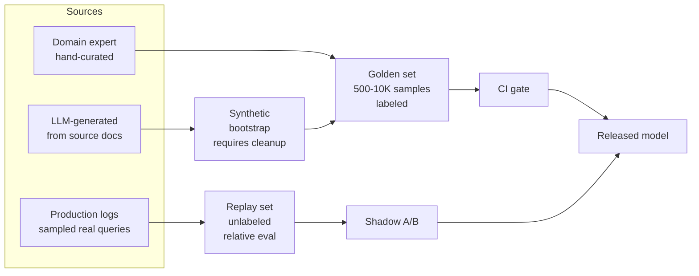

# Dataset Design

Eval datasets matter more than metrics. A brilliant metric on a bad dataset tells you nothing.

!!! tip "Rapid Recall"
    **Three dataset types**: golden (curated, 500-10K), production replay (real queries, unlabeled, for relative eval), synthetic (LLM-generated, cheap, requires cleanup). **Composition**: head queries + tail edge cases + adversarial examples + "impossible" queries (agent should say "I don't know"). **Maintenance**: weekly add 20-50 samples from production failures, prune trivial samples, rebalance categories. **80/20 visible/held-out** to prevent overfitting. **Inter-annotator agreement** measured by Cohen's kappa (κ > 0.8 excellent, 0.6-0.8 good, 0.4-0.6 means labeling guidelines need work).

## §5 — Dataset design

Eval datasets matter more than metrics. A brilliant metric on a bad dataset tells you nothing.

### Three dataset types

#### Golden set (curated)

Human-labeled, high-quality. Used for pre-deploy eval. Target: 500-10K samples.

**Composition matters:**

- Cover common queries (head).
- Cover edge cases (long tail).
- Include adversarial examples (prompt injections, confusing queries).
- Include "impossible" queries (agent should say "I don't know").

#### Production replay

Real queries from production, sampled. Used for shadow A/B testing and regression detection. Unlabeled, use for relative eval between systems.

#### Synthetic

LLM-generated queries from source docs. Cheap, scalable, lower quality. Good for coverage testing. Bad for ground truth on edge cases.

### Golden / replay / synthetic flow

### Dataset maintenance

Eval sets decay. Every week:

- Add 20-50 new samples from production failures.
- Prune samples that have become trivial (everyone passes).
- Rebalance categories as product evolves.

### Held-out vs visible

Split eval into **visible** (devs can see, optimize against) and **held-out** (hidden, only checked periodically). Prevents overfitting to the eval set.

Ratio: ~80% visible, 20% held-out. Held-out score diverging from visible = overfitting.

### Inter-annotator agreement (IAA)

Multiple humans label same samples. Agreement measured by Cohen's kappa or Fleiss' kappa.

- κ > 0.8: excellent.
- 0.6-0.8: good.
- 0.4-0.6: moderate, your labeling guidelines need work.

Without IAA measurement, you don't know if your labels are consistent.

### Likert vs SBS

**Likert scales** (1-5 or 1-7 absolute quality scores): simple, intuitive; but scores drift (rater leniency, anchoring), poor sensitivity to small differences.

**Side-by-side (SBS)**: two answers, judge picks winner (or tie). Much more sensitive than Likert, humans are better at comparing than scoring. Result: preference rate (A preferred over B in X% of queries).

For multi-variant comparisons (A vs B, A vs C, B vs C, ...), use Elo (see [Agent Eval](agent-eval.md)).

## Composition checklist for a new eval set

When standing up an eval set for a new agent or RAG system, the checklist is:

- [ ] 100+ samples from real production traffic (or near-equivalent), labeled by a human.
- [ ] 10+ adversarial samples (prompt injections, malformed inputs, edge cases).
- [ ] 10+ "impossible" samples where the agent should refuse or say "I don't know".
- [ ] 10+ multi-step / multi-hop samples (for agents).
- [ ] 10+ samples in non-English languages (if relevant).
- [ ] 80% / 20% visible vs held-out split.
- [ ] Each sample versioned in git with timestamp and source.
- [ ] At least 2 annotators on a 10% sample for IAA measurement.

## Interview Questions

**Q8: How do you prevent overfitting to your eval set?**

Split into visible (devs can optimize against) and held-out (checked only periodically, hidden). Typical ratio 80/20. If visible scores keep improving but held-out plateau or regress, you're overfitting. Rotate samples between visible and held-out. Add new samples from production failures weekly. Measure correlation between eval scores and production CSAT, if correlation drops, eval is no longer representative.

**Q11: Trap — candidate claims their RAG has 95% accuracy with no mention of test set construction.**

"Accuracy on what set?" Push for: set size, construction method (human-curated vs synthetic), diversity (query types, difficulty distribution), held-out portion, sample a few examples. A 95% score on 50 easy synthetic queries means nothing. 95% on a curated 5K-sample set with adversarial cases means something. Always probe the eval set before trusting the number.

**Q12: Your eval scores are great but production users complain. Diagnose.**

Common causes: (1) eval set doesn't match production distribution, devs curated "interesting" queries, missed common ones. (2) Overfitting, devs optimized to visible set. (3) Metric gaming, team gamed LLM-as-judge. (4) Latency or UX issues not captured in quality metrics. (5) Deployment issue, staging/prod drift, wrong model version in prod. Fix: sample real production failures into eval, measure correlation between eval scores and production CSAT, rotate held-out samples.
