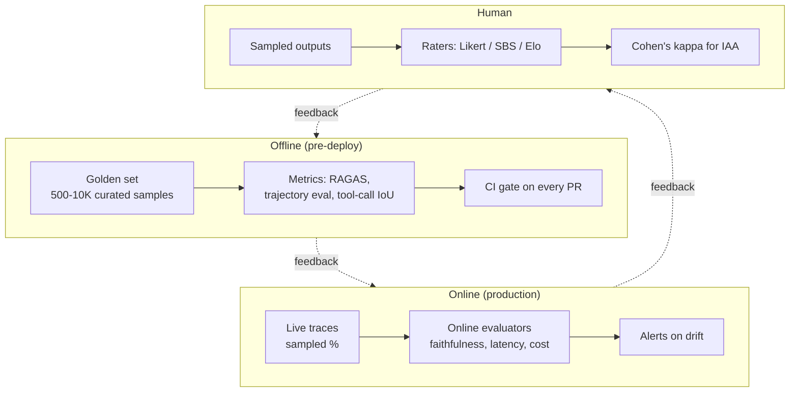

# Evaluation & Monitoring

How you know your LLM system works, and how you keep it working. Without eval, you're flying blind. Every serious LLM system has three eval planes (offline, online, human) feeding a metrics dashboard with alerts.

!!! tip "Rapid Recall"
    **Four RAGAS metrics**: Faithfulness (anti-hallucination), Answer Relevancy (anti-off-topic), Context Precision (retrieval quality), Context Recall (retrieval coverage). Combine them for the 2x2 diagnostic. **Three eval planes**: offline (golden set, pre-deploy), online (production sampling, drift detection), human (Likert / SBS / Elo / IAA). **Pairwise > absolute** scoring for LLM-as-judge (humans and LLMs both more reliable comparing than scoring). **Elo** for multi-variant comparison (LMSYS Chatbot Arena pattern). **Agentic correctness** = did the agent actually accomplish the task (binary final-state check), not "did the text look good." **Trajectory eval** measures the path (tool selection, step efficiency, recovery). **SWE-bench Verified** is the canonical coding-agent benchmark. **Datasets**: golden (curated) + production replay + synthetic, with 80/20 visible/held-out split to prevent overfitting.

## The eval landscape

## Why eval matters more than metrics

RAG and agent systems have a brutal property: they look right until they don't. "Looks right when I try it" is not evaluation; it's confirmation bias. Every change you make, chunk size, embedding model, reranker, prompt, needs to be measured against a fixed evaluation set with the same metrics.

> **A RAG system you can't evaluate is a RAG system you can't improve.**

This is the part most teams skip and most candidates blow in interviews.

## Section guide

| Page | Covers |
|---|---|
| [RAG Eval](rag-eval.md) | RAGAS four metrics + 2x2 diagnostic, DeepEval/TruLens/Phoenix, MRR/nDCG, golden sets |
| [Agent Eval](agent-eval.md) | Trajectory eval, tool-call evaluation, agentic correctness, Elo ranking, SWE-bench |
| [Dataset Design](dataset-design.md) | Golden / replay / synthetic, held-out vs visible, maintenance, IAA |
| [LLM-as-Judge](llm-as-judge.md) | Single-point vs pairwise, known biases and mitigations, fine-tuned judges |

## Layer Checklist

- [ ] Can you name the four RAGAS metrics and diagnose a failure from their combination?
- [ ] Can you list three LLM-as-judge biases and their mitigations?
- [ ] Can you explain Elo rating and when it beats absolute scoring?
- [ ] Can you design a hallucination measurement pipeline?
- [ ] Can you distinguish text quality vs functional correctness for agent eval?
- [ ] Can you design an eval dataset with held-out partitioning?
- [ ] Can you investigate a production metric regression systematically?
- [ ] Can you explain why BLEU/ROUGE are sanity checks only in 2026?
- [ ] Can you design evaluation for a multi-agent system across three planes?
- [ ] Can you measure inter-annotator agreement and interpret Cohen's kappa?
