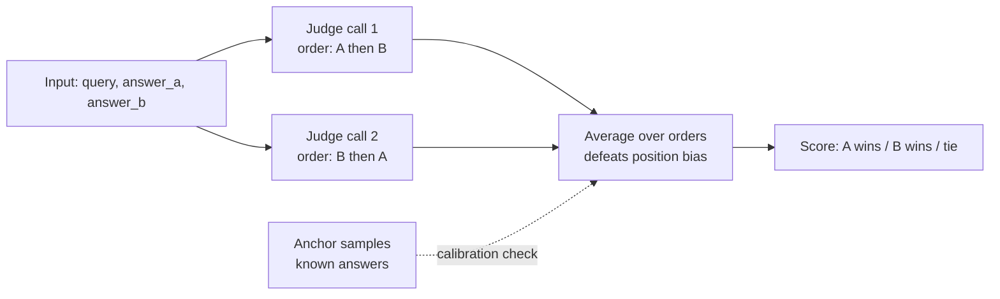

# LLM-as-Judge

The meta-trick: use an LLM to grade LLM outputs. Scales far beyond human labeling, but every team that uses it gets bitten by the same handful of biases.

!!! tip "Rapid Recall"
    **Single-point vs pairwise**: pairwise is more reliable (humans and LLMs both better at comparing than absolute scoring). **Five well-known biases**: position bias (favors first), verbosity (favors longer), self-preference (model prefers its own outputs), calibration drift across batches, cost. **Mitigations**: swap positions and average, length-normalized scoring, use different model as judge, anchor samples in every batch, fine-tune a small judge. **Fine-tuned judges** (Llama 3.1 8B fine-tuned on human-labeled pairs) get close to GPT-4 quality at 100x lower cost.

## §3.1 — LLM-as-Judge

The meta-trick: use an LLM to grade LLM outputs. Scales far beyond human labeling.

### Single-point scoring

```
Given query: {query}
Given answer: {answer}
Rate the answer from 1-10 on: accuracy, completeness, clarity.
Return JSON: {"accuracy": int, "completeness": int, "clarity": int}
```

### Pairwise comparison

```
Given query: {query}
Answer A: {answer_a}
Answer B: {answer_b}
Which is better? Return: A, B, or tie.
```

Pairwise is more reliable than absolute scoring (humans and LLMs both).

### The judge harness loop



### Known issues and mitigations

| Issue | Description | Mitigation |
|---|---|---|
| **Position bias** | Judge favors first option in pairwise | Swap positions, average both orderings |
| **Verbosity bias** | Judge prefers longer answers | Include length controls or length-normalized scoring |
| **Self-preference** | Model rates its own outputs higher | Use a different model as judge |
| **Calibration drift** | Scores aren't stable across batches | Include gold-standard anchors in every eval batch |
| **Cost** | Each eval = 1+ LLM call | Cheaper judge, batch calls, sample don't evaluate all |

### Fine-tuned judges

For high-scale evaluation, fine-tune a smaller model (e.g., Llama 3.1 8B) on human-labeled pairs. Gets close to GPT-4 judge quality at 100x lower cost.

## §3.2 — Hallucination rate

Percentage of claims in output unsupported by context or ground truth. The key anti-hallucination metric.

### Measurement

1. Extract claims from answer (LLM or rule-based).
2. For each claim, check against retrieved context + external truth (Wikipedia, knowledge base).
3. Mark each claim as {supported, contradicted, unverifiable}.

```
Hallucination Rate = (# contradicted + α × # unverifiable) / total claims
```

α weights unverifiable claims (usually 0.5). In high-stakes domains (medical, legal), α = 1.0.

### Implementation sketch

```python
def measure_hallucination(query, answer, context, llm):
    claims_prompt = f"Extract factual claims from: {answer}"
    claims = llm.complete(claims_prompt).split("\n")

    results = []
    for claim in claims:
        check = llm.complete(
            f"Is this claim supported by the context?\n"
            f"Claim: {claim}\n"
            f"Context: {context}\n"
            f"Reply: supported / contradicted / not_in_context"
        )
        results.append(check.strip())

    contradicted = sum(1 for r in results if r == "contradicted")
    unverifiable = sum(1 for r in results if r == "not_in_context")
    return (contradicted + 0.5 * unverifiable) / len(results)
```

## §3.3 — Groundedness scoring

Similar to faithfulness but specifically asking: "is each sentence of the answer grounded in at least one retrieved chunk?"

Stricter than faithfulness, requires sentence-level alignment, not just claim-level.

## The labelling pyramid — where the ground truth actually comes from

You can't compute any of these metrics without labels. Three sources, a pyramid where each tier checks the one below:

1. **Human annotation (gold standard, anchor)** — ~100–300 representative queries graded on your rubric (e.g. `3 = perfect, 2 = relevant, 1 = related, 0 = irrelevant`, with examples). Trusted, but doesn't scale. You *author* the rubric — relevance is operationally defined, not handed to you.
2. **LLM-as-judge (scale)** — a strong model grades against the same rubric, scaling to thousands of queries. *Must* be calibrated against the human core (~20–30 cases), and watch for position / length / self-preference bias. The reference-free design (especially for recall and faithfulness) is what lets a judge work at all.
3. **Implicit production signals (free, noisy)** — clicks, dwell, accepted answers, 👍/👎, rephrasings. Massive scale but heavy **position bias** — needs debiasing.

**Why LLM judges over human labels?** Scale. Human labeling can't run as an automated regression gate on every change. But human labels are more trustworthy in specialized domains (an LLM judge may miss that two near-identical clauses differ decisively). The mature answer is **both** — human core to calibrate, LLM judge to extend coverage — each covering the other's weakness.

### The operating loop

```
golden set (human-labeled, frozen)
      ├─ offline: nDCG@k / precision gate on every change
      │           (beat retriever-only baseline, no regression)
      ├─ LLM judge (calibrated) scales to 1000s of queries
      └─ ship behind A/B → online: acceptance, 👍, rephrase rate
                  └─ log implicit signals → grow next golden set → repeat
```

Two truths worth holding alongside each other:

1. **Evaluate at the `k` that reaches the user** — nDCG@5 if the LLM gets 5 chunks; nDCG@100 is academic.
2. **Better retrieval metrics ≠ better answers** — track the retrieval metric *and* the end-to-end answer metric; trust the second when they disagree (a reranker can lift nDCG without moving answer quality if retrieval wasn't the bottleneck).

## Three things to know about LLM judges (production reality)

1. **Stronger judge ≠ better scores.** A GPT-5.4 judge will mark a GPT-3.5 system's outputs differently than a Haiku judge will. Pick one judge and stick with it for comparability.
2. **Order matters.** Some judges have positional bias, they prefer the first or last option in pairwise comparisons. Randomize order.
3. **Cost adds up.** Faithfulness over 500 test queries with GPT-4o judge = ~1500 LLM calls per eval run. Cache aggressively. Use smaller judges (gpt-4o-mini, Haiku) where the metric allows.

## When LLM-as-judge is the wrong tool

| Situation | Use instead |
|---|---|
| Tests pass / don't pass | Run the tests, no LLM needed |
| Schema validation | Pydantic or a JSON schema validator |
| Tool was called or not | Inspect the trace |
| Diff size, latency, cost | Compute the number directly |
| Subjective "is this better" comparing two long outputs | LLM-as-judge pairwise (this is its sweet spot) |
| Faithfulness on RAG | LLM-as-judge with claim decomposition (Ragas-style) |

The right frame: **use LLM-as-judge for things that need a judgment call but happen at a scale where humans can't keep up.** For anything deterministically measurable, measure it directly.

## Interview Questions

**Q4: Design an LLM-as-judge and list its known biases.**

Prompt a strong model to rate (query, answer) pairs on defined axes (accuracy, completeness, safety). Biases: position bias in pairwise (favors first), verbosity bias (longer = better), self-preference (model rates own outputs higher), calibration drift across batches. Mitigations: swap positions and average, include length-normalized variants, use different model as judge, include anchor samples in every batch.

---
