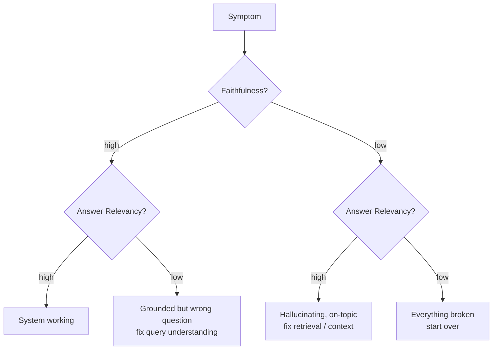

# RAG Eval

The metrics, tools, and CI pattern for evaluating retrieval-augmented systems.

!!! tip "Rapid Recall"
    **Two layers of RAG eval**: retrieval (did the right docs come back, in what order) and generation (did the LLM use them faithfully and on-topic). **RAGAS four metrics**: Faithfulness, Answer Relevancy, Context Precision, Context Recall. Memorize the 2x2 diagnostic. **Ecosystem**: Ragas (RAG-specific), DeepEval (broad + pytest-native), TruLens (RAG triad + tracing), Phoenix (drift). **MRR** for binary relevance, **nDCG@K** for graded. **Test set construction**: 50-500 hand-curated triples (query, relevant_docs, ideal_answer), versioned in git, gated in CI.

## §16 — The eval problem: why "it looks right" is not enough

You demo your RAG to a stakeholder. You ask 3 queries you've already tested. All 3 look great. Ship.

Three weeks later: users are getting confidently wrong answers. The reranker change you made on Tuesday looks correlated. Was it the reranker? You can't tell, because you have no baseline, no held-out set, no metrics that produce numbers.

**The fix is systematic eval.** You need:

1. **A test set**: 50-500 (query, relevant docs, ideal answer) triples. Hand-curated or LLM-synthesized then human-cleaned.
2. **Metrics**: numbers that go up or down when retrieval / generation quality changes.
3. **A baseline**: today's system's scores. Every change is measured against the baseline.
4. **A CI hook**: if scores regress beyond a threshold, the build fails.

### The two layers of RAG eval

RAG has two pieces, retrieval and generation, and they fail in different ways. You need to measure them separately, then together.

| Layer | What you measure | Why |
|---|---|---|
| **Retrieval** | Did the right docs come back? In what order? | If retrieval fails, generation has no chance |
| **Generation** | Did the LLM use the docs faithfully? Did it answer the question? | If generation hallucinates, even perfect retrieval is wasted |

If you only measure end-to-end ("did the final answer match the ground truth?") you can't tell where failures live. **Always measure both layers.**

### Building a test set (the part nobody talks about)

Two paths:

**Hand-curated** (high quality, slow):

- Sit with a domain expert, write 50 queries that real users would ask.
- For each, mark the docs that should be retrieved.
- Write the ideal answer.
- This is *the* gold standard. Worth its weight when stakes are high.

**Synthetic with Ragas TestsetGenerator** (fast, requires cleanup):

- Ragas can generate `(query, ground truth answer, context)` triples from your corpus.
- LLM reads a passage, generates a plausible question + answer.
- **You must spot-check.** LLM-generated questions can be too easy, too narrow, or hallucinate facts not in the corpus.
- Use synthetic for bootstrap, then refine by hand.

## §17 — Ragas: the four metrics you must know

Ragas is the most-used open-source RAG evaluation library in 2026. It computes RAG-specific metrics using **LLM-as-judge** (an LLM scores the system's outputs against ground truth or against the retrieved context).

### The four core metrics

Each measures a different RAG failure mode:

| Metric | Layer | What it asks | Failure mode it catches |
|---|---|---|---|
| **Context Precision** | Retrieval | Of the chunks retrieved, are the relevant ones at the top? | Wrong order, relevant docs buried below noise |
| **Context Recall** | Retrieval | Did we retrieve all chunks needed to answer? | Missing docs, answer impossible to ground |
| **Faithfulness** | Generation | Is every claim in the answer supported by retrieved context? | Hallucination, LLM made things up |
| **Answer Relevancy** | Generation | Does the answer actually address the question? | Off-topic, LLM rambled |

### Faithfulness, in one sentence

> "Decompose the answer into atomic claims; for each claim, ask: is this claim supported by the retrieved context? Faithfulness = (supported claims) / (total claims)."

This is the metric that catches hallucination, the #1 RAG failure mode in production. **A faithfulness of 0.7 means 30% of what your LLM says isn't backed by your docs.** That's a fireable offense in a medical or legal context.

### Context Precision, in one sentence

> "Of the top-K retrieved chunks, count how many are actually relevant to the question, weighted by their rank. Position-1-relevant counts more than position-K-relevant."

Mathematically (with relevance indicator `v_k ∈ {0, 1}` for chunk at rank k):

$$\text{Context Precision@K} = \frac{\sum_{k=1}^{K} (\text{Precision@k} \cdot v_k)}{\text{total relevant chunks in top K}}$$

Low context precision = your reranker isn't working OR the index is full of near-duplicates pushing relevant docs down.

### Context Recall

> "How much of the information needed to answer the question is present in the retrieved context?"

Requires a ground-truth answer. The LLM judge breaks the ground truth into claims, then checks how many are supported by the retrieved chunks.

Low context recall = retriever missed important docs. Increase `k`, improve chunking, fix the embedding model, or add hybrid retrieval.

### Answer Relevancy

> "How well does the answer address the user's actual question (regardless of factual correctness)?"

Ragas computes this by asking an LLM to generate questions *from the answer*, then measuring how close those generated questions are to the original. If the answer was off-topic, the generated questions will look nothing like the original.

### The RAGAS four-quadrant diagnostic



| Faithfulness | Answer Relevancy | Diagnosis |
|---|---|---|
| High | High | System working |
| Low | High | LLM hallucinating but staying on-topic, usually bad context |
| High | Low | LLM grounded but answering wrong question, usually bad query understanding |
| Low | Low | Everything is broken, start over |

**Memorize the cells.** This 2x2 is the diagnostic frame interviewers want to hear.

### Ragas implementation

```python
from ragas import EvaluationDataset, evaluate
from ragas.metrics import Faithfulness, ResponseRelevancy, LLMContextPrecisionWithoutReference, LLMContextRecall
from ragas.llms import LangchainLLMWrapper
from langchain_openai import ChatOpenAI

# 1. Wrap your evaluator LLM (any LangChain-compatible LLM works)
evaluator_llm = LangchainLLMWrapper(ChatOpenAI(model="gpt-4o-mini", temperature=0))

# 2. Build the evaluation dataset.
samples = [
    {
        "user_input":         "How long do refunds take?",
        "response":           "Refunds are processed within 5-7 business days.",
        "retrieved_contexts": ["Refunds are processed within 5-7 business days for all orders."],
        "reference":          "Refunds take 5-7 business days.",
    },
]
dataset = EvaluationDataset.from_list(samples)

# 3. Choose metrics and run
metrics = [
    Faithfulness(llm=evaluator_llm),
    ResponseRelevancy(llm=evaluator_llm),
    LLMContextPrecisionWithoutReference(llm=evaluator_llm),
    LLMContextRecall(llm=evaluator_llm),
]
result = evaluate(dataset=dataset, metrics=metrics)
```

## §18 — DeepEval, TruLens, Phoenix — the eval ecosystem

Ragas is purpose-built for RAG metrics. The other major players cover broader ground.

### DeepEval

Confident AI's eval library. **Broader scope** than Ragas: covers RAG, agents, multi-turn chatbots, MCP tool use, safety, multimodal. 50+ metrics, native `pytest` integration. **Best for teams using pytest already and wanting eval-as-CI from day one.**

```python
# DeepEval pattern — pytest-integrated
from deepeval import assert_test
from deepeval.metrics import FaithfulnessMetric, ContextualPrecisionMetric
from deepeval.test_case import LLMTestCase

def test_refund_query():
    test_case = LLMTestCase(
        input="How long do refunds take?",
        actual_output="Refunds are processed within 5-7 business days.",
        retrieval_context=["Refunds are processed within 5-7 business days for all orders."],
        expected_output="5-7 business days",
    )
    assert_test(test_case, [FaithfulnessMetric(threshold=0.7),
                            ContextualPrecisionMetric(threshold=0.7)])
```

### TruLens

Focuses on the **RAG triad**: Context Relevance + Groundedness + Answer Relevance. Built around observability, every call gets traced, every metric attached. **Best when you want eval and tracing in one tool.**

### Phoenix (Arize)

Open-source from Arize. Strong on **production drift detection**, embeddings drift, retrieval quality decay, answer distribution shifts over time. **Best for post-deployment monitoring.**

### Comparing the four

| | Ragas | DeepEval | TruLens | Phoenix |
|---|---|---|---|---|
| Scope | RAG-focused | Broad (RAG + agents + safety) | RAG triad + tracing | Production monitoring |
| Pytest integration | Manual | First-class | Manual | Manual |
| LLM-as-judge | Yes | Yes | Yes | Yes |
| Tracing | Via LangSmith/Langfuse | Optional | Built-in | Built-in |
| Best for | Pure RAG eval, fast iteration | Eval-as-CI, agentic systems | RAG + observability bundled | Production drift |

!!! note "Interview pick"
    If asked "what eval library?", say **Ragas for the metrics, DeepEval if I want pytest gating.** Anyone who name-drops TruLens or Phoenix knows their stuff.

## Standard offline metrics (sanity checks only in 2026)

| Metric | Measures | When to use | Gotcha |
|---|---|---|---|
| **Perplexity** | Language model fit to distribution | Fine-tuning eval | Useless for end-to-end system quality |
| **BLEU** | n-gram overlap with reference | Machine translation, historical artifact | Weak correlation with LLM quality |
| **ROUGE** | Recall-focused n-gram overlap | Summarization | Same weakness as BLEU |
| **BERTScore** | Semantic similarity via embeddings | Better alternative to BLEU/ROUGE | Still misses factual correctness |
| **Exact Match / F1** | For extractive QA | SQuAD-style tasks | Useless for open-ended generation |

In 2026, these are **sanity checks only**. LLM-as-judge metrics (RAGAS, custom) and task-specific functional metrics dominate.

## Ranking metrics: MRR and nDCG@k

Both measure "did the good stuff land near the top," with different assumptions about what counts as good.

### MRR — Mean Reciprocal Rank

Assumes **one** right answer. Find the rank of the first relevant result, take its reciprocal, average over queries.

`MRR = (1/|Q|) × Σ (1 / rank_of_first_relevant(q))`

Rank 1 → 1.0, rank 2 → 0.5, rank 3 → 0.33, not found → 0. Ignores everything after the first hit. Use for binary or singular relevance — factoid QA, "navigational" lookups.

### nDCG — Normalized Discounted Cumulative Gain

Assumes **graded** relevance and that all top-k positions matter with diminishing weight. The primary metric for *reranking*.

```
DCG@k = Σᵢ rel_i / log₂(i + 1)
nDCG@k = DCG@k / IDCG@k
```

Three pieces to keep straight:

1. **Gain** = each result's graded relevance (e.g. 0–3).
2. **Discount** = divide by `log₂(rank + 1)`: rank 1 divisor = `log₂(2) = 1` (full credit), rank 2 = `log₂(3) ≈ 1.585` (discounted), etc.
3. **IDCG** = DCG of the perfect ordering for that query; **normalize** → 0 to 1, comparable across queries with different numbers of relevant items.

**One-line split**: MRR = "how high is the *first* good one" (binary, single answer). nDCG = "how good is the *whole ordering*" (graded, all positions). For reranking, lead with nDCG; graded labels are what make it meaningful (with binary labels it collapses toward simpler metrics).

**The real hard part isn't the metric.** The arithmetic is trivial. The engineering is **getting the relevance labels** — you *author* the relevance definition (e.g. a 0–3 rubric with examples). Lead an interview answer with "first I'd build a labeled eval set, here's how," not the nDCG formula.

### Contextual precision and recall (the RAGAS / DeepEval flavor)

RAGAS-style metrics judge the *retrieved set* via an LLM judge that scores relevance against the expected answer. Two halves:

**Contextual recall — "did I get everything?"** Of the information the correct answer needs, how much is in the retrieved chunks. Computed by breaking the **ground-truth answer** into claims and checking the fraction supported by retrieved context:

`recall = (reference-answer claims supported by context) / (total claims)`

**Contextual precision — "is the good stuff ranked high?"** Whether relevant chunks appear *above* irrelevant ones. **Rank-aware by design** — mechanically like Average Precision / MAP.

Worked example: retrieved 5 chunks, relevance: `rank1=1, rank2=0, rank3=1, rank4=1, rank5=0`. Compute Precision@k only at ranks holding a relevant chunk:

- rank 1: `1/1 = 1.00`
- rank 3: `2/3 = 0.67`
- rank 4: `3/4 = 0.75`
- Average over the 3 relevant positions: `(1.00 + 0.67 + 0.75) / 3 = 0.81`

Each relevant chunk's contribution = "how clean is the list up to and including me." Relevant-near-top → high precision@k; relevant-buried-below-junk → low. Same chunks in worse order → lower score.

**Why rank-aware?** Built that way because retrieval feeds a **position-sensitive LLM** — the "lost in the middle" effect means a buried relevant chunk underperforms a top one. The metric predicts *generation* quality, not just retrieval correctness. **2026 nuance**: rank-awareness is a hedge against LLM position-sensitivity; its importance scales with (a) how position-sensitive the model is and (b) how large the retrieved set is. For a small top-5–8 fed to a strong long-context model *after a reranker*, order matters *less* — a precision-as-filter framing is defensible. It scales back up the moment you widen k or use a more position-sensitive model. Say "ranking mattered less *for my config*," not "ranking doesn't matter."

**The recall critique (and why it's valid).** RAGAS recall is measured against the **reference answer's claims, NOT the complete relevant-document set** in your DB. So it conflates two different failures:

1. Relevant chunk *exists in DB* but retrieval missed it → true retrieval failure (should be penalized). ✓
2. Information *was never in the corpus* → still penalized, though retrieval did all it could. ✗ — a corpus-coverage gap blamed on retrieval.

The defensible framing: "RAGAS recall is measured against the reference answer, so a corpus gap is penalized like a retrieval miss. **True retriever recall needs the complete relevant-set labels, infeasible at 10–20K docs.** So rather than a recall metric whose semantics didn't match what I wanted, I used contextual precision and graded nDCG — which I could compute rigorously." Don't say "recall is impractical"; say "this *operationalization* conflated corpus coverage with retrieval, and true recall needs labels I couldn't build."

### Faithfulness — the generation-side check

A **generation** metric (nDCG/precision were retrieval metrics): *is every claim in the answer supported by the retrieved context?* Catches within-RAG hallucination — retrieval was fine but the model invented beyond the source.

**Critical**: faithfulness does NOT measure correctness — only grounding-in-context. An answer can be **faithful-but-wrong** (context was wrong) or **correct-but-unfaithful** (used parametric knowledge the context lacked).

How it's computed (LLM-judge, two steps):

1. **Claim decomposition** — judge breaks the answer into atomic claims.
2. **Verification** — for each claim, can it be inferred from the retrieved context? yes / no.

`faithfulness = (claims supported by context) / (total claims)`

It's the rigorous version of a cosine-similarity grounding proxy — claim-level entailment catches paraphrased support that similarity misses.

**Faithfulness golden sets are cheaper than retrieval golden sets** — reference-free. A test case needs only: `input` (query), `actual_output` (what the system generated), `retrieval_context` (chunks actually retrieved). No expected-answer labels. So it's just representative queries + your system's real runtime outputs.

- **Stratify for coverage** — include hard, compound, ambiguous cases. Hallucination concentrates there, so an all-easy set reports a falsely rosy number.
- **Include "context doesn't contain the answer" cases** — highest value. Check the model *abstains* rather than confabulates.
- **Use real retrieved contexts**, not idealized ones.
- **Always pair with answer relevancy** — faithfulness alone is gameable (answer "I can't determine this" to everything → trivially faithful). High faithfulness + high relevancy is the target.

## BLEU, ROUGE, beam search — what they actually measure

These come up in 2026 only because interviewers ask, "could you have used BLEU here?" The honest answer is no — both do surface n-gram matching, so they're blind to synonyms, paraphrase, and meaning. The field moved to BERTScore (embedding cosine) and LLM-as-judge. Still, knowing the *one* distinction between BLEU and ROUGE matters because it gets asked.

**BLEU** = modified n-gram **precision** (n=1..4, geometric mean). *Clipped* precision stops "the the the the" gaming (clip each n-gram count to its max in the reference). A **brevity penalty** punishes too-short outputs (BLEU's backdoor way of caring about recall):

```
BLEU = BP × exp( Σ wₙ · log precisionₙ )    # denominator = CANDIDATE n-grams (precision)
```

**ROUGE** = n-gram **recall** (denominator = *reference* n-grams — that single swap is the core BLEU/ROUGE distinction). ROUGE-N = n-gram recall; **ROUGE-L** = Longest Common Subsequence F-measure. Reports P/R/F1 in practice. Clean framing: **BLEU designed precision-first (translation), ROUGE recall-first (summarization).**

**Beam search** turns per-step token distributions into a sequence. Greedy = pick top token each step (myopic). Beam search = keep top *k* sequences each step, expand all, keep best k, repeat. Greedy = beam with k=1. Catches: k× cost; **length bias** (longer = more sub-1 probs multiplied → fix with length normalization); **blandness** (optimizes for high probability → safe, generic). Use **beam for target-answer tasks** (translation, summarization); **sampling** (temperature, top-k, top-p) **for open-ended generation** — which is why chat LLMs use sampling, not beam.

## §19 — Building a regression test set and CI for RAG

The eval *frame* matters more than the specific metric values. Here's the production playbook.

### Step 1: build the test set

- 50-100 queries minimum to start. 500 is "comfortable."
- Coverage: mix of (a) common queries from real logs, (b) hard queries you know fail, (c) edge cases (multilingual, multi-hop, no-answer).
- Each entry: `(query, ground_truth_answer, must_retrieve_doc_ids)`.
- Store in a version-controlled CSV/JSONL. **Yes, in git.** Your test set is part of your codebase.

### Step 2: baseline once

Run your current system over the full test set. Record per-metric scores. This is "production today."

### Step 3: gate every change

Every PR that touches retrieval / prompts / chunking / models triggers eval. The CI:

1. Runs the full test set against the candidate branch.
2. Compares per-metric scores to baseline.
3. Fails the build if any metric drops by more than `X%` (5-10% is typical).
4. Posts the score-delta as a PR comment.

```python
# Pseudo-CI gate
results = evaluate(dataset, metrics=[Faithfulness(), ResponseRelevancy(),
                                     LLMContextPrecisionWithoutReference(), LLMContextRecall()])
deltas = {m: results[m] - baseline[m] for m in results}
fails = [m for m, d in deltas.items() if d < -0.05]   # 5% regression budget
if fails:
    print(f"REGRESSION on {fails}; blocking merge."); exit(1)
```

### Step 4: rotate the test set

A test set is also a *training set for confirmation bias.* You'll start tweaking to make scores go up. Once a quarter:

- Pull a new batch of queries from production logs.
- Have a human label them.
- Replace 20% of the test set.
- Re-baseline.

### Step 5: separate retrieval eval from generation eval

Same test set, two CI checks:

- **Retrieval check**: did `must_retrieve_doc_ids` show up in top-K? Fail if recall drops.
- **Generation check**: faithfulness + relevancy. Fail if they drop.

This isolates which side broke when a regression lands.

## Interview Questions

**Q1: Walk me through the four RAGAS metrics and what each diagnoses.**

Faithfulness: are the answer's claims supported by retrieved context? (low = hallucination). Answer Relevancy: does the answer address the query? (low = off-topic). Context Precision: are retrieved chunks actually relevant? (low = junk in retrieval). Context Recall: did retrieval get all necessary info? (low = missed docs). Combined, they decompose where RAG fails: generation, retrieval relevance, or retrieval coverage.

**Q2: Your RAG system has high faithfulness but low answer relevancy. What's happening?**

The model is grounding its answers in retrieved context (no hallucination) but answering a different question than the user asked. Causes: ambiguous queries the model interprets wrong, retrieval returning chunks about a related topic that the model then faithfully answers about. Fix: clarify query intent (ask the user), improve query understanding, add answer-relevance check post-generation.

**Q3: When is BLEU useful and when is it useless?**

BLEU is useful when there's a clear reference translation and fluency matters (machine translation). Useless for open-ended generation where many good answers exist, long-form content, and conversational AI, a different but equally correct answer scores zero BLEU. Rule: use BLEU as sanity check only, never as primary metric in 2026.

**Q6: How would you measure hallucination in a medical RAG system where you can't tolerate errors?**

Claim extraction → context check → external fact check against a curated medical knowledge base. Weight unverifiable claims as hallucination (α = 1.0, stricter than typical 0.5). Every flagged claim goes through human review. Run adversarial eval set of known tricky medical queries weekly. Target: hallucination rate < 0.5% on golden set, zero on life-safety-critical queries. Plus: refuse to answer when confidence low rather than guess.

---
