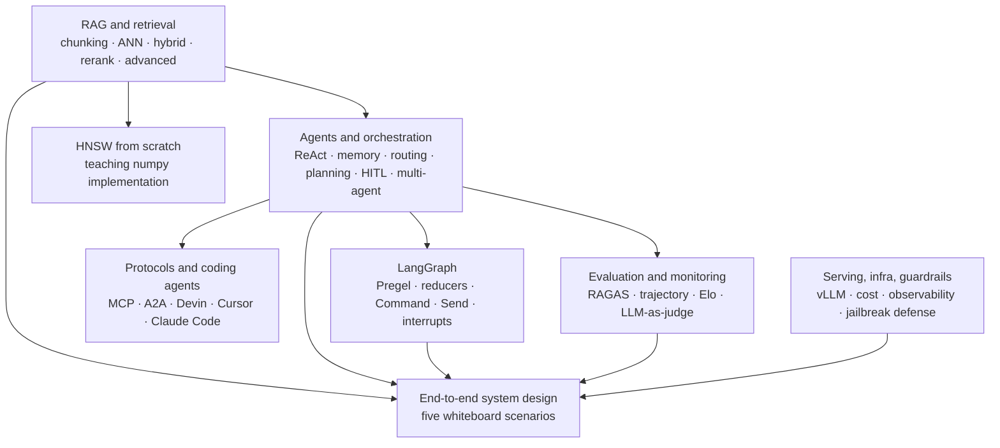

# Agentic AI Study Notes

A personal interview-prep knowledge base on agentic AI, covering retrieval, agent loops, LangGraph internals, protocols, evaluation, and serving.

!!! tip "How to use this site"
    Every page opens with a **Rapid Recall** callout, the compact TL;DR for fast revision before an interview, followed by the full deep-source content for study. Use the right-hand TOC for jump-to-section navigation, the top search bar for keyword lookup, and the section graph below for orientation across topics.

## Section Graph

## Recommended Reading Order

1. **Retrieval foundations.** Start with [RAG & Retrieval — Overview](rag/index.md) and walk through the seven sub-pages from Foundations through Advanced RAG. The HNSW From Scratch page is optional code reading.
2. **Agent loops.** Read [Agents & Orchestration](agents/index.md) end-to-end. This is where ReAct, reflection, plan-and-execute, memory tiers, routing, HITL, and multi-agent topologies live.
3. **LangGraph internals.** Move to [LangGraph](langgraph/index.md) for the code-forward view: graph and Pregel model, state and reducers, control flow with `Command` and `Send`, persistence, interrupts, streaming, time travel, CRAG, and multi-agent subgraphs.
4. **Protocols.** Read [Protocols & Coding Agents](protocols/index.md) for MCP, A2A, and the four coding-agent paradigms (Devin, Cursor, Claude Code, spec-driven).
5. **Operating agents in production.** Cover [Evaluation & Monitoring](eval/index.md) and [Serving, Infra & Guardrails](serving/index.md) together, since they share the production-loop story.
6. **Capstone drill.** Use [End-to-End System Design](system-design/index.md) as a whiteboard rehearsal across the five scenarios.

## Scope and Sources

This site is scoped strictly to **agentic AI**. LLM internals, transformer math, and hardware topics appear only where they directly serve an agentic concept (for example, vLLM and PagedAttention show up under serving because they govern agent latency, but pure CUDA and CPU-cache material is excluded).

Source provenance per page sits inside each topic. The corpus comprises:

- **Compact layers** (01–06) that fuel the Rapid Recall callouts on every page.
- **Deep masterclasses** for RAG, agents, LangGraph, protocols, eval, serving, and ops, used verbatim as the body of every page.
- **HTML references** that contribute distinctive figures and interview traps, embedded inline as static SVG.
- **Notebook code snippets** woven into the LangGraph pages especially, since runnable graph examples are the best way to understand graph mechanics.

## Layer Conventions

- **Rapid Recall** is interview-revision content. It is intentionally compact and may compress nuance.
- **Body sections** are kept verbatim from the deep sources. Reading the body is the way to understand a concept; reading the Rapid Recall is the way to remember it.
- **Mermaid diagrams** are added wherever they aid understanding. They render statically inside the page.
- **Code snippets** in the LangGraph section are runnable as-is in a LangChain/LangGraph environment, but on this site they are static and explained inline.
