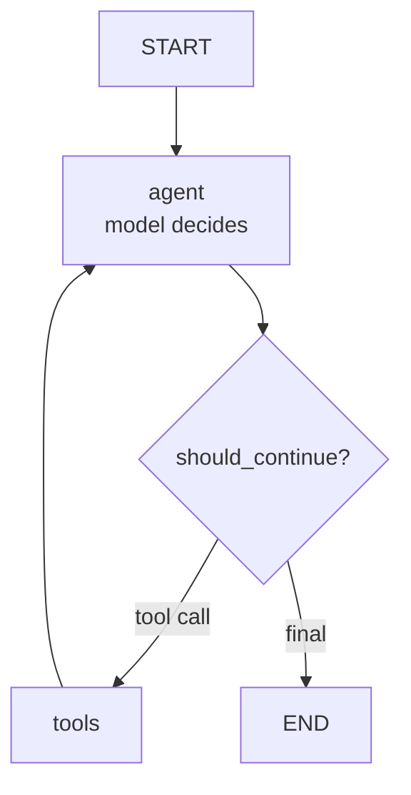
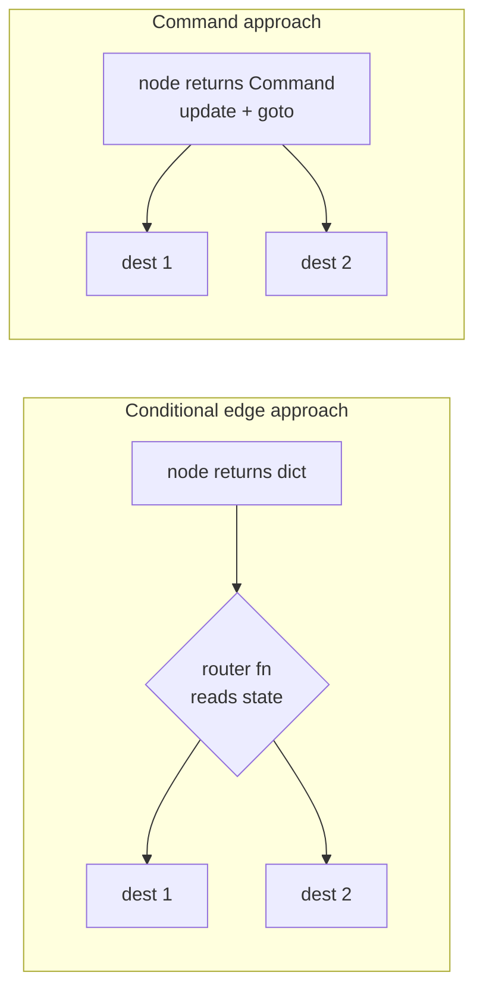

# Control Flow: Edges, Command, Send

Edges declare control flow. There are two kinds of edges, two modern primitives (`Command`, `Send`), and the agent loop is built from them.

!!! tip "Rapid Recall"
    **Normal edges** are unconditional next-node transitions; **conditional edges** run a router function that inspects state and returns the next node name. **The ReAct loop** is two edges: conditional from `agent` (tool calls → `tools`, else END), and normal from `tools` back to `agent`. **`Command`** lets a node return both a state update and a routing decision in one move, also the basis for multi-agent handoffs via `graph=Command.PARENT`. **`Send`** dispatches N parallel instances of a node, each with its own private input — this is dynamic map-reduce as a first-class primitive.

## §7 — Edges: normal, conditional, and the agent loop

### Normal edges: unconditional transitions

```python
builder.add_edge("a", "b")          # after a, always run b
builder.add_edge(START, "a")        # entry point
builder.add_edge("b", END)          # exit
```

A normal edge means "when the source node finishes, the destination node runs next, no questions asked." You can also fan out (multiple edges from one node → parallel execution) and fan in (multiple edges into one node).

### Conditional edges: the decision mechanism

A conditional edge runs a **router function** that inspects state and returns the name of the next node (or a list of names, or END):

```python
def should_continue(state: State) -> str:
    """Router: inspect state, return the name of the next node."""
    last_message = state["messages"][-1]
    if last_message.tool_calls:        # the LLM wants to call a tool
        return "tools"
    return END                          # the LLM gave a final answer

builder.add_conditional_edges(
    "agent",                            # source node
    should_continue,                    # router function
    {                                   # optional: map router outputs to node names
        "tools": "tools",
        END: END,
    },
)
```

**This is the heart of the agent loop.** After the model node runs, the router checks: did the LLM emit a tool call? If yes → go to the tools node. If no → the LLM gave a final answer → END.

### The canonical ReAct agent loop



Two edges make the loop:

- **Conditional edge** from `agent`: tool call → `tools`, else → END.
- **Normal edge** from `tools` back to `agent`: after running tools, always return to the model.

That cycle — agent → tools → agent → tools → ... → END — is the ReAct loop expressed as a LangGraph.

### Router functions can return lists (fan-out)

A router can return a *list* of node names to trigger multiple nodes in parallel:

```python
def route_to_specialists(state) -> list[str]:
    needed = []
    if state["needs_research"]: needed.append("researcher")
    if state["needs_math"]: needed.append("calculator")
    return needed    # both run in parallel in the next superstep
```

This is the conditional version of fan-out, dynamic parallel dispatch based on state.

### The `path_map` argument (third argument to add_conditional_edges)

The optional dict maps the router's return values to actual node names. Two reasons to use it:

1. **Decoupling**, the router returns abstract labels ("needs_tool"), the map translates to node names. Change the node without changing the router.
2. **Graph validation + visualization**, LangGraph can draw the possible edges if you declare them in the map. Without it, the diagram can't show conditional targets.

### Edges to remember

| Pattern | Code |
|---|---|
| Entry | `add_edge(START, "first")` |
| Exit | `add_edge("last", END)` |
| Sequential | `add_edge("a", "b")` |
| Parallel fan-out | `add_edge("a", "b")` + `add_edge("a", "c")` |
| Conditional | `add_conditional_edges("a", router_fn, path_map)` |
| Dynamic parallel | router returns a `list[str]` |
| Loop | conditional edge back to an earlier node |

!!! note "Interview note"
    *"How is an agent loop expressed in LangGraph?"* Two edges: a conditional edge from the model node (router checks for tool calls → route to tools node, else END) and a normal edge from the tools node back to the model node. That cycle is the ReAct loop. The recursion limit (default 25) caps it so a misbehaving loop can't run forever.

## §8 — `Command` and `Send`: the modern control-flow primitives

Two primitives in v1.x give you control flow beyond static edges. Both matter for multi-agent systems.

### `Command`: update state and route in one move

A node can return a `Command` object instead of a plain dict. `Command` combines **a state update** and **a routing decision**:

```python
from langgraph.types import Command
from typing import Literal

def agent_node(state: State) -> Command[Literal["tools", "__end__"]]:
    response = call_model(state)
    if response.tool_calls:
        return Command(
            update={"messages": [response]},   # update state
            goto="tools",                       # AND route to "tools"
        )
    return Command(update={"messages": [response]}, goto=END)
```

**Why this matters**: without `Command`, you need a node (returns update) *plus* a separate conditional edge (decides route). With `Command`, the node does both. Cleaner for cases where the routing decision is tightly coupled to what the node just computed.

The `Literal[...]` type hint tells LangGraph (and your IDE) the possible destinations, which enables graph visualization and validation.

### Command vs conditional-edge flow



### `Command` for multi-agent handoffs

`Command` is *the* mechanism behind multi-agent handoffs. When one agent hands off to another:

```python
def supervisor(state: State) -> Command[Literal["researcher", "writer", "__end__"]]:
    decision = decide_next_agent(state)
    return Command(
        update={"messages": [decision_message]},
        goto=decision,        # route to the chosen specialist
    )
```

And for handoffs that cross subgraph boundaries (a node in a child graph routing to a node in the parent), `Command` takes a `graph` parameter:

```python
return Command(
    update={"messages": [msg]},
    goto="other_agent",
    graph=Command.PARENT,    # navigate in the PARENT graph, not this subgraph
)
```

This `graph=Command.PARENT` is exactly what `langgraph-swarm`'s handoff tools return under the hood.

### `Send`: dynamic map-reduce / fan-out to N instances

`Send` solves a problem static edges can't: **"I don't know until runtime how many parallel branches I need."** This is the **map** half of classic map-reduce — apply the same operation to every item, independently, in parallel (one → many). The **reduce** half is the reducer on the shared field that folds all N results into one (many → one). Classic example: count words per document (map), sum the counts (reduce).

A normal edge hardcodes structure at *build time*. Map-reduce needs the *number* of parallel branches decided at *runtime* — if node A produces 7 subtasks you need 7 copies of B; if 200, then 200. You cannot draw that edge ahead of time.

Imagine: the agent retrieved 7 documents and wants to grade each one in parallel. You don't know it's 7 until runtime. `Send` lets a router dispatch N copies of a node, each with its own private input:

```python
from langgraph.types import Send

def dispatch_grading(state: State) -> list[Send]:
    # Create one Send per document — each goes to the "grade" node with that doc
    return [Send("grade_document", {"doc": doc}) for doc in state["retrieved_docs"]]

builder.add_conditional_edges("retrieve", dispatch_grading, ["grade_document"])
```

Each `Send("grade_document", {"doc": doc})` says "run the `grade_document` node with *this* private state." All N runs happen in parallel in the next superstep, and their writes merge via reducers (so `grade_document` should write to a list channel with an `add` reducer).

This is **map-reduce as a first-class primitive**:

- **Map**: `Send` dispatches N parallel node instances.
- **Reduce**: the reducer merges their N outputs.

### Send fan-out

<figure class="diagram diagram-dark" markdown="0">
<svg viewbox="0 0 760 250" xmlns="http://www.w3.org/2000/svg">
  <defs><marker id="arr3" markerwidth="8" markerheight="8" refx="6" refy="4" orient="auto"><path d="M0,0 L8,4 L0,8 Z" fill="#e0a64b"/></marker></defs>
  <rect x="30" y="100" width="120" height="50" rx="10" fill="#211d15" stroke="#a892c4" stroke-width="1.5"/>
  <text x="90" y="122" text-anchor="middle" class="svg-title">node A</text><text x="90" y="138" text-anchor="middle" class="svg-sub">returns [Send,…]</text>
  <g>
  <rect x="300" y="30" width="150" height="38" rx="8" fill="#16140f" stroke="#6fb3a8"/><text x="375" y="54" text-anchor="middle" class="svg-label">process({item:x1})</text>
  <rect x="300" y="106" width="150" height="38" rx="8" fill="#16140f" stroke="#6fb3a8"/><text x="375" y="130" text-anchor="middle" class="svg-label">process({item:x2})</text>
  <rect x="300" y="182" width="150" height="38" rx="8" fill="#16140f" stroke="#6fb3a8"/><text x="375" y="206" text-anchor="middle" class="svg-label">process({item:xN})</text>
  </g>
  <rect x="600" y="106" width="140" height="50" rx="10" fill="#211d15" stroke="#e0a64b" stroke-width="1.5"/>
  <text x="670" y="128" text-anchor="middle" class="svg-title">reducer</text><text x="670" y="144" text-anchor="middle" class="svg-sub">operator.add</text>
  <line x1="150" y1="118" x2="296" y2="49" stroke="#e0a64b" stroke-width="1.8" marker-end="url(#arr3)"/>
  <line x1="150" y1="125" x2="296" y2="125" stroke="#e0a64b" stroke-width="1.8" marker-end="url(#arr3)"/>
  <line x1="150" y1="132" x2="296" y2="201" stroke="#e0a64b" stroke-width="1.8" marker-end="url(#arr3)"/>
  <line x1="450" y1="49" x2="596" y2="118" stroke="#6fb3a8" stroke-width="1.8" marker-end="url(#arr3)"/>
  <line x1="450" y1="125" x2="596" y2="128" stroke="#6fb3a8" stroke-width="1.8" marker-end="url(#arr3)"/>
  <line x1="450" y1="201" x2="596" y2="138" stroke="#6fb3a8" stroke-width="1.8" marker-end="url(#arr3)"/>
  <text x="225" y="20" text-anchor="middle" class="svg-sub">MAP — dynamic fan-out (Send)</text>
  <text x="600" y="190" text-anchor="middle" class="svg-sub">REDUCE — fan-in</text>
</svg>
<figcaption>Send spawns N runtime-determined branches; each gets its own private slice of state; the reducer on the shared field folds them back. Parallelism width is data-determined at runtime, not fixed at compile time.</figcaption>
</figure>

**Send vs Command in one line.** Both are control-flow objects you *return* from a node, but `Send(node, state)` is fan-*out* — spawn (possibly many) parallel branches each with private state (you usually return a list). `Command(goto=..., update=...)` is "update state *and* go to that node next" (singular).

### `Command` vs `Send` vs conditional edges — when to use which

| You want to... | Use |
|---|---|
| Route to one of a few known nodes based on state | conditional edge (router fn) |
| Update state AND route, tightly coupled | `Command` |
| Hand off between agents / subgraphs | `Command(goto=..., graph=Command.PARENT)` |
| Fan out to N parallel instances, N known only at runtime | `Send` |
| Static parallel fan-out (fixed N) | multiple normal edges |

### The decision in practice

Most graphs: normal edges + conditional edges. Reach for `Command` when nodes naturally decide their own next step (multi-agent, complex routing). Reach for `Send` when you need dynamic parallelism (grade N docs, process N items, spawn N subagents).

!!! note "Interview note"
    *"What's the difference between `Command` and `Send` in LangGraph?"* `Command` lets a node return both a state update and a routing decision (`goto`), and can cross subgraph boundaries with `graph=Command.PARENT`, it's the basis of multi-agent handoffs. `Send` dispatches N parallel instances of a node, each with private input, where N is determined at runtime, it's the map half of map-reduce, with reducers handling the reduce. Conditional edges route to known nodes; `Send` creates a dynamic number of parallel branches.

### Why not "Command AND conditional edges together" on one decision

For a *single* decision, pick one — a node with `Command(goto=...)` shouldn't *also* have conditional edges defined on it, or two mechanisms fight over "what's next." The legitimate mix is at the *graph* level: different nodes use different mechanisms. Never both on one node's single decision.

The framing that helps: **conditional edges externalize routing into the topology**, which keeps control flow legible — that's why they're the default. **`Command` co-locates a node's state update and its routing**, which is right for multi-agent handoffs and parent-graph navigation, where the next step *is* the node's own output rather than a separable function of state.

## The Functional API — same engine, imperative style

`@entrypoint` = "this function is the runnable workflow." `@task` = "this is a unit of work" (gets checkpointing, retry, parallelism). Your control flow stays plain Python.

```python
from langgraph.func import entrypoint, task

@task
def step1(x): ...

@entrypoint(checkpointer=saver)
def workflow(inp):
    a = step1(inp).result()
    if a > 0.5:                # plain Python if — no router, no edge
        b = step2(a).result()
    return b
```

| Functional API wins when… | Graph API wins when… |
|---|---|
| Complex nested `if / for / while` logic | Topology is the valuable, inspectable thing |
| Retrofitting existing pipeline code | Genuine parallel fan-out |
| Structure is trivially linear, logic is gnarly | Complex multi-agent topologies |
| Messy data-dependent iteration | Human-in-the-loop interrupts at named nodes; visualization |

Compression: the Functional API is LangGraph's durability, checkpointing, and streaming over ordinary imperative Python via `@entrypoint` + `@task`. It's "rarely used" because if you reach for LangGraph at all you usually want what graphs give you — visible topology, parallelism, interrupts, multi-agent. Think of it as "LangGraph's runtime without LangGraph's graph."

### Send + reducer example output

```
=== Running dynamic map-reduce with Send ===

  retrieve: got 3 documents
  dispatch: sending 3 parallel grade tasks via Send
    grade: 'doc about cats' → relevant
    grade: 'doc about dogs' → relevant
    grade: 'irrelevant doc about taxes' → irrelevant

Final grades (merged from 3 parallel grade nodes):
  {'doc': 'doc about cats', 'relevant': True}
  {'doc': 'doc about dogs', 'relevant': True}
  {'doc': 'irrelevant doc about taxes', 'relevant': False}

What happened:
  1. retrieve produced 3 docs (N unknown until runtime).
  2. dispatch_grading returned [Send('grade', {doc}) for each doc] → 3 parallel grade nodes.
  3. Each grade node got a PRIVATE state ({single_doc: ...}), not the whole state.
  4. All 3 ran in ONE superstep, in parallel.
  5. Their writes to 'grades' merged via the `add` reducer.

This is map-reduce as a first-class LangGraph primitive. Send = map, reducer = reduce.
```

---
