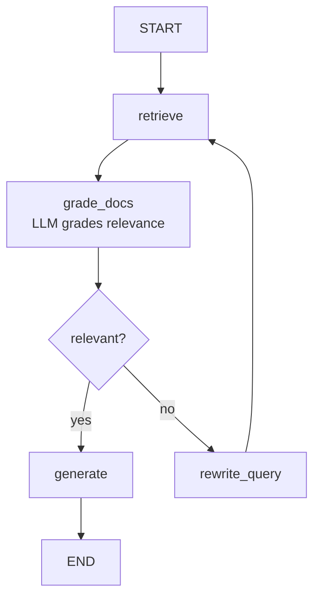
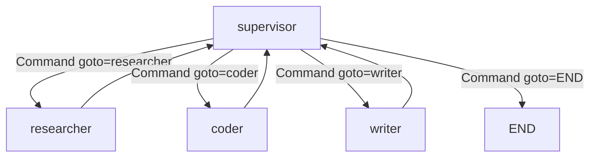
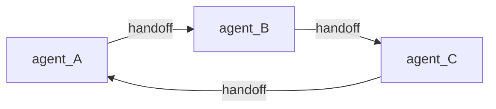
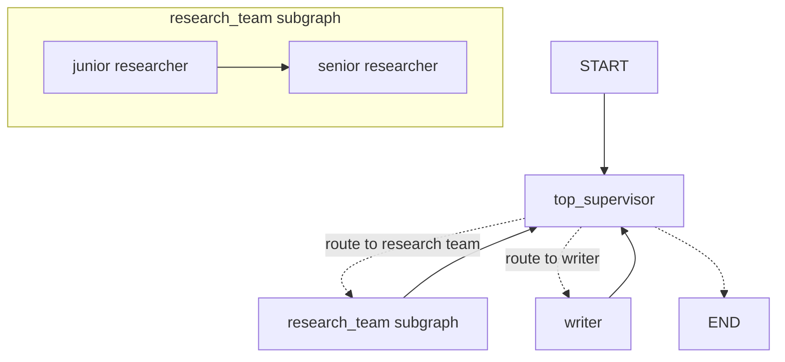

# CRAG & Multi-Agent Subgraphs

How RAG becomes a graph the moment it gets adaptive, and how every multi-agent pattern from supervisor to hierarchical falls out of the same primitives.

!!! tip "Rapid Recall"
    **Naive RAG is a chain, not a graph.** Reach for a graph when RAG becomes adaptive: grading retrieved docs, rewriting bad queries, looping until context is good. **CRAG (Corrective RAG)** is the canonical agentic-RAG graph: retrieve → grade_docs → (good: generate / bad: rewrite_query → loop). Cap the loop with a rewrite counter. **Multi-agent topologies are just graphs of agent-nodes and agent-subgraphs**, routed with conditional edges, `Command`, and `Send`. Supervisor = central node returning `Command(goto=specialist)`. Swarm = handoff tools that return `Command(goto=peer, graph=Command.PARENT)`. Hierarchical = compiled subgraphs used as nodes in a parent graph. Scatter-gather = `Send` + reducer.

## §14 — RAG as a graph: naive → agentic (CRAG)

### Naive RAG doesn't need a graph

The simplest RAG is a linear pipeline: retrieve → augment prompt → generate. That's an LCEL chain, not a graph:

```python
# This is fine as a plain LangChain chain — no graph needed
chain = retriever | format_docs | prompt | llm | parser
answer = chain.invoke("What is RAG?")
```

**If your RAG is truly linear, use a chain.** The graph earns its place only when you add loops or branches.

### When RAG needs a graph: the agentic patterns

The moment RAG becomes *adaptive*, it decides whether to retrieve, grades what it retrieved, rewrites bad queries, or loops until it has good context, you need cycles and branches. That's a graph. The canonical example is **Corrective RAG (CRAG)**:

### CRAG decision graph



The structure:

- **retrieve** — pull candidate documents.
- **grade_docs** — an LLM grades each doc for relevance (the "corrective" step).
- **conditional edge** — if docs are good → generate; if bad → rewrite the query and loop back.
- **rewrite_query** — improve the query, then retry retrieval.
- **generate** — produce the answer from good docs.

The loop (rewrite → retrieve → grade) is what a chain *can't* do and a graph *can*.

### The state for a RAG graph

```python
class RAGState(TypedDict):
    question: str
    documents: list           # retrieved docs
    relevant: bool            # did grading pass?
    answer: str
    rewrite_count: int        # cap the loop!
```

Note `rewrite_count`, you cap the corrective loop so a hopeless query doesn't retry forever. This is the recursion-limit discipline applied at the application level.

### Why this maps cleanly to LangGraph

Every agentic-RAG technique becomes a graph shape:

| Technique | Graph shape |
|---|---|
| **Naive RAG** | Linear chain (no graph needed) |
| **Corrective RAG (CRAG)** | retrieve → grade → (good: generate / bad: rewrite → loop) |
| **Self-RAG** | generate → critique → (good: end / bad: regenerate with more retrieval) |
| **Adaptive RAG** | router → (no retrieval / single retrieval / corrective loop) by query complexity |
| **Agentic RAG** | a full agent where "retrieve" is one tool among several |

The last one is key: **agentic RAG is just an agent where retrieval is a tool.** The ReAct agent decides when to retrieve, can retrieve multiple times, can combine retrieval with other tools. No special "RAG framework" needed, it's the agent loop with a retriever tool.

### CRAG demo output

```
=== Query 1: 'What is langgraph?' (good first retrieval) ===
  [retrieve] query='What is langgraph?' → 1 docs
  [grade_docs] relevant=True
  [generate] producing answer
  ANSWER: Based on 1 docs: LangGraph is a library for stateful agent workflows using a graph model.

=== Query 2: 'tell me stuff' (bad retrieval → corrective loop fires) ===
  [retrieve] query='tell me stuff' → 0 docs
  [grade_docs] relevant=False
  [rewrite_query] attempt 1: 'tell me stuff' → 'Tell me about langgraph'
  [retrieve] query='Tell me about langgraph' → 1 docs
  [grade_docs] relevant=True
  [generate] producing answer
  ANSWER: Based on 1 docs: LangGraph is a library for stateful agent workflows using a graph model.
  (took 1 query rewrite(s) — the corrective loop worked)
```

!!! note "Interview note"
    *"How would you build corrective RAG in LangGraph?"* State holds question, documents, a relevance flag, and a rewrite counter. Nodes: retrieve, grade_docs (LLM grades relevance), rewrite_query, generate. A conditional edge after grading routes to generate (docs good) or rewrite_query (docs bad), and rewrite loops back to retrieve. The rewrite counter caps the loop. Naive RAG is a linear chain and doesn't need a graph; you reach for the graph exactly when RAG becomes adaptive, grading, rewriting, looping.

## §15 — Multi-agent networks in LangGraph

You know the multi-agent patterns from the [Agents section](../agents/multi-agent-topologies.md). Here's how each is *built* in LangGraph — the structures behind `langgraph-supervisor` and `langgraph-swarm`, plus the subgraph mechanism that makes hierarchical systems possible.

### The foundational idea: agents are nodes (or subgraphs)

In LangGraph multi-agent systems, each "agent" is either:

- **A node** — a function that runs that agent's logic, or
- **A subgraph** — an entire compiled graph embedded as a node in a parent graph.

Multi-agent coordination is then just **routing between these nodes/subgraphs**, using the conditional edges, `Command`, and `Send` primitives you already learned. There's no separate "multi-agent engine"; it's the same graph model, composed.

### Pattern 1: Supervisor

A central supervisor node routes to specialist nodes; after each specialist, control returns to the supervisor.



**How it's built**: the supervisor is a node that returns `Command(goto=specialist_name)`. Each specialist is a node with an edge back to the supervisor. The supervisor's logic (an LLM call, usually) decides which specialist to route to next, or to END.

`langgraph-supervisor`'s `create_supervisor(...)` builds exactly this graph for you, but now you know it's a supervisor node + specialist nodes + routing edges. You could build it by hand with `Command`.

### Pattern 2: Swarm

No central supervisor — agents hand off to each other directly via handoff tools.



**How it's built**: each agent is a node. A "handoff tool" is a tool that, when called, returns `Command(goto="other_agent")`. Whichever agent is active handles the turn; calling a handoff tool routes to a peer. The "active agent" is tracked in state.

`langgraph-swarm`'s `create_swarm(...)` builds this. The handoff tools return `Command(goto=..., graph=Command.PARENT)`, exactly the `Command` mechanism from [Control Flow](control-flow.md).

### Pattern 3: Hierarchical (subgraphs)

The key enabling mechanism: **a compiled graph can be a node inside another graph.** This is how you build supervisors-of-supervisors.

```python
# A team is its own graph
research_team = build_research_team().compile()

# The top-level graph uses the team graph AS A NODE
top_builder = StateGraph(TopState)
top_builder.add_node("research_team", research_team)   # ← a whole graph as one node
top_builder.add_node("writing_team", writing_team)
top_builder.add_node("top_supervisor", top_supervisor)
```

When the parent graph routes to `"research_team"`, that entire subgraph runs (its own supervisor, its own specialists), then returns control to the parent. This composes infinitely, teams of teams.

**The state-sharing rule for subgraphs**: if the subgraph's state schema shares keys with the parent (like `messages`), those keys flow through automatically. If the schemas differ, you transform state at the boundary (a wrapper node maps parent state → subgraph state and back).

### Pattern 4: Scatter-gather (with Send)

The map-reduce pattern from [Control Flow](control-flow.md), applied to agents: a coordinator uses `Send` to spawn N subagent invocations in parallel, and a reducer merges their outputs.

```python
def dispatch(state):
    return [Send("subagent", {"task": t}) for t in state["subtasks"]]
```

This is the Anthropic research-system pattern — lead spawns parallel subagents — built with `Send`.

### Supervisor + subgraph topology



### Choosing the structure

| Pattern | LangGraph mechanism | When |
|---|---|---|
| Supervisor | supervisor node + `Command`/conditional routing | 3-7 specialists, central control |
| Swarm | handoff tools returning `Command(goto=...)` | peer-to-peer, lower latency |
| Hierarchical | subgraphs as nodes | 10+ specialists in teams |
| Scatter-gather | `Send` + reducer | dynamic parallel subtasks |

### The big realization

There is no "multi-agent framework" hiding inside LangGraph. **Multi-agent systems are just graphs composed of agent-nodes and agent-subgraphs, routed with the primitives you already know** (conditional edges, `Command`, `Send`, subgraphs). The `langgraph-supervisor` and `langgraph-swarm` packages are thin conveniences over these primitives. Once you see that, you can build *any* topology, including ones no library provides, because you're working at the primitive level.

!!! note "Interview note"
    *"How are multi-agent systems built in LangGraph?"* Each agent is a node or a subgraph; coordination is routing between them. Supervisor = a central node returning `Command(goto=specialist)` with specialists edging back. Swarm = handoff tools that return `Command(goto=peer, graph=Command.PARENT)`. Hierarchical = compiled subgraphs used as nodes in a parent graph. Scatter-gather = `Send` to spawn N parallel subagents + a reducer to merge. The `langgraph-supervisor`/`-swarm` libraries are conveniences over these primitives, you can build any topology by hand.

## Maximum customizability and complete clarity

The single most important mental unlock: **in LangGraph, all control flow is explicit.** Unlike frameworks where an opaque "agent executor" decides what happens, in LangGraph *you* declared every node and every edge. When something happens, it's because of an edge you wrote or a `Command`/`Send` a node returned. There is nowhere for magic to hide.

So when you're confused by a LangGraph program, the answer is *always* in one of these places:

1. A node function (what work happened)
2. An edge or conditional edge (why it went there)
3. A `Command`/`Send` return (dynamic routing)
4. A reducer (why state merged that way)
5. The compile config (checkpointer, interrupts)

That's the whole surface area. Master those five and you can read and modify any LangGraph code.

### Debugging method

1. **Render the graph**: `print(graph.get_graph().draw_mermaid())`. See the structure.
2. **Enable tracing**: set `LANGSMITH_TRACING=true`. See every node, LLM call, tool call.
3. **Stream updates**: `graph.stream(..., stream_mode="updates")`. Watch state evolve node by node.
4. **Inspect state history**: `graph.get_state_history(config)`. See every superstep's state.
5. **Time-travel to the failure**: fork from the checkpoint just before things went wrong.
6. **Unit-test the suspect node/router**: it's a plain function, call it with the state, assert.

Five tools, and you can diagnose anything. No guessing.

### The flexibility payoff

Because LangGraph exposes the engine (not just a high-level agent), you can build things no opinionated framework allows:

- **Arbitrary topologies**, not just ReAct or supervisor; any graph you can draw.
- **Custom state semantics**, reducers let you define exactly how state merges.
- **Mixed sync/async**, per-node, as needed.
- **Deep persistence control**, checkpoint where you want, resume how you want, time-travel.
- **Compose with anything**, a node can call LlamaIndex, an MCP server, another framework's agent, a raw HTTP API.

That last point is the ultimate flexibility: **a LangGraph node is just a Python function, so it can do literally anything.** The graph gives you orchestration, state, and persistence around arbitrary Python. Nothing is off-limits.

### 90-second "explain LangGraph"

> "LangGraph models an agent as a directed graph: nodes are functions that do work, edges declare control flow, and all nodes share a typed state object. It runs on a Pregel / Bulk-Synchronous-Parallel engine, execution proceeds in supersteps that plan which nodes to run, execute them in parallel, merge their state writes via reducers at a barrier, then checkpoint. That checkpointing is what gives you durable persistence, resume, and time travel for free. You get the agent loop by wiring a conditional edge from the model node, tool calls route to a tools node, else END, with the tools node looping back to the model. State updates merge via reducers; the canonical `messages` field uses `add_messages` which appends and dedupes by ID. Memory is two systems: the checkpointer (per `thread_id`, short-term/conversation) and the store (per namespace, long-term/cross-conversation). For multi-agent, agents are nodes or subgraphs routed with `Command` and `Send`. It's the lowest-level, most flexible agent framework, and the most production-proven via LangSmith."
