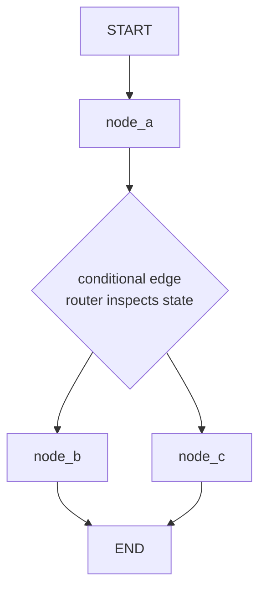
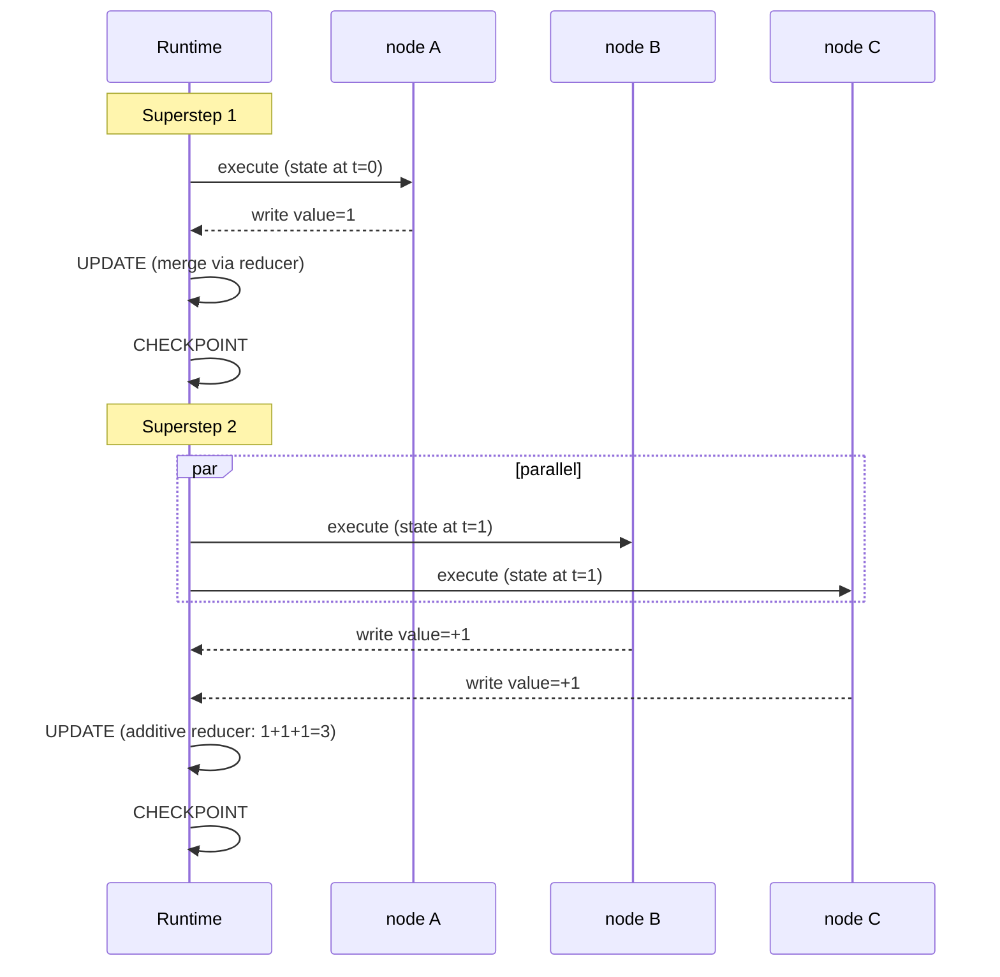

# Graph & Pregel Mental Model

The "behind the scenes" you asked about. Three sections that make every other LangGraph behavior obvious.

!!! tip "Rapid Recall"
    A LangGraph "graph" is **functions that share one piece of state, where you explicitly declare which function runs after which.** Three primitives: **State** (shared dict), **Nodes** (functions that read state and return updates), **Edges** (declared control flow). The runtime is **Pregel** (BSP: Bulk Synchronous Parallel). Execution = supersteps of PLAN → EXECUTE (in parallel) → UPDATE (merge via reducers) → CHECKPOINT. Within a superstep, sibling nodes don't see each other's writes; concurrent writes need a reducer. **Reading any LangGraph code = find State + nodes + edges + compile config; there's no hidden control flow.**

## §1 — What a "graph" actually is in LangGraph

Forget the word "graph" for a second. The clearest way to understand LangGraph is this:

> **LangGraph is a way to write a program as a set of functions that share one piece of state, where you explicitly declare which function runs after which.**

That's it. The "graph" is just the map of "after function A, run function B (or C, depending on the state)." Three primitives:

| Primitive | What it is | Plain-Python analogy |
|---|---|---|
| **State** | A shared data structure passed to every function | A dict that every function reads and writes |
| **Node** | A function that reads state and returns updates to it | A regular Python function |
| **Edge** | A declaration of what runs next | The control flow (`if/else`, loops) made explicit and external |

### Why not just write normal Python?

You absolutely could write an agent as a `while` loop with `if/else`. People do. So why a graph?

Because three things get painful fast in a plain loop, and LangGraph solves all three for free:

1. **Persistence**: you want to pause the agent (for human approval), save its full state to a database, and resume hours later on a different machine. In a plain `while` loop, the state lives in local variables that vanish when the function returns. In LangGraph, the state is a declared structure that the runtime checkpoints automatically after every step.
2. **Streaming**: you want to emit "the agent just called the weather tool" to the user as it happens. In a plain loop you'd manually thread a callback through everything. In LangGraph, the runtime streams state updates after every node automatically.
3. **Cycles with control**: agents loop (call tool → observe → decide → maybe call another tool). LangChain's older "LCEL" chains were acyclic (a fixed pipeline). LangGraph supports cycles with a recursion limit, conditional routing, and visibility into each iteration.

So the value proposition is: **write your logic as nodes + edges, and get persistence, streaming, and controlled cycles for free.** That's the whole pitch.

### The canonical picture



`START` and `END` are special sentinel nodes LangGraph provides. Your real nodes sit in between. Edges (solid) are unconditional; conditional edges (the fork) run a router function to pick the next node.

### LangChain vs LangGraph — the relationship

| | LangChain | LangGraph |
|---|---|---|
| **What** | Components: LLM wrappers, prompt templates, retrievers, output parsers, tool definitions | An execution engine for stateful, cyclic graphs |
| **Composition** | LCEL, linear, acyclic pipelines (`prompt | llm | parser`) | Graphs, cyclic, stateful, branching |
| **Use for** | A one-shot RAG query, a simple chain | Anything that loops, branches, persists, or has human-in-the-loop |
| **Relationship** | LangGraph nodes often *contain* LangChain components | Built on top of LangChain core |

The mental model: **LangChain gives you the building blocks (an LLM call, a retriever, a tool); LangGraph wires them into a stateful program that can loop and persist.** A LangGraph node is frequently just "call this LangChain LLM with this prompt." They're complementary, not competitors.

!!! note "Interview note"
    *"When would you use LangChain vs LangGraph?"* LangChain (LCEL) for linear, one-shot pipelines — a RAG query that retrieves then answers, no loop. LangGraph the moment you need cycles (agent loops), branching (route to different handlers), persistence (resume across sessions), or human-in-the-loop. They compose: LangGraph nodes call LangChain components.

## §2 — The engine: Pregel and the Bulk Synchronous Parallel model

This is the "behind the scenes" you asked about. **Understanding this one section makes every confusing LangGraph behavior obvious.**

LangGraph's runtime is named **Pregel**, after Google's 2010 paper on large-scale graph processing. Pregel itself is an adaptation of **Leslie Valiant's Bulk Synchronous Parallel (BSP)** model from the 1980s. You don't need the history, you need the execution model, because it explains *everything* about how state updates, parallelism, and checkpointing behave.

### The core idea: actors and channels

In Pregel terms:

- **Actors** = your nodes. They do computation.
- **Channels** = your state fields. Actors read from channels and write to channels.

Actors never talk to each other directly. They **only communicate by reading and writing channels.** Node B doesn't call node A; node A writes to a channel, and node B reads that channel on the next step. This indirection is *why* LangGraph can checkpoint, stream, and parallelize — all communication flows through observable channels.

### Execution happens in supersteps

A LangGraph run is a sequence of **supersteps**. Each superstep has four phases:

```
   ┌─────────────────────────────────────────────────────┐
   │                  ONE SUPERSTEP                       │
   │                                                      │
   │  1. PLAN     Which nodes should run this step?       │
   │              (Nodes whose input channels were        │
   │               updated in the PREVIOUS superstep.)    │
   │                                                      │
   │  2. EXECUTE  Run all selected nodes IN PARALLEL.     │
   │              Each reads the channel state as it was  │
   │              at the START of the superstep.          │
   │              ► Writes are NOT visible to siblings    │
   │                during this superstep.                │
   │                                                      │
   │  3. UPDATE   Apply all node writes to channels,      │
   │              using REDUCERS to merge.                │
   │                                                      │
   │  4. CHECKPOINT  Persist the new channel state to     │
   │                 the checkpointer (if configured).    │
   └─────────────────────────────────────────────────────┘
                            │
                            ▼
              Repeat until no node has new work
              (all "vote to halt" — reach END)
```

### The two consequences that explain everything

#### Consequence 1: within a superstep, nodes don't see each other's writes

If node B and node C run in the *same* superstep (because both were triggered by node A), and B writes `value=5`, **C does not see `value=5`.** C sees the value as it was at the *start* of the superstep. Their writes are merged at the UPDATE phase, *after* both finish.

This is the #1 source of "why didn't my parallel node see the other node's update?" confusion. The answer: **by design, superstep isolation.** Writes become visible only at the next superstep.

#### Consequence 2: parallelism is automatic for nodes triggered together

If node A's edges fan out to B and C (both unconditionally), then B and C are selected in the same PLAN phase and **execute in parallel** in the EXECUTE phase. You don't write any threading code. The BSP model gives you parallelism for free, and the barrier (the UPDATE phase) ensures their results merge deterministically.

This is exactly the "scatter-gather" pattern from the agentic masterclass, but at the framework level: fan out to N nodes, they run in parallel, their writes merge via reducers at the barrier.

### How a node "votes to halt"

A node has no more work when its output channels don't trigger any downstream node. When *all* nodes have halted (execution reaches END with nothing pending), the graph terminates and returns the final channel state. This is why you need a recursion limit, if your edges form a cycle that never halts, the graph would run forever; the limit (default 25) is the safety cutoff.

### Why this matters for you

Three practical payoffs from understanding the engine:

1. **Parallel state bugs make sense now.** "My two parallel nodes both incremented a counter but it only went up by one." Because they both read the same starting value, both wrote `start+1`, and the reducer (default: overwrite) kept one. Fix: use an additive reducer.
2. **You know when things run in parallel.** Nodes triggered in the same superstep run concurrently. Design for it (independent work) or avoid it (sequential edges).
3. **Checkpointing makes sense now.** State is persisted at the end of every superstep, so "resume" means "reload the last superstep's channel state and continue planning." Time travel means "reload an *earlier* superstep's state."

### The two API levels

LangGraph exposes this engine at two levels:

| Level | API | When |
|---|---|---|
| **Graph API** | `StateGraph`, `add_node`, `add_edge` | 95% of the time. Declarative, readable |
| **Functional / Pregel API** | `@entrypoint`, `@task`, raw `Pregel` | When you need imperative control flow or are doing something exotic |

We work almost entirely in the Graph API. But knowing the Pregel layer is underneath is what gives you the clarity to debug anything.

### Pregel superstep timeline



!!! note "Interview note"
    *"How does LangGraph execute a graph?"* The Pregel / BSP model: execution proceeds in supersteps; each superstep plans which nodes to run (those whose input channels changed), executes them in parallel, then applies their writes to channels via reducers at a synchronization barrier, then checkpoints. Nodes communicate only through channels, never directly. Writes within a superstep are invisible to siblings until the next superstep. That isolation is what enables deterministic parallelism and checkpointing.

## §3 — Reading any LangGraph codebase with confidence

Now that you have the engine model, here's how to read *any* LangGraph code you encounter. Every LangGraph program, no matter how complex, is built from exactly these moves. When you see a confusing codebase, find these six things and the whole thing decodes:

### The six things to find in any LangGraph code

```python
# 1. THE STATE — what data flows through the graph?
class AgentState(TypedDict):
    messages: Annotated[list, add_messages]
    # ↑ Look at the fields and their reducers. This tells you what the graph tracks.

# 2. THE NODES — what are the units of work?
builder.add_node("agent", call_model)
builder.add_node("tools", tool_node)
# ↑ Each add_node is one function. Read each function to know what it does.

# 3. THE ENTRY — where does it start?
builder.add_edge(START, "agent")
# ↑ Follow START to find the first node.

# 4. THE EDGES — what's the control flow?
builder.add_edge("tools", "agent")                    # unconditional
builder.add_conditional_edges("agent", should_continue) # conditional (router function)
# ↑ Trace the edges to understand the flow. Conditional edges have a router function — read it.

# 5. THE EXITS — when does it stop?
#    Look for edges to END, or conditional edges that can return END.

# 6. THE COMPILE — what's attached?
graph = builder.compile(checkpointer=..., interrupt_before=[...])
# ↑ checkpointer = persistence. interrupt_before/after = human-in-the-loop points.
```

### A reading checklist

When you open an unfamiliar `graph.py`, in order:

1. **Find the State class.** Read its fields and reducers. This is the data model.
2. **Find `compile()`.** Note the checkpointer and any interrupts.
3. **Find `add_edge(START, ...)`.** This is your entry point.
4. **Trace edges forward.** Build the graph in your head (or use `graph.get_graph().draw_mermaid()` to render it).
5. **Read each node function.** Each one takes state, returns updates.
6. **Read each router function** (the second argument to `add_conditional_edges`). These are the decision points.

That's the whole skill. There are no hidden mechanisms, everything is state + nodes + edges + compile config.

### Visualizing a graph (the debugging superpower)

LangGraph can render any compiled graph as a Mermaid diagram. This is the fastest way to understand a graph you didn't write:

```python
# Prints a Mermaid diagram you can paste into any Mermaid viewer
print(graph.get_graph().draw_mermaid())

# Or, in a Jupyter notebook with the right deps, render inline:
from IPython.display import Image
Image(graph.get_graph().draw_mermaid_png())
```

### Common things that confuse people, pre-answered

| Confusion | Resolution |
|---|---|
| "Where's the main loop?" | There isn't one in your code, the Pregel runtime is the loop. You declare nodes/edges; it runs supersteps. |
| "Why does my node return a partial dict?" | Nodes return *updates*, not the full state. The runtime merges via reducers. |
| "Why didn't my parallel node see the other's write?" | Superstep isolation. Writes merge at the barrier, visible next superstep. |
| "What's `START` / `END`?" | Sentinel nodes the framework provides. START = entry, END = exit. |
| "Graph not compiled error" | You forgot `.compile()`. The builder isn't executable; the compiled graph is. |
| "Why TypedDict and not a regular class?" | TypedDict is serializable (checkpointing needs that) and supports the reducer-annotation system. |

### Minimal StateGraph with a deterministic fake LLM

This is the smallest interesting LangGraph you can build, two nodes communicating through state:

```python
from typing import TypedDict
from langgraph.graph import StateGraph, START, END

class S(TypedDict):
    value: int
    log: str

def node_a(state):
    print(f"  node_a sees value={state['value']}")
    return {"value": state["value"] + 1, "log": state["log"] + "A"}

def node_b(state):
    print(f"  node_b sees value={state['value']}")
    return {"value": state["value"] * 10, "log": state["log"] + "B"}

builder = StateGraph(S)
builder.add_node("a", node_a)
builder.add_node("b", node_b)
builder.add_edge(START, "a")
builder.add_edge("a", "b")
builder.add_edge("b", END)
graph = builder.compile()

graph.invoke({"value": 1, "log": ""})
# value: 1 → (a: +1) → 2 → (b: *10) → 20
# log:  '' → 'A' → 'AB'
```

!!! note "Interview note"
    *"Walk me through how you'd understand a LangGraph codebase you've never seen."* Find the State class (the data model), the compile call (persistence + interrupts), the START edge (entry), then trace edges and read node + router functions. Render it with `draw_mermaid()`. Emphasize that there's no hidden control flow, it's all declared in nodes and edges; the Pregel runtime is the loop.
