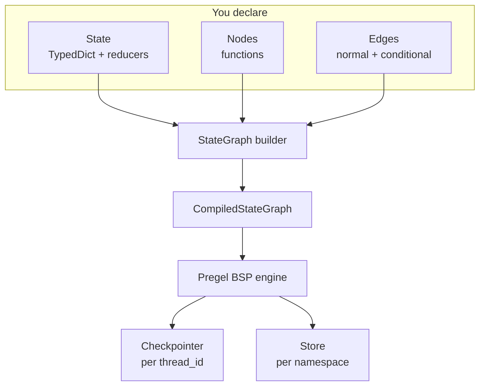
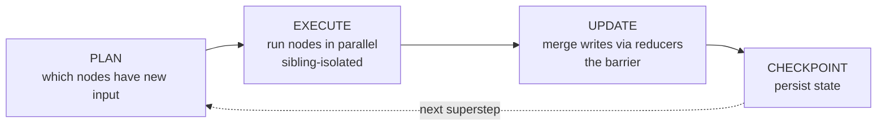

# LangGraph

Code-forward deep dive on **LangGraph**: how the engine works under the hood so you can build, debug, and customize with complete clarity. Where the [Agents](../agents/index.md) section taught *what* agents are, this section teaches *how* the tool actually works.

!!! tip "Rapid Recall"
    LangGraph = **state + nodes + edges + the Pregel / BSP runtime that checkpoints after every superstep.** Cycles, branching, persistence, streaming, and time travel are all consequences of that one architecture. State is a typed `TypedDict` with reducers (`add_messages` for chat, `operator.add` for accumulators); writes within a superstep are isolated and merge at the barrier. Two modern control-flow primitives: **`Command`** (update state + route in one move, also the basis for handoffs) and **`Send`** (dynamic map-reduce). Two memory systems: **Checkpointer** per `thread_id` (this conversation) and **Store** per namespace (across conversations). HITL via `interrupt(payload)`; resume with `Command(resume=value)`. `create_agent` builds the standard ReAct graph in one line; drop to `StateGraph` whenever you need custom topology.

## The complete picture



## The Pregel / BSP loop in one diagram



Within a superstep, sibling nodes don't see each other's writes — they merge at the UPDATE barrier. Concurrent writes to one field require a reducer or `InvalidUpdateError` fires.

## The customizability ladder

```
create_agent → +middleware → StateGraph → custom reducers/policies → Functional API → Pregel
   (simplest)                  (most work lives here)                          (rarely)
```

Climb down only as far as you need. Most production agents live at "create_agent + middleware" or "StateGraph."

## Section guide

| Page | Covers |
|---|---|
| [Graph & Pregel Mental Model](graph-pregel.md) | What a graph really is; the BSP engine; how to read any LangGraph code |
| [State & Reducers](state-reducers.md) | TypedDict / Pydantic / dataclass; channels; default vs additive vs custom reducers; `add_messages`; node contract |
| [Control Flow (Edges, Command, Send)](control-flow.md) | Normal vs conditional edges; the agent loop; `Command` for handoffs; `Send` for map-reduce |
| [ReAct & create_agent](react-create-agent.md) | Build the ReAct loop by hand; then the prebuilt one-liner; `@tool`, `ToolNode`, middleware |
| [Persistence, Interrupts, Streaming](persistence-streaming.md) | Checkpointer vs Store, `interrupt`/`Command(resume=...)`, four stream modes, time travel |
| [CRAG & Multi-Agent Subgraphs](crag-multiagent.md) | Corrective RAG as a graph; supervisor, swarm, hierarchical, scatter-gather, all from primitives |

## The complete primitive reference

| Primitive | What | Code |
|---|---|---|
| State | Shared typed data | `class S(TypedDict): x: Annotated[list, add]` |
| Node | A function (state)→updates | `builder.add_node("n", fn)` |
| Normal edge | Unconditional next | `builder.add_edge("a", "b")` |
| Entry / exit | Start / end | `add_edge(START, "a")` / `add_edge("z", END)` |
| Conditional edge | Router function | `add_conditional_edges("a", router, path_map)` |
| Command | Update + route in one | `return Command(update={...}, goto="b")` |
| Send | Dynamic parallel fan-out | `return [Send("n", {...}) for x in items]` |
| Compile | Make it runnable | `graph = builder.compile(checkpointer=..., store=...)` |

## Versions (2026)

- **LangGraph v1.0** (stable since October 2025). The API in this section is v1.x: `StateGraph`, `add_node`, `add_edge`, `add_conditional_edges`, `compile`, `Command`, `Send`, `interrupt`.
- **LangChain v1.x**: `create_agent` (successor to `AgentExecutor` and `create_react_agent`), middleware system.
- Common deprecated patterns to avoid: `set_entry_point()` (use `add_edge(START, ...)`), `config_schema` (deprecated v0.6, use `context_schema`).

## Framework comparison

LangGraph vs the alternatives:

| Framework | One-liner |
|---|---|
| **LangGraph** | Lowest-level, most flexible graph engine; best state/persistence; model-agnostic |
| **LlamaIndex** | RAG-first; best retrieval abstractions |
| **Google ADK** | Hierarchical agents, multimodal, GCP, built-in sandboxed code exec |
| **OpenAI Agents SDK** | Handoff-centric, minimal, OpenAI-first |
| **Anthropic Agent SDK** | Tool-use + sub-agents, computer use first-class, Claude-only |

The mature 2026 take: **don't force one framework to do everything.** A common production stack uses LangGraph for orchestration, LlamaIndex for retrieval, MCP to connect tools, and A2A when agents span vendor boundaries.

## Layer checklist

- [ ] Can you explain the Pregel/BSP supersteps and why they enable persistence + parallelism?
- [ ] Can you write a `StateGraph` with conditional edges, a reducer on `messages`, and a checkpointer?
- [ ] Can you explain why v1.0 requires TypedDict not Pydantic for agent state?
- [ ] Can you build the ReAct loop by hand from `State` + nodes + edges (no `create_agent`)?
- [ ] Can you build CRAG as a graph with a corrective loop?
- [ ] Can you use `Command` for multi-agent handoffs and `Send` for dynamic map-reduce?
- [ ] Can you distinguish checkpointer (short-term per-thread) from store (long-term per-namespace)?
- [ ] Can you debug a graph with `draw_mermaid`, tracing, stream(updates), state history, time travel?
