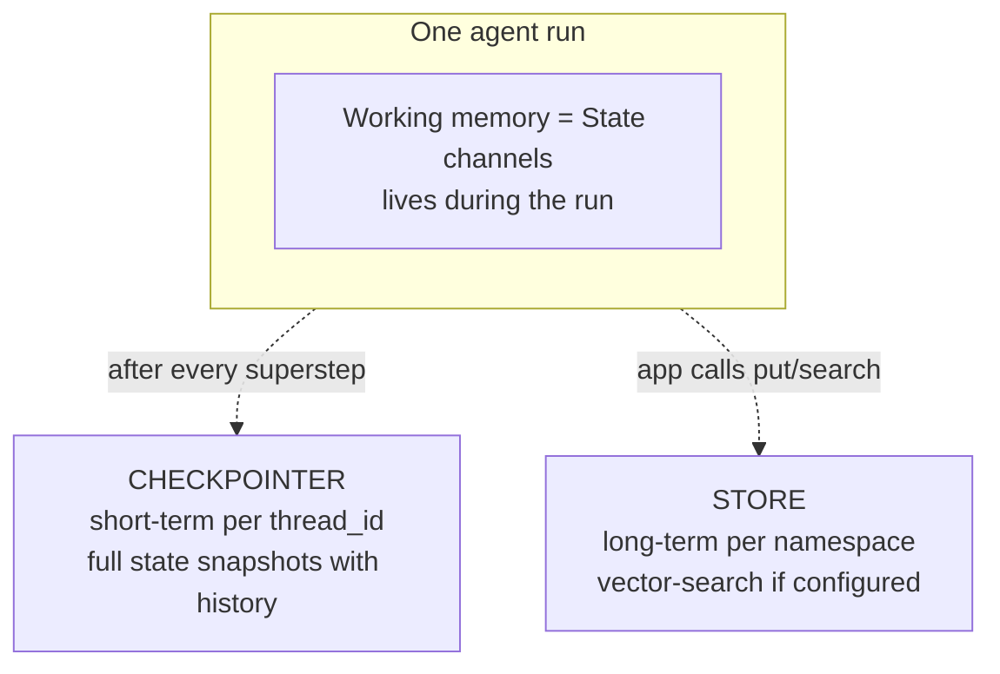
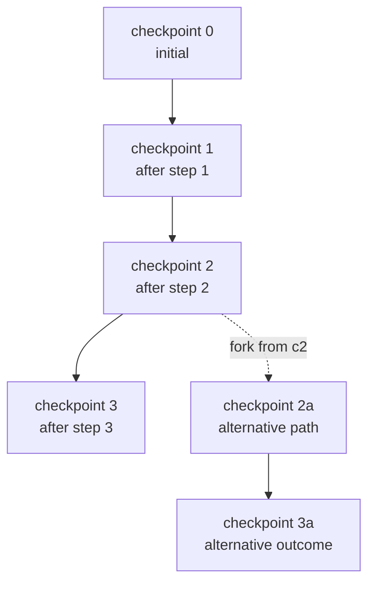

# Persistence, Interrupts, Streaming, Time Travel

How LangGraph specifically implements each layer of memory, plus the four stream modes and time travel — all consequences of per-superstep checkpointing.

!!! tip "Rapid Recall"
    LangGraph splits memory into **two distinct systems**: **Checkpointer** = short-term, keyed by `thread_id` (one conversation). **Store** = long-term, keyed by namespace (e.g. `user_id`), cross-thread. Hierarchy: `MemorySaver` (dev) → `SqliteSaver` (local) → `PostgresSaver` (prod). **HITL via `interrupt(payload)`**: the graph pauses, state is checkpointed, the call returns. Resume with `Command(resume=value)`; the `interrupt()` call returns that value as if it had been waiting. Requires a checkpointer. **Four stream modes**: `values` (full state per step), `updates` (per-node diffs), `messages` (LLM tokens), `custom`. **Time travel**: `get_state_history`, fork from any checkpoint, `update_state` to edit and resume.

## §11 — How LangGraph handles memory: checkpointers and the store

You know the theory of agent memory (working / short-term / long-term / episodic). Here's **how LangGraph specifically implements each layer.**

### LangGraph splits memory into two distinct systems

| Memory type (theory) | LangGraph mechanism | Scope |
|---|---|---|
| **Working memory** | The state itself (the channels) | Current run |
| **Short-term memory** (this conversation) | **Checkpointer**, keyed by `thread_id` | One thread (conversation) |
| **Long-term memory** (across conversations) | **Store**, keyed by namespace + key | Across all threads for a user |
| **Episodic / semantic** | Built on the Store (or external vector DB) | Cross-thread |

The crucial distinction LangGraph makes: **checkpointer = short-term (per-thread), store = long-term (cross-thread).** This trips people up. Let's separate them clearly.

### Short-term memory: the checkpointer

The checkpointer persists the **full graph state** after every superstep, keyed by `thread_id`. This is what makes a conversation continuous.

```python
from langgraph.checkpoint.memory import MemorySaver   # dev
# from langgraph.checkpoint.postgres import PostgresSaver  # production

checkpointer = MemorySaver()
graph = builder.compile(checkpointer=checkpointer)

# Thread A — one conversation
config_a = {"configurable": {"thread_id": "conversation-A"}}
graph.invoke({"messages": [HumanMessage("Hi, I'm Sam")]}, config=config_a)
graph.invoke({"messages": [HumanMessage("What's my name?")]}, config=config_a)
# ↑ Second call REMEMBERS "Sam" because same thread_id loads the prior state.

# Thread B — a DIFFERENT conversation, fresh state
config_b = {"configurable": {"thread_id": "conversation-B"}}
graph.invoke({"messages": [HumanMessage("What's my name?")]}, config=config_b)
# ↑ No memory of Sam — different thread.
```

**The mechanism (read-execute-write cycle)**:

1. **Retrieve**, on invoke with a `thread_id`, load the latest checkpoint for that thread.
2. **Execute**, run the graph, starting from that loaded state.
3. **Persist**, after each superstep, write the new state as a new checkpoint.

The checkpointer keeps a *history* of checkpoints (not just the latest), which is what enables time travel.

### The checkpointer hierarchy

| Checkpointer | Persistence | Use |
|---|---|---|
| `MemorySaver` / `InMemorySaver` | In-process RAM | Dev, tests, notebooks |
| `SqliteSaver` | Local SQLite file | Local apps, single machine |
| `PostgresSaver` | Postgres | Production |
| Redis checkpointer | Redis | High-throughput production |

**The single most important production fact**: `MemorySaver` loses everything on restart. For production you need `PostgresSaver` (or Redis).

### Long-term memory: the Store

The checkpointer is *per-thread*. But you want some memory to persist **across** threads — user preferences, facts learned in past conversations. That's the **Store**.

```python
from langgraph.store.memory import InMemoryStore   # dev
# from langgraph.store.postgres import PostgresStore  # production

store = InMemoryStore()
graph = builder.compile(checkpointer=checkpointer, store=store)

# Inside a node, access the store via the runtime:
def node(state, runtime):
    store = runtime.store
    user_id = runtime.context["user_id"]
    # Namespaced by user → cross-thread, per-user memory
    namespace = ("memories", user_id)
    store.put(namespace, "food_preference", {"value": "vegetarian"})
    memories = store.search(namespace)   # retrieve this user's memories
    return {...}
```

The Store is **namespaced** (a tuple like `("memories", user_id)`) and stores key-value pairs. It supports semantic search if you configure it with an embedding model, turning it into vector-backed long-term memory.

**The privacy point**: namespace by `user_id` so retrieval is naturally scoped per user. The store enforces the namespace boundary.

### The complete memory picture



**The clean mental model**:

- **State** = what the agent is thinking about right now.
- **Checkpointer** = the memory of *this* conversation (resume where you left off).
- **Store** = the memory of *this user* across all conversations (remember their preferences).

!!! note "Interview note"
    *"How does LangGraph handle memory?"* Two systems. The **checkpointer** persists full graph state per `thread_id` after every superstep, that's short-term/conversation memory and what enables resume + time travel; `PostgresSaver` in production. The **store** is namespaced key-value (by user_id, say) that persists across threads, that's long-term memory, optionally with embedding-based semantic search. State is working memory; checkpointer is this-conversation memory; store is across-conversation memory.

## §12 — Human-in-the-loop: `interrupt` and resume

You know the HITL theory. Here's the LangGraph mechanism precisely.

### The `interrupt` primitive

A node calls `interrupt(payload)`. The graph **pauses**, persists its state to the checkpointer, and returns control to the caller with the payload. Later, the caller resumes by invoking the graph with a `Command(resume=value)`, and the `interrupt(...)` call *returns that value*, as if it had been waiting.

```python
from langgraph.types import interrupt, Command

def approval_node(state):
    # Pause here. The payload is what your UI shows the human.
    decision = interrupt({
        "action": state["proposed_action"],
        "question": "Approve this action?",
    })
    # When resumed with Command(resume="approve"), `decision` == "approve"
    if decision == "approve":
        return {"status": "approved"}
    return {"status": "rejected"}
```

### Why this is powerful

The pause is **durable**, not a held thread. When `interrupt` fires:

1. State is checkpointed (so it survives a server restart).
2. `invoke` returns — your server is free, no connection held.
3. Hours or days later, the human clicks approve.
4. You call `graph.invoke(Command(resume="approve"), config={thread_id})`.
5. The graph reloads state, the `interrupt()` call returns `"approve"`, execution continues from exactly there.

**`interrupt` requires a checkpointer**, without persistence, there's nothing to resume from.

### Two ways to set up interrupts

#### 1. Dynamic interrupt (inside a node) — the modern way

Call `interrupt()` inside a node, as above. Flexible — you decide at runtime whether to pause, and the payload can include live state.

#### 2. Static interrupt (at compile time)

```python
graph = builder.compile(
    checkpointer=checkpointer,
    interrupt_before=["tools"],     # pause BEFORE the tools node every time
    # interrupt_after=["agent"],    # or pause AFTER a node
)
```

Static interrupts pause at fixed points. Useful for "always review before executing tools." Less flexible than dynamic, but zero code in the node.

### The four HITL patterns

| Pattern | LangGraph mechanism |
|---|---|
| Approve / reject | `interrupt()` returns the decision; node branches on it |
| Edit the proposed action | `interrupt()` returns the edited value; node uses it |
| Human handoff | `interrupt()` then route to a "human" node |
| Inject missing info | `interrupt()` asking for the field; resume with the value |

### Inspecting the interrupt from outside

After an `invoke` that hits an interrupt, you inspect what it's waiting on:

```python
state = graph.get_state(config)
if state.interrupts:
    # state.interrupts[0].value is the payload you passed to interrupt()
    show_to_user(state.interrupts[0].value)
```

Then resume:

```python
graph.invoke(Command(resume=user_decision), config=config)
```

!!! note "Interview note"
    *"How does human-in-the-loop work in LangGraph?"* A node calls `interrupt(payload)`; the graph checkpoints its state and returns control, no thread held, survives restarts. The UI shows the payload; the human decides; you resume with `Command(resume=value)`, and the `interrupt()` call returns that value, continuing execution from exactly that point. Requires a checkpointer. Static interrupts (`interrupt_before`/`interrupt_after` at compile) pause at fixed nodes; dynamic `interrupt()` pauses conditionally with live payloads.

## §13 — Streaming and time travel

Two more capabilities you get for free from the graph model.

### Streaming: four modes

LangGraph can stream a running graph. You call `graph.stream(...)` (sync) or `graph.astream(...)` (async) instead of `invoke`, and iterate over the events. There are four `stream_mode` values:

| `stream_mode` | What it emits | Use for |
|---|---|---|
| `"values"` | The **full state** after each superstep | Watching the whole state evolve |
| `"updates"` | Only the **state diff** each node produced | Progress tracking (which node ran, what it changed) |
| `"messages"` | **LLM tokens** as they stream, plus metadata | Chat UIs, token-by-token output |
| `"custom"` | Whatever you emit via `get_stream_writer()` | Custom progress events from inside nodes |

```python
# Stream state updates (progress)
for chunk in graph.stream({"messages": [...]}, config, stream_mode="updates"):
    print(chunk)   # {"node_name": {state updates from that node}}

# Stream LLM tokens (chat UI)
for token, metadata in graph.stream({"messages": [...]}, config, stream_mode="messages"):
    print(token.content, end="")

# Stream multiple modes at once
for mode, chunk in graph.stream({...}, config, stream_mode=["updates", "messages"]):
    ...
```

The `"messages"` mode is what powers token-by-token chat; `"updates"` is what powers "the agent is now searching the web" progress indicators.

### Time travel: forking from any past checkpoint

Because the checkpointer keeps a *history* of checkpoints (not just the latest), you can:

1. **List the history**, every state the graph passed through.
2. **Fork from any point**, re-run from an earlier state with different input.

```python
# List every checkpoint for this thread
history = list(graph.get_state_history(config))
for snapshot in history:
    print(snapshot.config["configurable"]["checkpoint_id"], "→ next:", snapshot.next)

# Pick a past checkpoint and fork from it
past = history[2]   # some earlier state
fork_config = past.config   # this config points at that specific checkpoint
# Resume execution FROM that past state — maybe with a different input
graph.invoke(new_input, config=fork_config)
```

### Time-travel checkpoint tree



**Why time travel matters**:

- **Debugging**, inspect the exact state at each step to find where things went wrong.
- **What-if analysis**, fork from step 5, try a different path, compare outcomes.
- **Error recovery**, a transient failure at step 7? Re-run from the step-6 checkpoint instead of from scratch.
- **HITL correction**, human edits the state at a past point; re-run from there.

### Updating state manually (the other half of time travel)

You can also *modify* a checkpoint's state directly, then resume:

```python
# Overwrite part of the state at the current checkpoint
graph.update_state(config, {"some_field": "corrected_value"})
# Now resume — the graph continues with the corrected state
graph.invoke(None, config=config)
```

`update_state` respects reducers (so updating a `messages` field appends via `add_messages` unless you specify otherwise). This is how a human "edits the agent's plan" mid-run.

### The connection to everything else

Streaming and time travel both fall out of the same property: **the runtime checkpoints state after every superstep, keeping history.** Streaming = emit each checkpoint as it's made. Time travel = reload an old checkpoint. Both are free consequences of the BSP + checkpointer architecture. This is the payoff of understanding the engine, these features stop being magic.

!!! note "Interview note"
    *"How does streaming work in LangGraph, and what's time travel?"* Streaming: call `graph.stream()` with a `stream_mode` — `"values"` (full state per step), `"updates"` (per-node diffs, for progress), `"messages"` (LLM tokens, for chat UIs), or `"custom"`. Time travel: the checkpointer keeps a history of every superstep's state, so you can list it (`get_state_history`), fork from any past checkpoint, or edit a checkpoint (`update_state`) and resume. Both are consequences of per-superstep checkpointing.

## Interview Questions

**Q11: How does LangGraph checkpointing work, and why does it matter for long-running agents?**

Every node execution writes a state snapshot to the checkpointer DB. If the server crashes mid-graph, the next invocation with the same `thread_id` resumes from the last checkpoint, no lost work. Matters for long-running tasks (research agents, multi-day approvals, background jobs), human-in-the-loop (pause can last hours), and debugging (time travel through past state).
