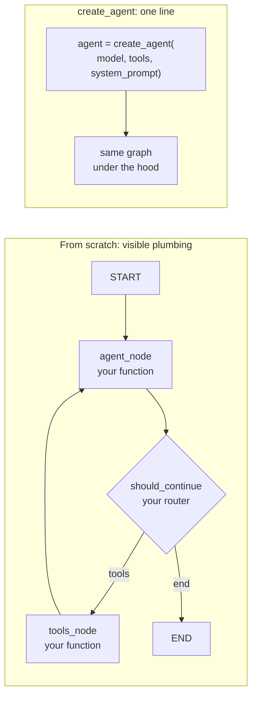

# ReAct & create_agent

Build the ReAct loop by hand using only primitives, then see the prebuilt one-liner that does the same thing.

!!! tip "Rapid Recall"
    **The ReAct loop in LangGraph** = three pieces. (1) State with `messages: Annotated[list, add_messages]`. (2) An `agent` node that calls `llm_with_tools`. (3) A `tools` node that executes any tool calls and appends `ToolMessage`s. Wire it with a conditional edge from `agent` (tool calls → `tools`, else END) and a normal edge from `tools` back to `agent`. **`create_agent(model, tools, system_prompt)`** builds exactly this graph in one line. **Middleware** (SummarizationMiddleware, HumanInTheLoopMiddleware, custom `before_model`/`after_model`/`wrap_tool_call`) is how you customize without dropping to the raw graph. **Climb down only as far as you need**: `create_agent` → `+middleware` → `StateGraph` → custom reducers and policies → Functional API → Pregel.

## §9 — A ReAct agent from scratch (no abstractions)

Time to build a real agent using only the primitives. **No `create_agent`, no prebuilt anything**, just State, nodes, edges. This is the single most clarifying exercise in LangGraph: once you've built the loop by hand, every prebuilt agent becomes transparent.

### The plan

We're building the canonical ReAct loop:

```
   START → agent → (tool calls?) → tools → agent → ... → END
```

Three pieces:

1. **State** with a `messages` field using `add_messages`.
2. **An `agent` node** that calls the LLM (which may emit tool calls).
3. **A `tools` node** that executes any tool calls and appends results.
4. **A conditional edge** that loops back to `agent` if there were tool calls, else ends.

### The pieces in detail

#### State

```python
class AgentState(TypedDict):
    messages: Annotated[list, add_messages]
```

Just conversation history. The `add_messages` reducer appends and dedupes.

#### The agent node

```python
def agent_node(state):
    response = llm_with_tools.invoke(state["messages"])  # may contain tool_calls
    return {"messages": [response]}                       # append the AI's response
```

It calls the LLM with the full message history. The LLM returns an `AIMessage` that either has `tool_calls` (it wants to use a tool) or is a plain answer.

#### The tools node

```python
def tools_node(state):
    last = state["messages"][-1]
    results = []
    for tc in last.tool_calls:
        tool = tools_by_name[tc["name"]]
        output = tool.invoke(tc["args"])
        results.append(ToolMessage(content=str(output), tool_call_id=tc["id"]))
    return {"messages": results}    # append the tool results
```

It reads the last message's tool calls, runs each tool, and appends a `ToolMessage` per call. The `tool_call_id` links each result back to its request, the LLM needs this to match results to calls.

#### The router

```python
def should_continue(state):
    last = state["messages"][-1]
    return "tools" if last.tool_calls else END
```

If the LLM's last message has tool calls → run tools. Otherwise → done.

### The wiring

```python
builder = StateGraph(AgentState)
builder.add_node("agent", agent_node)
builder.add_node("tools", tools_node)
builder.add_edge(START, "agent")
builder.add_conditional_edges("agent", should_continue, ["tools", END])
builder.add_edge("tools", "agent")     # ← the loop: after tools, back to agent
graph = builder.compile()
```

That `add_edge("tools", "agent")` is the loop. After tools run, control returns to the agent, which sees the tool results and decides again, call more tools, or give a final answer.

### Why build it by hand?

Because now you understand *exactly* what `create_agent` does. When you later write `create_agent(model, tools)` in one line, you know it's building this graph: an agent node, a tools node, a conditional edge for the loop. No magic. And when you need to customize — add a node between agent and tools, change the routing, inject a guardrail — you know precisely where to cut in.

### ReAct from scratch vs create_agent



## §10 — The prebuilt way: `create_agent`, tools, and middleware

You built the ReAct loop by hand. Now here's the one-liner that does the same thing, and because you understand what's underneath, you can see exactly what it builds.

### `create_agent` (LangChain v1.x)

```python
from langchain.agents import create_agent

agent = create_agent(
    model="anthropic:claude-sonnet-4-6",   # or a model object
    tools=[get_weather, web_search],
    system_prompt="You are a helpful assistant.",
)

result = agent.invoke({"messages": [{"role": "user", "content": "Weather in Delhi?"}]})
```

That's it. Under the hood, `create_agent` builds **exactly the graph you built in §9**: an agent node that calls the model, a tools node (the prebuilt `ToolNode`), a conditional edge for the loop, and the `tools → agent` back-edge. It returns a compiled graph — so everything you know about graphs applies (you can stream it, checkpoint it, inspect it with `draw_mermaid()`).

**Naming note**: `create_agent` is the v1.x name. You'll see older code using `create_react_agent` (from `langgraph.prebuilt`), same idea, the LangChain v1 `create_agent` is the current entry point. Both build the ReAct graph.

### When to use prebuilt vs build-your-own

| Situation | Use |
|---|---|
| Standard ReAct agent with tools | `create_agent` — don't reinvent it |
| You need a node *between* agent and tools (e.g., a guardrail, a logger) | Build your own, or use middleware |
| Custom routing (not just "tool calls? loop: end") | Build your own graph |
| Multi-agent topology | Build with subgraphs + Command |
| Learning / understanding | Build your own once, then use prebuilt |

The rule: **`create_agent` for the common case; drop to the Graph API the moment you need something it doesn't give you.** Because you understand the underlying graph, dropping down is never scary.

### Tools: the `@tool` decorator

A LangChain tool is a function plus a schema. The `@tool` decorator generates the schema from the type hints and docstring:

```python
from langchain_core.tools import tool

@tool
def search_flights(origin: str, destination: str, date: str) -> list[dict]:
    """Search available flights.

    Args:
        origin: IATA airport code, e.g. 'BLR'
        destination: IATA airport code, e.g. 'BOM'
        date: ISO date YYYY-MM-DD
    """
    return [{"flight": "6E-543", "price": 3840}]
```

The docstring becomes the tool description the LLM reads (description quality is everything). The type hints become the argument schema. For complex arguments, use a Pydantic model:

```python
from pydantic import BaseModel, Field

class FlightSearch(BaseModel):
    origin: str = Field(description="IATA airport code")
    destination: str = Field(description="IATA airport code")
    date: str = Field(description="ISO date YYYY-MM-DD")

@tool(args_schema=FlightSearch)
def search_flights(origin: str, destination: str, date: str) -> list[dict]:
    """Search available flights."""
    ...
```

### The prebuilt `ToolNode`

LangGraph ships a `ToolNode` that does exactly what your hand-written `tools_node` did — reads tool calls from the last message, runs them, appends `ToolMessage`s — but also handles errors, parallel tool calls, and edge cases:

```python
from langgraph.prebuilt import ToolNode

tool_node = ToolNode([get_weather, search_flights])
builder.add_node("tools", tool_node)
```

Use `ToolNode` instead of hand-writing the tools node unless you need custom tool-execution logic.

### Tool errors — and where the result actually lives

A subtle thing that confuses people: tool output "looks far from state" because the tool and the node are different layers. A tool returns a *naked value* and knows nothing about state. The `ToolNode` is the **adapter** that wraps that value into a `ToolMessage` and appends it to `state["messages"]` via the `add_messages` reducer.

```python
# tool: just a value
@tool
def get_weather(city): return "72°F"

# ToolNode (simplified): wraps + writes to state
msg = ToolMessage(content=str(raw), tool_call_id=call_id)
return {"messages": [msg]}
```

So error dicts (`{"error": ..., "suggestion": ...}`) also become `ToolMessage`s the model reads next turn. `ToolMessage` has a `status` field (`"success"` or `"error"`). That's the mechanism: tools are pure, the node is the bridge.

Three error categories, each handled in a different layer:

| Category | Handled where | Touches state? |
|---|---|---|
| **Transient** (rate limit, timeout, 503) | Retry with backoff *below* the model (RetryPolicy / tenacity) | No — ideally invisible if retry succeeds |
| **Permanent / bad-request** (404, invalid args) | Surfaced *to* the LLM as an error ToolMessage so it self-corrects | **Yes** — this is the "error + suggestion dict" bucket |
| **Programming** (your bug) | Should *fail loud*, not be laundered into the conversation | Ideally no |

!!! warning "handle_tool_errors trap"
    `ToolNode`'s default `handle_tool_errors=True` catches *everything* — including your bugs — and surfaces them as error `ToolMessage`s. Convenient, but it masks real programming errors. Many teams set it to `False` or pass a custom handler so bugs fail loud. If you want errors tracked separately for observability, add your own channel: `errors: Annotated[list, operator.add]` — a deliberate choice, not the default.

Interview line: tools return plain values; `ToolNode` wraps them into `ToolMessage`s in the messages channel — that's why tool output lands in state without the tool knowing about state. Transient errors retry beneath the model; bad-request errors become error `ToolMessage`s the model self-corrects from; programming errors should fail loud, which means being careful with `ToolNode`'s default error-swallowing.

### Middleware (LangChain v1.x): the customization layer

Middleware is the v1.x way to inject behavior into `create_agent` without dropping to the raw graph. Middleware can hook **before the model call**, **after the model call**, and **around tool execution**:

```python
from langchain.agents.middleware import SummarizationMiddleware, HumanInTheLoopMiddleware

agent = create_agent(
    model="anthropic:claude-sonnet-4-6",
    tools=[...],
    middleware=[
        SummarizationMiddleware(max_tokens=4000),       # auto-summarize long history
        HumanInTheLoopMiddleware(interrupt_on=["send_email"]),  # pause for approval on sensitive tools
    ],
)
```

Built-in middleware covers the most common needs:

- **`SummarizationMiddleware`**, the summary-buffer pattern, automatic.
- **`HumanInTheLoopMiddleware`**, interrupt before specified tools for approval.
- Custom middleware, subclass `AgentMiddleware`, override `before_model` / `after_model` / `wrap_tool_call`.

**This is the customizability story for `create_agent`**: you get the prebuilt loop, and middleware lets you inject cross-cutting behavior (summarization, guardrails, HITL, logging) without rebuilding the graph. When middleware isn't enough, you drop to the Graph API.

### The customizability ladder (full picture)

```
   create_agent (no middleware)        ← simplest; the ReAct loop
        │  add middleware
        ▼
   create_agent + middleware           ← inject summarization, HITL, guardrails
        │  need custom topology
        ▼
   StateGraph (Graph API)              ← build any graph; full control
        │  need imperative style
        ▼
   Functional API (@entrypoint/@task)  ← imperative control flow over the engine
        │  need raw engine access
        ▼
   Pregel (channels + actors)          ← almost never; the bare metal
```

Climb down only as far as you need. Most production agents live at "create_agent + middleware" or "StateGraph."

### Concrete customization recipes

| You want to... | Level | How |
|---|---|---|
| Add a guardrail before the LLM | middleware | Custom middleware `before_model` hook |
| Summarize long conversations | middleware | `SummarizationMiddleware` |
| Approve sensitive tools | middleware | `HumanInTheLoopMiddleware(interrupt_on=[...])` |
| Insert a node between agent and tools | StateGraph | Build the graph; add your node, rewire edges |
| Route to different agents by intent | StateGraph | Conditional edge or `Command` |
| Grade N documents in parallel | StateGraph | `Send` + a list reducer |
| Retry a flaky API node 3x | node policy | `add_node(..., retry_policy=RetryPolicy(max_attempts=3))` |
| Cache an expensive node | node policy | `add_node(..., cache_policy=CachePolicy(ttl=...))` |
| Keep only last-N messages | custom reducer | Custom reducer on the messages field |
| Imperative multi-step flow | Functional API | `@entrypoint`/`@task` |

!!! note "Interview note"
    *"When do you use `create_agent` vs building a graph by hand?"* `create_agent` builds the standard ReAct graph (agent node + ToolNode + conditional loop) in one line, use it for the common case. Add middleware (summarization, HITL, guardrails) for cross-cutting concerns. Drop to the `StateGraph` API when you need custom topology, a node between agent and tools, non-standard routing, or multi-agent structure. Because the prebuilt agent IS a graph, dropping down is seamless.

## Interview Questions

**Q10: When does middleware beat custom node logic in LangGraph?**

Middleware wins for cross-cutting concerns: retries, moderation, PII redaction, summarization, logging. These apply to every LLM call uniformly. Custom nodes win for business logic specific to one point in the graph: "after retrieval, if fewer than 3 docs, trigger web search." Rule: if you'd copy-paste it across 3+ nodes, make it middleware.

---
