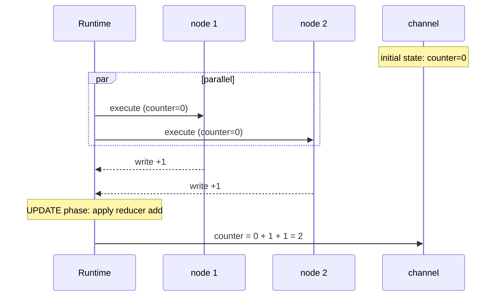

# State & Reducers

State design is where most LangGraph quality (and most bugs) come from. Channels, three ways to define state, the reducer system, and what a node can and can't do.

!!! tip "Rapid Recall"
    State is your **durable contract** — serialized to the checkpointer every superstep. Keep it small, serializable, and treat schema changes like database migrations. **Three schemas**: TypedDict (default, 90% of code), Pydantic (runtime validation), dataclass (defaults without Pydantic weight). **Reducers**: default is overwrite and rejects concurrent writes; `add_messages` is the canonical messages reducer (append + dedupe-by-id + format coercion); `operator.add` for lists/counters; custom for anything else. **A node** is a function that reads state and returns updates (dict). Don't mutate state in place; return updates and let the reducer merge.

## §4 — State, channels, and the three ways to define state

You now know state is "the data every node reads and writes," and that under the hood each state field is a **channel** in the Pregel model. Let's go deep, because state design is where most LangGraph quality and most bugs come from.

### State is your durable contract

Critical mental shift: **the state schema is not just a convenience type, it's what gets serialized to your checkpointer after every superstep.** If you use `PostgresSaver`, every field in your state is written to Postgres on every step. This has consequences:

- **Keep state small.** No giant binary blobs, no 10 MB payloads. Those get written to disk every step.
- **Keep state serializable.** TypedDicts of JSON-compatible types serialize cleanly. Arbitrary Python objects may not.
- **Treat schema changes like database migrations.** Add a field, and old checkpoints don't have it.

### The three ways to define state

#### 1. TypedDict (the default, most common)

```python
from typing import TypedDict, Annotated
from langgraph.graph.message import add_messages

class AgentState(TypedDict):
    messages: Annotated[list, add_messages]
    user_id: str
    step_count: int
```

**Pros**: simple, type-checked by your IDE, serializes cleanly, supports reducer annotations.
**Cons**: no runtime validation (TypedDict is just a hint), no default values.

This is what 90% of LangGraph code uses. Default to it.

#### 2. Pydantic BaseModel (when you want runtime validation)

```python
from pydantic import BaseModel, Field

class AgentState(BaseModel):
    messages: list = Field(default_factory=list)
    user_id: str = ""
    step_count: int = 0
```

**Pros**: runtime validation (bad data raises at the boundary), default values, the full Pydantic ecosystem.
**Cons**: slightly more overhead; reducer support is a bit more involved; serialization needs care.

Use Pydantic when input validation matters, e.g., the state is populated from external/untrusted input.

#### 3. Dataclass (a middle ground)

```python
from dataclasses import dataclass, field

@dataclass
class AgentState:
    messages: list = field(default_factory=list)
    user_id: str = ""
    step_count: int = 0
```

**Pros**: default values, lighter than Pydantic, standard library.
**Cons**: no runtime validation; less common in LangGraph code (you'll see TypedDict far more).

### The recommendation

| Situation | Use |
|---|---|
| Default / learning / most production | **TypedDict** |
| State populated from untrusted external input | **Pydantic** |
| Want defaults without Pydantic weight | **dataclass** |

**Pydantic for tool I/O at API boundaries; TypedDict for LangGraph state.** That holds, the state itself is usually TypedDict; the *tools* the agent calls use Pydantic for their argument schemas.

### What Pydantic actually is — and where it earns its cost

**Pydantic is a data-validation library.** Plain Python type hints (`x: int`) are decoration — ignored at runtime. Pydantic makes them *load-bearing*: data crossing a boundary must match the declared shape, or it fails loudly.

```python
from pydantic import BaseModel

class User(BaseModel):
    name: str
    age: int

User(name="Sam", age="25")   # coerced → 25
User(name="Sam", age="old")  # ValidationError
```

It was never *the* way LangGraph stored state. You saw Pydantic everywhere a year ago for two reasons: LangChain's own internals are built on it, and the v1 → v2 migration (v2 core rewritten in Rust) caused churn. That awkwardness is gone now — everything's on v2.

Three places Pydantic genuinely earns its cost in an agent system:

- **Tool / function-call schemas** — the cleanest way to describe tool arguments. `Field(description=...)` text goes *straight into the schema the model reads*, so it's effectively prompt engineering.
- **Structured output** — `model.with_structured_output(SomeModel)` forces the LLM to return validated data matching your class. Replaces brittle "parse the prose and pray" code.
- **Graph state (optional)** — supported, but the community default is `TypedDict`, not Pydantic.

| | TypedDict | Pydantic BaseModel |
|---|---|---|
| **Runtime validation** | No | Yes |
| **Overhead** | Lighter | Slightly heavier |
| **Defaults & validators** | No | Yes |
| **Docs default** | Yes | Less common |
| **Catches bad node returns** | No (fails later, weirdly) | Yes (fails at the boundary) |

The `Annotated[...]` reducer pattern works with both — it's an orthogonal axis. Compression: **always Pydantic for tool schemas and structured output; TypedDict by default for graph state, upgrading to Pydantic only when you want validation guarantees** (e.g. multi-author production graphs).

`TypedDict` itself, mechanically, is just a regular dict with declared keys and value types — hints on a dictionary, nothing more. Checking is **compile-time only** (IDE / mypy) — autocomplete, typo-catching. At runtime it's an ordinary dict; Python won't stop you putting a string in `count`. That's exactly why LangGraph picked it as the default state container: it behaves like the dict everything already passes around, but gives you a typed contract for free.

### Multiple state schemas: input, output, and internal

A subtlety that unlocks cleaner designs: a graph can have **different schemas for input, output, and internal state.**

```python
class InputState(TypedDict):
    question: str

class OutputState(TypedDict):
    answer: str

class InternalState(TypedDict):   # the full working state
    question: str
    retrieved_docs: list
    answer: str

builder = StateGraph(InternalState, input_schema=InputState, output_schema=OutputState)
```

Now the caller passes only `{question}`, the graph works with the full internal state, and the caller gets back only `{answer}`. The intermediate `retrieved_docs` never leaks out.

### What goes in state vs what doesn't

| Put in state | Keep out of state |
|---|---|
| Conversation messages | Large file contents (write to disk/store, keep a reference) |
| Current plan / todos | Secrets, API keys (use config/context) |
| Tool results you need later | One-off scratch values a single node uses internally |
| Control flags (status, step_count) | The LLM client object (inject via config) |
| Small structured data | Anything > a few hundred KB |

The test: "Does a *later* node need this, and should it survive a checkpoint?" If yes → state. If no → a local variable inside the node.

!!! note "Interview note"
    *"How do you decide what goes in LangGraph state?"* State is the durable contract, serialized to the checkpointer every superstep. Put in it only what later nodes need and what should survive a pause/resume: messages, plan, key results, control flags. Keep it small and serializable. Large blobs go to a store with a reference in state; secrets go through config/context, never state.

### Serialization — why "JSON-compatible state" is the rule

**Serialize** = turn a live in-memory object into a flat representation (usually JSON) you can save, send, and reconstruct. LangGraph cares because **checkpointers serialize state every superstep** to make it durable, resumable, and time-travelable. A non-serializable value breaks the checkpoint write.

The clean test: *"If I save this to a file and load it on a different machine tomorrow, does it still mean anything?"* Data **describes** (a name is true anywhere). Resources **do** (an open socket is action-in-progress, true only here, now, in this process). JSON carries facts, not action-in-progress.

| Serializable (data) | NOT serializable (live resource) |
|---|---|
| strings, numbers, booleans, lists, dicts | DB connection / network socket |
| messages (LangChain has a recipe) | open file handle |
| Pydantic models, datetimes | thread / lock / running coroutine |
| structured tool output | function / lambda (JSON has no "code") |
| | **LLM client object** (wraps HTTP client/config) |

The one that bites in practice: **never put the model object in state** — it wraps a live HTTP client; it's a tool, not data. Put the model's *output* in state. Create clients and connections fresh inside nodes when needed.

"JSON-compatible" is the safe rule; the real rule is "anything with a known serialize/deserialize recipe." A live socket can never have one — there's nothing to write down that brings it back. **State = facts the graph gathered, not live machinery.**

### How an LLM "runs" Python — it doesn't

This trips people up so often it deserves its own subsection. **The LLM never executes anything.** It only emits structured output. The execution is plain Python calling plain Python.

<figure class="diagram diagram-dark" markdown="0">
<svg viewbox="0 0 760 250" xmlns="http://www.w3.org/2000/svg">
  <defs><marker id="arr" markerwidth="9" markerheight="9" refx="7" refy="4.5" orient="auto"><path d="M0,0 L9,4.5 L0,9 Z" fill="#e0a64b"/></marker></defs>
  <rect x="20" y="95" width="150" height="60" rx="10" fill="#211d15" stroke="#a892c4" stroke-width="1.5"/>
  <text x="95" y="120" text-anchor="middle" class="svg-title">LLM</text>
  <text x="95" y="138" text-anchor="middle" class="svg-sub">emits name + args</text>
  <rect x="240" y="95" width="160" height="60" rx="10" fill="#211d15" stroke="#e0a64b" stroke-width="1.5"/>
  <text x="320" y="120" text-anchor="middle" class="svg-title">ToolNode</text>
  <text x="320" y="138" text-anchor="middle" class="svg-sub">dict lookup → call</text>
  <rect x="470" y="95" width="150" height="60" rx="10" fill="#211d15" stroke="#6fb3a8" stroke-width="1.5"/>
  <text x="545" y="120" text-anchor="middle" class="svg-title">Python fn</text>
  <text x="545" y="138" text-anchor="middle" class="svg-sub">trusted code runs</text>
  <rect x="640" y="40" width="100" height="48" rx="10" fill="#16140f" stroke="#322c20"/>
  <text x="690" y="60" text-anchor="middle" class="svg-label">state</text>
  <text x="690" y="76" text-anchor="middle" class="svg-sub">ToolMessage</text>
  <line x1="170" y1="125" x2="234" y2="125" stroke="#e0a64b" stroke-width="2" marker-end="url(#arr)"/>
  <text x="202" y="115" text-anchor="middle" class="svg-sub">{"name","args"}</text>
  <line x1="400" y1="125" x2="464" y2="125" stroke="#e0a64b" stroke-width="2" marker-end="url(#arr)"/>
  <line x1="545" y1="95" x2="640" y2="78" stroke="#6fb3a8" stroke-width="2" marker-end="url(#arr)"/>
  <text x="610" y="100" text-anchor="middle" class="svg-sub">result</text>
  <path d="M640 64 C 420 4, 200 4, 95 90" fill="none" stroke="#a892c4" stroke-width="2" stroke-dasharray="4 4" marker-end="url(#arr)"/>
  <text x="370" y="22" text-anchor="middle" class="svg-sub">loop back to LLM (ReAct)</text>
</svg>
<figcaption>The ReAct loop. The model is the dispatcher (emits a tool name and args as JSON); a registered Python callable is the executor. The model never runs code.</figcaption>
</figure>

Mechanically: the LLM emits `{"name":"search","args":{...}}` — just a string. Your runtime has a registry (a plain dict) mapping tool names to real callables:

```python
tools_by_name = {"search": search_fn, "calculator": calc_fn}
result = tools_by_name[call["name"]].invoke(call["args"])
```

The model chose *which* function and *what* arguments — like filling out a form. Your machine ran it.

!!! warning "Sandboxing trap"
    By default **there is no sandbox**. If a tool does `eval(llm_output)` or shell access, it runs with your process's full permissions. Sandboxing (Docker, Firecracker / E2B / Modal, restricted subprocess) is something *you* wrap inside the tool — it is not a LangGraph feature. The genuinely dangerous case is a **code-execution tool** (LLM writes Python, you run it); a search or calculator tool only risks bad arguments, not arbitrary execution.

## §5 — Reducers: how state updates actually merge

A **reducer** is the function that decides how a node's write to a channel combines with the existing value. This is the single most important concept for writing correct LangGraph state.

### Where the name comes from, and why `Annotated` is the wiring

"Reducer" comes from functional programming's `reduce` — folding many values into one by repeatedly applying a two-arg function (`reduce(add, [1,2,3,4]) → 10`). LangGraph borrows the name because it folds the stream of updates to a field into one merged value — same `(accumulator, new) → accumulator` shape.

`Annotated[ActualType, metadata]` bolts extra info onto a type without changing it. The first slot is the real type (what type-checkers see); everything after is metadata a framework reads. Python itself ignores it. LangGraph reads that metadata to pick the reducer:

```python
from typing import Annotated, TypedDict
from langgraph.graph import add_messages
import operator

class State(TypedDict):
    messages: Annotated[list, add_messages]  # append, handles update-by-id
    items:    Annotated[list, operator.add]  # concatenate
    count:    int                            # no reducer → replace
```

<figure class="diagram diagram-dark" markdown="0">
<svg viewbox="0 0 760 210" xmlns="http://www.w3.org/2000/svg">
  <defs><marker id="arr2" markerwidth="9" markerheight="9" refx="7" refy="4.5" orient="auto"><path d="M0,0 L9,4.5 L0,9 Z" fill="#6fb3a8"/></marker></defs>
  <text x="380" y="24" text-anchor="middle" class="svg-title">One super-step: parallel writes folded by the reducer</text>
  <rect x="40" y="55" width="140" height="44" rx="9" fill="#211d15" stroke="#a892c4"/><text x="110" y="82" text-anchor="middle" class="svg-label">node A → ["a"]</text>
  <rect x="40" y="115" width="140" height="44" rx="9" fill="#211d15" stroke="#a892c4"/><text x="110" y="142" text-anchor="middle" class="svg-label">node B → ["b"]</text>
  <rect x="320" y="85" width="150" height="44" rx="9" fill="#16140f" stroke="#e0a64b" stroke-width="1.5"/><text x="395" y="107" text-anchor="middle" class="svg-label" style="fill:#f4c06a">reducer (old,new)</text><text x="395" y="123" text-anchor="middle" class="svg-sub">add_messages</text>
  <rect x="600" y="85" width="130" height="44" rx="9" fill="#211d15" stroke="#6fb3a8"/><text x="665" y="112" text-anchor="middle" class="svg-label">["a","b"]</text>
  <line x1="180" y1="77" x2="316" y2="100" stroke="#6fb3a8" stroke-width="2" marker-end="url(#arr2)"/>
  <line x1="180" y1="137" x2="316" y2="114" stroke="#6fb3a8" stroke-width="2" marker-end="url(#arr2)"/>
  <line x1="470" y1="107" x2="596" y2="107" stroke="#6fb3a8" stroke-width="2" marker-end="url(#arr2)"/>
  <text x="665" y="150" text-anchor="middle" class="svg-sub">next state</text>
</svg>
<figcaption>One superstep folds parallel writes from sibling nodes into the next state via the field's reducer. Without a reducer on a contested field, you get InvalidUpdateError.</figcaption>
</figure>

`operator` is Python's stdlib exposing built-in operators *as functions you can pass around* — you can't pass the `+` symbol, but you can pass `operator.add`. Common reducers: `operator.add` (concatenate lists / sum numbers — by far the most used), occasionally `operator.or_` (merge dicts/sets). For anything else, write your own `(old, new) → merged` function.

Other typing imports you'll meet alongside `Annotated`: `Optional[X]` ("X or None"), `Union[A, B]` (modern: `A | B`), `Literal["a", "b"]` (restrict to specific values — enum-like, big in tool args and structured output), `Callable[[int], str]` (a function taking int, returning str). The two you'll *write* constantly are `Annotated` (reducers) and `Literal` (constrained values).

### The default reducer: overwrite (with a catch)

If you don't annotate a field with a reducer, the default behavior is **overwrite** — the node's write replaces the old value:

```python
class State(TypedDict):
    answer: str    # default reducer: new value replaces old
```

But the default reducer **rejects concurrent writes** — if two nodes write `answer` in the same superstep, you get `InvalidUpdateError`. The default reducer assumes exactly one writer per superstep.

### Additive reducers: accumulate

For fields that should accumulate (lists that grow, counters that sum), annotate with a reducer:

```python
from typing import Annotated
from operator import add

class State(TypedDict):
    results: Annotated[list, add]   # writes are concatenated, not replaced
    total: Annotated[int, add]      # writes are summed
```

Now `{"results": ["x"]}` from a node *appends* `"x"` rather than replacing the whole list. And multiple parallel nodes can each append safely.

### The most important reducer: `add_messages`

For conversation history, LangGraph provides a purpose-built reducer: `add_messages`. It's smarter than plain `add`:

```python
from langgraph.graph.message import add_messages

class AgentState(TypedDict):
    messages: Annotated[list, add_messages]
```

`add_messages` does three things plain `add` doesn't:

1. **Appends new messages** to the list (like `add`).
2. **Deduplicates / updates by ID** — if a message with an existing ID comes in, it *updates* that message rather than appending a duplicate. Critical for streaming, where the same message gets updated as tokens arrive.
3. **Coerces formats** — accepts dicts, tuples, or Message objects and normalizes them to LangChain Message objects.

**Almost every agent uses `Annotated[list, add_messages]` for its `messages` field.** It's the canonical pattern.

### Custom reducers: when the built-ins aren't enough

A reducer is just a function `(current_value, new_value) -> merged_value`. You can write your own:

```python
def merge_dicts(current: dict, new: dict) -> dict:
    """Merge new keys into current, rather than replacing the whole dict."""
    return {**current, **new}

class State(TypedDict):
    metadata: Annotated[dict, merge_dicts]
```

Now writing `{"metadata": {"key": "val"}}` merges into the existing metadata dict instead of replacing it. Custom reducers are the escape hatch for any merge logic you need, keep last N items, deduplicate by a field, take the max, etc.

### Reducers and parallelism — the connection

This ties back to the BSP engine. When N parallel nodes write the same channel in one superstep:

- **No reducer (default)** → `InvalidUpdateError`. LangGraph refuses to guess.
- **`add` reducer** → all N writes are reduced together (summed/concatenated).
- **Custom reducer** → your function decides how to merge N writes.

So the reducer is *what makes the scatter-gather pattern work* in LangGraph. Fan out to N nodes, each writes to a list channel with an `add` reducer, and the barrier merges all N results into one list. That's map-reduce, built into the state model.

### A reducer cheat sheet

| Field type | Reducer | Behavior |
|---|---|---|
| A value only one node sets | (none, default) | Overwrite; errors on concurrent write |
| Conversation messages | `add_messages` | Append + dedupe-by-id + format coercion |
| A list that grows | `operator.add` | Concatenate |
| A counter | `operator.add` | Sum |
| A dict that merges | custom `merge_dicts` | Shallow merge |
| Keep last N items | custom | Append then truncate |
| A set | custom (union) | Union |

### State merge timeline



!!! note "Interview note"
    *"What's a reducer in LangGraph and why does `add_messages` exist?"* A reducer defines how a node's write merges with the channel's current value. Default is overwrite (and it rejects concurrent writes). `add_messages` is the special reducer for conversation history, it appends, but also dedupes/updates by message ID (essential for streaming where a message updates as tokens arrive) and coerces dicts/tuples to Message objects. It's the canonical `messages` field annotation.

## §6 — Nodes in depth: what they can and can't do

A node is a function. But there are details that matter for writing them well.

### The node contract

```python
def my_node(state: State) -> dict:
    # 1. READ from state (don't mutate it in place — return updates instead)
    current = state["some_field"]
    # 2. DO WORK (call an LLM, a tool, compute something)
    result = do_something(current)
    # 3. RETURN UPDATES (a dict of only the fields you changed)
    return {"some_field": result}
```

Three rules:

1. **Read from `state`, don't mutate it.** Return a dict of updates; let the reducer merge.
2. **Return only changed fields.** Returning the whole state works but is wasteful and error-prone.
3. **Return `{}` or `None`** if the node changes nothing (e.g., a pure side-effect node that logs).

### Nodes can be sync or async

```python
def sync_node(state): ...
async def async_node(state): ...     # use when the node does I/O (LLM calls, HTTP, DB)
```

If any node is async, invoke the graph with `await graph.ainvoke(...)`. Async nodes are how you get concurrency benefits, many graph runs multiplexed on one event loop.

### Nodes receive more than just state: config and runtime

A node can take a second parameter to access **runtime context**, config, the store (long-term memory), and injected dependencies:

```python
from langgraph.runtime import Runtime

def node_with_context(state: State, runtime: Runtime) -> dict:
    # Access config passed at invoke time
    user_id = runtime.context.get("user_id")
    # Access the long-term memory store (if compiled with one)
    store = runtime.store
    return {...}
```

This is how you inject per-request data (user ID, tenant, feature flags) without putting it in state. **Config/context is for request-scoped data that isn't part of the durable state.**

### Nodes can return `Command` (the modern pattern)

Here's a powerful v1.x capability: a node can return a `Command` object that **both updates state AND decides where to go next**, combining a node and a routing decision in one place:

```python
from langgraph.types import Command
from typing import Literal

def smart_node(state: State) -> Command[Literal["node_b", "node_c"]]:
    if state["value"] > 10:
        return Command(update={"log": "high"}, goto="node_b")
    else:
        return Command(update={"log": "low"}, goto="node_c")
```

This eliminates the need for a separate conditional-edge function in many cases. See [Control Flow](control-flow.md) for the full `Command` story.

### What a node should NOT do

| Anti-pattern | Why | Instead |
|---|---|---|
| Mutate `state` in place | Breaks the reducer model; unpredictable | Return updates |
| Do unbounded work (infinite loop inside a node) | The runtime can't checkpoint mid-node | Break into multiple nodes |
| Store huge objects in returned state | Serialized every superstep | Write to store/disk, keep a reference |
| Catch-and-swallow all errors silently | Hides failures from the runtime's retry logic | Let errors surface, or return structured error state |
| Call the next node directly | Defeats the graph model | Use edges / Command |

### Node-level configuration: retries and caching

When you add a node, you can attach policies:

```python
from langgraph.types import RetryPolicy, CachePolicy

builder.add_node("flaky_api_call", call_api,
                 retry_policy=RetryPolicy(max_attempts=3))
builder.add_node("expensive_compute", compute,
                 cache_policy=CachePolicy(ttl=300))   # cache results for 5 min
```

`RetryPolicy` gives you exponential-backoff retry logic declaratively, per node. `CachePolicy` memoizes a node's output so re-runs with the same input skip the work. Both are node-level config you get for free.

## Interview Questions

**Q5: Why did LangGraph v1.0 drop Pydantic support for AgentState? How do you handle it in a FastAPI stack?**

`create_agent` now requires TypedDict extending AgentState for performance and consistency reasons. For FastAPI stacks using Pydantic for request/response validation, you split: TypedDict for agent internal state, Pydantic at the API boundary, conversion functions in between. Mixing creates confusion, be strict about the boundary.

**Q6: Explain reducers in LangGraph. What breaks without one?**

Reducers define how parallel node outputs merge into shared state. Without a reducer, concurrent writes to the same key conflict (last-write-wins, non-deterministic). `Annotated[list, add]` means concatenate. `Annotated[int, lambda x, y: x + y]` means sum. For scatter-gather patterns, missing reducers = dropped results.

---
