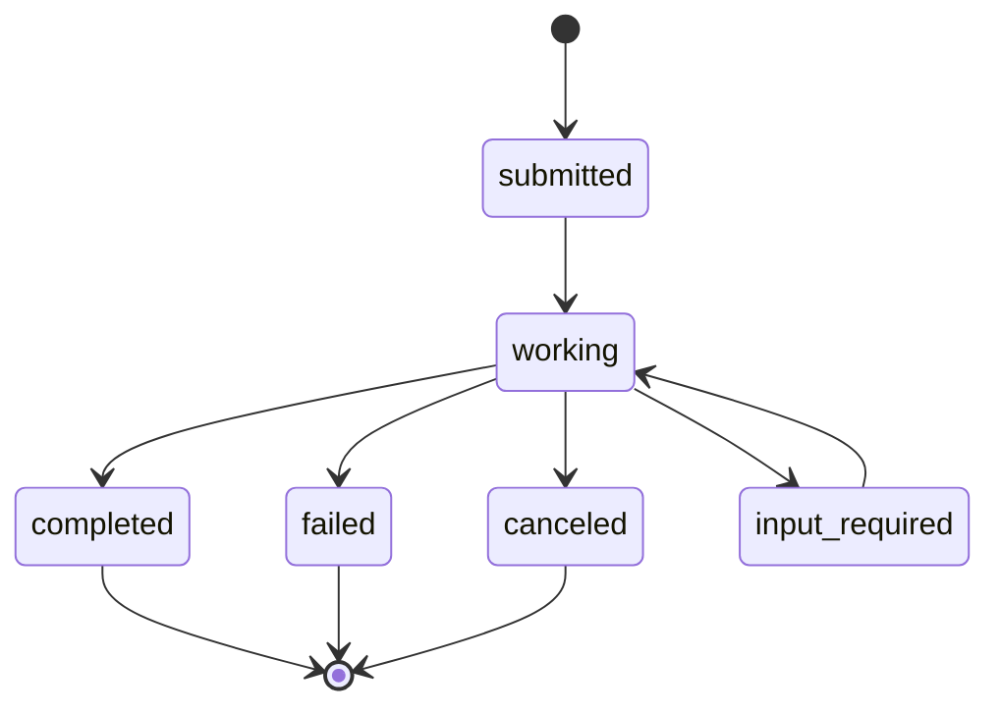
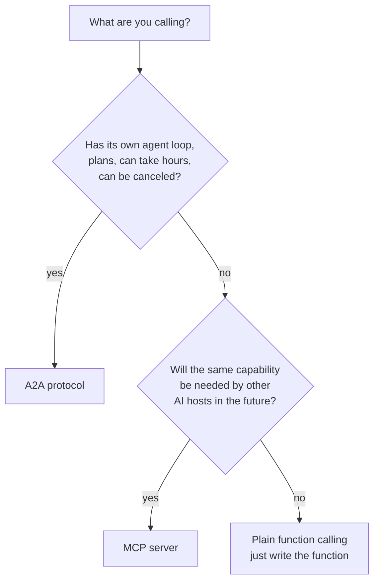
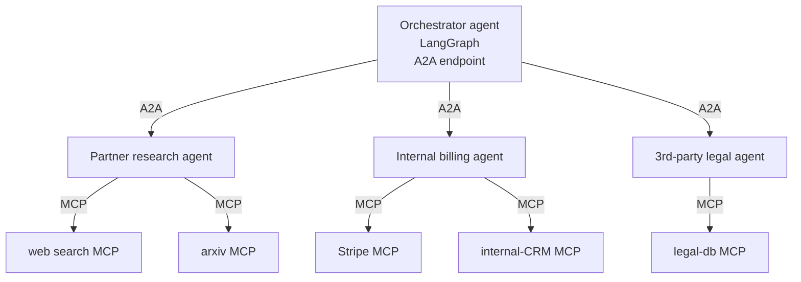

# A2A (Agent2Agent)

The protocol layer for **agents talking to other agents**, not tools. Google introduced it in April 2025; donated it to the Linux Foundation in June 2025; v1.0 shipped in early 2026.

!!! tip "Rapid Recall"
    If MCP is "USB-C for AI" (how an LLM uses tools), then A2A is **"HTTP for agents"** (how an agent delegates to another agent across vendor and framework boundaries). **Agent cards** at `/.well-known/agent-card.json` are the discovery primitive — JSON document describing capabilities, skills, auth, modalities. **Signed agent cards** (v1.0) enable decentralized trust. **Task lifecycle** is the main verb: submitted → working → (completed | failed | canceled | input-required → working). Use A2A for cross-vendor agent integration, long-running streaming tasks; use MCP for tools and data; use plain function calling for in-process latency-critical work. They compose: A2A horizontal across agents, MCP vertical from each agent to its tools.

## §4 — A2A protocol v1.0: agent cards, task lifecycle, signed discovery

### Why a second protocol? Why not just use MCP?

Because the interaction shape is different. With a tool, the host knows roughly how long it'll take and what shape the result will be. With another agent, the receiver is itself running an agent loop — it might take minutes or hours, stream partial updates, ask clarifying questions, fail and recover. The interaction is **task-oriented, stateful, multi-modal, peer-to-peer**.

The official line from the Google / Linux Foundation A2A docs: **"MCP for tools and data, A2A for agents."** You can do agent-to-agent over MCP — wrap each agent as an MCP tool — but you lose task lifecycle semantics (cancellation, status updates, artifact streaming) that A2A provides natively.

### The agent card — the heart of A2A

Every A2A-compliant agent publishes a JSON document at a well-known URL: `/.well-known/agent-card.json`. This is the discovery primitive.

```jsonc
{
  "name": "research-agent",
  "description": "Research multi-aspect questions and return structured findings.",
  "version": "1.2.0",
  "url": "https://research-agent.example.com/a2a",
  "capabilities": {
    "streaming": true,
    "pushNotifications": true,
    "stateTransitionHistory": true
  },
  "skills": [
    {
      "id": "deep_research",
      "name": "Deep research",
      "description": "Multi-source research with citations on technical topics",
      "inputModes": ["text"],
      "outputModes": ["text", "file/pdf"]
    }
  ],
  "authentication": {"schemes": ["oauth2", "bearer"]},
  "defaultInputModes": ["text"],
  "defaultOutputModes": ["text"]
}
```

This is the "OpenAPI for agents." Another agent fetches it to know what this agent can do, how to authenticate, what input/output modalities it speaks. **Dynamic discovery without code changes**, adding a new remote agent is just adding a new URL.

### Signed agent cards (v1.0)

In v1.0 (early 2026), the spec added **cryptographic signatures on agent cards.** Without this, an attacker could stand up a fake agent card and redirect other agents into a card-forgery attack. With signed cards, a receiving agent can verify the card was actually issued by the domain owner.

This is the trust model that makes decentralized agent discovery viable. Compare: the entire HTTPS web works because cert authorities sign domains; A2A v1.0 brings the same idea to agent discovery.

### Task lifecycle: the protocol's main verb

Where MCP is built around **tool calls** (request/response), A2A is built around **tasks** (long-running stateful units of work). A task moves through states:



Each state can carry artifacts (intermediate or final results), status updates, and messages back to the client. The client can subscribe to the task's event stream (SSE in v1.0; the v1.0 release added gRPC as an alternative).

A typical task flow:

```
Client (calling agent): tasks/send({"task": "Research LangGraph vs DSPy"})
   → returns task_id, status="submitted"

Server (research agent): starts working, emits events on the task's stream:
   status: "working" + artifact: partial findings
   status: "working" + artifact: more findings
   status: "completed" + artifact: final report (PDF)
```

### Other v1.0 changes

- **Multi-tenancy**, one A2A endpoint can host multiple agents, letting SaaS providers serve different agents per tenant.
- **Multi-protocol bindings**, the same logical agent can be exposed over JSON-RPC and gRPC simultaneously. Picking gRPC matters when you want strict typing and HTTP/2 multiplexing.
- **Version negotiation**, backward-compatible migration from v0.3 to v1.0 is guaranteed at the spec level.

### What an A2A interaction looks like in practice

The Google ADK (Agent Development Kit, 1.0 GA in April 2026) gives you both sides cheaply:

```python
# Exposing your agent as an A2A server (server side)
from google.adk import Agent, expose_as_a2a

class MyResearchAgent(Agent):
    def __init__(self): ...
    async def run(self, task): ...   # your agent's logic

expose_as_a2a(
    MyResearchAgent(),
    agent_card_path="/.well-known/agent-card.json",
    base_url="https://research.mycompany.com/a2a",
)

# Calling a remote A2A agent (client side)
from google.adk import RemoteA2aAgent

remote = RemoteA2aAgent(card_url="https://research.othercompany.com/.well-known/agent-card.json")
task = await remote.send_task("Research the EV market in Southeast Asia")
async for event in task.stream():
    print(event.status, event.artifact)
```

You don't need to use ADK, Python, Java, Go, TypeScript, .NET SDKs all ship; LangGraph has an A2A adapter that wraps a LangGraph agent as an A2A server. The protocol is framework-agnostic.

### When to reach for A2A

| Use case | A2A fit |
|---|---|
| Cross-company agent integration (your agent calls a partner's agent) | Strong fit, that's exactly the design target |
| Multi-vendor multi-agent system (LangGraph + ADK + CrewAI agents talking) | Strong fit, the framework-agnostic interop layer |
| Internal multi-agent inside one codebase | Overkill, use LangGraph supervisor/swarm |
| Calling a known tool / API | Wrong layer, that's MCP or function calling |
| Long-running task with streaming updates | A2A's task lifecycle is built for this |

!!! note "Interview note"
    *"How does A2A relate to MCP?"* They compose. A2A coordinates agents; each of those agents internally uses MCP (and/or function calling) to talk to tools. A 2026 architecture diagram looks like: top layer A2A for cross-agent coordination, middle layer LangGraph / Antigravity / ADK orchestrating internal agents, bottom layer MCP servers wrapping each tool.

## §5 — MCP vs A2A vs function calling: decision matrix and composition

### The three options at a glance

| | Function calling | MCP | A2A |
|---|---|---|---|
| **What you're talking to** | A function inside your app | A tool exposed by an external (or co-located) MCP server | Another autonomous agent, often owned by someone else |
| **State** | Stateless request/response | Session-stateful; can stream and notify | Task-stateful; long-running with lifecycle states |
| **Where the tool lives** | Same process as your code | Separate process (often a separate service / machine) | Separate agent, often a separate org |
| **Discovery** | Hardcoded in your prompt/code | Standardized: `tools/list` over JSON-RPC | Standardized: agent card at `/.well-known/agent-card.json` |
| **Reusability across hosts** | None, you own all the integration code | High, same server works in Claude, ChatGPT, Cursor, etc. | High, same agent callable by any A2A client |
| **Auth** | Whatever your app already does | OAuth 2.1 for remote, none for stdio | OAuth 2.1 or bearer tokens; signed agent cards for trust |
| **Best for** | One-off, in-process, latency-critical | Tools you'd reuse across multiple AI hosts | Agents you'd compose across vendor boundaries |

### The decision tree



### When function calling is the right answer (and you don't need a protocol)

| Signal | Why function calling, not MCP |
|---|---|
| You're building a single app and the tools are app-specific | No reuse value; protocol overhead isn't worth it |
| Sub-100ms latency budget for tool calls | MCP adds a process boundary + JSON-RPC overhead |
| The "tool" is really just a Python function with no side effects | Wrap it as a LangChain tool, done |
| You're prototyping; will revisit later | Don't pay protocol tax to learn faster |

Don't reach for MCP because "it's the modern way." Reach for it when the cross-host reuse, the standardized discovery, or the secure remote deployment story actually matters to you.

### How they compose in a real 2026 system

The interesting architectures are not "MCP vs A2A", they're **both, stacked**:



**A2A is the horizontal layer** (agents to agents, often crossing org boundaries).
**MCP is the vertical layer** (each agent to its tools, often crossing process boundaries).
**Function calling is the leaf** (each agent's in-process Python tools that didn't justify being MCP servers).

### The classic interview question

> **Q**: *"You're building a customer support agent that needs to (1) look up account info from your CRM, (2) search your help center, (3) delegate complex billing questions to your billing team's agent, (4) escalate legal questions to your law firm's agent. What protocols and where?"*

The clean answer:

- **CRM lookup and help-center search**: MCP servers. They're reusable across hosts (Claude, ChatGPT, your support agent), have stable schemas, deserve session state for streaming long results. Wrap your existing REST APIs as MCP servers.
- **Internal billing agent**: A2A. It's an autonomous agent with its own loop, runs for tens of seconds to minutes, can ask for clarification mid-task.
- **External law firm agent**: A2A with a signed agent card. Same shape as billing, but crossing an org boundary, the signature matters here.
- **In-process utilities** (formatting, slug generation, etc.): plain function calls. No protocol needed.

That's a real-world answer that maps each component to the right layer instead of treating it as either/or.

### A failure mode to know

Teams sometimes try to express agent-to-agent over MCP — wrap the entire other agent as one MCP tool. It works for short interactions, but loses A2A's task lifecycle: no streaming progress, no cancellation, no input-required state for mid-task clarification, no artifact-typed outputs. The other agent looks like a "function that took 30 minutes to return." For anything beyond trivial, you want A2A.

## Adoption check — A2A is rising, not declining

The lazy take is that A2A is a niche Google thing. The data says otherwise. At its one-year mark (April 2026): 150+ supporting organizations; native integration in Azure AI Foundry, Amazon Bedrock AgentCore, and Google Cloud; production deployments in supply chain, finance, insurance, IT ops. Search interest has grown ~22% month-over-month. The strongest signal it's winning: IBM's competing ACP protocol *merged into* A2A in August 2025 — effectively no real alternative as of 2026.

The "needs ADK" assumption is outdated. Google donated the protocol + spec + SDKs to the **Linux Foundation** in June 2025, making it vendor-neutral (no more ADK-bound than Kubernetes is Google-bound). v1.0 (early 2026) made it production-grade: **Signed Agent Cards** (cryptographic trust for discovery, blocks card-forgery), multi-tenancy, multi-protocol bindings (JSON-RPC + gRPC), version negotiation.

<figure class="diagram diagram-dark" markdown="0">
<svg viewbox="0 0 760 220" xmlns="http://www.w3.org/2000/svg">
  <defs><marker id="arr5" markerwidth="9" markerheight="9" refx="7" refy="4.5" orient="auto"><path d="M0,0 L9,4.5 L0,9 Z" fill="#6fb3a8"/></marker></defs>
  <rect x="100" y="40" width="150" height="50" rx="10" fill="#211d15" stroke="#a892c4" stroke-width="1.5"/><text x="175" y="70" text-anchor="middle" class="svg-title">Agent (vendor X)</text>
  <rect x="510" y="40" width="150" height="50" rx="10" fill="#211d15" stroke="#a892c4" stroke-width="1.5"/><text x="585" y="70" text-anchor="middle" class="svg-title">Agent (vendor Y)</text>
  <line x1="250" y1="65" x2="506" y2="65" stroke="#6fb3a8" stroke-width="2" marker-end="url(#arr5)"/>
  <line x1="510" y1="78" x2="254" y2="78" stroke="#6fb3a8" stroke-width="2" marker-end="url(#arr5)"/>
  <text x="380" y="40" text-anchor="middle" class="svg-sub" style="fill:#6fb3a8">A2A — horizontal (agent ↔ agent)</text>
  <rect x="120" y="150" width="110" height="44" rx="9" fill="#16140f" stroke="#e0a64b"/><text x="175" y="177" text-anchor="middle" class="svg-label">tools</text>
  <rect x="530" y="150" width="110" height="44" rx="9" fill="#16140f" stroke="#e0a64b"/><text x="585" y="177" text-anchor="middle" class="svg-label">tools</text>
  <line x1="175" y1="90" x2="175" y2="148" stroke="#e0a64b" stroke-width="2" marker-end="url(#arr5)" opacity="0.8"/>
  <line x1="585" y1="90" x2="585" y2="148" stroke="#e0a64b" stroke-width="2" marker-end="url(#arr5)" opacity="0.8"/>
  <text x="175" y="135" text-anchor="middle" class="svg-sub" style="fill:#e0a64b">MCP — vertical</text>
  <text x="585" y="135" text-anchor="middle" class="svg-sub" style="fill:#e0a64b">MCP — vertical</text>
</svg>
<figcaption>MCP connects each agent down to its tools (vertical); A2A connects agents to each other across vendor boundaries (horizontal). Complementary layers, not rivals.</figcaption>
</figure>

**Honest scope caveat**: the traction is mostly large-company / cloud-platform / enterprise inter-agent plumbing. As a solo dev not building cross-vendor multi-agent systems, you may never touch A2A directly — which is why it can *feel* niche. Big in enterprise, quieter in solo-dev land. Both true at once.

!!! note "Interview soundbite"
    A2A is increasing, not declining — 150+ orgs, native in Azure / Bedrock / Google Cloud, competitor ACP absorbed into it. It's vendor-neutral under the Linux Foundation since June 2025, so it's not ADK-bound. Mental model: **MCP = vertical (agent ↔ tool), A2A = horizontal (agent ↔ agent)** — complementary layers, not rivals. Discovery is via Agent Cards, cryptographically signed since v1.0.

---
