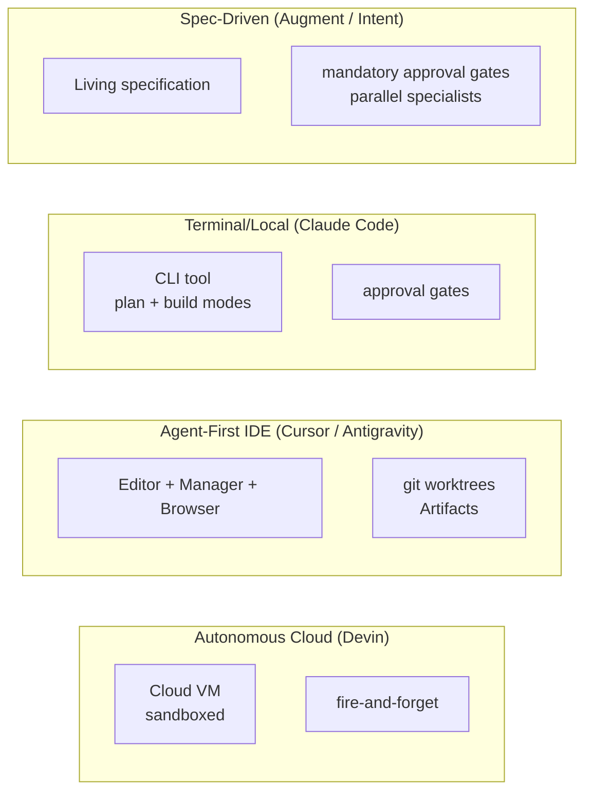

# Coding Agents

What makes coding agents structurally different from chat agents, the four 2026 architectural paradigms, the canonical tool kit, context management for large codebases, and the failure modes you will be asked about in interviews.

!!! tip "Rapid Recall"
    **Five things make coding agents structurally distinct** from chat agents: long horizons (50-500 turns), file-system-as-state, test loops as success signal, sandboxing matters, diff-first review. **Four 2026 paradigms**: **Autonomous cloud** (Devin, fire-and-forget), **Agent-first IDE** (Cursor + Antigravity, parallel via git worktrees and Artifacts), **Terminal/local** (Claude Code, plan/build modes + approval gates), **Spec-driven** (Augment/Intent, mandatory approval gates between phases). **Canonical tool kit**: `view`, `glob`, `grep`, `list_dir`, `bash`, `str_replace`, `create_file`, `run_tests`. **Why `str_replace` not line edits**: puts bookkeeping on the file, not the LLM. **Context strategies**: agentic exploration + retrieval + symbol indexing, combined. **Top failure modes**: context overflow → flailing, wrong-file edit, test-loop fixation, unsafe destructive actions, hallucinated APIs, diff explosion, fake success.

## §6 — What makes coding agents structurally different

A coding agent is, at one level, just an agent with tools that read and write files. But the *shape* of the work is so different from chat agents that whole architectural categories exist just for code. Five things make coding agents structurally distinct.

### 1. Long horizons

A chat agent's task usually completes in one turn or a handful of turns. A coding agent's task — "fix this failing test", "add a feature with tests", "refactor this module" — runs for minutes to hours, makes dozens to hundreds of tool calls, and edits many files. The horizon is **10-100x longer**.

This breaks the assumptions of a vanilla ReAct loop. By turn 50, the context is bloated. By turn 100, the agent forgets early decisions. By turn 200, the cost is alarming. So coding agents need:

- **Planning** — explicit task decomposition (write_todos).
- **Context offloading** — write intermediate notes to disk, read them back.
- **Subagents** — isolate long subtasks in their own context windows.

This is why DeepAgents was extracted from Claude Code: those are the four pillars that make long-horizon coding agents work.

### 2. File-system-as-state

Coding agents don't just read files, they **edit** them. Editing is fundamentally different from reading. Three properties matter:

- **Editing is destructive.** A bad edit deletes work. You need version control as a safety net.
- **Editing is positional.** You can't just say "change the function", you have to specify *which lines* with surgical precision. This shapes the tool API.
- **Editing creates new state to read back.** After an edit, the agent might want to verify by reading the result, then run tests, then iterate. The loop is read → edit → verify → repeat.

### 3. Test loops as the success signal

A chat agent often has no clear success criterion. A coding agent usually does: **the tests pass**. This single property changes everything:

- Reflection becomes powerful, the critic is `pytest`, not another LLM.
- The agent can attempt a fix, observe the test output, refine, and try again. **Self-correction is automatic.**
- Reward signal is sparse but unambiguous, green/red, no judgment call.

### 4. Sandboxing matters

A coding agent runs *code that an LLM wrote*. Three failure modes follow:

- **Accidentally destructive code**, `rm -rf /tmp` becomes `rm -rf /` if the prompt is off. Without a sandbox, you've lost data.
- **Resource exhaustion**, a fork-bomb-like bug eats your machine.
- **Security escape**, code intended to write to `./data` writes to `~/.ssh/`.

So real coding agents either:

1. **Run in a true sandbox** (container, VM, browser sandbox, cloud isolation), Devin, Antigravity's terminal sandbox.
2. **Run locally with explicit user approval gates for destructive actions**, Claude Code, Cursor.

There is no third option. "Hope for the best" is not a strategy.

### 5. Diff-first review

A chat agent's output is *the answer.* A coding agent's output is *a diff*, a set of changes against an existing codebase. The diff is the unit of human review.

This means:

- Smaller, focused diffs > sprawling rewrites. A 30-line surgical fix is easier to review than a 500-line "while I was here" cleanup.
- The agent should commit incrementally, git checkpoints are natural HITL gates.
- Diff size is a quality metric in evaluation.

### The chat agent → coding agent shift in numbers

| Dimension | Chat agent | Coding agent |
|---|---|---|
| Horizon | 1-10 turns | 50-500 turns |
| Tokens per task | 1K-10K | 100K-1M |
| Tools called per task | 0-5 | 20-200 |
| State carried across turns | Conversation history | Filesystem + git state + test results |
| Success signal | Subjective ("looks good") | Objective ("tests pass") |
| Failure mode if you skip planning | Mild rambling | Total flailing across irrelevant files |
| Failure mode if you skip sandboxing | Wasted tokens | Data loss / security incident |
| Right harness | `create_agent` is fine | DeepAgents, or a dedicated coding-agent runtime |

**You don't build a coding agent by stretching a chat-agent harness.** You use a harness designed for long horizons, file edits, and verification loops.

## §7 — The four architectures

### Architecture comparison



### Paradigm 1: Autonomous cloud (Devin)

**Shape**: A fully sandboxed cloud workspace, its own VM with browser, terminal, editor, filesystem. You give it a task in chat ("fix the OAuth bug in the login flow"); it works for minutes-to-hours autonomously; you check in later.

**Optimization axis**: developer time. The whole point is "fire and forget", you walk away, do other work, come back to a PR.

**Strengths**:

- True hands-off execution. Run 5 tasks in parallel, none requires your attention.
- The cloud sandbox is genuinely isolated, nothing the agent does affects your machine.
- Suited for tickets that would otherwise sit in your backlog (bug bash, dependency updates, test improvements).

**Weaknesses**:

- **Opaque.** Hard to course-correct mid-task without watching closely.
- **Expensive.** Cloud VMs running for hours add up.
- **Sandbox cuts both ways.** Real apps need real credentials, real DBs, real external APIs, sandboxes have to bridge to those carefully.
- **Failure recovery is slow.** When the agent goes off the rails, you've usually paid for the whole run before noticing.

**Best for**: well-scoped backlog tickets, dependency upgrades, prototyping greenfield features overnight, research/exploration that doesn't touch production.

### Paradigm 2: Agent-first IDE (Cursor, Google Antigravity, Windsurf)

**Shape**: An IDE built around the agent, not around code. The editor is one surface; the **agent manager** is the other, a control panel where you spawn, observe, and orchestrate multiple agents working in parallel.

**Optimization axis**: developer throughput, while keeping the developer in the loop. **You're an architect orchestrating agents**, not a typist driving every keystroke.

**Cursor's defining feature** is parallel agents via **git worktrees**. Each agent gets its own worktree (same repo, different working directory, different branch). Five agents can work on five features simultaneously without stepping on each other's files.

**Antigravity's defining feature** (released Nov 18, 2025 alongside Gemini 3) is the **three-surface architecture** plus **Artifacts**:

- Editor surface: traditional code editing with agent sidebar.
- Manager surface: parallel agents working asynchronously, each producing Artifacts.
- Browser surface: the agent has its own Chrome instance for UI testing and validation.

Artifacts are the trust mechanism. Instead of asking you to read the agent's chat log, the agent produces tangible deliverables, task lists, implementation plans, code diffs, screenshots, video recordings of browser testing. You review the artifact, not the trace. **This is the key UX innovation of 2025-2026**: closing the trust gap by making the deliverable visible without making the agent's internal monologue mandatory reading.

Antigravity also has **plan-review-execute** as the default mode (Fast Mode skips planning for trivial tasks), and **Knowledge Items**, patterns the agent learns from feedback and carries across sessions.

**Best for**: active development, pair-programming style work, frontend iteration where browser preview matters, multi-task workdays where you'd otherwise context-switch a lot.

### Paradigm 3: Terminal / local (Claude Code)

**Shape**: A CLI tool you run in your terminal. No GUI, no cloud sandbox, works directly on your local filesystem via tool calls. Two modes:

- **Plan mode**: the agent reads, thinks, proposes, but doesn't modify anything.
- **Build mode**: the agent executes its plan, with explicit approval gates for destructive actions.

**Optimization axis**: flexibility and scriptability. The agent is *just* a CLI process — you can pipe into it, run it in CI, script it, integrate it with whatever editor or workflow you already have.

**Best for**: experienced developers, complex multi-file work that doesn't need a browser, automation/scripting, CI integration ("run Claude Code on the failing tests"), terminal-first workflows.

### Paradigm 4: Spec-driven orchestration (Augment Code, Intent)

**Shape**: The central artifact is a **living specification**, a markdown document describing intent, constraints, and acceptance criteria. **Mandatory human approval gates between phases.** Once a phase's spec is approved, parallel specialist agents (planner, implementer, reviewer) execute it.

**Optimization axis**: control and auditability. Spec-driven trades speed for traceability, every code change traces back to an approved spec, and every spec change is reviewed.

**Best for**: enterprise software, regulated industries (finance, healthcare), large codebases with many contributors, long-lived features where the spec adds value.

### Paradigm comparison

| | Autonomous Cloud (Devin) | Agent-first IDE (Cursor, Antigravity) | Terminal/Local (Claude Code) | Spec-Driven (Augment) |
|---|---|---|---|---|
| Human involvement | Lowest | High | Medium | Highest at gates, low during execution |
| Setup cost | Low | Medium | Low | High |
| Best task duration | Medium-long | Small-medium | Any | Large |
| Parallelism | Cloud-native | git worktrees / agent manager | Shell parallelism | Parallel specialists |
| Debugging | Hard (opaque) | Easy (artifacts) | Easy (terminal trace) | Easy (spec audit) |
| Cost per task | High | Low-medium | Low | Medium-high |
| Sandbox | Cloud VM | Optional (Antigravity has terminal sandbox) | Local, approval gates | Per-agent, by phase |

### The decision rule

```
Are you actively coding right now?
   YES → agent-first IDE (Cursor or Antigravity)

Are you scripting / running in CI / want CLI integration?
   YES → terminal (Claude Code)

Do you want to dispatch a task and walk away for an hour?
   YES → autonomous cloud (Devin), or Antigravity Manager view

Do you need an audit trail with approval gates for compliance?
   YES → spec-driven (Augment, Intent)
```

Most working developers use **2-3 of these for different jobs**. Cursor or Antigravity for active development, Claude Code for terminal/scripts/CI, Devin for fire-and-forget tickets, spec-driven for high-stakes changes that need an audit trail.

### The common architecture across all four

Despite the surface differences, every coding agent shares the same core stack. The differences are mostly UX, sandboxing, and orchestration, not fundamental architecture:

```
   ┌────────────────────────────────────────────────────┐
   │                  LLM (the brain)                    │
   │       Claude Sonnet/Opus, Gemini 3 Pro, GPT-5      │
   └────────────────────────┬───────────────────────────┘
                            │ tool calls
                            ▼
   ┌────────────────────────────────────────────────────┐
   │                  Tool layer                         │
   │  view / read_file / write_file / edit / str_replace │
   │  bash / glob / grep / list_dir                      │
   │  run_tests / git ops                                │
   │  (these are MCP servers, in-process tools, or both) │
   └────────────────────────┬───────────────────────────┘
                            │ filesystem operations
                            ▼
   ┌────────────────────────────────────────────────────┐
   │              Sandbox / workspace                    │
   │   Local filesystem | Container | Cloud VM | Worktree│
   └────────────────────────────────────────────────────┘
```

Five components shared across all four paradigms:

1. **Planning phase**, explicit (Augment specs, Antigravity Artifacts) or implicit (Claude Code's plan mode, write_todos).
2. **Tool-calling loop**, filesystem + shell + (often) web as the primary tools.
3. **Context management**, file indexing, retrieval, summarization.
4. **Verification**, tests, linters, type-checkers, in some cases browser-based UI checks.
5. **Rollback capability**, git commits are the natural checkpoints; some sandboxes add VM snapshots.

## §8 — The tool kit for coding agents

### The canonical tool list

| Tool | Read or write | Why it exists in this exact shape |
|---|---|---|
| `view` (a.k.a. `read_file`) | Read | View a file's contents with optional line ranges; supports text, images, dirs |
| `glob` | Read | Find files by pattern (`**/*.py`), fast file discovery |
| `grep` | Read | Search file contents for a regex, fast content discovery |
| `list_dir` (`ls`) | Read | List directory contents; structure discovery |
| `bash` (`shell`, `terminal`) | Write | Run arbitrary shell commands, the escape hatch |
| `str_replace` | Write | Replace a unique substring in a file, surgical, no positional math |
| `create_file` (or `write_file`) | Write | Create a new file or overwrite an existing one |
| `edit` (multi-format) | Write | Higher-level edits; sometimes line-based, sometimes diff-based |
| `run_tests` (or implicit via `bash`) | Read+Write | Execute the test suite, read pass/fail |

Six of these — `view`, `glob`, `grep`, `bash`, `str_replace`, `create_file` — are non-negotiable. Every major coding agent has them. The names vary; the semantics don't.

### Why `str_replace` instead of line-edit?

This is the tool design choice everyone gets wrong on the first try, then gets right. Three options for "edit a file":

1. **Patch / diff input**, agent generates a `diff`, you `git apply` it.
2. **Line-based edit**, agent says "replace lines 42-47 with this."
3. **String-based replace**, agent says "replace this exact substring with this new string."

Why string-based won:

| Approach | Failure mode |
|---|---|
| Patch input | LLM gets line numbers wrong; one off-by-one and the patch fails to apply. Many failures, fragile. |
| Line-based | Same problem, LLM must track line numbers across the whole conversation. Edits at the top of the file shift every line number below. |
| `str_replace` | LLM provides the exact text to find and the text to replace it with. No line numbers; the file does the work. Failure mode: ambiguity (the substring appears more than once), solved by requiring sufficient context in the search string. |

`str_replace` puts the bookkeeping burden on the file system, not the LLM. **You should not require the LLM to track line numbers across a conversation**, that's what files are for.

### Why two read tools (`glob` + `grep`)?

Because they answer different questions:

- `glob`: "where are the files I care about?" (by filename pattern)
- `grep`: "where is this concept defined?" (by content pattern)

### Why is `bash` necessary at all?

Because no fixed tool set covers everything. The agent will need to run a linter, start a server, run a migration, install a package, query a database. `bash` is the escape hatch.

But `bash` is also the most dangerous tool by far. **Every coding agent's defining safety choice is: how is `bash` constrained?**

| Constraint | Where you'll see it |
|---|---|
| Approval gate before each `bash` call | Claude Code (default) |
| Allowlist of commands that auto-execute | Antigravity's terminal command policy |
| Sandboxed shell (chroot, container) | Devin, Antigravity terminal sandbox |
| Read-only by default; explicit elevation for writes | Some enterprise setups |
| No `bash` at all; only specific tools | Strict spec-driven setups |

The safer the sandbox, the more autonomous the agent can be.

## §9 — Context management: filesystem as working memory

Big codebases don't fit in context. A medium repo has 1M-10M tokens of source code. Even Gemini 2.5 Pro's 2M-token context can't hold a real codebase, and you wouldn't want to pay to put it all in even if you could. **Coding agents need a context strategy.**

Three strategies, often combined:

### 1. Agentic exploration (Claude Code's default)

The agent navigates the codebase the same way a developer would: `list_dir` → `glob` for relevant files → `view` the interesting ones → `grep` for specific symbols. The agent reads what it needs, when it needs it.

### 2. Retrieval (Cursor, Windsurf, Antigravity)

The IDE indexes the codebase upfront, embeds every file (or function, or symbol) and stores the vectors. At query time, retrieve the top-K most relevant chunks for the agent's current task.

### 3. Symbol indexing (advanced)

Tree-sitter-based parsers build a call graph and symbol table. The agent queries semantically: "where is `authenticateUser` defined? called? imported?" Languages with strong type systems benefit most.

### Filesystem-as-working-memory (DeepAgents / Claude Code pattern)

A second use of the filesystem, beyond just *reading* the code: the agent **writes intermediate notes**:

- Write the **plan** to `plan.md`.
- Write **partial findings** as you go: `notes/auth_audit.md`, `notes/test_failures.md`.
- Read them back later instead of recomputing.

The filesystem becomes the agent's **extended brain**, anything that would have blown up the context window now lives in a file.

!!! note "Interview note"
    *"How do you keep a coding agent from losing the plot on a long task?"* Three answers, in order of impact: (1) write the plan to a file (`plan.md`), have the agent re-read it every N turns. (2) Use subagents for any subtask that involves more than 10 tool calls, keeps the lead's context clean. (3) Summarize older turns once total tokens cross 50% of context. Without these, the agent dies in a loop.

## §10 — Failure modes of coding agents

| Symptom | Most likely cause | First thing to check |
|---|---|---|
| Agent flails after 50+ turns | Context overflow | Is there a plan file? Is summarization on? |
| Agent edited wrong file | Bad discovery / tool selection | Did agent view the file before editing? |
| Stuck in test loop | Reactive editing without diagnosis | Force write_todos between test runs |
| Lost uncommitted work | Unsafe destructive action | Are bash approval gates on? |
| ImportError or AttributeError | Hallucinated API | Is doc-MCP server connected? Verify with `pip list`? |
| 500-line diff for a 5-line bug | No scope constraint | Add scope rules to system prompt; review artifact |
| "Done" but bug persists | Sloppy verification | Was the original failing test re-run? |

### The seven failure modes in detail

1. **Context overflow → flailing.** Agent does great for the first 50 turns, then progressively loses the thread. Fix: plan in a file, summarize older turns, use subagents for isolated subtasks.
2. **Wrong-file edit.** Agent edits `tests/test_auth.py` when the bug is in `auth/login.py`. Fix: dual-source confirmation (find via grep AND verify by viewing); strict acceptance criteria; "view file before editing" rule.
3. **Test-loop fixation.** Agent makes a tiny edit, runs tests, sees different failure, makes another tiny edit. Fix: force the agent to write the diagnosis before the fix; cap consecutive test calls; reflection layer after each failure.
4. **Unsafe destructive actions.** Agent runs `rm -rf node_modules` or `git reset --hard`. Fix: approval gates on `bash` → sandbox the workspace → snapshot before changes → allowlist destructive commands.
5. **Hallucinated APIs / packages.** Agent writes `import some_package` that doesn't exist. Fix: "verify before using" tool, test-driven catches ImportError fast, pin documentation via MCP doc server.
6. **Diff explosion ("while I was here" cleanup).** 300-line diff for a 5-line bug fix. Fix: explicit scope rules in system prompt; diff size as an eval metric; approval review for diffs over N lines.
7. **Silent failure / fake success.** Agent reports "done!" but the bug persists. Fix: explicit acceptance criteria, run the entire test suite, final verification step in the plan.

!!! note "Interview note"
    *"What's the failure mode that worries you most about giving an agent shell access?"* The answer is destructive actions you can't undo, `rm -rf`, `git reset --hard`, unrecoverable DB ops. The mitigation stack is: approval gates → sandbox → snapshots → allowlist destructive commands. State all four, in that order; it's the right defense-in-depth answer.

## Evaluation for Coding Agents

Not just "did it compile?" Full eval covers:

| Metric | What it measures |
|---|---|
| Functional correctness | Does the code pass tests? (SWE-bench, HumanEval, MBPP) |
| Test coverage delta | Does the agent maintain/improve coverage? |
| Regression rate | Do existing tests still pass? |
| Diff size | Small focused changes vs sprawling rewrites |
| Comment-to-code ratio | Over-explanation is a red flag |
| Time-to-completion | Latency + cost |
| Human rollback rate | How often does a human revert the agent's change? |

SWE-bench (Jimenez et al. 2023) is the standard benchmark, real GitHub issues with hidden tests. SWE-bench Verified is the human-curated subset.

## Interview Questions

**Q6: Compare coding agent paradigms for a solo founder vs an enterprise team.**

Solo founder: agent-first IDE (Cursor) or terminal (Claude Code), fast iteration, low setup, developer stays in loop. Enterprise team: spec-driven (Intent, Augment), audit trail, approval gates, multiple specialist agents matches team structure. Autonomous cloud (Devin) for solo founder running background tasks overnight, or enterprise R&D experiments, but cost/opacity makes it a worse primary tool.

**Q7: Why does Cursor use git worktrees for parallel agents instead of just multiple branches?**

Worktrees let each agent have its own working directory pointing to a different branch of the same repo. Multiple branches in one working directory means you can only have one branch checked out at a time. Worktrees give true physical isolation, each agent edits its own files, runs its own tests, without context switching the repo state. Enables parallelism without conflict.

**Q8: How would you evaluate a coding agent beyond SWE-bench?**

SWE-bench measures functional correctness on GitHub issues, but misses important axes: diff size (smaller is better, sprawling rewrites are a red flag), regression rate (did it break existing tests?), test coverage delta, human rollback rate in production, time-to-completion, cost per task. Also: subjective code quality, do humans rate the diff as idiomatic? Real production systems weight these, not just functional pass rate.
