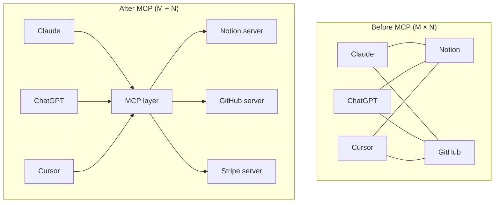

# Protocols & Coding Agents

Two adjacent topics: **how agents talk to tools (and to each other)** and **what makes coding agents different**. MCP was originally built for coding agents; coding agents use MCP heavily. Understanding either without the other is hollow.

!!! tip "Rapid Recall"
    **MCP** (Model Context Protocol) is "USB-C for AI", JSON-RPC 2.0 over stdio or Streamable HTTP, with three primitives (resources, tools, prompts). Solves the M×N integration problem; donated to Linux Foundation Dec 2025. **A2A** (Agent2Agent) is "HTTP for agents", task-stateful agent-to-agent protocol with signed agent cards at `/.well-known/agent-card.json`. **The split**: MCP for tools and data; A2A for agents. **Coding agents** have four 2026 paradigms: **Autonomous cloud** (Devin, fire-and-forget), **Agent-first IDE** (Cursor, Antigravity, parallel via git worktrees), **Terminal/local** (Claude Code, CLI + plan/build modes), **Spec-driven** (Augment, Intent, mandatory approval gates). Same brain, same tools underneath, different surfaces — pick by workflow.

## The N+M insight

Before MCP, every team building serious AI tools was solving the same problem twice: once for OpenAI clients, once for Anthropic clients, once for whatever Cursor/Continue/Cline/local-models needed. **Every integration was M × N** — M hosts, N tools.

```
Without MCP (M × N integrations):           With MCP (M + N integrations):

   Claude  ─┬─ Notion                          Claude  ─┐
   ChatGPT ─┼─ GitHub                          ChatGPT ─┤
   Cursor  ─┼─ Stripe                          Cursor  ─┼─→ [MCP] ←─┬─ Notion server
   Custom  ─┴─ Linear                          Custom  ─┘           ├─ GitHub server
                                                                     ├─ Stripe server
   each host integrates each tool              host speaks MCP;      └─ Linear server
   M × N = 16 integrations                     each server speaks MCP
                                               M + N = 8 integrations
```

USB-C is the standard analogy. Before USB-C, every device had its own port; now any device that speaks USB-C plugs into any host that speaks USB-C. **MCP is USB-C for AI.**



## Two protocols, two scopes

By early 2026, two protocols matter:

| Protocol | Scope | Originated |
|---|---|---|
| **MCP** (Model Context Protocol) | Tools and data, how an LLM uses external capabilities | Anthropic, Nov 2024; donated to Linux Foundation Dec 2025 |
| **A2A** (Agent2Agent) | Agent-to-agent, how an agent delegates to another agent across vendor boundaries | Google, Apr 2025; donated to Linux Foundation Jun 2025 |

The official line: **MCP for tools, A2A for agents.** Pick one based on whether the thing you're calling is a passive tool (it does what you ask, returns a result) or an active agent (it has its own loop, its own tools, makes its own decisions, can take time, can stream updates).

## Section guide

| Page | Covers |
|---|---|
| [MCP](mcp.md) | Architecture (host/client/server), three primitives (resources/tools/prompts), transports (stdio + Streamable HTTP), OAuth 2.1 auth, minimal FastMCP server, security model |
| [A2A](a2a.md) | Why a second protocol, agent cards, signed discovery, task lifecycle, composition with MCP |
| [Coding Agents](coding-agents.md) | What makes coding agents structurally different, the four paradigms (Devin / Cursor+Antigravity / Claude Code / Augment), the canonical toolkit, context management, evaluation |

## Layer Checklist

- [ ] Can you explain MCP's host/client/server architecture in one minute?
- [ ] Can you name the three primitives (resources, tools, prompts) with examples?
- [ ] Can you describe both transports and when to use each?
- [ ] Can you walk through a JSON-RPC tool call lifecycle?
- [ ] Can you identify security threats in a third-party MCP server?
- [ ] Can you explain A2A vs MCP and when each applies?
- [ ] Can you compare the four coding agent paradigms with use cases?
- [ ] Can you explain git worktree parallelism for coding agents?
- [ ] Can you design an MCP server for a realistic enterprise use case?
- [ ] Can you evaluate a coding agent beyond SWE-bench pass rate?
