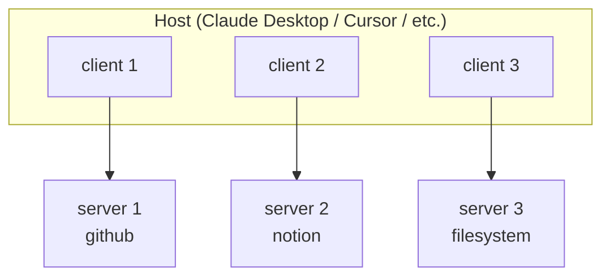
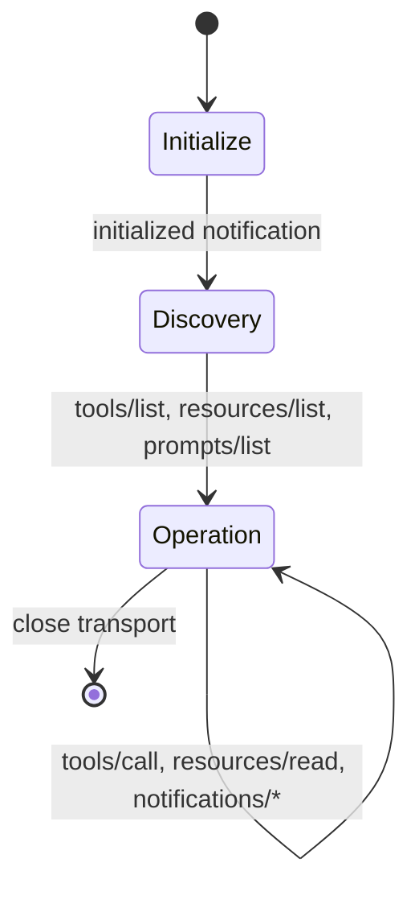

# MCP (Model Context Protocol)

An open standard for connecting LLMs to external tools and data. JSON-RPC 2.0 over pluggable transports. Anthropic introduced Nov 2024; donated to Linux Foundation Dec 2025. SDK downloads ~97M monthly.

!!! tip "Rapid Recall"
    **Architecture**: host (Claude Desktop, Cursor, Claude Code, etc.) runs N clients, each connected to one server. **Three primitives**: resources (read-only data, nouns), tools (actions, verbs), prompts (templates, recipes). **Two transports**: stdio for local subprocesses, Streamable HTTP for remote production. **Auth**: OAuth 2.1 with PKCE + Resource Indicators (RFC 8707). **Security**: tool descriptions are untrusted (prompt-injection vector); explicit user consent for destructive actions; sandbox where possible. **MCP doesn't replace REST**; your REST API still does the work, MCP is the protocol layer giving LLMs a standardized way to discover and use it.

## §1 — The "host" portability problem MCP solves

"Host" here means the **LLM provider** (OpenAI, Anthropic, Google). Each built its own tool-calling format, and they didn't match — the same tool needed three different shapes:

```jsonc
// OpenAI   {"type":"function","function":{"name":...,"parameters":{...}}}
// Anthropic {"name":...,"input_schema":{...}}
// Gemini    {"function_declarations":[{"name":...,"parameters":{...}}]}
```

Responses differ too (args as a JSON *string* vs a real object). So a tool was welded to one provider — swap models, redo the plumbing.

Two layers of fix exist:

- **Framework adapters** — LangChain's `bind_tools` defines a tool once and translates to each provider's shape. Solves portability for *your own* tools in your codebase.
- **MCP** — one standard protocol so independently-built tool *servers* plug into any agent on any provider, written once. The USB-C of tools.

### Why not just REST / gRPC / GraphQL / JSON-RPC alone?

| Protocol | One defining idea |
|---|---|
| **REST** | Act on noun-URLs with HTTP verbs (`GET /users/42`); stateless, one-shot. OpenAPI = its instruction manual. |
| **gRPC** | Call remote functions like local; compact binary (Protocol Buffers); fast; internal microservices. |
| **GraphQL** | Client requests exactly the fields it wants from one flexible endpoint. |
| **JSON-RPC** | Minimal "call this method with these params" as tiny JSON; transport-agnostic. |

Two things plain web protocols didn't natively give for this job:

1. A **standard runtime capability-discovery** convention shaped for "LLM-callable tool" — REST and OpenAPI describe APIs to humans at build time, with no agreed runtime "enumerate your tools" endpoint.
2. **Bidirectional, stateful, streaming** interaction — REST is stateless + one-directional + one-shot.

MCP picked **JSON-RPC 2.0 over pluggable transports** (stdio local, Streamable HTTP remote) — composing existing boring pieces rather than inventing new networking.

The plain-words pitch on why not REST: REST is built for a human to read docs, write code against fixed endpoints, ship. Stateless and one-directional. Wrong for agents three ways. (1) An agent needs to connect to an unseen server and ask *at runtime* "what can you do?" and get a machine-readable tool list. REST has no standard for that → custom glue per server. (2) The server sometimes needs to talk back unprompted ("data changed") or stream a long tool's progress. Plain REST can't do server-initiated or streaming. (3) The real point: even if you bolted all that on, everyone would do it *differently* → back to per-pairing integration. **The problem isn't capability, it's the lack of a shared standard.** Like USB-C — not electrically superior, just universally agreed, so any tool plugs into any agent. Turns N × M into N + M.

## §2 — MCP architecture: host / client / server, and the three primitives

### The three roles

| Role | What it is | Examples |
|---|---|---|
| **Host** | The AI application that initiates connections | Claude Desktop, Claude Code, Cursor, VS Code Copilot, ChatGPT Desktop, Antigravity |
| **Client** | A session manager inside the host, **one per server** | Internal component of the host; you don't write these |
| **Server** | A process that exposes capabilities over MCP | `github-mcp`, `notion-mcp`, `filesystem-mcp`, your custom server |

A single host runs **N clients**, each connected to **one server**. Each client handles its own handshake, capability discovery, request/response.



The user interacts with the host. The host's LLM emits tool calls. The host routes each call to the right client, the client sends it to its server, the server runs it, the result comes back. From the user's perspective, the experience is: "the LLM has tools." Under the hood, those tools live in independent processes the host doesn't have to know anything about.

### The three primitives

Each MCP server can expose any combination of three primitives:

| Primitive | Nature | What the LLM does with it | Examples |
|---|---|---|---|
| **Tools** | Executable actions with side effects | Calls them with arguments to get results | `send_email`, `create_issue`, `run_query`, `git_commit` |
| **Resources** | Read-only data | Reads them as context, doesn't "call" them | Files, DB tables, web pages, system status |
| **Prompts** | Reusable templates / starter flows | The host surfaces them as commands the user can pick | "Summarize this PR for release notes", "Onboard a new contractor" |

A clean mental model:

> **Resources are nouns** (data the LLM can read).
> **Tools are verbs** (actions the LLM can take).
> **Prompts are recipes** (parameterized workflows the user invokes).

Most production servers are heavy on tools, moderate on resources, light on prompts.

### What the protocol traffic actually looks like

Every message is JSON-RPC 2.0 — request, response, or notification. A tool call has three messages on the wire:

```jsonc
// 1. Host's client sends a request
{"jsonrpc":"2.0","id":42,"method":"tools/call",
 "params":{"name":"create_issue",
           "arguments":{"title":"Fix login bug","priority":"high"}}}

// 2. Server returns a response
{"jsonrpc":"2.0","id":42,
 "result":{"content":[{"type":"text","text":"Issue #1234 created"}]}}

// 3. (Optional) Server can send progress notifications during long tools
{"jsonrpc":"2.0","method":"notifications/progress",
 "params":{"progressToken":"abc","progress":0.5,"total":1.0}}
```

The `id` ties response to request. Notifications (no `id`) flow either direction without requiring a response. That's the whole wire protocol.

### Capability negotiation: handshake at session start

When a client connects to a server, they exchange capabilities first:

```
Client → Server:  initialize(protocolVersion="2025-11-25",
                              capabilities={...client supports...})
Server → Client:  initialize result(protocolVersion="2025-11-25",
                                     capabilities={tools:{...}, resources:{...}, prompts:{}})
```

**Negotiated capabilities determine what's legal to call later.** If a server didn't advertise `prompts`, the host won't list any prompts to the user.

### Resources vs. tool returns — a distinction that catches people

A resource is a **persistent, addressable piece of data** the LLM can attach to its context. Like a file URI: `weather://Delhi/current`. The client can subscribe to changes and the server can push updates.

A tool *return value* is **the result of an action**. It's not addressable, it doesn't persist, you don't subscribe to it.

When in doubt: if the same lookup keeps coming back (logs, DB rows, file contents that change) and the LLM might want it on every turn → expose it as a resource. If it's a one-off action with a one-off result (send this email, run this query right now) → tool.

The mental shortcut: **tool = verb** (do this, model-controlled, may have side effects, one-off result), **resource = noun** (addressable readable data, app/user-controlled like @-mentioning a file, stable, re-read across turns, subscribable). When designing a server: enumerate the actions → tools (≈80% of what you build); enumerate frequently-read stable data → resources (optional, patchy client support, often just done as a read-tool). **When in doubt, ship a tool.**

### tools/list — what makes runtime discovery work

Every MCP server answers one standard question the same way:

```jsonc
Agent → server:  {"method":"tools/list"}        // "what can you do?"
Server → agent:  [{"name":"create_issue",
                   "description":"Open a new issue",
                   "input_schema":{"repo":"string","title":"string"}}, …]
```

The agent now knows, at runtime, what it can call and with what arguments — no GitHub-specific code. Swap to a Slack server tomorrow: same `tools/list` call, Slack's tools come back, zero new glue. With REST you'd read each API's docs and hand-code an integration per service. **`tools/list` is exactly what REST never standardized.**

The companion notification `notifications/tools/list_changed` only matters during a **persistent open session**. Example: an IDE agent (Claude Code, Cursor) you keep open for hours; mid-session you enable a new integration; the server pings `list_changed`; the agent re-runs `tools/list` and can use the new tool without a restart. For typical request-response agents (fire query → run → finish → close), there's no one listening, so it rarely fires. It's a feature for long-lived sessions.

## §3 — Transport, lifecycle, OAuth 2.1, and a minimal MCP server

### The two official transports

MCP has **two transports, deliberately**. The November 2025 spec explicitly resisted adding more — keeping the spec small was a design value.

| Transport | When to use | Mechanics |
|---|---|---|
| **stdio** | Local execution (desktop apps, dev) | Server is a subprocess; messages flow over the server's stdin/stdout as newline-delimited JSON-RPC |
| **Streamable HTTP** | Remote services, production, multi-user | Single HTTP endpoint that handles both POST (requests) and GET (SSE stream); supports stateful sessions and bidirectional notifications |

Hard-won facts:

- **HTTP+SSE was deprecated** in March 2025 in favor of Streamable HTTP. If you see a tutorial mentioning a separate SSE endpoint, it's pre-2025, out of date.
- **Streamable HTTP supports both stateful and stateless modes.** Stateful uses an `Mcp-Session-Id` header; stateless is a 2026 evolution to fix horizontal-scaling issues with stateful sessions stuck on one pod.
- **The 2026 roadmap explicitly says no new transports will be added this cycle** — work focuses on evolving Streamable HTTP (scalability, stateless sessions, `.well-known` metadata).

### Where the stateful, bidirectional, streaming properties actually come from

This is the crucial correction most people get wrong: **JSON-RPC by itself does NOT provide statefulness, bidirectionality, or streaming.** It's just a message format. Those properties come from the *transport* — and JSON-RPC's one useful trait is being transport-agnostic, so you pick a transport that has them.

<figure class="diagram diagram-dark" markdown="0">
<svg viewbox="0 0 760 210" xmlns="http://www.w3.org/2000/svg">
  <rect x="180" y="30" width="400" height="46" rx="9" fill="#16140f" stroke="#e0a64b" stroke-width="1.5"/>
  <text x="380" y="50" text-anchor="middle" class="svg-title" style="fill:#f4c06a">Message layer — JSON-RPC 2.0</text>
  <text x="380" y="67" text-anchor="middle" class="svg-sub">uniform: request (has id) · notification (no id) · result</text>
  <rect x="80" y="120" width="270" height="62" rx="9" fill="#211d15" stroke="#6fb3a8"/>
  <text x="215" y="143" text-anchor="middle" class="svg-title">stdio (local)</text>
  <text x="215" y="162" text-anchor="middle" class="svg-sub">persistent pipe → stateful, 2-way, stream</text>
  <rect x="410" y="120" width="270" height="62" rx="9" fill="#211d15" stroke="#6fb3a8"/>
  <text x="545" y="143" text-anchor="middle" class="svg-title">Streamable HTTP (remote)</text>
  <text x="545" y="162" text-anchor="middle" class="svg-sub">HTTP + SSE → server pushes a stream</text>
  <line x1="280" y1="76" x2="215" y2="118" stroke="#322c20" stroke-width="2"/>
  <line x1="480" y1="76" x2="545" y2="118" stroke="#322c20" stroke-width="2"/>
  <text x="380" y="105" text-anchor="middle" class="svg-sub">pluggable transports — same messages, different pipe</text>
</svg>
<figcaption>JSON-RPC is the message format; statefulness, bidirectionality, and streaming come from the transport. "Pluggable transports" = the same messages ride whichever pipe fits the deployment.</figcaption>
</figure>

- **Bidirectionality** — JSON-RPC has *notifications* (no `id`, no response expected), and *either side* can send them. Over a persistent two-way pipe, the server can push "resource changed" unprompted.
- **Statefulness** — the transport holds one connection open across many messages; the first exchange is a capability-negotiation handshake; everything after lives in that remembered session.
- **Streaming** — entirely the transport's job: a stdio pipe you keep writing to, or **SSE** (Server-Sent Events) holding the HTTP response open to push event after event.

So why JSON-RPC *at all*, then? You still need a uniform message format both sides agree on, regardless of transport. JSON-RPC is the smallest such format, transport-agnostic, with the request-vs-notification distinction bidirectionality needs.

### Transport state machine



### The session lifecycle

```
1. Initialize
   client → server:  initialize(protocolVersion, capabilities)
   server → client:  initialize result(capabilities)
   client → server:  initialized (notification, confirming handshake)

2. Discovery (the client asks what's available)
   client → server:  tools/list      → [tool schemas]
   client → server:  resources/list  → [resource URIs]
   client → server:  prompts/list    → [prompt templates]

3. Operation (loop while the session is alive)
   client → server:  tools/call(name, args)              → tool result
   client → server:  resources/read(uri)                 → resource contents
   server → client:  notifications/resources/changed     → resource invalidation
   server → client:  notifications/progress              → progress on long tool

4. Termination
   either side closes the transport; stateful sessions can be resumed via the session ID
```

The "discovery" step is what makes MCP feel cleaner than function calling. The host doesn't hardcode the tool list, it asks the server. New tool added to the server → host sees it on next `tools/list`.

### Authentication: OAuth 2.1 (June 2025 spec)

For remote MCP servers (Streamable HTTP), the auth standard is **OAuth 2.1 with PKCE**. The June 2025 spec added Resource Indicators (RFC 8707), without these, a rogue server could trick the host into leaking tokens for other services.

The flow:

```
1. User opens host (e.g. Cursor) and adds a remote MCP server URL
2. Host fetches /.well-known/oauth-authorization-server on the MCP server's domain
3. Host opens a browser for OAuth — user signs in (SSO usually)
4. Host receives tokens, stores them securely
5. Host attaches Authorization: Bearer <token> on every MCP request
6. Token refresh happens silently
```

In practice: most enterprise MCP deployments now sit behind their company SSO, and the user goes through the same auth flow they would for any other internal tool.

The plain-words version of each piece:

- **OAuth** = log in without giving the app your password; the provider hands the app a scoped *token* instead.
- **OAuth 2.1** = the modern hardened version (insecure options removed, best practices mandatory).
- **PKCE** ("pixie") = anti-theft for the auth code: the app generates a secret, sends only its *hash*, and proves it holds the original when redeeming the code → an intercepted code alone is useless.
- **Resource Indicators (RFC 8707)** = pin each token to one specific service, so a rogue server can't replay a token meant for it against a *different* service.

### Building and hosting an MCP server — why and how

**Why build one**: so AI agents can *do things* in your product (press the buttons humans click). The payoffs are concrete: distribution (be the tool the agent reaches for, across all clients), write-once portability over any provider, usually a thin shim over an API you already have, and governed internal automation. **Skip it** if your app has no actions worth automating.

**Where and how to host**:

- **Local (stdio)** — not really hosted; the client launches your server as a subprocess and talks over pipes. Just point the client config at the run command. Personal and dev tools.
- **Remote (Streamable HTTP)** — a web service. Deploy to Cloud Run / AWS / Fly.io / a container, give it a URL, put OAuth 2.1 + PKCE in front, clients connect over HTTP+SSE. For multi-user or customer-facing.

### A minimal MCP server in Python (FastMCP)

The Python SDK's FastMCP makes a server two decorators:

```python
# Save this as weather_server.py
from mcp.server.fastmcp import FastMCP

mcp = FastMCP("weather-server")

@mcp.tool()
def get_weather(city: str, date: str) -> dict:
    """Get weather for a city on a given date.

    Args:
        city: City name, e.g. 'Delhi' or 'Bangalore'
        date: ISO date string YYYY-MM-DD
    """
    # Real implementation would call OpenWeather or similar
    return {"city": city, "date": date, "high": 38, "condition": "clear"}

@mcp.resource("weather://{city}/current")
def current_weather(city: str) -> str:
    """A live weather resource; the host can subscribe to changes."""
    return f"Current weather in {city}: 32°C, partly cloudy"

@mcp.prompt()
def trip_briefing(destination: str) -> str:
    """A reusable prompt template the user can invoke."""
    return f"Brief me on travel conditions for {destination}, including weather, visa, currency."

if __name__ == "__main__":
    mcp.run(transport="stdio")     # for production remote: transport="streamable-http"
```

And on the host side, Claude Desktop's config, for example, you point it at this server:

```json
{
  "mcpServers": {
    "weather": {
      "command": "python",
      "args": ["/path/to/weather_server.py"]
    }
  }
}
```

That's a complete MCP integration. Same server works in Claude Desktop, Cursor, Claude Code, VS Code Copilot, anywhere that speaks MCP.

### Security model (read this carefully)

The spec is blunt: **tool descriptions are untrusted**. A malicious server can put prompt-injection payloads into its tool descriptions, and the host will helpfully feed them to the LLM. Three rules:

1. **Whitelist servers.** Don't auto-trust anything in a public registry. Treat MCP servers like supply-chain software, review before you trust.
2. **Explicit user consent for destructive actions.** The host should pop a confirmation dialog for anything that creates, modifies, or sends.
3. **Sandbox server execution where possible.** Especially for code-execution tools, run them in a container or VM.

**Trust boundaries:** user trusts host → host trusts configured servers → servers trust their backing systems. A malicious server can exfiltrate everything in context or abuse tools.

**Enterprise pain points (2026):** no conformance testing yet, some servers community-built with uneven quality, gateway/proxy behavior undefined.

!!! note "Interview note"
    *"What's the threat model for third-party MCP servers?"* The answer interviewers want: (1) tool descriptions are prompt-injection vectors, (2) servers see everything in the context the host passes them, possible data exfiltration, (3) servers can claim capabilities they don't have safely. Mitigations: whitelist + user consent + sandboxing + audit logs.

### Multi-tenant governance — what MCP buys vs raw CLI

Imagine a SaaS agent serving 100 customers; Customer A must only touch A's Slack. Raw CLI versus MCP for that workload:

| | Raw CLI (bash tool) | MCP (typed tool) |
|---|---|---|
| **What's the boundary** | The LLM-generated command *string* | Your trusted *server* |
| **Auth scoping** | A token sits in env; which customer's? Injection can hit the wrong workspace | Server attaches the right customer's token and checks the channel — LLM never sees the credential |
| **Args** | Arbitrary string → shell-injection risk | Typed `channel`, `text` only — a schema cage |
| **Output** | `read` may dump 5,000 messages | Server caps and shapes it (e.g. latest 20, JSON) |
| **Audit** | Grep freeform command strings | Structured `(tool, args, customer_id)` logs |

With raw CLI the LLM-generated string is the security boundary — dangerous in multi-customer systems. MCP moves the boundary into trusted code: typed args cage requests, the server (not the model) attaches credentials and checks permissions, output is bounded, every call is auditable. **That control is what MCP's overhead buys** — and it only matters when the agent acts on behalf of multiple parties with real blast radius. On your own dev box, none of it applies → CLI wins.

## MCP vs REST/GraphQL APIs

MCP does **not** replace APIs. Your REST API still does the work. MCP is the protocol layer that gives LLMs a standardized way to discover and use them. One REST API → one MCP server wrapping it → any LLM host can use it.

**Why not just use function calling?** Function calling is per-host. Every app re-implements tool registration for every tool. MCP is cross-host: one server, every host. Also, MCP is stateful (sessions, streaming, bidirectional notifications) where function calling is stateless request/response.

## Common Failure Modes

| Issue | Cause | Fix |
|---|---|---|
| Tool selection errors with 50+ tools | Context bloat from listing all tools | Tool retrieval: embed descriptions, filter per query |
| Stateful session breaks on load balancer | Streamable HTTP sticky sessions | Session affinity, or wait for stateless evolution |
| Prompt injection via tool description | Untrusted servers | Whitelist servers, review descriptions, sandbox execution |
| Slow startup with many servers | Serial handshake per server | Parallel client init |
| Server crashes take down host | Unhandled server errors | Isolate clients, restart policies, graceful degradation |

## Context bloat — MCP vs CLI (2026)

**Why MCP bloats context**: the protocol declares *every* tool's full schema up front (via `tools/list`) before the agent reads your request — and that payload is often re-sent *every turn*. Reported in the wild: tool definitions burning 55,000+ tokens before a single user message; Perplexity's CTO has cited up to **72%** of the window consumed pre-input. It also degrades reasoning by crowding the high-attention part of the window.

<figure class="diagram diagram-dark" markdown="0">
<svg viewbox="0 0 760 180" xmlns="http://www.w3.org/2000/svg">
  <rect x="40" y="30" width="320" height="120" rx="10" fill="#16140f" stroke="#cf7a6a"/>
  <text x="200" y="52" text-anchor="middle" class="svg-title" style="fill:#cf7a6a">MCP — EAGER</text>
  <rect x="60" y="66" width="280" height="14" rx="4" fill="#cf7a6a" opacity="0.7"/>
  <rect x="60" y="84" width="280" height="14" rx="4" fill="#cf7a6a" opacity="0.7"/>
  <rect x="60" y="102" width="280" height="14" rx="4" fill="#cf7a6a" opacity="0.7"/>
  <rect x="60" y="120" width="90" height="14" rx="4" fill="#6fb3a8"/>
  <text x="200" y="170" text-anchor="middle" class="svg-sub">all schemas upfront · little room to reason</text>
  <rect x="400" y="30" width="320" height="120" rx="10" fill="#16140f" stroke="#6fb3a8"/>
  <text x="560" y="52" text-anchor="middle" class="svg-title" style="fill:#6fb3a8">CLI — LAZY</text>
  <rect x="420" y="66" width="40" height="14" rx="4" fill="#e0a64b"/>
  <rect x="420" y="84" width="280" height="14" rx="4" fill="#6fb3a8"/>
  <rect x="420" y="102" width="280" height="14" rx="4" fill="#6fb3a8"/>
  <rect x="420" y="120" width="280" height="14" rx="4" fill="#6fb3a8"/>
  <text x="560" y="170" text-anchor="middle" class="svg-sub">~80-token entry · --help on demand · room to reason</text>
</svg>
<figcaption>The real axis is eager-vs-lazy tool exposure. MCP declares every schema upfront (pay in tokens); CLI discovers on demand via <code>--help</code>.</figcaption>
</figure>

**Why CLI wins on context budget**: (1) near-zero upfront context — an ~80-token system prompt plus progressive disclosure via `--help`; (2) the model *already knows* common CLIs (`git`, `grep`, `jq`, `curl`, `aws`, `psql`) from training, so it needs *no schema at all* and can one-shot them.

What a CLI actually is, mechanically: a CLI is just an installed program you run by typing a command; it takes text args, prints text. The trick is that **the agent uses ALL CLIs through ONE generic `bash` / shell tool** — one tool, not N typed tools.

```
Agent emits:  bash(command="slack-cli send --channel general --text 'hi'")
Runtime runs that string in a real shell → stdout/stderr text back to agent
```

How it knows what to type without schemas: (1) the model already knows the command from training; (2) `--help` — it runs help *as a bash call* to learn syntax lazily, only for the tool it's using, only when needed; (3) an ~80-token system-prompt hint. To inject it: install the binary on the box (so it's on PATH) + give the agent a shell tool. Claude Code has a bash tool built in, which is exactly why "Claude Code + CLIs" is the popular combo — every installed CLI is instantly usable with zero registration.

**Don't overcorrect to "MCP is dead."** CLI has its own bloat — on the **output** side (raw `git log` can dump 10K unstructured lines; MCP returns bounded, structured output). The CLI edge narrows on complex chained writes. And MCP's overhead buys governance for multi-tenant, compliance-sensitive, customer-facing systems. Switching transport doesn't fix the threat model (prompt injection survives either way). 2026 consensus: **CLI for dev workflows, MCP where typed structure and governance matter.**

The second-order point most candidates miss: CLIs exploit the model's pretraining prior on Unix tools — no schema needed because the composability grammar is in the weights.

## MCP Registry & Discovery

The MCP Registry is the central index. 2026 roadmap adds **MCP Server Cards**, standardized metadata at `.well-known/mcp-server-card` so browsers, crawlers, and registries can discover server capabilities without connecting. Think: `robots.txt` for AI tools.

## When to Build an MCP Server

**Build one when:**

- You have a useful system (API, DB, tool) and want it accessible from any LLM host.
- You're building internal tooling and want consistency across Claude Code, Cursor, ChatGPT.
- You're publishing a product and want AI discoverability.

**Don't build one when:**

- You're building a single app with in-process tools, use native function calling.
- The tool is trivially simple (one API call), overhead isn't worth it.
- You need fine-grained latency control, MCP adds a hop.

## Interview Questions

**Q1: Explain MCP to someone who knows function calling but not MCP.**

Function calling is per-host: every app re-implements tool registration for every tool. MCP is cross-host: one server, every host (Claude, ChatGPT, Cursor) can use it. It's a standard protocol (JSON-RPC 2.0 over stdio or Streamable HTTP) with three primitives: resources (read-only context), tools (actions), prompts (templates). It does for AI tools what USB-C did for hardware, one connector, universal compatibility.

**Q2: Walk through the lifecycle of a single tool call in MCP.**

Host starts, spawns an MCP client per configured server. Client handshakes with server (version, capabilities). Client calls `list_tools()`, gets schemas. User sends message to LLM. LLM emits tool call. Host routes to correct MCP client. Client sends JSON-RPC request to server. Server executes, returns result. Result flows back: server → client → host → LLM. LLM produces final answer.

**Q3: Security concerns when using third-party MCP servers.**

Tool descriptions are untrusted, a malicious description can prompt-inject the LLM. Servers can read everything in context and exfiltrate. No conformance testing, so community-built servers vary widely in quality. Mitigations: whitelist servers, explicit user consent for destructive tools, sandbox server execution, review descriptions, prefer official servers (GitHub, Stripe) over random community ones.

**Q4: Why two transports (stdio and Streamable HTTP) and not more?**

Deliberate decision to keep the spec small. Stdio covers local use cases (dev, desktop apps, CLI tools); Streamable HTTP covers remote/production. Adding more (WebSocket, gRPC) fragments the ecosystem and forces every SDK to implement them. 2026 roadmap evolves Streamable HTTP for horizontal scaling rather than adding new transports.

**Q5: Design a production MCP server for a company CRM.**

Transport: Streamable HTTP (remote, multi-user). Primitives: resources (accounts, contacts, opportunities), tools (create_contact, update_opportunity, send_email), prompts (quarterly review template, cold outreach). Auth: OAuth 2.1 with per-user scopes. Destructive tools gated behind user consent dialog. Audit log of every tool call with user_id + input + output. Rate limiting per user. Deployment behind API gateway with session affinity until stateless transport lands.

**Q9: Trap — a candidate proposes building a custom tool protocol instead of using MCP.**

Push back. MCP is now a Linux Foundation standard with SDKs in 7+ languages, 97M monthly downloads, support in every major AI host. A custom protocol means you build and maintain SDK integrations forever. MCP extension points (resources, tools, prompts) cover 95% of use cases. Only legitimate reason to go custom is extreme performance constraints (sub-ms latency) where MCP's JSON-RPC overhead matters, rare.

**Q10: How does MCP handle tool selection with 50+ tools?**

Poorly by default, all tool schemas go into context, bloating tokens and confusing the LLM. Solutions: (1) tool retrieval, embed tool descriptions, retrieve top-K per query, only expose those to LLM. (2) Namespacing, group tools (`gmail.*`, `calendar.*`), LLM routes to group first. (3) MCP Server Cards (2026 roadmap), metadata-only discovery so registries can filter before connecting. Most production hosts implement variant of (1).

**Q11: Why did Anthropic donate MCP to the Linux Foundation?**

Neutral governance. USB-C works because no single laptop maker controls the spec; protocols tied to their creator evolve to match company roadmap. For MCP to become an actual standard rather than Anthropic's protocol, governance had to decouple. December 2025 donation to the Agentic AI Foundation under Linux Foundation gave it vendor-neutral status, critical for OpenAI, Google, Microsoft all adopting it natively.

---
