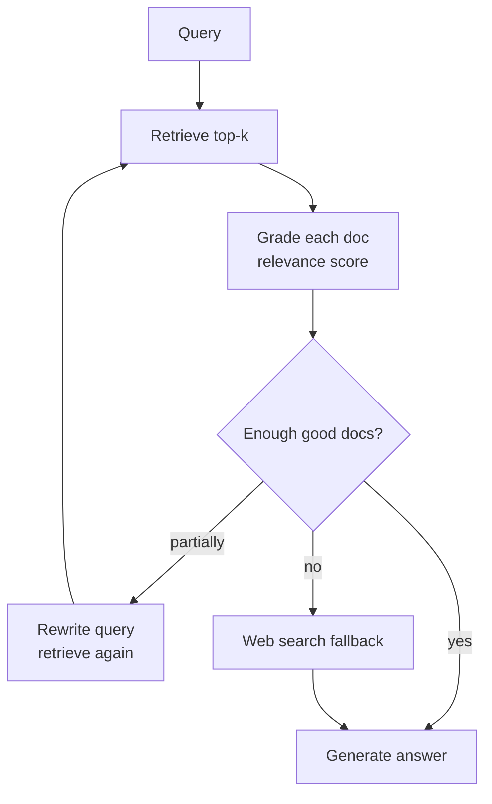
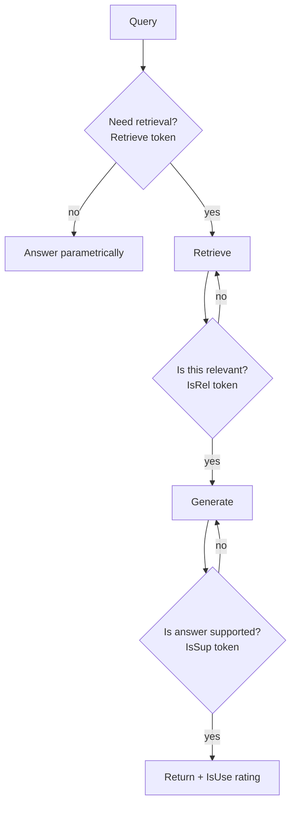
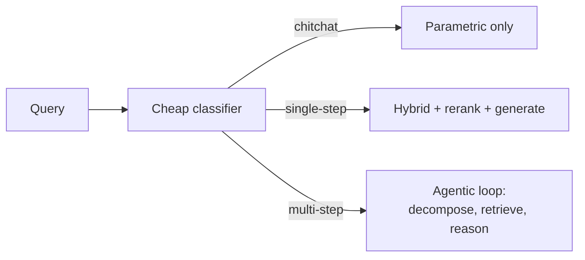

# Advanced RAG Architectures

Basic RAG handles the 80% case. The remaining 20% is where most production failures live: multi-hop questions, structured filters in natural language, cross-document aggregation, entity-relational queries, multimodal docs. **Critical principle**: every pattern here costs latency, ingest-time, or both. **Ship hybrid + rerank first**, measure what fails, then add exactly the pattern that fixes the observed failure. Premature sophistication kills velocity.

!!! tip "Rapid Recall"
    | Pattern | Fixes | Cost | Use when |
    |---|---|---|---|
    | **HyDE** | Query-doc phrasing gap | +1 LLM call | Short/ambiguous queries |
    | **RAPTOR** | Multi-doc, hierarchical QA | Heavy ingest, cheap query | Long docs, hierarchical content |
    | **Self-RAG** | Hallucination, trust | Moderate | Medical, legal, high-stakes |
    | **CRAG** | Bad retrievals passed silently | Moderate | Open-domain, variable doc quality |
    | **Graph RAG** | Entity-relational queries | Very heavy ingest | Enterprise with clear entities |
    | **Self-querying** | Structured filter hidden in NL query | +1 LLM call | Rich metadata corpora |
    | **Contextual compression** | Off-topic chunk text wastes tokens | +1 LLM call per chunk | High-cost answering LLM |
    | **Multimodal (ColPali)** | Charts, forms, scanned PDFs | Heavy ingest | Document VQA |

## §12 — Self-querying retrievers and contextual compression

### Self-querying retriever

Your user asks: *"Show me refund policies updated in 2026 for EU customers."*

This contains **three** signals:

1. **Semantic content** → "refund policies"
2. **Structured filter on metadata** → `modified >= 2026-01-01`
3. **Structured filter on metadata** → `region == "EU"`

Naive dense retrieval treats the whole thing as a semantic query and ignores the structured bits. **Self-querying retrievers use an LLM to parse the query into (semantic query, metadata filter) and pass them separately to the vector store.**

```
"refund policies updated in 2026 for EU customers"
       ↓ LLM parses
{
  "query": "refund policies",
  "filter": {"modified__gte": "2026-01-01", "region": "EU"}
}
       ↓ vector store applies filter as PRE-filter, then kNN on what remains
```

Cost: +1 LLM call per query. Worth it whenever your corpus has rich metadata (dates, authors, departments, geographies) and users naturally include those in queries.

### Contextual compression

After retrieval, you have 5–10 chunks. **Some of those chunks are 80% irrelevant text that just happens to share a sentence with the query.** That irrelevant 80% is now token-cost AND attention-noise for the LLM.

**Contextual compression**: a small/cheap LLM extracts only the relevant sentences from each chunk before the answering LLM sees them.

```
retrieved chunk (300 tokens, 80% off-topic):
"... Q3 revenue grew 12% ... [unrelated paragraphs about HR] ... The refund policy
allows 14 days for EU customers. ... [unrelated paragraphs about logistics] ..."

       ↓ compression LLM("extract only what's relevant to: refund policy EU")

compressed (40 tokens):
"The refund policy allows 14 days for EU customers."
```

Tradeoff: +1 LLM call per chunk, but token-cost savings on the *answering* LLM call and improved quality (less distracting context). Use a small model (Haiku, gpt-4o-mini) for compression.

## §13 — Agentic RAG with LangGraph (CRAG, Self-RAG, Adaptive RAG)

This is the biggest leap in production RAG between 2024 and 2026. **Linear pipelines don't handle hard queries.** Agentic RAG models the retrieval pipeline as a **state graph with cycles, conditional edges, and self-correction loops.**

### LangChain vs LangGraph — the mental shift

| | LangChain (LCEL) | LangGraph |
|---|---|---|
| Topology | DAG (directed acyclic) | Directed cyclic graph |
| Flow | One-way: input → output | Can loop, retry, branch |
| State | Implicit (passes through chain) | Explicit, typed `StateGraph` |
| Best for | Simple chains, fast paths | Multi-step reasoning, self-correction |

LangChain pipes A → B → C. LangGraph lets you say: "after grading retrieval, IF documents are bad, loop back to query rewriting; IF they're good, generate; THEN check the answer for hallucination, AND IF hallucinated, regenerate." That's a cyclic state machine, DAGs can't express it.

### The four agentic patterns to know

| Pattern | One-line summary | Fixes |
|---|---|---|
| **CRAG** (Corrective RAG) | After retrieval, an LLM grades each doc. Bad → fall back to web search. | Silent bad retrievals |
| **Self-RAG** | Model emits self-reflection tokens: `[Retrieve?]`, `[IsRelevant?]`, `[IsSupported?]` | Hallucination, trust |
| **Adaptive RAG** | Cheap classifier routes queries: no retrieval / single-step / multi-step. | Latency on easy queries |
| **Multi-hop / ReAct RAG** | Decompose, retrieve, reason, retrieve again, ... | Multi-hop questions |

### CRAG decision graph



### Self-RAG reflect loop



### Adaptive RAG router



### Why production teams converge on CRAG + Adaptive

In 2026, the most pragmatic agentic RAG stack is:

1. **Adaptive front-door**: classify the query. Easy lookup → fast path (hybrid + rerank, single shot). Hard query → enter the corrective loop.
2. **CRAG loop**: retrieve → grade → if good, generate; if bad, rewrite + re-retrieve (max N iterations); fall back to web search if all retries fail.
3. **Self-check on generation**: LLM checks its own answer against retrieved context. If unsupported, regenerate.

This is the "production-grade agentic RAG" you describe in interviews.

### CRAG (Corrective RAG) implementation sketch

```python
def crag(query, retriever, web_search, llm):
    docs = retriever(query, k=10)
    scores = [llm.grade(query, d) for d in docs]
    good = [d for d, s in zip(docs, scores) if s >= 0.7]
    if len(good) >= 3:
        return llm.generate(query, good)
    web_docs = web_search(query)
    return llm.generate(query, good + web_docs)
```

### Production additions you'd want

| Concern | Add |
|---|---|
| Persistence | LangGraph `Checkpointer` (SQLite, Postgres, Redis) for resumable runs |
| Human-in-the-loop | `interrupt_before=["generate"]` to require approval on sensitive answers |
| Observability | LangSmith or Langfuse tracing, captures every node's I/O |
| Streaming | `app.astream_events()` for partial answer streaming |
| Self-RAG additions | A `verify_grounding` node after `generate` that loops back if not supported |

!!! note "Interview answer"
    *"When would you pick LangGraph over plain LangChain?"* The moment your retrieval pipeline needs **cycles, branches based on output quality, retries, or human approval gates.** Linear chains can't do those. Don't over-build: ship LCEL chains for simple paths, escalate to LangGraph for paths where eval shows you need self-correction.

## §14 — GraphRAG and hierarchical summarization

Basic RAG fails at two question types:

1. **Cross-document aggregation**: *"Summarize the themes across our 50 customer interviews."* No single chunk contains the answer; the answer is a *synthesis*.
2. **Multi-hop entity-relational**: *"What is the revenue of the company that acquired Figma?"* Requires hopping: Figma → Adobe → Adobe's revenue.

### GraphRAG (Microsoft, 2024)

**Idea**: at ingest time, use an LLM to extract **entities** and **relations** from documents, building a knowledge graph alongside the vector index. At query time, traverse the graph to find relevant entities and their neighborhoods, fuse with vector retrieval.

```
Ingest pipeline:
  doc → LLM extracts (entities, relations) → knowledge graph
  doc → embed → vector store
  Graph nodes also get community detection + LLM-generated summaries per community

Query pipeline:
  query → extract entities from query
  Local search:  fetch entity + 1-2 hop neighborhood + chunks attached
  Global search: route to community summaries, map-reduce across them
  Fuse with vector retrieval, send to LLM
```

**Microsoft variant**: Local search (entity + neighbors) vs Global search (community summaries via map-reduce for corpus-wide aggregation).

**When to use**: enterprise knowledge work where queries are entity-relational (org charts, product hierarchies, customer relationship maps, legal entity graphs). Skip on pure unstructured prose.

**Cost reality**: GraphRAG ingestion is **10–50x more expensive than vector RAG** because every doc requires LLM entity-extraction calls. For 100K docs, that's a serious bill. **Heuristic**: ship hybrid RAG first, log query patterns, add GraphRAG only if ≥20% of queries are clearly entity-relational and failing.

### RAPTOR (hierarchical summarization)

**Idea**: build a *tree* of summaries. Cluster chunks → summarize each cluster with an LLM → cluster those summaries → summarize again → ... → root. Index all tree levels in the same vector DB. Retrieval naturally returns leaves (specific facts) OR branches (themes) OR root (corpus-wide summary) depending on query specificity.

```
Level 0: 10,000 raw chunks
Level 1: 1,000 cluster summaries
Level 2: 100 super-cluster summaries
Level 3: 10 thematic summaries
Level 4: 1 root summary

Query:   "What did customer Acme say about pricing?"  → matches Level 0 (specific)
Query:   "What themes emerged from customer feedback?" → matches Level 2-3
Query:   "Summarize the past year of feedback."        → matches Level 3-4
```

```python
def build_raptor_tree(chunks, embedder, llm, levels=3):
    current = chunks
    all_nodes = [{"level": 0, "nodes": current}]
    for level in range(1, levels + 1):
        vecs = embedder.embed([c["text"] for c in current])
        km = KMeans(n_clusters=max(1, len(current) // 5)).fit(vecs)
        new = []
        for cid in range(km.n_clusters):
            members = [current[i] for i, l in enumerate(km.labels_) if l == cid]
            combined = "\n\n".join(m["text"] for m in members)
            new.append({
                "text": llm.complete(f"Summarize:\n{combined}", max_tokens=300),
                "children": members,
            })
        all_nodes.append({"level": level, "nodes": new})
        current = new
    return all_nodes
```

**When to use**: slow-changing corpora with hierarchical content (textbooks, annual reports, codebases, customer-feedback archives). Skip for high-churn streaming data, rebuilding the tree is expensive.

### Decision: GraphRAG vs RAPTOR vs hybrid

| Need | Use |
|---|---|
| Multi-hop entity queries (Figma → Adobe → revenue) | GraphRAG |
| Cross-doc themes ("summarize all feedback") | RAPTOR |
| Both, large corpus | GraphRAG + RAPTOR combined (Microsoft's variant does this) |
| Neither, just need good lookup | Plain hybrid + rerank. **Don't over-engineer.** |

## §15 — Multimodal RAG

Documents are not just text. Real corpora have **screenshots, diagrams, scanned PDFs with tables, product photos, slide decks**. Three approaches, increasing in sophistication.

### Level 0: OCR everything, treat as text

Run OCR (Tesseract, Unstructured, Docling) on images and PDFs. Index the extracted text. Cheap, works for text-heavy scans. **Fails** on charts, diagrams, anything where the visual layout *is* the content.

### Level 1: Captioning with a vision-language model

For each image: caption it with a VLM (GPT-4o, Claude 3.5 Sonnet, Gemini 3 Pro vision, LLaVA). Index the caption text. The image filename stays as metadata so you can show the actual image alongside the answer.

```
chart.png  →  VLM("describe this chart") → "Line chart showing quarterly revenue from 2020-2024..."
             → embed the caption → index
At query time: retrieve caption, also surface chart.png to the user.
```

Works well for charts, infographics, product photos. Cost: 1 VLM call per image at ingest.

### Level 2: True multimodal embeddings (CLIP, SigLIP, ColPali)

Models that embed **both text and images into the same vector space**. A text query can retrieve an image directly.

- **CLIP / OpenCLIP**, the classic, English-centric, weakest on text-in-images.
- **SigLIP / SigLIP 2** (Google, 2024-25), better contrastive training, stronger zero-shot.
- **ColPali** (2024), late-interaction over **document page images directly**. No OCR, no captioning. Embeds each page as a grid of patches, query embeddings interact with patches at retrieval. **The 2026 state of the art for document VQA over scanned PDFs.**

ColPali is the 2026 game-changer for slide decks, technical manuals, and forms: index pages as images, the model "reads" them at retrieval time. Skip the OCR/captioning pipeline entirely.

### Cost vs quality tradeoff

| Approach | Ingest cost | Query cost | Quality on charts/forms |
|---|---|---|---|
| OCR-only | Cheap | Cheap | Poor |
| VLM captioning | Moderate (1 VLM call/image) | Cheap | Good for charts, weak on layouts |
| CLIP-style joint embeddings | Cheap | Cheap | Moderate; weak on text-in-images |
| ColPali / late-interaction | Moderate (compute-heavy ingest) | Moderate | **Best for document VQA** |

!!! note "Interview note"
    *"How do you RAG over a PDF with charts and tables?"* In 2026 the right answer is: **Docling for layout-aware parsing if the docs are text-heavy; ColPali if they're chart/diagram-heavy.** Older answers (Tesseract OCR + caption with VLM) are still valid baselines but no longer state of the art.

## §16 — How citations actually work

Citations aren't magic — they're engineered provenance plus a forced reference. Two halves, and only one is fallible.

### Half 1: provenance tracking (system, deterministic)

Every chunk carries its metadata from the moment it's created: `chunk_id, text, embedding, {source, url, page, section, effective_date}`. Retrieval returns these full records, so **the system already knows** "this chunk came from page 14 of contract.pdf." It's a foreign key following the data — no intelligence required. This is why every chunk needs metadata persistently attached, not stored separately.

### Half 2: getting the model to cite (prompt + parse)

Three patterns, increasingly clean:

- **A — Labelled context**: inject chunks with IDs in the prompt: `[1] (source: contract.pdf, p.14): ...`. Instruct the model to cite the number. Parse the `[1]` out of the answer and resolve to the real source. The model produces a *pointer*; your code resolves it to truth.
- **B — Structured output**: model returns JSON `{answer, citations:[{claim, source_id}]}`. Cleaner to parse, easier to validate against the source list. **The production default in 2026.**
- **C — Post-hoc attribution**: model writes the answer with no citations; a second pass attributes each sentence to its supporting chunk (cosine similarity or an LLM judge). Independent verification, but two passes.

**The honest catch**: with A and B the model *chooses* which label to attach — and can attach the wrong one. The metadata is always correct (deterministic); *which* chunk the model points at is a fallible generation. Rigorous systems add a verification layer that asks: "does chunk [1] actually entail this claim?"

Mental model: **citation = deterministic provenance (always correct) + model's pointer choice (fallible) + parse-resolve (deterministic)**. The metadata never lies; the pointer choice is the only soft link.

## §17 — Agentic RAG: when the pipeline becomes a loop

Everything above is a **fixed pipeline** — the path is designed at build time (even Self-RAG's reflection is a scripted checkpoint). Agentic RAG replaces the fixed pipeline with **an LLM that decides what to do at each step**, in a loop. The control flow is generated at runtime by the model. *Traditional RAG follows a path you designed; agentic RAG decides the path as it goes.*

### What the loop unlocks

- **Multi-step / iterative retrieval** — retrieve, see what's missing, retrieve again with a refined query. The big one — impossible in single-shot.
- **Query decomposition** — break a compound question into sub-questions, retrieve each, synthesize.
- **Tool / source routing** — choose vector DB vs SQL vs web vs calculator per sub-task.
- **Self-correction** — change strategy on failure, not just flag it.

### Tradeoffs — it is NOT strictly better

| | Fixed pipeline | Agentic |
|---|---|---|
| Control flow | Fixed, you design it | LLM decides at runtime |
| Latency / cost | Low, predictable | High, variable (N loops) |
| Debuggability | Easy (fixed path) | Hard (non-deterministic) |
| Failure mode | Bad answer | Loops, wrong tool, runaway cost |
| Best for | Simple single-hop | Complex multi-hop / multi-source |

**Decision rule + the trap.** Match architecture to query complexity. Simple, homogeneous, latency-sensitive → pipeline. Complex, multi-source, quality-over-speed → agentic. Mature systems use a **router** that sends easy queries to the cheap pipeline and hard ones to the agent. The trap: "if it's more capable, why not use it for everything?" — cost, latency, debuggability, and capability is *wasted* on simple queries. The earlier patterns (HyDE, RAPTOR, Self-RAG, CRAG) become *tools the agent can choose to invoke* — CRAG's web-fallback is one hardcoded agentic decision that agentic RAG generalizes.

## §18 — Web search and deep research as RAG

Web search *is* a (mildly agentic, live) RAG; deep research *is* a fully agentic multi-hop RAG. The skeleton is identical to closed-corpus RAG; every *corpus assumption* changes.

| | Closed-corpus RAG | Web search |
|---|---|---|
| Corpus / index | Your docs, you build the index | The internet; index outsourced to a search engine |
| Retrieval | Your hybrid BM25 + vector | A search API call (Bing / Google / Exa / Tavily) |
| Trust | Curated, trusted | Unknown, adversarial |

**Web-search flow**: (1) LLM formulates a query → (2) search API returns ranked URLs + snippets → (3) *fetch* promising pages, strip HTML to text → (4) inject as context → (5) generate with URL citations. Often still single-shot.

**Deep research**: plan → decompose into sub-questions → iterative search loops (search, read, decide next search from what was learned) → read full pages → synthesize a long cited report → self-direct until done. That's web RAG + agentic planning + multi-hop + long-form synthesis. Minutes and many calls — the agentic tax, paid deliberately.

### The trust problem (the core, unsolved issue)

In closed-corpus RAG, retrieving the right chunk means it's correct *by assumption*. On the open web, **retrieval succeeding tells you nothing about truth.** Two separate failures: retrieval failure vs *source corruption* (found perfectly, but wrong, biased, satire, propaganda, SEO spam, fabricated).

- **Unknown source reliability** — a paper, a Reddit comment, and a content farm all come back as "results." Mitigated by domain authority, cross-corroboration, recency — heuristics, not guarantees.
- **SEO manipulation and adversarial content** — the web is adversarially optimized; AI-generated slop now floods it (slop citing slop).
- **Indirect prompt injection** — a fetched page can contain `"ignore previous instructions…"`; the agent reads attacker-controlled text and may act on it. Larger attack surface the more autonomous the agent. Not solved — mitigations: treat fetched content as untrusted data, instruction/data separation, sandboxing.
- **Temporal conflicts** — 2019 and 2026 answers both live on the web; recency reasoning is error-prone.
- **Citation ≠ verification** — a citation proves "claim came from this page," not "page is correct." A confidently-cited wrong source manufactures false trust.

!!! warning "Interview-grade insight"
    "In closed-corpus RAG my job ends at retrieval quality — the corpus is trusted. Web search breaks that: retrieval can succeed perfectly while the source is wrong or adversarial. So open-web systems need a **credibility layer on top of the relevance layer** — source authority, cross-corroboration, recency — plus defenses against indirect prompt injection from fetched content. Even then it's mitigation, not a solution, which is why these systems hedge and cite rather than assert."

The sharpest danger is the *intersection*: a page both SEO-optimized to rank *and* carrying prompt injection — it ranks, gets trusted, then manipulates the agent.

## §19 — Long-context vs RAG (quality-only argument)

The naive intuition — "attention attends to everything, so stuffing the whole doc is better" — is **half right**. Long-context is better up to a point, then gets *worse*, and the crossover is well before a million tokens. The reasons here are about *quality*, separate from cost.

### Context rot — the finding that breaks the intuition

Attention *can* technically reach every token (architecturally true), but performance **degrades as context grows** (behaviorally it isn't used equally). Two different tasks diverge:

- **Needle-in-haystack (retrieve one fact)** — models are excellent at this now; it's what improved and what marketing cites. The intuition holds here.
- **Reasoning over full content (synthesize, compare distant parts)** — degrades with length far faster. Finding a fact ≠ holding the whole haystack in working memory. "Lost in the middle" is reduced for retrieval, sticky for reasoning.

### Why stuffing the full doc can hurt quality

- **Distractor dilution** — burying 3 relevant paragraphs in 1,000 pages forces the model to suppress 997 pages of plausible distractors; it can latch onto related-but-wrong text. **RAG's filtering is itself a quality feature.**
- **Attention spread thin** — a finite soft-weight budget diluted across a million tokens vs concentrated on 5 chunks.
- **Position effects persist** (reduced, not gone) — the "middle" of a million tokens is enormous.

### When full-context genuinely wins on quality

- **Whole-document synthesis** on a bounded doc ("summarize this contract & find contradictions") — RAG fragments structure and misses cross-references.
- **Chunking would sever critical structure** — a clause and its definition 40 pages away.
- **Can't predict what's relevant** — giving everything avoids the retrieval-miss failure entirely.

### The decision rule

It's not whether the doc *fits* — it's **what fraction is relevant + lookup vs synthesis**. High relevant-fraction or whole-doc reasoning → full-context. Low relevant-fraction over a large corpus → **RAG wins on quality** (filtering removes distractors). The 2026 answer is **composition**: use RAG to drop the irrelevant 95%, then long-context reasoning over the relevant 5% kept whole. Long context also lets RAG use bigger parent chunks.

Caveat: advertised window size is partly marketing — usable-quality length is shorter than the headline. Treat "1M tokens" as an upper bound on *retrieval*, not a guarantee of *reasoning*.

## Combining Patterns (Production 2026)

- HyDE + hybrid retrieval + cross-encoder rerank = common strong baseline.
- RAPTOR + vector RAG = hierarchical content.
- CRAG + Self-RAG = hallucination-averse.
- Graph RAG + vector RAG = enterprise knowledge work.
- RAG + long-context = composition (retrieve relevant ~5%, reason over it whole).

## Interview Questions

**Q12: Walk through a multi-hop question and how RAG fails.**

"What was the revenue of the company that acquired Figma?" Basic RAG: retrieves Figma chunks, maybe mentions Adobe, but doesn't connect "Adobe → revenue." RAPTOR might surface Adobe summary if tree covered it. Graph RAG cleanly: Figma → (acquired_by) → Adobe → (had_revenue) → 54B. Two hops, explicit.

**Q13: CRAG adds latency from grading. Justify the cost.**

~50ms per doc with small LLM/classifier × 10 docs ≈ 500ms. Quantify: (reduction in hallucination rate) × (cost of hallucination incident). Medical/legal: hallucinations >> 500ms. Chat bots: usually not worth.

**Q14: Trap — candidate proposes Graph RAG as MVP for enterprise assistant. Push back.**

10–50x vector RAG ingestion cost due to LLM entity extraction per doc. Paying this before knowing if queries are graph-heavy. Ship hybrid RAG first, measure query patterns for a month. Only add Graph RAG if 20%+ queries clearly entity-relational. Premature sophistication kills velocity.

---
