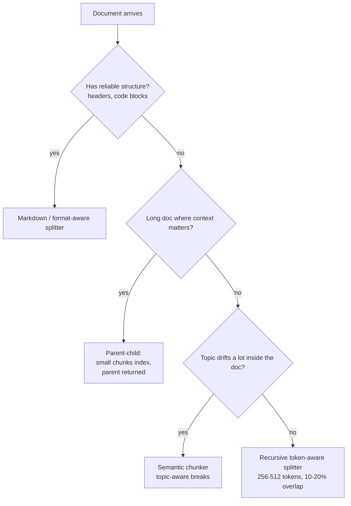

# Foundations: Loading, Chunking, Embedding, Storing

The offline indexing pipeline runs once per document (or once per document version). Time spent here is amortized over every query you will ever serve. **Get this right and retrieval gets easier. Get this wrong and no amount of clever reranking will save you.**

!!! tip "Rapid Recall"
    **Chunking.** Five strategies, recursive is the 2026 default for prose, parent-child for long docs. Chunks formula `N = ceil((L - O) / (C - O))`, storage inflation `C / (C - O)`. 20% overlap = 1.25x storage. Sweet spot 256–512 tokens.
    **Embeddings.** BGE-M3 self-host default, OpenAI 3-small managed cheap default, 3-large with Matryoshka for quality. Always L2-normalize, embed with the model's own tokenizer, version embeddings so model swaps don't silently corrupt the index.
    **Vector DBs.** Qdrant is the 2026 self-host default; Pinecone for managed. FAISS in-process for prototypes; pgvector if you're already on Postgres under 10M vectors. Pre-filter beats post-filter at scale.

## §4 — Document loading

The first failure mode of every RAG system: **your loader silently butchered the source document**. Tables become run-on text, PDFs lose layout, headers disappear, code blocks merge with prose. By the time you see "bad answer", the damage was done in step 1.

### What you're actually solving

You need to turn an arbitrary source (PDF, HTML, .docx, Notion page, Markdown, a database row) into a uniform `Document` object with:

- `page_content`: the text
- `metadata`: a dict with at least `source`, ideally `page`, `section`, `modified_date`, `url`

Metadata travels with the chunk through the whole pipeline. **You need it for citations, for filtering at retrieval time ("only docs from the last 30 days"), and for debugging.** Skip metadata and you'll regret it within a week.

### LangChain's loader taxonomy (2026)

| Source | Loader | Gotcha |
|---|---|---|
| `.txt` / `.md` | `TextLoader`, `UnstructuredMarkdownLoader` | Markdown loader preserves headers as metadata, use it |
| `.pdf` text-based | `PyPDFLoader` (one Document per page) | Tables get linearized, see below |
| `.pdf` scanned | `UnstructuredPDFLoader` + Tesseract OCR | Slow, OCR errors compound |
| `.pdf` complex layout | `PyMuPDFLoader`, `LlamaParse` (paid), `Docling` (IBM, 2025) | Docling is the 2026 open-source winner for tables |
| HTML / web | `WebBaseLoader`, `RecursiveUrlLoader` | Strip nav/ads or they pollute every chunk |
| `.docx` | `Docx2txtLoader`, `UnstructuredWordDocumentLoader` | Tracked changes can leak |
| Notion | `NotionDirectoryLoader` (export) or Notion API loader | Use the API loader for live sync |
| Code | `GitLoader`, language-specific splitter | Use `RecursiveCharacterTextSplitter.from_language(Language.PYTHON)` |
| Images / multimodal | `UnstructuredImageLoader`, ColPali | Multimodal RAG is its own beast |

### The PDF table problem (everyone hits this)

Standard PDF loaders extract text in reading order. A 3-column table becomes `"header1 header2 header3 row1col1 row1col2 row1col3 row2col1 ..."`, embeddings will be useless on this. **Fix:** use a layout-aware loader (Docling, LlamaParse, Unstructured) that preserves table structure as Markdown or HTML, then index the table as a single chunk.

A useful intermediate trick when converting HTML → Markdown: tables become detectable pipe-delimited blocks (`| col | col |`), so you can isolate them programmatically and apply table-specific handling (see §8 below).

!!! note "Interview note"
    When asked "how would you ingest 100 different document types?", the answer is: **standardize early.** Convert everything to Markdown (Docling does this beautifully for PDFs), then run one chunking strategy. Trying to maintain a different chunker per format is a tax you'll pay forever.

## §5 — Chunking: the single most important knob in RAG

Chunking is where most RAG systems live or die. Get the chunk size right and retrieval feels magical. Get it wrong and the rest of the pipeline can't compensate.

### The fundamental tradeoff

- **Small chunks (128–256 tokens)** → precise retrieval, but each chunk lacks surrounding context → LLM gets fragments.
- **Large chunks (1024–2048 tokens)** → rich context, but the embedding "averages" too many ideas → retrieval becomes fuzzy.
- **Sweet spot for most prose:** 256–512 tokens with 10–20% overlap.

### The five strategies

| Strategy | Best for | Failure mode |
|---|---|---|
| **Fixed-size** | Logs, transcripts (no structure) | Cuts mid-sentence, mid-table |
| **Recursive** | General prose (the 2026 default) | Still butchers tables |
| **Markdown / format-aware** | Docs with headers, code blocks | Worthless on unstructured text |
| **Semantic** | Long monologues where topic shifts | Threshold-fragile, expensive |
| **Parent-child** (small-to-big) | Long-doc QA | More storage, more complexity |

**Production default in 2026:** recursive with token-aware length function, parent-child when you want "the chunk + surrounding paragraphs" for the LLM.

### Sizing is tuned, not decreed

The 256–512 sweet spot above is a *prior*, not a verdict. Dense, conditional text (legal, policy) pushes toward the larger end (512) or parent-child, because a clause's meaning depends on definitions stated nearby — chopping too small severs the logic. Overlap around 10–15% catches rules that straddle a boundary. And critically, **count tokens with the same tokenizer the embedder uses** — otherwise a "512-token chunk" may truncate silently on the embedding side.

The honest interview answer is "here's my prior, and I'd sweep sizes against my golden eval set and measure nDCG@k" — the optimum depends on your query and document distribution. A confident single number is a weak answer.

### Chunking strategy decision tree



### The math you should know

For a document of length `L`, chunk size `C`, overlap `O`:

$$\text{chunks} = \left\lceil \frac{L - O}{C - O} \right\rceil$$

$$\text{storage inflation factor} = \frac{C}{C - O}$$

At 20% overlap → 1.25x storage. At 50% overlap → 2x storage. **Overlap isn't free**, it scales storage, indexing time, and (somewhat) retrieval noise.

### Recursive splitting

```python
from langchain.text_splitter import RecursiveCharacterTextSplitter

splitter = RecursiveCharacterTextSplitter(
    chunk_size=512,
    chunk_overlap=64,
    length_function=lambda x: len(tokenizer.encode(x)),  # token-aware
    separators=["\n\n", "\n", ". ", " ", ""],
)
chunks = splitter.split_text(doc)
```

**Why "recursive" and not "split every N characters"?** The splitter walks a **priority list of separators**, biggest semantic unit first, dropping finer only when a chunk is still too big. Order: `\n\n` (paragraphs) → `\n` (lines) → `. ` (sentences) → ` ` (words) → characters. The logic is: try splitting on `\n\n`; if any piece still exceeds `chunk_size`, re-split that piece on `\n`, then `. `, and so on. You cut at the most natural boundary that fits the budget instead of slicing blindly at character N. This is the 2026 default for unstructured prose — preserves meaning better than fixed-size, without semantic chunking's embedding cost.

### Parent-child (small-to-big) chunking — production workhorse

The clever trick: **index small chunks for precision, return their parents for context.** When a small chunk matches, hand the LLM the parent (the surrounding paragraph or section). The four-step recipe:

1. Split doc into large **parent** chunks (~2,048 tokens).
2. Split each parent into small **child** chunks (~256 tokens).
3. Embed and index **only the children**.
4. At query time, match a child → but return its **parent**.

Why it works: small chunks embed cleanly (one idea = sharp match) but a stranded 256-token hit often lacks context to answer well. So **match small, serve big** — decouple *easy to match* from *useful to read*. The cost: more tokens per query, and over-fetch if parents are huge.

```python
def parent_child(doc, parent_size=2048, child_size=256, overlap=32):
    parents = [{"id": i, "text": doc[j:j+parent_size]}
               for i, j in enumerate(range(0, len(doc), parent_size - overlap))]
    children = []
    for p in parents:
        for k in range(0, len(p["text"]), child_size - overlap):
            children.append({"text": p["text"][k:k+child_size], "parent_id": p["id"]})
    return parents, children
```

**When to reach for each:**

- **Recursive, single-size** → 80% of cases. Start here.
- **Parent-child** → long docs where context matters (legal contracts, technical manuals, support tickets with long threads).
- **Markdown / code-aware** → when source structure is reliable.
- **Semantic** → rarely. Only if eval shows recursive is actively hurting on topic-drift-heavy docs.

### Data diet

- **Tokenizer matters.** Chunk by the embedding model's tokenizer, not chars.
- **Overlap isn't free.** Storage and inference cost. 10–15% is the standard.
- **Metadata per chunk.** Page, section, source URL, modified date — travels with the chunk for filtering and citation.

## §6 — Embedding models

An embedding model is a function `f: text → R^d` where similar-meaning texts get nearby vectors. The whole "find relevant docs" magic in dense retrieval reduces to: `cosine(f(query), f(doc))`.

### Two architectures, one job

| | Bi-encoder | Cross-encoder |
|---|---|---|
| Input | One text at a time | Query + doc together |
| Output | One vector per text | One score per pair |
| Speed | Embed N docs once, search in O(d) per query | Score N pairs per query, no pre-compute |
| Use for | Retrieval | Reranking (see Reranking page) |
| Catches | Semantic similarity | Negation, phrase structure, fine-grained interactions |

Bi-encoders are fast because you embed all docs *once*, offline. Cross-encoders are accurate because they see the query+doc together at inference, but they cost a full forward pass per pair, unusable on millions of docs, perfect on top-50 candidates.

### The 2026 model landscape

**Proprietary** (managed, pay per call):

- **OpenAI `text-embedding-3-large`** (3072 dims, Matryoshka-truncatable). Strong general baseline.
- **OpenAI `text-embedding-3-small`** (1536 dims). Cheap, surprisingly competitive, the budget default.
- **Cohere `embed-v4`**. Strong multilingual, good for code and legal.
- **Voyage-3**. Specialized models for code, finance, legal, medical.

**Open weights** (self-host):

- **BGE-M3** (BAAI), multilingual, produces dense + sparse + multi-vector in one model. **The 2026 self-host default.**
- **E5-large-v2** (Microsoft), strong MTEB baseline.
- **GTE-large** (Alibaba), Apache 2.0.
- **Nomic-embed-text-v1.5**, Matryoshka, 8K context.
- **Jina embeddings v3**, good multilingual, long context.

### Matryoshka embeddings — why they're a 2026 superpower

Trained so that **the first `k` dimensions of the full vector are themselves a valid (lower-quality) embedding.** Matryoshka training packs the most important information into the leading dimensions, so prefixes remain useful embeddings on their own. You can truncate a 3072-dim vector to 256 dims for fast coarse search, then rescore the top candidates at full 3072.

OpenAI's `text-embedding-3-small` (1536-dim) and `-large` (3072-dim) both support Matryoshka-style truncation via the `dimensions` parameter — shorten 1536 → 512 with only minor quality loss, no re-embedding. Massive storage savings (12x at 256 dims). At scale (10M+ vectors), this is the difference between "fits in RAM" and "doesn't."

### Math: contrastive training (InfoNCE)

Embeddings aren't trained to predict words; they're trained so that similar pairs land close and dissimilar pairs land far apart. The InfoNCE loss:

$$\mathcal{L} = -\log \frac{\exp(\text{sim}(q, d^+)/\tau)}{\sum_i \exp(\text{sim}(q, d_i)/\tau)}$$

where `d+` is a known-relevant doc for query `q`, the `d_i` are in-batch negatives (everyone else's docs), and `τ` is a temperature (~0.05). **Intuition:** pull the positive close, push everything in the batch far, scaled by similarity. Larger batches → harder negatives → better embeddings (why training embeddings cheaply is so hard).

**Matryoshka loss:** sum contrastive losses across multiple dims (3072, 1024, 512, 256, 128) so each prefix is its own valid embedding.

### Implementation

```python
from sentence_transformers import SentenceTransformer
model = SentenceTransformer("BAAI/bge-m3")
emb = model.encode(texts, normalize_embeddings=True, batch_size=32)
```

```python
# OpenAI with Matryoshka truncation
resp = client.embeddings.create(
    model="text-embedding-3-small",
    input=texts,
    dimensions=512,  # truncate from native 1536
)
```

### Storage math

`d × 4 bytes` per vector (float32), `d × 2` (float16), `d × 1` (int8). 1B chunks at 1024 dims float32 = 4TB. At int8 = 1TB. Quantization matters at scale.

### Failure modes to know

| Assumption | Breaks when | Fix |
|---|---|---|
| Input is in training distribution | Legal / medical / Hinglish / niche jargon | Domain-specific model or fine-tune |
| Query is phrased like docs | Questions vs statements ("What's the refund process?" vs "Refunds take 5-7 days") | HyDE, or query-tuned models |
| Vectors are normalized | Library silently uses wrong metric | Always L2-normalize + use cosine/dot |
| Model is frozen forever | You upgrade → vectors silently drift | Version embeddings, re-index on swap |
| English works → all languages work | English-only model on Hindi degrades hard | BGE-M3 or multilingual-e5 |

!!! warning "Trap question (real interview)"
    *"You swap BGE-M3 for OpenAI 3-large. What breaks?"* All existing vectors are invalid. Different models = different vector geometries. Full re-ingestion required. Production fix: version embeddings (`embedding_version` in metadata), dual-write during migration, shadow-read both, switch when confident.

## §7 — Vector stores

A vector store is a database optimized for the question *"find me the `k` vectors most similar to this query vector, fast."* Regular databases are built for exact matches (`WHERE id = 42`). They're terrible at geometric proximity (`WHERE distance(vec, query) < ε`), which is what RAG needs.

### Why not just a CSV? Where vectors actually live

Retrieval isn't a lookup, it's a **similarity search**: given a query vector, find the top-k closest of N. A CSV + Python can only brute-force — compute similarity against every vector on every query, `O(N·d)`. ~1,000 chunks runs fine in numpy in milliseconds (genuinely no DB needed); 100K is sluggish; 10M+ is dead on arrival. Three other things a flat CSV can't give you:

- **No concurrency** — one process writing at a time; two simultaneous writers corrupt the file. A DB handles many readers and writers with locking.
- **No metadata filtering** — you often want "similar chunks *where source='invoices' AND date > 2024*". A DB filters during search; CSV forces a manual unindexed Python loop.
- **No persistence guarantees** — a crash mid-write leaves a half-broken file. DBs use transactions and write-ahead logs so data survives crashes.

What a vector DB actually adds on top is an **ANN index** (HNSW, IVF) — approximate nearest neighbor, trading a sliver of recall to go from `O(N)` to `~O(log N)`. That's the whole game.

### The deployment ladder

| Tier | Examples | Use when |
|---|---|---|
| **In-memory library** | FAISS, numpy, hnswlib | Fits in RAM (<1–5M vectors), single app, you own the lifecycle. "Local file but smart." |
| **On-disk embedded** | Chroma, LanceDB, DuckDB-VSS | Exceeds RAM but you want zero ops — index spills to disk, no server. |
| **Self-hosted server** | Qdrant, Milvus, Weaviate, pgvector | Concurrent users, live writes + reads, filtering at scale, decoupled from app. |
| **Managed SaaS** | Pinecone, Qdrant Cloud | Don't want to run infra, billions of vectors, SLAs — at cost + data leaves your network. |

You graduate tiers when you hit a *specific* wall: RAM (→ on-disk), concurrency / writes (→ server), or ops / scale (→ SaaS). Most systems that "need Pinecone" run great on pgvector or LanceDB. **The interview question is never "which DB" — it's "what's your N, QPS, write pattern, and latency budget?"** Answer those four and the DB picks itself.

### Embedded vs server — what those terms actually mean

| Model | Meaning | Vector examples |
|---|---|---|
| **Embedded** | Runs inside your app's process as a library. No server, no network hop. `pip install` and go. | Chroma, LanceDB, FAISS |
| **SQLite-like** | Embedded + stores to a single file on disk, zero server. Borrows SQLite's reputation as the gold standard of simple file-based DBs. | LanceDB, Chroma |
| **Postgres extension** | A plugin (`pgvector`) adding vector search into existing Postgres. Vectors sit in a normal table beside relational data, queried with SQL. | pgvector |

Two clarifications people regularly get wrong:

- **SQL vs Postgres** — SQL is a *language*; PostgreSQL is a *product* that speaks it (so do MySQL, SQLite, SQL Server). "Postgres vs SQL" is a category error — Postgres *is* a SQL database.
- **SQLite** is a library storing an entire SQL database in one file with no server — the engine is compiled *into* your app. Postgres and MySQL run a separate server you connect to over a socket; SQLite reads and writes a single `.db` file from inside your process.

**Why most production DBs run as servers** — not for "decoupling code changes" (that's a minor side benefit). The real reasons are runtime properties an embedded library can't give you: shared state across many clients (API, batch jobs, dashboards all hit the same live data), concurrent writes with transaction isolation, data that outlives any single process (run many stateless app copies against one DB), and resource isolation (give the DB a beefy machine, scale the app layer separately).

For a data-science team picking between Chroma and Qdrant: notebook / experiment / one person → **Chroma** (embedded). Shared index the team queries / production / an API → **Qdrant** (server). The trigger to go server is never "we felt like it" — it's a concrete event: a second consumer appears, you need writes while serving, or the index outgrows one machine's RAM.

### Why specialized stores exist

Naive exact `k`-NN over `N` vectors of dimension `d` is `O(Nd)`, fine at 10K vectors, painful at 10M, impossible at 1B. **Approximate Nearest Neighbor (ANN)** algorithms trade a tiny bit of recall for orders of magnitude in speed. Vector stores wrap ANN algorithms + persistence + filtering + (sometimes) hybrid retrieval.

### The landscape

| Store | Type | Strength | Reach for when |
|---|---|---|---|
| **FAISS** | Library, in-process | Fastest pure vector search, GPU support | Embed inside another system, research, single-node |
| **Chroma** | Embedded, SQLite-like | Dead-simple, file-backed | Prototypes, local dev |
| **Qdrant** | Self-hosted / managed | Rust, strong filtering, hybrid search | **The 2026 self-host default** |
| **Pinecone** | Managed SaaS | Zero ops, strong filtering | Small team, SaaS budget, no infra desire |
| **Weaviate** | Self-hosted / managed | GraphQL, built-in vectorization, hybrid | Schema-first, batteries included |
| **Milvus / Zilliz** | Scale-first | Handles billions | Big-data shops, >100M vectors |
| **pgvector** | Postgres extension | Reuse existing infra | Already on Postgres, <10M vectors |
| **OpenSearch / Elastic** | Search engine with vectors | Native hybrid (BM25 + dense) | Already a search-engine shop |

### Failure modes

| Assumption | Breaks when | Fix |
|---|---|---|
| ANN recall ≥ 95% | Tuning off | Increase `efSearch` (HNSW) or `nprobe` (IVF) |
| Post-filter works | Filter removes 99% of results | Use pre-filter index (Qdrant, Weaviate) |
| Vectors fit in RAM | Spill to disk tanks p99 | Shard or use DiskANN / IVF-PQ |
| No concurrent writes | Writers corrupt index | Managed DB with WAL |

### Scale tiers (rule of thumb)

| Vectors | Recommended index |
|---|---|
| <1M | Anything; flat (exact) is fine |
| 1M–100M | HNSW |
| 100M–1B | IVF-PQ, DiskANN |
| 1B+ | Sharded IVF-PQ, custom pipeline |

### Implementation (Qdrant, hybrid-capable)

```python
from qdrant_client import QdrantClient
from qdrant_client.models import Distance, VectorParams, PointStruct

client = QdrantClient(url="http://localhost:6333")
client.create_collection(
    "docs",
    vectors_config=VectorParams(size=1024, distance=Distance.COSINE),
)
client.upsert("docs", [
    PointStruct(id=i, vector=v, payload={"src": "notion", "date": "2026-04-01"})
    for i, v in enumerate(embeddings)
])
hits = client.search(
    "docs", query_vector=q_vec,
    query_filter={"must": [{"key": "src", "match": {"value": "notion"}}]},
    limit=10,
)
```

### Pre-filter vs post-filter — a real trap

- **Pre-filter** (good): filter the candidate set first, then run kNN on what's left. Qdrant, Weaviate, modern Chroma do this. Recall is preserved.
- **Post-filter** (dangerous): run kNN to get top-100, *then* filter. If your filter is selective (e.g., "only docs from yesterday" = 1% of corpus), you might get 1-2 results out of your top-100, or zero.

!!! warning "Trap question"
    *"Your ANN recall is 70% but eval expects 95%. Diagnose."* Five things to check: (1) pre vs post filter, (2) `efSearch` (HNSW) / `nprobe` (IVF) too low, (3) vectors not normalized + metric mismatch, (4) stale index after many deletes (HNSW soft-deletes degrade, needs reindexing), (5) embedding-model drift after an upgrade.

### Decision rule

Small team + SaaS budget → Pinecone. Infra team, cost-sensitive → Qdrant. Already on Postgres <10M → pgvector. Default 2026 → Qdrant.

## §8 — Tables in RAG

Tables break naive RAG in a uniquely correctness-critical way. Plain text and Markdown loaders **linearize** a grid into a token stream and destroy the row/column structure. `Azure 15% $25,000 M365 10% $10,000` — the model can attach "15%" to the wrong product. In pricing, policy, or financial data, that's not a quality issue; it's a wrong answer, and the damage happens at ingestion before any reranker can help.

### Why naive RAG mangles tables

- **Flattens 2D → 1D**: the meaning lives in the grid (cell ↔ column header ↔ row label). Linear parsing destroys the association — "120" floats free of "Revenue, Q2, 2025".
- **Chunking splits mid-grid**: headers land in chunk A, data in chunk B → headerless, uninterpretable numbers.

### Good loading techniques (worst → best)

- **Structure-aware extraction** to HTML (complex / merged cells) or Markdown (simple). Use layout parsers — `unstructured`, LlamaParse, Docling, Azure Document Intelligence.
- **Keep tables atomic**; if you must split, **repeat the header row in every sub-chunk** so each piece is self-describing.
- **Row-level serialization** — the highest-leverage move for retrieval. Turn each row into a self-describing sentence: `"In Q2 2025, Revenue was 120."` Now the value is glued to its meaning and the embedding actually captures it.
- **Table summarization + multi-vector** — generate a natural-language summary of the table with a small LLM, embed the *summary* for retrieval, but store and return the **original** table. Decouples the match-friendly representation (rich, paraphrase-friendly) from the data-holding one (precise numbers). Same parent-child philosophy. **Crux**: never answer from the summary — a summary is lossy compression; answering a precise threshold question from a paraphrase reintroduces the error you were avoiding. **Retrieve on the summary, ground on the real numbers.**
- **Preserve caption + link** to the surrounding narrative.

### Retrieval vs computation — the deeper fork

There are two query shapes hiding inside "questions about tables":

- **(A) Semantic lookup** — "Q2 2025 revenue?". Row-serialization solves it; the answer is retrievable.
- **(B) Aggregation / computation** — "average across quarters?". RAG *cannot* do this reliably; the answer isn't in any single chunk. Route to **Text-to-SQL**: load the table into SQL or a DataFrame, have the LLM write a query, let the database do the math.

So the real best practice is a *router*: lookup → vector retrieval; analytical → Text-to-SQL.

## Interview Questions

**Q1: Your RAG returns relevant chunks but LLM hallucinates. How do you investigate chunking?**

Inspect 20 retrieved chunks manually. Look for: mid-sentence cuts, orphan references ("as mentioned above"), split tables. If >20% have these issues, chunking contributes. Fix: recursive with larger chunks, or parent-child for context preservation.

**Q2: Why not use very large chunks (4K tokens) to avoid missing context?**

Three reasons. Embedding quality degrades — 4K-token embedding averages too many ideas, reducing discrimination. Retrieval precision drops — huge chunk for tiny question. Cost: 5 large chunks = 20K tokens = $0.06+/query at scale. Sweet spot: 256–1024.

**Q3: You swap embedding model BGE-M3 → OpenAI 3-large. What breaks?**

All existing vectors invalid — geometries don't align. Need full re-ingestion. Even minor version bumps require re-embed. Production fix: version embeddings (`embedding_v=bge-m3-2024-01`), dual-write + shadow reads during migration.

**Q4: Explain Matryoshka embeddings and when to use them.**

Trained so any prefix of the vector is itself a valid (lower-quality) embedding. Truncate 3072 → 256 for fast coarse search, rescore top-K at full 3072. Massive storage and latency savings. Use at scale (>10M vectors) when bottlenecked on storage or retrieval latency.

**Q15: When would you use document-level chunking in 2026?**

Only for short, self-contained docs (FAQ entries, product cards). Even then, with long-context models cheap enough now, sometimes skip RAG entirely and stuff whole corpus in context for small collections (say, <100K tokens total). Revisit "do I need RAG?" question quarterly as models evolve.

---
