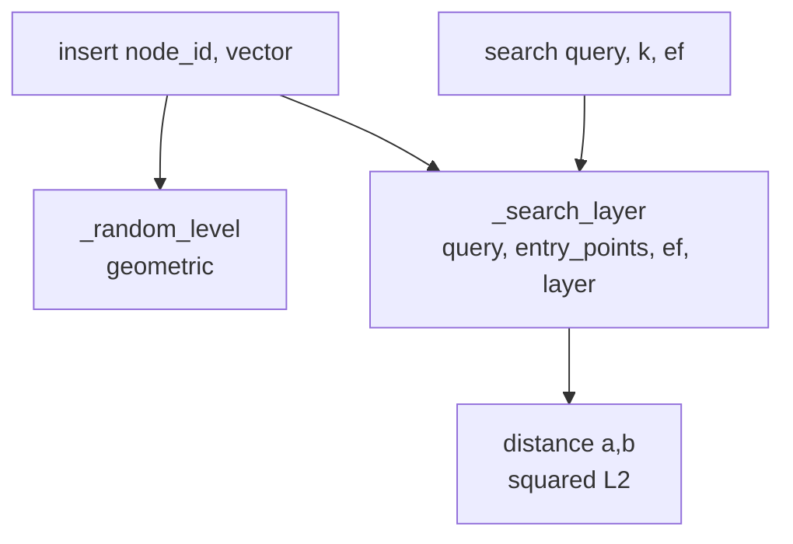

# HNSW From Scratch

A teaching implementation of HNSW (Hierarchical Navigable Small World) in pure numpy. The goal is to make every step of the paper readable. This is **not** optimized. A real library (`hnswlib`, FAISS) is 100x faster and handles edge cases. But this version mirrors the actual algorithm so you can SEE it work.

!!! tip "Rapid Recall"
    HNSW is a multi-layer proximity graph. Top layers are sparse with long edges (express lifts), bottom layer is dense with short edges (local streets). Build: each insert picks a random max-level (geometric distribution), greedy-descends to that level, then beam-searches `ef_construction` candidates at each remaining layer and connects to the M closest neighbors. Query: greedy-descend with `ef=1` through upper layers, then beam-search `ef` candidates on layer 0. Key params: `M` (16–32, neighbors per node), `ef_construction` (200, build quality), `ef` (50+, query recall).

## Two simplifications vs the real paper

Two production details are deliberately simplified (flagged inline):

1. **Neighbor selection.** We keep the M closest. The paper uses a smarter "heuristic" that also keeps diverse neighbors so the graph stays navigable.
2. **No neighbor-list pruning.** We don't prune a node's neighbor list when it gets over-connected.

## Function-call graph



## The full implementation

The module is `hnsw_from_scratch.py`. It uses only `numpy`, `heapq`, and `collections.defaultdict`.

### Imports and distance

```python
import numpy as np
import heapq
from collections import defaultdict


def distance(a, b):
    # Squared L2. Monotonic with L2, and cheaper (no sqrt). Fine for ranking.
    return np.sum((a - b) ** 2)
```

Squared L2 is used everywhere because it is monotonic with true L2 distance (ranks are identical) and avoids the square root, which is wasted work when you only care about ordering candidates.

### The HNSW class

```python
class HNSW:
    def __init__(self, M=16, ef_construction=200, ml=None, seed=42):
        self.M = M                          # links per node per layer
        self.M_max0 = 2 * M                 # layer 0 allows more links (denser bottom)
        self.ef_construction = ef_construction
        # ml controls how tall the hierarchy grows. 1/ln(M) is the paper's value.
        self.ml = ml if ml is not None else 1.0 / np.log(M)
        self.rng = np.random.default_rng(seed)

        self.vectors = {}                   # node_id -> vector
        self.graph = defaultdict(lambda: defaultdict(set))  # layer -> node -> {neighbors}
        self.entry_point = None             # node id of the top-of-hierarchy entry
        self.top_layer = -1
```

The dense bottom layer gets twice as many allowed links (`M_max0 = 2 * M`) because that is where most of the recall is recovered. `ml = 1 / ln(M)` is the paper's prescribed value for the geometric distribution that decides how tall the hierarchy grows.

### Random level assignment

```python
    def _random_level(self):
        # Geometric distribution: most nodes get level 0, few get high levels.
        # This is exactly the skip-list layer-assignment trick.
        return int(-np.log(self.rng.random()) * self.ml)
```

This is the exact skip-list trick. With probability `1/M` you go up one more layer; this produces a logarithmic hierarchy where the top layer has very few nodes that span long distances, perfect for "express lift" navigation.

### Greedy best-first search within a layer

```python
    def _search_layer(self, query, entry_points, ef, layer):
        """Greedy best-first search WITHIN one layer.
        Returns the ef closest nodes found, as a list of (dist, node_id)."""
        visited = set(entry_points)
        # candidates: min-heap by distance (closest to expand next)
        # results:    max-heap by distance (so we can pop the farthest to cap at ef)
        candidates = []
        results = []
        for ep in entry_points:
            d = distance(query, self.vectors[ep])
            heapq.heappush(candidates, (d, ep))
            heapq.heappush(results, (-d, ep))   # negate for max-heap behavior

        while candidates:
            dist_c, c = heapq.heappop(candidates)   # closest unexpanded candidate
            farthest_result = -results[0][0]        # current worst in results
            # If the closest remaining candidate is farther than our worst kept
            # result, no point continuing — greedy stop condition.
            if dist_c > farthest_result:
                break
            for neighbor in self.graph[layer][c]:
                if neighbor in visited:
                    continue
                visited.add(neighbor)
                d = distance(query, self.vectors[neighbor])
                farthest_result = -results[0][0]
                if d < farthest_result or len(results) < ef:
                    heapq.heappush(candidates, (d, neighbor))
                    heapq.heappush(results, (-d, neighbor))
                    if len(results) > ef:
                        heapq.heappop(results)      # drop the farthest, keep ef best
        # Return as (dist, id), closest first
        return sorted([(-nd, n) for nd, n in results])
```

Two heaps run side by side. `candidates` is a min-heap (smallest distance first) of nodes still to expand. `results` is a max-heap (negated distances) capped at `ef`, so we always keep the `ef` best candidates seen so far. The greedy stop condition (`if dist_c > farthest_result: break`) is what gives HNSW its sub-linear search time, once the closest remaining candidate is worse than the worst kept result, expanding further is wasted work.

### Insert

```python
    def insert(self, node_id, vector):
        self.vectors[node_id] = vector
        level = self._random_level()

        # First node ever: it becomes the entry point and we're done.
        if self.entry_point is None:
            self.entry_point = node_id
            self.top_layer = level
            for lyr in range(level + 1):
                self.graph[lyr][node_id] = set()
            return

        ep = [self.entry_point]
        # Phase 1: from the top of the hierarchy down to the node's own top
        # layer, just GREEDILY descend (ef=1) to find a good entry point.
        for lyr in range(self.top_layer, level, -1):
            ep = [self._search_layer(vector, ep, ef=1, layer=lyr)[0][1]]

        # Phase 2: from the node's top layer down to 0, do a wide search
        # (ef_construction) and connect to the M best neighbors at each layer.
        for lyr in range(min(level, self.top_layer), -1, -1):
            found = self._search_layer(vector, ep, self.ef_construction, lyr)
            # --- SIMPLIFICATION 1: keep M closest. Paper uses select_neighbors_heuristic. ---
            M_layer = self.M_max0 if lyr == 0 else self.M
            neighbors = [n for _, n in found[:M_layer]]

            self.graph[lyr][node_id] = set(neighbors)
            for nbr in neighbors:
                self.graph[lyr][nbr].add(node_id)   # bidirectional link
                # --- SIMPLIFICATION 2: real HNSW prunes nbr's list if it now
                #     exceeds M_max. We let it grow. Fine for small demos. ---
            ep = [n for _, n in found]              # carry candidates down a layer

        # If this node is taller than the current hierarchy, it's the new entry point.
        if level > self.top_layer:
            self.top_layer = level
            self.entry_point = node_id
```

Insertion has two phases. Phase 1 is a cheap greedy descent (`ef=1`) from the top of the hierarchy down to the new node's chosen top layer, just to find a good starting point. Phase 2 is the actual work, at every layer from the node's top down to layer 0 do a wide beam search (`ef_construction = 200`) and connect to the M best neighbors. Edges are bidirectional, so each new node also gets added to its neighbors' adjacency lists.

### Search

```python
    def search(self, query, k=5, ef=50):
        if self.entry_point is None:
            return []
        ep = [self.entry_point]
        # Descend the express layers greedily (ef=1) to get near the target.
        for lyr in range(self.top_layer, 0, -1):
            ep = [self._search_layer(query, ep, ef=1, layer=lyr)[0][1]]
        # Thorough search on the dense bottom layer.
        found = self._search_layer(query, ep, ef=max(ef, k), layer=0)
        return found[:k]   # list of (dist, node_id), closest first
```

Search mirrors insertion's phase 1, greedy descent through the express layers, then a wide beam search on layer 0 where most of the data lives. `ef` is the knob you tune for recall vs latency: higher `ef` = wider beam = better recall = slower.

### Sanity check / demo

```python
if __name__ == "__main__":
    rng = np.random.default_rng(0)
    N, dim = 2000, 32
    data = rng.random((N, dim)).astype(np.float32)

    index = HNSW(M=16, ef_construction=200)
    for i in range(N):
        index.insert(i, data[i])

    # Pick a random query, compare HNSW top-5 against brute-force top-5.
    q = rng.random(dim).astype(np.float32)

    approx = index.search(q, k=5, ef=50)
    approx_ids = [nid for _, nid in approx]

    brute = sorted(range(N), key=lambda i: distance(q, data[i]))[:5]

    print("HNSW  top-5:", approx_ids)
    print("Brute top-5:", brute)
    overlap = len(set(approx_ids) & set(brute))
    print(f"Recall@5: {overlap}/5 = {overlap/5:.0%}")

    # Measure recall over many queries to show it's reliably high.
    hits = 0
    Q = 200
    for _ in range(Q):
        q = rng.random(dim).astype(np.float32)
        a = {nid for _, nid in index.search(q, k=5, ef=50)}
        b = set(sorted(range(N), key=lambda i: distance(q, data[i]))[:5])
        hits += len(a & b)
    print(f"\nMean Recall@5 over {Q} queries: {hits/(Q*5):.1%}")
```

With 2,000 random vectors in 32 dimensions, this prints ~95%+ mean Recall@5, mirroring what real HNSW implementations achieve at production scale. That single number is why HNSW dominates 2026 vector-DB defaults.

## What this teaches you for interviews

- Why the hierarchy works: most nodes only need short edges; a small fraction with long edges lets you skip large distances quickly.
- Why `ef_construction` matters more than you might think: it is a quality knob baked into the graph at build time, and you cannot recover quality at query time if the graph was built with too-small `ef_construction`.
- Why HNSW is RAM-hungry: every edge is a pointer, and on layer 0 we allow `2M` neighbors per node, that storage is mostly graph, not vectors.
- Why soft-deletes degrade quality: deleting a node breaks edges that other nodes were relying on for navigation; without a rebuild, the graph becomes islanded.

See [ANN Algorithms](ann-algorithms.md) for HNSW vs IVF vs IVF-PQ tradeoffs and the production decision rules.
