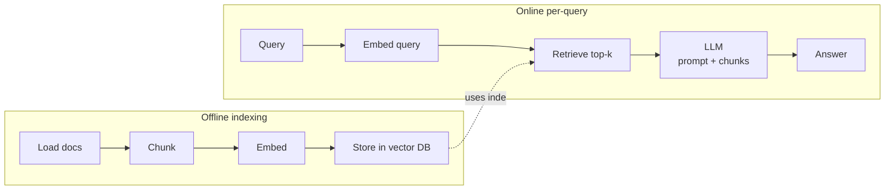
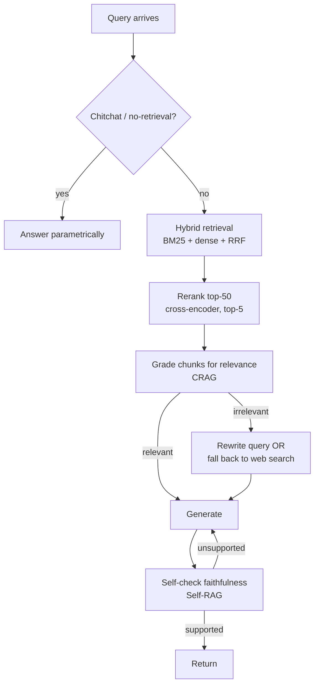

# RAG & Retrieval

The data pipeline that feeds the LLM. If the model is the brain, this layer is the library card, the Dewey Decimal system, the librarian, and the fact-checker all at once. Master this and you defend every RAG design decision in an interview.

!!! tip "Rapid Recall"
    RAG = **parametric memory** (LLM weights) **+ non-parametric memory** (retrieval index). Fine-tuning changes behavior; RAG changes knowledge. Standard 2026 production pipeline: load → chunk (recursive, 256–512 tokens, 10–20% overlap) → embed (BGE-M3 or OpenAI 3-small) → store (Qdrant or Pinecone) → embed query → retrieve (hybrid BM25 + dense, RRF-fused) → rerank (cross-encoder) → generate (with tight grounding prompt). Position best chunk at start, second-best at end, to defeat lost-in-the-middle. Evaluate with Ragas (faithfulness, answer relevancy, context precision, context recall) and gate every change in CI.

## Why RAG exists

LLMs have three problems that RAG was invented to solve:

1. **Stale knowledge.** GPT-5.4 doesn't know what happened yesterday, your company's internal docs, or your user's last support ticket.
2. **Hallucination.** When a model doesn't know, it confabulates. Grounding generation in retrieved evidence is the most reliable mitigation we have in 2026.
3. **Cost vs fine-tuning.** Fine-tuning costs and locks knowledge in weights. RAG keeps knowledge in a database you can update in seconds.

RAG = parametric memory (LLM weights) + non-parametric memory (your retrieval index). The whole sub-section is about how to make the non-parametric part not suck.

## The two kinds of memory

| | Parametric memory | Non-parametric memory |
|---|---|---|
| Where it lives | LLM weights | A retrieval index (vector DB, BM25, etc.) |
| How you update it | Fine-tune / re-train (slow, expensive) | Insert a row (cheap, instant) |
| How retrieval works | Forward pass through transformer | k-NN search, BM25 lookup |
| Provenance | None, model "just knows" | Each fact traces to a document |
| Hallucination risk | High when out-of-distribution | Lower, model has the source text in context |
| Token cost at inference | Free (already baked in) | Paid (retrieved chunks consume context) |

**RAG = use both.** The LLM provides reasoning, language fluency, and common sense. The retrieval index provides fresh, private, citable facts.

## When you'd pick each over RAG

- **Fine-tuning wins** when you want to change *behavior*, tone, format, refusal patterns, domain-specific reasoning style. You don't fine-tune to teach facts; you fine-tune to teach style.
- **Long context wins** for small, static corpora. If your knowledge base is a 50-page PDF and queries are rare, just stuff it in the context window. Gemini 3 Pro's 2M-token context makes this practical for collections under ~1M tokens. Revisit "do I actually need RAG?" quarterly as context windows grow.
- **RAG wins** when knowledge is large, changes often, requires citations, or contains data the LLM provider can't see (PII, IP, internal docs).

## The four pains RAG removes

1. **Stale data.** Model frozen at training cutoff. RAG queries are answered from a live index.
2. **Hallucination.** Model fabricates when uncertain. RAG injects ground truth into context.
3. **No citations.** Model can't tell you where it learned something. RAG returns the source chunks alongside the answer.
4. **Privacy.** You don't want to ship internal docs to OpenAI's training pipeline. RAG keeps docs in your DB; only retrieved snippets enter the prompt.

!!! note "Interview note"
    If asked "why not just fine-tune on our data?", the one-liner is: *Fine-tuning changes behavior, not knowledge. For knowledge, RAG is cheaper, faster to update, gives citations, and doesn't bake stale facts into weights.*

## The naive RAG pipeline, end to end

Before diving into 26 sections of optimization, here is the seven-step pipeline that every advanced technique is a refinement of.

The rest of this section: *each of these seven steps has a thousand failure modes; here is how to fix them.*

| Step | Page | Why it gets its own chapter |
|---|---|---|
| Load + Chunk + Embed + Store | [Foundations](foundations.md) | Format-aware loading, the chunking knob, embedding-model choice, vector DB tradeoffs |
| Embed query + Retrieve | [Retrieval Mechanics](retrieval-mechanics.md) | Sparse vs dense vs hybrid, RRF, similarity metrics |
| ANN inside the store | [ANN Algorithms](ann-algorithms.md) | HNSW, IVF, IVF-PQ, LSH, KD-tree, complexity, scale tiers |
| Rerank | [Reranking](reranking.md) | Cross-encoders, ColBERT, lost-in-the-middle, query transformations |
| Pattern selection | [Advanced RAG](advanced-rag.md) | HyDE, RAPTOR, Self-RAG, CRAG, GraphRAG, multimodal, agentic RAG |
| Code walkthrough | [HNSW From Scratch](hnsw-from-scratch.md) | A teaching numpy implementation of the HNSW paper |

## The mental model: RAG is search done well, plus an LLM stapled on

Here's the single most useful reframing for an AI engineer:

> **RAG is a search problem.** The "AI" part is the easy bit, any LLM can summarize five paragraphs into one answer. The hard part is finding *the right* five paragraphs. Everything that makes a RAG system good is something the search community has known since 1995.

This reframing has practical consequences:

1. **Information retrieval (IR) literature is your friend.** Hybrid retrieval, BM25, reranking, NDCG, MRR, all from IR, repurposed for LLMs.
2. **Bad retrieval cannot be fixed by a better LLM.** If your retriever returns garbage, even GPT-5.4 will produce garbage. Spend your eval budget on retrieval first.
3. **Garbage-in-garbage-out is brutal in RAG.** A good LLM with bad context is *worse* than a good LLM with no context, because it hallucinates with confidence.

### The three "levels" of RAG quality

| Level | What you have | What works | What breaks |
|---|---|---|---|
| **L1: Demo** | Naive pipeline | Looks great in a slide deck | Falls apart on multi-hop, exact-match queries, multilingual, anything weird |
| **L2: Production basic** | Hybrid retrieval + reranking + good chunking + eval harness | 90% of B2B chatbots | Multi-step reasoning, fast-changing data, cross-doc aggregation |
| **L3: Agentic / advanced** | LangGraph orchestration, CRAG, Self-RAG, query routing, GraphRAG where needed | Hard queries, high-stakes (medical, legal) | Latency, complexity, cost |

**Most production systems should aim for L2 and add L3 patterns only where eval shows they help.** "Premature sophistication kills velocity" — ship hybrid + rerank first, measure, add CRAG/Graph only when 20%+ of queries fail in ways those patterns specifically fix.

### The decision tree you'll internalize

Every node in that tree is a section on the pages that follow.

## 2026 Production Default Stack

1. **Chunking.** Recursive with token-aware splitter, parent-child for long docs.
2. **Embeddings.** BGE-M3 (open) or OpenAI text-embedding-3-small (managed).
3. **Vector DB.** Qdrant (self-hosted) or Pinecone (managed).
4. **ANN.** HNSW by default, IVF-PQ at billion-plus scale.
5. **Retrieval.** Hybrid (BM25 + dense) fused with RRF.
6. **Reranking.** BGE-reranker-v2 or Cohere Rerank.
7. **Advanced patterns.** Add HyDE for short queries, CRAG for grounding, Graph RAG only when entity-relational.

## Layer Checklist

- [ ] Can you explain all 5 chunking strategies and pick right one for a use case?
- [ ] Can you compute chunk count and storage inflation from doc length, size, overlap?
- [ ] Can you justify BGE-M3 vs OpenAI 3-small for a specific use case?
- [ ] Can you explain Matryoshka embeddings and storage implications?
- [ ] Can you pick the right vector DB for three scale/ops combinations?
- [ ] Can you explain HNSW hierarchy and its 3 tunable params?
- [ ] Can you explain IVF-PQ memory math for a billion-scale index?
- [ ] Can you write BM25 formula with correct k1/b intuition?
- [ ] Can you implement RRF in 10 lines and explain why it beats score fusion?
- [ ] Can you design a reranking pipeline with latency budget?
- [ ] Can you diagnose lost-in-the-middle and its fixes?
- [ ] Can you map each advanced RAG pattern to a specific failure mode?
- [ ] Can you defend flat hybrid RAG as the right MVP vs Graph RAG?
