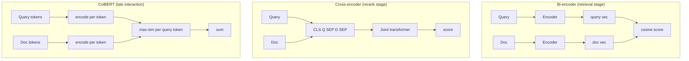

# Reranking and Query Transformation

Two-stage retrieval is *the* standard production architecture in 2026: fast first-stage retrieval (top-50/100) → slow but accurate reranker → top-K for the LLM. Cross-encoders are too slow for millions of docs, fast enough on short candidate lists.

!!! tip "Rapid Recall"
    **Cross-encoders** process query+doc jointly, catch interactions a bi-encoder misses (negation, phrase order, named-entity disambiguation). 50–200ms per 100 pairs on GPU. **BGE-reranker-v2-m3** is the 2026 self-host default, **Cohere Rerank 3.5** the managed default. **ColBERT** is a middle-ground "late interaction" approach when latency-bound. **Lost-in-the-middle**: LLMs attend to start and end of context, not middle, so place best at position 1 and second-best at the last position. **Query transforms**: HyDE for question/answer phrasing gaps, multi-query for brittle phrasings, step-back for narrow-question/broad-doc mismatches, decomposition for multi-hop.

## §10 — Reranking with cross-encoders

```
  query → [Stage 1: hybrid retrieval] → top-50 candidates →
        [Stage 2: cross-encoder rerank] → top-5 for the LLM
```

**Why two stages?** Cross-encoders are too slow to score every doc in your corpus (full transformer forward pass per query+doc pair, ~50ms each on GPU), but they're far more accurate than bi-encoders. Solution: use fast retrieval to narrow 10M docs down to 50 candidates, then use the slow-but-accurate cross-encoder on those 50.

### Why cross-encoders beat bi-encoders for ranking

A bi-encoder sees the query and the doc **separately**. It can't model fine-grained interactions:

- "What is **not** allowed?" vs "What is allowed?" — same vectors for both, different meaning.
- "Apple the company" vs "Apple the fruit" — bi-encoder needs context to disambiguate, cross-encoder gets the query AND doc side by side.

A cross-encoder concatenates `[CLS] query [SEP] doc [SEP]` and runs joint attention. Negation, phrase order, named-entity disambiguation, and exact-phrase matching all get handled.

### Bi-encoder vs cross-encoder vs ColBERT



### The 2026 reranker landscape

| Model | Type | Notes |
|---|---|---|
| **BGE-reranker-v2-m3** | Open weights, multilingual | The 2026 self-host default |
| **Jina reranker v2** | Open, multilingual | Strong for long docs |
| **Cohere Rerank 3.5** | Managed API | Top MTEB rankings, pay per 1K |
| **`cross-encoder/ms-marco-MiniLM-L-12-v2`** | Open, English | Tiny, fast, great baseline |
| **ColBERT v2 / PLAID** | "Late interaction" | Per-token embeddings; between bi- and cross-encoder in cost/quality |
| **LLM-as-reranker** | GPT-4o-mini, etc. | Flexible but expensive; rarely the right default |

### Lost-in-the-middle: why reranking changes what you do *after* it

[Liu et al. 2023](https://arxiv.org/abs/2307.03172) showed: **LLMs attend best to the start and end of context, worst to the middle.** In a 10-passage prompt, the 5th-6th passages might as well not be there.

Tactic after reranking:

- Put the best passage at position 1.
- Put the second-best at the **last** position.
- Fill the middle with the rest (or just keep fewer passages, 3-5 over 10).
- Measure sensitivity: shuffle positions in eval, see if quality drops.

```python
def position_best(reranked):
    """Best at start, 2nd-best at end, rest middle."""
    if len(reranked) < 3:
        return reranked
    return [reranked[0]] + reranked[2:] + [reranked[1]]
```

### Math

**MRR (binary relevance):** `MRR = (1/|Q|) × Σ (1 / rank_of_first_relevant(q))`

**NDCG@K (graded relevance):**

```
DCG@K = Σᵢ rel_i / log₂(i+1)
NDCG@K = DCG@K / ideal_DCG@K
```

### Implementation

```python
from sentence_transformers import CrossEncoder
reranker = CrossEncoder("BAAI/bge-reranker-v2-m3")
pairs = [(query, d["text"]) for d in candidates]
scores = reranker.predict(pairs, batch_size=32)
reranked = sorted(zip(candidates, scores), key=lambda x: -x[1])[:10]
```

### Rerank failure modes

| Assumption | Breaks when | Fix |
|---|---|---|
| Retrieval recall@K ≥ 95% | Reranker can't find what wasn't retrieved | Widen top-K, improve embeddings, fix chunking |
| Cross-encoder is in-domain | Out-of-domain quality cliff | Fine-tune on domain query+doc pairs |
| Latency budget allows 100 pairs | p99 spikes | Drop to 50 candidates, or use ColBERT/late-interaction |
| LLM attends to reranked order | Answer quality unchanged | Apply lost-in-the-middle positioning, measure |
| Cross-encoder scores discriminate | All scores cluster at 0.95+ | Out-of-domain model OR near-duplicate candidates → dedupe first |

!!! note "Interview note"
    *"Where does reranking fit?"* Always after retrieval, always before LLM. Standard pattern: retrieve 50-100, rerank to 5-10, position best at start + end. If asked *"why not use the cross-encoder directly?"* — cost. A cross-encoder over 10M docs is ~100 hours per query. The two-stage pattern is non-negotiable at any real scale.

### Cross-encoder architecture in more detail

A typical reranker — e.g. `cross-encoder/ms-marco-MiniLM-L-6-v2` — is a **distilled BERT (MiniLM)**: 6 transformer layers ("L-6"), hidden size 384, ~22M params, small and fast by design. The defining cross-encoder property is the *input*:

```
[CLS] query tokens [SEP] document tokens [SEP]
   → 6 MiniLM layers (joint self-attention)
   → take [CLS] final hidden state
   → linear head → single relevance score
```

Query and doc are concatenated into **one sequence**, so self-attention runs across both *jointly* at every layer — the model sees them *interacting*. That's why cross-encoders are far more accurate than bi-encoders (which encode separately and only compare at the end).

| | Bi-encoder (retrieval) | Cross-encoder (rerank) |
|---|---|---|
| Input | Query and doc separately | Concatenated, together |
| Output | Two vectors → cosine | One relevance scalar |
| Interaction | None until the end | Full attention every layer |
| Speed / use | Fast, retrieve over millions | Slow, rerank a shortlist |

Cross-encoders can't precompute (they need both inputs together) → can't run over the whole corpus → used as a **reranker** on ~20–50 candidates: retrieve cheap with bi-encoder, rerank precise with cross-encoder.

### Training and fine-tuning a reranker

- **Base**: MiniLM pretrained by *distillation* (student mimics a larger BERT or RoBERTa).
- **Reranker fine-tune**: on **MS MARCO** (real Bing queries + relevant/irrelevant passages) → the scalar head learns "relevance."
- **Adapting to your domain**: continue-train the ms-marco checkpoint on domain triplets `(query, positive, negative)` — crucially with **hard negatives** (topically similar but irrelevant). Random negatives teach little.

**When to fine-tune vs use off-the-shelf**: ms-marco generalizes well — a fully defensible default. Fine-tune when the general model **can't tell your relevant chunks from your hard negatives** — i.e. when *domain-specific relevance distinctions* are too subtle (e.g. a current rule vs a superseded near-identical one). The trigger is confusion about *what "relevant" means in your domain*, not "I want better ranking precision."

**Reranker as filter vs ranker**: using it to get the right chunks into a tight top-5–8 is *set selection* (precision filter), subtly different from fine-grained ordering. Within that small set, order matters *less* (the LLM reads all of them) but not zero — **position bias / "lost in the middle"** means the single most decisive chunk still belongs near the top. Say "ranking mattered less than set-membership *for my config*," never "ranking didn't matter."

**InfoNCE** — the standard contrastive loss for training embedding models that feed these systems. The "Info" is **Info**rmation; the "NCE" traces to **N**oise-**C**ontrastive **E**stimation. In practice it's a **cross-entropy over similarity scores** — pulls a positive pair together against a set of negatives.

### Decision Rule

Always add cross-encoder rerank in production. Switch to ColBERT if latency-bound. LLM rerank only after exhausting cross-encoder tuning.

## §10.5 — Query rewriting (the other side of the funnel)

Reranking is the highest-value **post**-retrieval step. **Pre**-retrieval rewriting fixes the *query* before it hits the retriever. The full picture:

```
Query → [PRE: rewrite / expand / decompose] → Retrieve → [POST: rerank / compress / filter / order] → LLM
```

Pre-retrieval moves (fix the query before it hits the retriever):

- **Conversational rewrite** — resolve pronouns into standalone queries ("what about its pricing?" → "Qdrant's pricing"). **Non-negotiable for chat** — retrieval is stateless and can't see the prior turn.
- **Multi-query** — generate paraphrases, retrieve each, merge with Reciprocal Rank Fusion. Highest-ROI for ambiguous queries.
- **Decomposition** — break multi-part questions into sub-queries (multi-hop, comparative).
- **HyDE** — write a fake answer, embed *that* (closer to answer-docs than the question).
- **Route by complexity** — don't over-rewrite simple queries (latency tax). Keep the original as a fallback.

Post-retrieval moves (what to actually do after the candidates land):

- **Reranking — the highest-value step.** Retrieve wide (top 50–100 via cheap bi-encoder), **rerank to narrow (top 3–5) with a cross-encoder** that scores `(query, doc)` jointly for precision. The recall-then-precision funnel.
- **Contextual compression** — trim chunks to query-relevant sentences (reduces "lost in the middle").
- **Dedupe + MMR diversity** — when near-duplicates flood the top.
- **Ordering** — LLMs attend best to start and end → put best chunks at the edges, not buried in the middle.
- **Relevance gating** — if top reranked result is below threshold, **abstain** ("I don't have that") rather than hallucinate.

## §11 — Query transformation: HyDE, multi-query, step-back, decomposition

Sometimes the problem isn't the index, it's the query. User queries are short, ambiguous, phrased as questions while docs are phrased as statements, or compound ("compare X vs Y on Z and W"). Four techniques fix four different query-side failures.

### HyDE (Hypothetical Document Embeddings)

**Problem solved**: queries are phrased as questions, docs are phrased as answers. The vectors don't align because question-phrasing and answer-phrasing live in different regions of embedding space.

**Trick**: ask the LLM to *hallucinate* an answer to the query, then embed that hallucinated answer (not the query) and retrieve against the real docs. The fake answer is question-shaped in meaning but answer-shaped in surface form, it matches real docs better.

```
query: "What does HNSW stand for?"
       ↓ LLM("Write a passage that answers: What does HNSW stand for?")
fake passage: "HNSW stands for Hierarchical Navigable Small World, a graph-based ANN algorithm..."
       ↓ embed the fake passage
       ↓ retrieve against real docs
real docs that talk about HNSW (in answer form) match perfectly.
```

```python
def hyde_retrieve(query, llm, embedder, vdb, k=10):
    hypo = llm.complete(f"Write a passage answering: {query}", max_tokens=200)
    return vdb.search(embedder.embed(hypo), k=k)
```

Cost: +1 LLM call per query (~300-500ms). Skip under tight latency budget; great for short ambiguous queries.

### Multi-query expansion

**Problem solved**: a single phrasing of the query is brittle. The LLM rewrites it 3-5 ways, you retrieve for each, fuse with RRF.

```
"How to get refund?"
   → "What is the refund process?"
   → "How long do refunds take?"
   → "What's your return policy?"
   → retrieve top-10 for each, RRF-fuse
```

Catches docs you'd miss with any single phrasing. Cost: 1 LLM call + 4x retrieval. **The simplest "agentic" technique that actually works.**

### Step-back prompting

**Problem solved**: question is too specific, retrieving on it misses the surrounding concept.

```
specific query: "Did Einstein win the Nobel Prize in 1921?"
       ↓ LLM step-back: "What did Einstein win and when?"
       ↓ retrieve on step-back query (broader)
       ↓ then answer the specific query using the broader context
```

Useful when your docs are encyclopedic (Wikipedia-like) and queries are needle-in-haystack.

### Query decomposition

**Problem solved**: multi-hop questions ("What was the revenue of the company that acquired Figma?")

```
"What was the revenue of the company that acquired Figma?"
       ↓ decompose
       Sub-question 1: "Who acquired Figma?"  → "Adobe"
       Sub-question 2: "What is Adobe's revenue?" → "$21.5B (FY2024)"
       ↓ compose final answer
```

This is the entrance ramp to agentic RAG.

### Query transformation decision rules

| Technique | When to use | When to skip |
|---|---|---|
| **HyDE** | Short queries, question-vs-statement gap, dense retrieval dominates | Tight latency budget; BM25-only systems (no embedding gap to fix) |
| **Multi-query** | Cheap insurance against brittle phrasings | High QPS; cost-sensitive (4x retrieval) |
| **Step-back** | Encyclopedic docs, narrow questions | Already-broad queries; FAQ-style docs |
| **Decomposition** | Multi-hop, "compare X and Y" questions | Single-fact lookups; latency-bound |

!!! warning "Interview trap"
    *"You added HyDE and quality dropped."* Possible cause: the LLM hallucinated a passage with the wrong facts; embedding that hallucination retrieved docs about the wrong topic. **Fix**: keep both the original query AND the hypothetical, retrieve for both, RRF-fuse. Don't replace the query, augment it.

## Interview Questions

**Q9: Explain lost-in-the-middle and how reranking interacts.**

LLMs attend more to start and end of context than middle. Top-10 passages in order → 5th-6th effectively ignored. Fix: put best at position 1, 2nd-best at last, rest middle. Also: fewer passages. Test sensitivity by shuffling in eval.

**Q10: Cross-encoder scores all 0.95–0.99 for every candidate. What's wrong?**

Model isn't discriminating. Either candidates all genuinely relevant (unlikely at top-100), or model saturated. Likely: out-of-domain model or near-duplicate candidates (chunked versions of same doc). Fix: dedupe before rerank, or fine-tune on domain.

**Q11: When would you use HyDE vs query expansion?**

HyDE: generates full hypothetical answer, embeds. Query expansion: adds synonyms/related terms. HyDE wins when phrasing gap is big (questions vs statements). Expansion wins when queries are short and need more terms for BM25. Rule: HyDE for dense, expansion for sparse.

---
