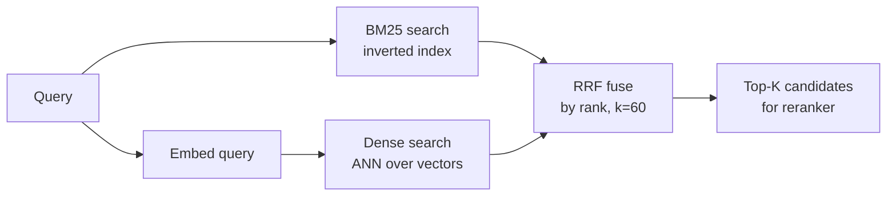

# Retrieval Mechanics: Sparse, Dense, Hybrid

The indexing pipeline is amortized; the retrieval pipeline runs *every single query*. Latency budget here is tight (often <500ms before generation starts). This is where production RAG differentiates from demo RAG.

!!! tip "Rapid Recall"
    Three paradigms. **Sparse (BM25)** wins on exact terms, IDs, code, error codes; loses on paraphrase. **Dense (embeddings)** wins on semantic similarity, paraphrase, multilingual; loses on exact identifiers. **Hybrid (RRF-fused)** wins everywhere and is the 2026 production default. RRF: `score(d) = Σ 1/(k + rank_i(d))`, `k=60`. Score-agnostic so it works without normalizing BM25 vs cosine score distributions. For normalized vectors, cosine ≡ dot ≡ L2; pick dot for speed. Always normalize and use dot.

## §8 — Similarity metrics

Once you have query and doc as vectors, you need a number for "how similar are they?" Three candidates, only two matter in practice.

### Cosine similarity

$$\cos(u, v) = \frac{u \cdot v}{\|u\|\,\|v\|}$$

Range `[-1, 1]`. Measures the **angle** between vectors, direction matters, magnitude doesn't. The 2026 default for text embeddings because:

1. Most embedding models are trained with cosine loss.
2. Document length differences inflate magnitude; cosine normalizes that out.

### Dot product

$$u \cdot v = \sum_i u_i v_i$$

If vectors are L2-normalized (`||u|| = ||v|| = 1`), **dot product == cosine similarity** but cheaper to compute (skip the norms). **Always normalize and use dot product** unless your library forces a choice, saves ~30% per query.

### Euclidean (L2) distance

$$\|u - v\|_2 = \sqrt{\sum_i (u_i - v_i)^2}$$

Smaller is better, opposite direction from cosine. **Equivalent to cosine for normalized vectors** (monotonic transform of each other). Sometimes appears in FAISS index types, just know it's equivalent if you normalize.

### When does the choice matter?

For normalized text embeddings: **cosine ≡ dot product ≡ L2.** Pick whichever your library is fastest on (usually dot product). For unnormalized vectors, cosine and L2 give different rankings, bugs caused by this kill weeks. **Always normalize.**

!!! note "Interview soundbite"
    *Cosine and dot product are the same for normalized vectors, and L2 is monotonically related. The choice doesn't change rankings, it only changes computation cost. I always normalize and use dot product.*

### The full distance-metric family — Minkowski's knob

The Lp distances are one formula with a knob; cosine sits outside it.

```
Minkowski:   L_p(x, y) = ( Σ |xᵢ − yᵢ|ᵖ )^(1/p)
  p=1 → L1 (Manhattan)   sum of absolute diffs
  p=2 → L2 (Euclidean)   straight-line, squared penalty
  p=∞ → L∞ (Chebyshev)   max|xᵢ − yᵢ|, only the worst dim
```

As `p` rises, you weight the largest coordinate diff more and ignore small ones. **Low p spreads attention across all dims; high p focuses on the worst.** Cosine is separate — it measures angle only, magnitude-blind.

| Metric | Penalizes | Use when |
|---|---|---|
| **Cosine** | Angle only (magnitude-blind) | Direction = meaning, magnitude irrelevant — *almost all embeddings* |
| **L2** | Large deviations (squared) | Magnitude matters; smooth geometric space |
| **L1** | All deviations linearly | Outlier robustness; high dimensions |
| **L∞** | Only the worst dim | Any single dim out of tolerance (constraints) |
| **Dot product** | Alignment + magnitude | Magnitude is meaningful (popularity, confidence) |

**The crucial AI reality**: for embeddings, **use the metric the model was trained under** (usually cosine or dot product) — this overrides taste. On *normalized* vectors, cosine and L2 give identical rankings (`‖a − b‖² = 2 − 2·cos` for unit vectors), so the real decision is "do I normalize?" L1 and L∞ rarely suit dense neural embeddings; they earn their keep in classical ML and constraint-satisfaction. High-D distance concentration is also why cosine and normalized-dot win in practice — angle stays discriminative when raw distances concentrate.

## §9 — Hybrid retrieval: BM25 + dense, fused with RRF

Dense retrieval (embeddings + cosine) has a weakness: **it can't reliably match exact terms.** Queries with SKUs, error codes, API names, person names, technical jargon — these need *literal* word matching. That's what sparse retrieval (BM25) was designed for.

### BM25 in one breath — TF-IDF, plus two fixes

Start from **TF-IDF**: score per term per document = TF × IDF, summed over query terms.

- **TF** = term frequency in *this* doc (how much it's about the term).
- **IDF** = rarity across all docs: `IDF(t) = log(N / df(t))`. `N` = total docs, `df(t)` = docs containing `t`. The log compresses the curve — without it, IDF grows linearly and over-rewards ultra-rare terms. A term in every doc → `N/df = 1` → `log(1) = 0` → contributes nothing. **High TF-IDF = frequent here, rare elsewhere = distinctive.**

**BM25** is the 25th refinement of the Okapi probabilistic relevance model — same TF-IDF skeleton, with two corrections. The "weird terms" are the knobs implementing them:

$$\text{BM25}(q, d) = \sum_{t \in q} \text{IDF}(t) \cdot \frac{f(t, d) \cdot (k_1 + 1)}{f(t, d) + k_1 \cdot \left(1 - b + b \cdot \frac{|d|}{\text{avgdl}}\right)}$$

- **Fix 1 — TF saturates** (via `k1 ≈ 1.2–2.0`): repeated terms hit diminishing returns instead of growing linearly. Spamming a keyword stops helping. **The biggest behavioral difference from TF-IDF.**
- **Fix 2 — length normalization** (via `b ≈ 0.75`): documents longer than the corpus's `avgdl` get discounted so they don't win just by being long. `b = 0` ignores length entirely; `b = 1` is full normalization.

Interview line: "BM25 is TF-IDF with two corrections — term frequency saturates so spamming a keyword stops helping, and it normalizes for document length so long docs don't win by length alone. `k1` tunes saturation, `b` tunes the length penalty. That's why BM25 is the production-default lexical scorer — the fixes match how relevance actually behaves."

**BM25 wins on**: exact terms, identifiers, error codes, named entities. It's fast (inverted index, microseconds), interpretable (you can see *why* a doc matched), and zero training needed.

**BM25 loses on**: synonyms ("car" ≠ "automobile"), paraphrase ("how to refund" ≠ "money-back policy"), multilingual (Hindi query against English docs goes nowhere).

### What about Elasticsearch and Lucene?

These names dominate JDs and infra discussions, so worth being precise:

- **Elasticsearch** is fundamentally a **BM25 lexical / full-text search engine** (and distributed document store) — *not* natively a hybrid. It dominated full-text search for over a decade (site search, e-commerce, the **ELK stack** for logs). Modern versions (8.x+) *added* dense vector + ANN (HNSW), so you *can* now do BM25 + vector hybrid in it — but its DNA is keyword search, vectors bolted on later. **OpenSearch** is the open-source fork after a license change; usually interchangeable.
- **Apache Lucene** is the foundational **Java search library** — the actual engine that builds the inverted index, runs BM25, and now stores vectors + HNSW. Not run alone; products are built on it. **Lucene is the engine; Elasticsearch / OpenSearch / Solr are the distributed cars built around it.** When people say Elasticsearch "is BM25 under the hood," that implementation literally *is* Lucene.

For RAG choice: dedicated vector DBs can be leaner for pure-vector workloads; Elasticsearch's pitch is mature lexical + vector + filtering in one scalable system you may already run.

### Why hybrid wins

Dense and sparse retrieval **fail in different ways**. Their failure modes are largely uncorrelated. Combine them and you get the union of what both catch:

| Query type | BM25 | Dense | Hybrid |
|---|---|---|---|
| "iPhone 15 Pro warranty" (exact terms) | ✓ | ✗ (Pro might match Pro Max) | ✓ |
| "How do I get my money back?" (paraphrase) | ✗ | ✓ | ✓ |
| "What's the refund policy?" + product code | ~ | ~ | ✓ |
| Code search: `useState` | ✓ | ✗ | ✓ |
| Hindi query → English docs | ✗ | ✓ (with multilingual model) | ✓ |

### Sparse vs dense vs hybrid pipeline



### Reciprocal Rank Fusion (RRF), how you actually combine them

The naive idea: take dense score + BM25 score → rank. **This is wrong.** Dense scores live in `[0, 1]` (cosine), BM25 scores are unbounded and log-distributed (a "good" BM25 score might be 8, a "great" one might be 30). Normalizing across them is fragile and varies per query.

RRF sidesteps this. It uses **ranks**, not scores:

$$\text{RRF}(d) = \sum_{i} \frac{1}{k + \text{rank}_i(d)}$$

where `rank_i(d)` is the rank of doc `d` in retriever `i`'s output, and `k=60` is a smoothing constant. Doc `d` ranked #1 in dense and #5 in BM25 gets `1/61 + 1/65`. Score-agnostic, robust, ~5 lines of code.

```python
def rrf_fuse(ranked_lists, k=60):
    scores = {}
    for lst in ranked_lists:
        for rank, doc_id in enumerate(lst, 1):
            scores[doc_id] = scores.get(doc_id, 0) + 1 / (k + rank)
    return sorted(scores.items(), key=lambda x: -x[1])

final = rrf_fuse([dense_retrieve(q, 50), bm25_retrieve(q, 50)])[:10]
```

!!! warning "Trap"
    *"Why not just learn weights α · dense + (1 - α) · BM25?"* You can, and that's called *learned sparse-dense fusion*. But: (1) you need labeled data, (2) optimal α shifts per query type, (3) the score distributions still need normalizing. RRF works zero-shot and is robust. Reach for learned fusion only with eval-on-domain data.

### Failure modes

| Assumption | Breaks | Fix |
|---|---|---|
| Query has exact-match signal | BM25 empty on paraphrase | Hybrid |
| Query long enough to embed well | Dense noisy on 1-2 word queries | Query expansion or BM25-first |
| BM25 params tuned | Defaults mediocre on domain corpora | Grid-search k1, b |

### Data diet

- Tokenize BM25 for your language (ICU for Indian scripts, regular for English).
- Don't strip stopwords from queries to dense, embeddings need them.
- Stemming: run only on BM25 path.

### Parallel retrieval

BM25 and dense retrieval are independent. Run them in parallel, not serial. With `asyncio.gather()` you save the slower one's time entirely.

```python
import asyncio
bm25_task = asyncio.to_thread(bm25_search, query, 50)
dense_task = asyncio.to_thread(dense_search, query, 50)
bm25_hits, dense_hits = await asyncio.gather(bm25_task, dense_task)
# Time = max(bm25, dense), not bm25 + dense
```

### Decision rule

Always start hybrid in production. Tune weights only if eval shows one path dominates.

## Interview Questions

**Q7: Why is RRF preferred over weighted score fusion?**

BM25 scores unbounded and log-distributed; cosine scores 0–1. Normalizing across retrievers is fragile (per-query variance). RRF uses ranks only, score-agnostic, robust. Weighted score fusion requires hand-tuning per retriever and breaks when score distributions shift.

**Q8: Multilingual corpus (English + Hindi + Hinglish). Design retrieval.**

Multilingual embedding (BGE-M3) for dense. Per-language tokenized BM25 (ICU tokenizer for Devanagari). Run dense across all, BM25 per-language, fuse with RRF. For Hinglish specifically, dense dominates because BM25 chokes on transliteration.

---
