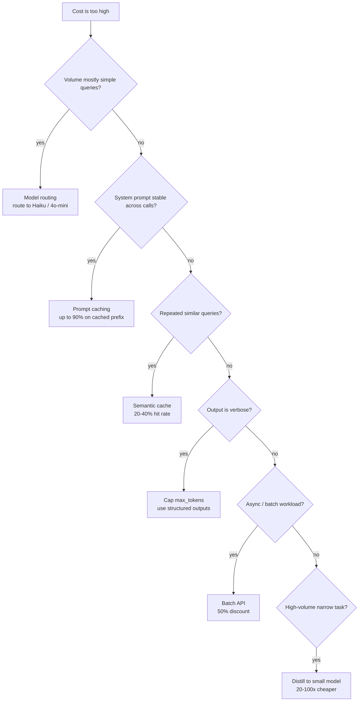

# Cost & Token Economics

LLM systems are expensive to run. A mid-size production deployment easily hits $50K-500K/month. Knowing the levers is table stakes.

!!! tip "Rapid Recall"
    **Output tokens are 4-5x input tokens in price**, this asymmetry drives many optimizations. **Seven levers** ranked by typical impact: model routing (3-5x), prompt caching (up to 90% on cached prefixes), output cap + structured outputs (20-40%), semantic caching (20-40% hit rate in mature systems), context trimming (10-20%), batch API for async (50% off), distillation for high-volume narrow tasks (20-100x). **FP8** is the 2026 quantization default on H100+ hardware. **Always include ops cost in self-host vs API math**; break-even is around 10-50M tokens/day on stable workloads.

## §1.1 Token Economics

Every provider charges per million tokens, split into input and output prices. Typical 2026 pricing (per M tokens):

| Model class | Input | Output | Use case |
|---|---|---|---|
| Frontier (Opus 4.7, GPT-5) | $15-20 | $75-100 | Complex reasoning, tough edge cases |
| Mid-tier (Sonnet 4.6, GPT-5 mini) | $3 | $15 | Production default |
| Small (Haiku 4.5, GPT-5 nano) | $0.25-1 | $1.25-5 | Routing, classification, simple tasks |
| Embedding | $0.02-0.13 | — | Retrieval |

**Output tokens are 4-5x input tokens in price.** This asymmetry drives many optimizations.

## §1.2 The Seven Levers

### Cost-lever decision tree



### 1. Model Routing

Cheap model for simple queries, expensive for complex. Router is a small classifier (rules or tiny LLM) that decides.

```python
def route(query):
    if is_simple_factual(query):   return "haiku"
    if needs_reasoning(query):     return "sonnet"
    if complex_multi_step(query):  return "opus"
    return "sonnet"  # default
```

Typical savings: 3-5x cost reduction. Requires good router, bad routing = worse quality AND cost.

### 2. Prompt Caching

Providers cache large static prompts (system prompt, few-shot examples, large context). Subsequent requests reusing cached prefix are 10-90% cheaper.

- **Anthropic:** up to 90% discount on cached input tokens, 5-minute TTL.
- **OpenAI:** automatic caching for prompts >1024 tokens, ~50% discount.
- **Google:** explicit context caching API, varies by model.

**Architecture implication:** design system prompts to be stable, place dynamic content at the end.

### 3. Semantic Caching

Cache LLM responses keyed by query embedding. Similar queries (cosine > 0.95) hit the cache.

```python
def cached_complete(query, llm, cache_db):
    vec = embed(query)
    hit = cache_db.search(vec, threshold=0.95)
    if hit: return hit.response
    resp = llm.complete(query)
    cache_db.upsert(vec, resp)
    return resp
```

**Works well for:** FAQ-style queries, common customer support questions.
**Fails for:** personalized responses, stateful conversations.
**Typical savings:** 20-40% of queries hit cache in mature systems.

### 4. Context Trimming

Reduce input tokens:

- Top-K = 3-5 instead of 10 in retrieval.
- Summarize old messages instead of appending verbatim.
- Strip unnecessary boilerplate from system prompts.

Every 1K input tokens saved = direct $$ back. Measure and reduce.

### 5. Output Constraint

Cap `max_tokens` aggressively. For structured outputs, use JSON mode or schema constraints so the model doesn't ramble.

Output tokens are 4-5x input price, output reduction is the highest-leverage lever.

### 6. Batch Processing

For async workloads (overnight eval, bulk enrichment), batch APIs offer 50% discount (Anthropic, OpenAI).

```python
# OpenAI batch API
batch = client.batches.create(
    input_file_id=file.id,
    endpoint="/v1/chat/completions",
    completion_window="24h",  # up to 24h latency for 50% off
)
```

### 7. Distillation

Fine-tune a small model (Llama 8B, Mistral 7B) on outputs from a frontier model. For high-volume narrow tasks (classification, extraction, specific Q&A), distilled models hit 90%+ of frontier quality at 20-100x lower cost.

Self-host the distilled model on vLLM for bare-metal economics.

## §1.3 Quantization for Self-Hosted

For self-hosted models, quantization reduces VRAM and inference cost.

| Quantization | Memory | Quality loss | When to use |
|---|---|---|---|
| FP16 | baseline | 0% | Default for training |
| FP8 | 2x reduction | <1% | Modern inference on H100+ |
| INT8 | 2x reduction | ~1-3% | Cost-sensitive deployment |
| INT4 / AWQ / GPTQ | 4x reduction | 2-5% | Edge, consumer GPU |
| NVFP4 | 4x reduction | ~1% | Newest on Blackwell GPUs |

FP8 is the 2026 default for production inference on H100/H200 hardware.

## §1.4 Cost Dashboard

Track daily:

- Total spend by model
- Tokens by endpoint
- Cost per query (weighted avg)
- Cache hit rate
- Cost per resolved task (for customer-facing products)
- Anomaly detection on spikes

Hook Langfuse or LangSmith to auto-aggregate.

## Output Token Economics (the math)

A query with 800 input tokens (context) + 150 output tokens on Claude Sonnet 4.6 = ~$0.005 per query. **At 100K queries/day, that's $500/day = $15K/month just for the answering LLM.**

**Levers to pull (in order of leverage):**

1. **Use a smaller LLM where possible.** Haiku 4.5 at 1/10th the cost; route hard queries to Sonnet, easy ones to Haiku (Adaptive RAG idea).
2. **Compress context.** Fewer/shorter chunks → fewer input tokens. Reranking lets you drop from top-10 to top-3.
3. **Prompt caching.** 90% discount on cached prefixes.
4. **Semantic cache.** Skip the LLM entirely on repeat queries.
5. **Limit output tokens.** Long ramble = $$. Use `max_tokens` aggressively.

## Caching for Consistency

Three layers of cache stack:

| Layer | What it caches | Hit rate |
|---|---|---|
| **Embedding cache** | `query → embedding` (the cheapest win) | High for repeat queries |
| **Semantic cache** | `query_embedding → answer` (cosine > 0.95) | 20-40% in mature systems |
| **Prompt prefix cache** | Provider-level KV cache for stable prefixes | Up to 90% off the cached portion |

```python
# Pattern: embedding cache
def cached_embed(query, ttl=86400):
    key = f"emb:{hashlib.sha256(query.encode()).hexdigest()}"
    if (cached := redis.get(key)):
        return pickle.loads(cached)
    emb = embedder.encode(query)
    redis.setex(key, ttl, pickle.dumps(emb))
    return emb
```

**Cache invalidation gotcha**: when you change embedding model, **bump the cache key prefix** (`emb_v2:...`). Don't forget this — it's the #1 source of embedding-cache bugs.

**What NOT to cache**:

- Answers based on stale retrievals (your knowledge base changed)
- Per-user personalized answers (cache key must include user ID)
- Answers to questions where freshness matters (news, prices, schedules)

### Semantic vs prompt caching — they solve *different* problems

A trap hides in the question "do we cache for consistency or for cost?" The two cache types attack different problems. **Semantic caching helps consistency; prompt caching helps latency / cost only.**

**Semantic caching — the consistency tool.** Keys responses by the query's *embedding*. New query → embed → vector similarity search → above threshold → return the cached response. "What's your refund policy?" and "How do refunds work?" embed nearby → both get the *same stored answer* → consistency enforced because paraphrases collapse to one response. **The trap is false cache hits**: loose threshold → wrong answers served confidently. Embeddings are blind to *negation* ("is X allowed" vs "is X not allowed" sit very close). Tight threshold → low hit rate. The whole game is threshold tuning. Great for FAQ / bounded domains, dangerous for high-stakes specifics.

**Prompt caching — NOT a consistency tool.** Caches the *KV cache of a shared prefix* (intermediate computation), not the output. After loading the prefix, the model still samples and decodes fresh → with `temperature > 0`, two requests on the same cached prefix can still diverge. It buys latency and cost, nothing about output sameness.

| Lever | What it fixes |
|---|---|
| Exact-match cache (hash full prompt) | Identical inputs → same output. The *only* true determinism guarantee. |
| Semantic cache | Similar inputs → same output |
| `temperature=0` | Reduces (not eliminates) variance |
| Structured output / schema | Format consistency |

**Subtle point**: `temperature=0` ≠ deterministic on real stacks — batched GPU matmuls aren't associative, MoE routing depends on batch composition → tiny logit diffs flip the argmax. Exact-match caching is the only hard guarantee.

### Redis — what it actually is and when you reach for it

**RE**mote **DI**ctionary **S**erver — an in-memory key-value store: a fast, shared, networked dictionary. Two defining properties:

- **In-memory** → microsecond reads (no disk seek); RAM-limited and (by default) volatile → for data you want *fast* and can afford to lose or regenerate.
- **A server** → many app instances hit one shared store, persistent across restarts (beats an in-process dict that dies with the process and isn't shared).

Complexity: easy to use (`r.set(k, v, ex=3600)` — the `ex` TTL auto-expiry is 80% of caching value), one-command setup (`docker run redis`), no schema. The "complicated" reputation is *production ops* (clustering, replication, failover, eviction tuning), not using it.

When you need it for AI / RAG specifically:

- **Semantic / LLM response caching (the big one)** — cache answers to repeated questions. Exact-match (same query string) or *semantic* (embed query, return a cached answer if similar enough). Cuts LLM cost + latency on hot queries.
- **Embedding cache** — `text → embedding`, avoid re-embedding.
- **Rate limiting / session state / general app caching** — why Redis shows up in every JD.

**The hard part is invalidation.** Caching is an optimization you add when a specific repeated-cost shows up — not "because best practice." And in a policy or correctness domain, a stale cached answer = serving a wrong (superseded) rule. So caching *must* include **TTL + invalidation tied to document updates**. Caching the right thing is easy; knowing *when to throw the cache away* is the senior signal.

## Interview Questions

**Q1: Name five concrete levers to reduce LLM costs and rank their typical impact.**

(1) Model routing (cheap for simple, expensive for complex): 3-5x reduction. (2) Prompt caching: up to 90% on cached tokens, 30-50% overall if prompts stable. (3) Output cap + structured outputs: 20-40% reduction. (4) Semantic caching for FAQ-style queries: 20-40% hit rate. (5) Context trimming (smaller top-K, summarize history): 10-20%. (6) Distillation for high-volume narrow tasks: 20-100x reduction. (7) Batch API for async: 50% off. Router is highest impact in most systems.

**Q9: Your cost dashboard shows a 3x spike this morning. Investigate.**

Check attribution: which endpoint, which model, which user/tenant? Common causes: (1) buggy client in retry loop. (2) Prompt change that blew up input size (e.g., context not trimmed). (3) Model routing degraded, everything going to expensive model. (4) Cache hit rate dropped (cache invalidation, TTL issue). (5) Abuse, single user or bot hitting rate limits. (6) Provider pricing change, check recent announcements. Rollback recent deploys if timing matches; rate-limit offending user; add alert for future.

**Q11: Trap — candidate proposes running all inference through the frontier model.**

Unnecessary and expensive. Route by complexity: simple classification/routing → Haiku or smaller. Most conversation → Sonnet. Frontier reserved for hard edge cases (<10% of traffic). Frontier-for-everything = 10-20x higher bill with marginal quality gain on easy queries. Design the router. Measure quality gain of frontier vs cheaper on held-out eval, justify with numbers.

**Q13: Why is output-token cost reduction more impactful than input-token cost reduction?**

Output tokens cost 4-5x more than input at most providers. Plus, output dominates user-perceived latency and context length for follow-up turns. So capping `max_tokens`, using structured outputs, or distilling to a smaller model for output-heavy tasks gives outsized returns. Input reduction (smaller context, trimming system prompts) still matters but has smaller dollar impact per saved token.

---
