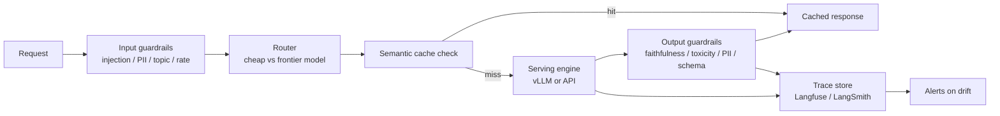

# Serving, Infra & Guardrails

The operational layer: ensuring the system doesn't bankrupt the company, leak data, or go down at 3am. Where applied scientists become legitimate systems engineers.

!!! tip "Rapid Recall"
    **Seven cost levers**, ranked by impact: model routing (3-5x), prompt caching (up to 90% on cached prefixes), output cap + structured outputs, semantic caching, context trimming, batch API (50% off), distillation. **vLLM** is the 2026 default serving engine; PagedAttention + continuous batching = 2-23x throughput. **FP8** is the modern quantization default on H100+. **Four serving modes**: sync (one user), async (concurrent), streaming (TTFT matters), background (long jobs). **Observability** = traces with per-span input/output/cost; **alert on** p95 latency, error rate, cost-per-query, CSAT, hallucination rate. **Guardrails are defense in depth**: input (PII, injection, topic, rate), output (faithfulness, toxicity, PII redaction, schema), execution (step limits, cost limits, HITL, confidence escalation).

## The production stack at a glance

## Section guide

| Page | Covers |
|---|---|
| [Cost & Token Economics](cost.md) | Token economics, the seven levers, model routing, quantization, cost dashboard |
| [Inference Stack](inference-stack.md) | vLLM, PagedAttention, continuous batching, parallelism strategies, alternative engines, hardware cost |
| [Serving Modes](serving-modes.md) | Sync, async, streaming, background jobs; state stores and durable execution |
| [Observability](observability.md) | Tracing, alerts, feedback loops, shadow traffic |
| [Guardrails](guardrails.md) | Input, output, execution guardrails; jailbreak defenses; privacy and compliance |

## Layer Checklist

- [ ] Can you list seven cost-reduction levers ranked by impact?
- [ ] Can you explain PagedAttention and continuous batching in 90 seconds each?
- [ ] Can you configure vLLM for a production deployment?
- [ ] Can you calculate break-even volume for self-hosting vs API?
- [ ] Can you compare FP16, FP8, INT8, INT4 quantization tradeoffs?
- [ ] Can you design comprehensive guardrails (input, output, execution)?
- [ ] Can you defend against 3 specific prompt injection attack patterns?
- [ ] Can you design a feedback loop from user thumbs-down to eval set?
- [ ] Can you investigate a cost spike systematically?
- [ ] Can you design multi-provider failover for provider outages?
