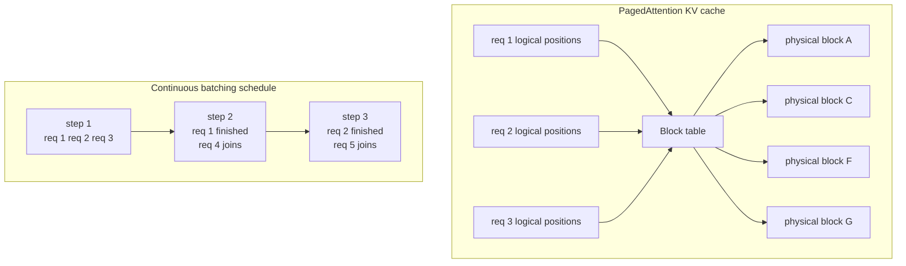

# Inference Stack: vLLM, PagedAttention, Batching, Parallelism

When you self-host. Skip for API-only deployments, but Tier-1 interviews probe this.

!!! tip "Rapid Recall"
    **vLLM** is the 2026 default open-model serving engine. **PagedAttention** treats KV cache like OS virtual memory (fixed-size blocks, non-contiguous), drops memory waste from 60-80% to under 4%. **Continuous batching** schedules per-decode-step instead of per-batch, freeing finished requests immediately, up to 23x throughput vs static batching. **Tuning order**: continuous batching (on by default) → raise `--gpu-memory-utilization` to 0.95 → enable chunked prefill for p95 TTFT. **Parallelism**: tensor parallel within a node, data parallel across nodes; pipeline parallel only when interconnect is slow; expert parallel for MoE; context parallel only for >1M token contexts. **Break-even** for self-host vs API is ~10-50M tokens/day on stable workloads.

## §2.0 The split that explains every optimization: prefill vs decode

Before vLLM, batching, or anything else makes sense, internalize this one asymmetry. LLM inference has two phases with **opposite hardware profiles**:

<figure class="diagram diagram-dark" markdown="0">
<svg viewbox="0 0 720 200" xmlns="http://www.w3.org/2000/svg">
        <text x="360" y="22" text-anchor="middle" class="svg-title">PREFILL vs DECODE — opposite hardware profiles</text>
        <rect x="50" y="48" width="290" height="130" rx="10" fill="rgba(95,179,168,0.07)" stroke="#5fb3a8"/>
        <text x="195" y="74" text-anchor="middle" class="svg-label" fill="#5fb3a8">PREFILL</text>
        <text x="195" y="98" text-anchor="middle" class="svg-label-sm">All N input tokens in ONE pass ∥</text>
        <text x="195" y="118" text-anchor="middle" class="svg-label-sm">Big matmul → compute units busy</text>
        <text x="195" y="142" text-anchor="middle" class="svg-label" fill="#e0a458">COMPUTE-BOUND</text>
        <text x="195" y="164" text-anchor="middle" class="svg-label-sm">→ prices INPUT tokens (cheap/token)</text>
        <rect x="380" y="48" width="290" height="130" rx="10" fill="rgba(201,126,90,0.07)" stroke="#c97e5a"/>
        <text x="525" y="74" text-anchor="middle" class="svg-label" fill="#c97e5a">DECODE</text>
        <text x="525" y="98" text-anchor="middle" class="svg-label-sm">One token at a time, serial</text>
        <text x="525" y="118" text-anchor="middle" class="svg-label-sm">Read ALL weights per token → idle</text>
        <text x="525" y="142" text-anchor="middle" class="svg-label" fill="#e0a458">MEMORY-BANDWIDTH-BOUND</text>
        <text x="525" y="164" text-anchor="middle" class="svg-label-sm">→ prices OUTPUT tokens (costly/token)</text>
</svg>
<figcaption>Prefill is compute-bound; decode is memory-bandwidth-bound. This asymmetry is the root of almost every serving optimization, including why output tokens cost ~5x input.</figcaption>
</figure>

Almost every serving optimization derives from this split:

- **Continuous batching + PagedAttention** — pack concurrent requests densely. PagedAttention manages KV cache like OS virtual memory (non-contiguous pages, no fragmentation) — vLLM's signature innovation, the substrate under everything else.
- **Prefill / decode disaggregation** — run the two phases on separate GPU pools so compute-heavy prefill doesn't stall decode streaming (the *interference* problem). Transfer KV cache between pools over NVLink or InfiniBand. Lets you scale each independently and even use different hardware. Cheaper middle-ground: **chunked prefill** (break long prefills into chunks, interleave with decode on the same GPU).
- **Prompt / prefix caching** — saves and reuses the KV cache of a *shared prefix* (system prompt, long doc, few-shot, chat history) → skips recomputing prefill for the repeated part. It's a *prefill-side* optimization: slashes TTFT, frees prefill capacity. vLLM and SGLang do automatic prefix caching (SGLang's RadixAttention uses a prefix tree). Doesn't touch decode or change outputs.

## §2.1 Throughput vs latency — and why batching trades one for the other

**Throughput** = requests or tokens completed per unit time (system output rate). **Latency** = how long one request takes (one user's wait). Batching trades the second for the first.

Why batching trades latency for throughput: the GPU hates being underfed. Loading weights from HBM is the expensive part. Process 1 request → load billions of weights for a few tokens, compute units idle. Process 32 together → load each weight *once*, reuse across all 32 → ~32× useful work for ~same memory cost. **That's the throughput win.** But each request now waits (queue + shared slower step). The bus-vs-taxi analogy: the bus moves far more people per hour, but your individual trip is slower.

When to use a **Batch API** (the product) instead of the real-time API: submit a large job, the provider processes asynchronously within ~24h at ~50% discount. **The decision rule is one question: is a human (or latency-sensitive system) waiting on this response right now?**

| Use Batch API | Use real-time API |
|---|---|
| Bulk embeddings (1M docs) | Chat / copilots |
| Offline eval / LLM-judge | Agents responding to a person |
| Dataset labeling, synthetic data | Autocomplete |
| Tolerates minutes-to-hours | Needs sub-second to few-second |

## §2.2 Continuous batching — resolving the apparent paradox

The confusion people hit: *"if batching = load weights once and compute in parallel, how can requests leave mid-flight without breaking parallelism?"* The resolution is the single most important fact about LLM inference.

**The key fact**: LLM generation is **step-by-step, one token at a time**. A 200-token answer = 200 forward passes. A "step" = one forward pass = *one next token for every request currently in the batch*. Within a step, every request needs the identical operation — one pass through the weights. That's perfectly parallel regardless of how far along each request is.

<figure class="diagram diagram-dark" markdown="0">
<svg viewbox="0 0 720 250" xmlns="http://www.w3.org/2000/svg">
        <text x="360" y="20" text-anchor="middle" class="svg-title">CONTINUOUS BATCHING — roster changes between steps, never mid-step</text>
        <text x="120" y="58" text-anchor="middle" class="svg-label">STEP N</text>
        <rect x="60" y="70" width="120" height="34" rx="5" fill="#1c212b" stroke="#5fb3a8"/>
        <text x="120" y="92" text-anchor="middle" class="svg-label-sm" fill="#5fb3a8">A · B · C</text>
        <text x="120" y="124" text-anchor="middle" class="svg-label-sm">1 token each ∥</text>
        <text x="270" y="80" text-anchor="middle" class="svg-label-sm" fill="#e0a458">B finishes →</text>
        <text x="270" y="98" text-anchor="middle" class="svg-label-sm" fill="#e0a458">D joins from queue</text>
        <path d="M205 90 L335 90" stroke="#e0a458" stroke-width="1.5" marker-end="url(#ar)"/>
        <defs><marker id="ar" markerwidth="8" markerheight="8" refx="6" refy="3" orient="auto"><path d="M0,0 L6,3 L0,6" fill="#e0a458"/></marker></defs>
        <text x="420" y="58" text-anchor="middle" class="svg-label">STEP N+1</text>
        <rect x="360" y="70" width="120" height="34" rx="5" fill="#1c212b" stroke="#5fb3a8"/>
        <text x="420" y="92" text-anchor="middle" class="svg-label-sm" fill="#5fb3a8">A · C · D</text>
        <text x="420" y="124" text-anchor="middle" class="svg-label-sm">1 token each ∥</text>
        <rect x="60" y="160" width="600" height="60" rx="8" fill="rgba(224,164,88,0.06)" stroke="rgba(224,164,88,0.3)"/>
        <text x="360" y="184" text-anchor="middle" class="svg-label-sm" fill="#e0a458">Each request's progress lives in its KV CACHE.</text>
        <text x="360" y="204" text-anchor="middle" class="svg-label-sm">Scheduler just picks which KV caches to include each step · add D = alloc · remove B = free.</text>
</svg>
<figcaption>Generation is one-token-per-step. The bus stops every block: people get off, people get on, then it drives one block with whoever's aboard. Driving = the parallel forward pass; the roster reshuffles between steps, never mid-step.</figcaption>
</figure>

**Static batching** (the old way) locks `{A, B, C}` until all finish — B's slot sits idle for 170 steps while A finishes. **Continuous batching** lets B leave instantly and D take the slot, keeping the GPU packed with active work every step. State is preserved in each request's KV cache, which is exactly what PagedAttention manages efficiently.

## §2.3 vLLM — the default serving engine

**vLLM** (UC Berkeley, 2023) is the gold standard for open-model inference. 2-4x throughput over naive implementations, 23x with optimizations. Two core innovations.

### PagedAttention

**The problem**: the KV cache (stored keys and values from past tokens) grows unpredictably per request. Traditional engines pre-allocate contiguous GPU memory for the max possible sequence length, causing massive fragmentation. Real-world padding overhead hits 60-80%.

**The insight**: treat KV cache like OS virtual memory. Allocate in fixed-size blocks (pages) that don't need to be contiguous. Block table maps logical sequence to physical blocks.

**Result**: memory waste drops from 60-80% to under 4% (only the last block of each sequence). Larger batch sizes fit on same hardware. Throughput up 2-4x.

### Continuous Batching (Iteration-Level Scheduling)

**The problem**: static batching groups N requests, processes them together, waits for all to finish before accepting new. One long request blocks N-1 short ones.

**Continuous batching**: scheduler operates per-decode-step. When a request finishes, its slot is freed immediately and a new request joins. No idle slots.

**Result**: up to 23x throughput improvement vs static batching, p50 latency often drops too.

### vLLM PagedAttention + continuous batching



### Other vLLM Features (2026)

- **Chunked prefill**: interleave prefill and decode phases for better p95 TTFT.
- **Prefix caching**: automatic KV cache reuse for shared prefixes (system prompts).
- **Speculative decoding**: small draft model proposes tokens, big model verifies. 2-3x latency improvement.
- **Multi-GPU**: tensor parallelism, pipeline parallelism for large models.
- **Hardware**: CUDA, ROCm, TPU, Gaudi, Apple Silicon all supported.

### Key Config Parameters

```bash
# vllm serve configuration
--model meta-llama/Llama-3.3-70B-Instruct
--tensor-parallel-size 4           # split model across 4 GPUs
--gpu-memory-utilization 0.95      # fraction of VRAM for KV cache pool (default 0.90)
--max-model-len 32768              # cap context; smaller = more blocks available
--enable-chunked-prefill           # improves p95 TTFT
--enable-prefix-caching            # reuse KV for shared prefixes
--quantization fp8                 # FP8 weights + KV cache
```

**Tuning order**: continuous batching (on by default) → raise `--gpu-memory-utilization` to 0.95 → add chunked prefill if p95 TTFT is the bottleneck.

## §2.2 Parallelism Strategies for Large Models

When a model doesn't fit on one GPU:

| Strategy | How it works | When to use |
|---|---|---|
| **Tensor parallelism** | Split each layer across GPUs | Single node with multiple GPUs, one model instance |
| **Pipeline parallelism** | Split model by layer groups across GPUs | Multi-node, fewer fast interconnects |
| **Data parallelism** | Replicate model, different requests per replica | Scale throughput when one replica fits on one GPU |
| **Expert parallelism** | For MoE models, distribute experts | MoE models (DeepSeek, Mixtral) |
| **Context parallelism** | Split long context across GPUs | Extremely long contexts (>1M tokens) |

Most production deployments: tensor parallelism within a node, data parallelism across nodes.

**Decision order** when picking strategies: fits on 1 GPU → replicas. Fits on 1 node → TP then replicate. Bigger → TP in-node + PP across nodes. MoE → add EP. Huge context → add sequence/context parallel. The mental split: **TP / PP / EP make the model *fit and run fast*; replicas make the service *handle volume*.** They solve different problems.

## §2.3 Alternative Serving Engines

| Engine | Strengths | When to prefer |
|---|---|---|
| **vLLM** | Best throughput, wide hardware support | Default for most deployments |
| **SGLang** | Faster on some workloads (16K tok/s on H100 with Llama 8B) | Prompt-heavy workloads, structured generation |
| **TensorRT-LLM** | NVIDIA-specific, fastest on NVIDIA hardware | Pure NVIDIA shops, compile-time optimization tolerable |
| **TGI (Text Generation Inference)** | HuggingFace native, good for Hugging Face ecosystem | Simple deployment with HF models |
| **llama.cpp** | CPU + consumer GPU | Edge deployment, low-volume self-hosting |
| **Ollama** | Developer-friendly local | Local dev, prototyping |

## §2.4 Autoscaling

LLM workloads are bursty. Design for it:

- **Horizontal scaling**: more replicas behind a load balancer.
- **Warm pool**: pre-warmed replicas to avoid cold-start latency (model loading = 30s-5min).
- **Request queuing**: queue with priority, not blocking.
- **Graceful degradation**: under load, route to smaller model or return cached response.
- **Rate limiting**: per-user and per-tenant.

Kubernetes + KEDA or serverless GPU platforms (Modal, RunPod, Lambda Labs) are common 2026 patterns.

## §2.5 Hardware Cost Benchmark (2026 approximate)

| Hardware | Hourly cost | Use case |
|---|---|---|
| H100 80GB on Spheron/Lambda | $2-3/hr | General inference |
| H200 141GB | $3-4/hr | Large models (70B+) |
| B200 / Blackwell | $5-7/hr | Frontier, large KV cache |
| A100 40GB | $1.5-2/hr | Legacy, small models |
| 4x H100 node | $8-12/hr | 70B tensor-parallel |

On a 4x H100 node running Llama 3.3 70B with vLLM FP8: ~1850 tokens/second at 50 concurrent requests, ~120ms TTFT p50. Cost ≈ $0.0015/1K output tokens — 10x cheaper than API for high-volume.

## Throughput vs Latency

These are two different optimization targets:

- **Throughput** = tokens per second across all concurrent requests (system perspective).
- **Latency** = how long a single request takes (user perspective).

Static batching maximizes throughput at the cost of latency. Continuous batching gets both.

**The right metric** depends on use case:

- **High-QPS chatbots**: optimize for throughput; latency is "good enough" past TTFT.
- **Voice agents**: optimize for TTFT (sub-800ms); throughput is secondary.
- **Batch enrichment overnight**: optimize for tokens/$ throughput.

## Inference Optimization Stack

| Layer | Optimization | Typical gain |
|---|---|---|
| **Model** | Quantization (FP8, INT8) | 2x memory, 1.5x throughput |
| **Model** | Distillation to smaller model | 10-100x cost, 0.95x quality |
| **Engine** | Continuous batching | Up to 23x throughput |
| **Engine** | Speculative decoding | 2-3x latency |
| **Engine** | Prefix caching | 30-50% off shared-prefix workloads |
| **Cache** | Prompt prefix cache | 90% discount on cached portion |
| **Cache** | Semantic cache | 20-40% queries skip LLM entirely |
| **Router** | Model routing | 3-5x cost reduction |

## Interview Questions

**Q2: Explain PagedAttention in 90 seconds.**

Traditional inference pre-allocates contiguous GPU memory for each request's KV cache, sized to max possible sequence length. Most requests use a fraction, leaving 60-80% memory wasted. PagedAttention treats the KV cache like OS virtual memory: allocate in fixed-size blocks (pages) on demand, non-contiguous. A block table maps logical sequence positions to physical pages. Result: memory waste under 4%, larger batch sizes on same hardware, 2-4x throughput. Core insight applied from vLLM paper 2023, now standard.

**Q3: Explain continuous batching and why it beats static batching.**

Static batching groups N requests, runs them through the model together, waits for all to finish before accepting new. One long request blocks everyone. Continuous batching operates per-decode-step: when a request finishes mid-batch, its slot is freed immediately and a queued request joins. No idle slots. Up to 23x throughput improvement. In vLLM it's on by default, no config needed.

**Q4: Your self-hosted Llama 70B on 4x H100 hits OOM under load. What do you tune?**

First check `--gpu-memory-utilization`, default 0.90, raise to 0.95 on bare metal. Lower `--max-model-len` if your use case allows shorter context. Enable FP8 quantization (`--quantization fp8`), halves KV cache memory. Enable chunked prefill. If still OOM at target throughput, scale out with more replicas (data parallelism). Only go to 8 GPUs tensor-parallel if truly needed, diminishing returns.

**Q7: When does self-hosting beat API economically?**

Break-even when volume hits ~10-50M tokens/day on stable workloads. Below that, API cheaper after ops/engineering costs. Above, self-hosting on a 4x H100 node at $10/hr can hit $0.0015/1K tokens, 10x cheaper than GPT-5 API pricing. Exceptions: (1) API offers features not easily self-replicable (function calling, constitutional guardrails). (2) Data residency / compliance requires on-prem. (3) Spiky workloads where idle GPU time dominates, API still wins. Always include ops cost in the math.

**Q10: Explain FP8 quantization tradeoffs for inference.**

FP8 halves memory (vs FP16) with <1% quality loss on most models. Enables larger batch sizes → more throughput on same hardware. Requires H100+ hardware (native FP8 ops). KV cache can also be FP8, doubles effective context per GPU. Tradeoffs: slightly more sensitive to calibration (needs good calibration dataset), some operations still in higher precision (rounding, attention softmax), model-dependent quality impact. 2026 default for production inference on modern GPUs.

**Q14: Your vLLM deployment has great throughput but p99 TTFT (time-to-first-token) is bad. What do you do?**

Enable chunked prefill (`--enable-chunked-prefill`), interleaves prefill and decode, so long new requests don't block decode on existing requests. Trade-off: slight p50 TTFT increase (maybe 10-20ms) for much better p95/p99 (can halve them). Also check: are you running one giant batch? Reduce `--max-num-batched-tokens`. Are inputs wildly variable? Consider request prioritization by estimated length.

---
