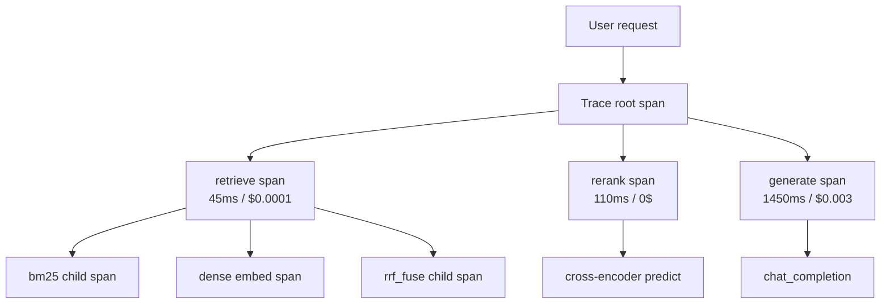
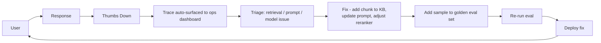

# Observability

You can't debug what you can't see. LLM systems have novel failure modes that require purpose-built tooling.

!!! tip "Rapid Recall"
    Every request becomes a **trace**; each step a **span** with input, output, tokens, cost, latency. **Tools**: Langfuse (OSS), LangSmith (LangChain-native, best for LangGraph), Phoenix (drift), Helicone (proxy), W&B Weave. **Alert on**: p95 latency, error rate, cost-per-query, CSAT drop, hallucination rate, retrieval recall. **Feedback loop**: user thumbs-down → surfaced to engineer → triage → fix → add to eval set → re-run → deploy. **Shadow traffic** to catch regressions before they ship. **P50 / P95 / P99** matter all three; the user feels p99.

## §3.1 Tracing

Every request becomes a trace. Each step in the pipeline is a span. Captures:

- Input query + resolved prompt (post-retrieval, post-formatting)
- All LLM calls with input/output tokens, model, temperature
- All tool calls with args and responses
- Retrieval: which chunks, which scores
- Reranking: before/after ranks
- Total latency + per-span latency
- Total cost + per-span cost
- User feedback (thumbs up/down) linked to the trace

### What a trace looks like

For one user query, a trace captures:

```
[trace: "How do I get a refund?"]
├── retrieve_node (45ms)
│   ├── bm25_search (3ms)     → top-10 doc_ids
│   ├── dense_search (28ms)   → embedding call to OpenAI (2 tokens, $0.0001)
│   └── rrf_fuse (1ms)
├── rerank_node (110ms)
│   └── cross_encoder.predict (108ms, batch=10)
├── generate_node (1450ms)
│   └── chat_completion (1442ms, in=600 tokens, out=85 tokens, $0.003)
└── total: 1605ms, $0.0031
```

You want to filter on: "slowest 100 queries", "queries with cost > $0.01", "queries where faithfulness < 0.5", "queries with empty retrieval results."

### Trace fan-out



## §3.2 Tooling (2026)

| Tool | Strengths |
|---|---|
| **Langfuse** | Open source, self-hostable, strong tracing + eval |
| **LangSmith** | LangChain-native, best for LangGraph agents |
| **Arize Phoenix** | Open source, strong embeddings + drift analysis |
| **Helicone** | Proxy-based, easy drop-in |
| **Weights & Biases Weave** | Experiment tracking + traces |

Pick one early. Cost of switching later is high.

### The three contenders for RAG

| | LangSmith | Langfuse | Arize Phoenix |
|---|---|---|---|
| By | LangChain team | Independent OSS | Arize |
| Hosting | SaaS (free tier + paid) | Self-host OR SaaS | Self-host OR SaaS |
| LangChain integration | Native | Excellent | Good |
| Eval integration | Built-in | Built-in (Ragas-native) | Built-in |
| Best for | LangChain-heavy teams | OSS-first, self-host preference | Drift detection, ML+LLM combined |

## §3.3 What to Alert On

| Alert | Threshold (example) | Severity |
|---|---|---|
| p95 latency | > 2s chat, > 800ms voice | High |
| Error rate | > 2% | High |
| Cost per query | > 1.5x baseline | Medium |
| CSAT | drop > 5% over 24h | High |
| Hallucination rate | > 1% | High (domain-dependent) |
| Retrieval recall | drop > 5% | Medium |
| LLM provider errors | any sustained 5xx | High |

### Alert decision graph

```mermaid
flowchart TD
  M[Metric crosses threshold] --> S{Severity}
  S -- high --> P[Page on-call]
  S -- medium --> CH[Post to Slack ops channel]
  S -- low --> DG[Log to daily digest]
  P --> RB{Recent deploy?}
  RB -- yes --> RLB[Roll back deploy]
  RB -- no --> INV[Investigate: attribution + sample low-scoring traces]
  RLB --> CL[Close + postmortem]
  INV --> CL
```



## §3.4 Feedback Loops

**The tight loop that separates production-grade from hobby:**



Without this loop, bugs are reported, ignored, and repeat. With it, the system learns from every failure.

## §3.5 Shadow Traffic

Run candidate system in parallel with production. Doesn't serve users, but processes every production query. Compare outputs offline. Catches regressions before they ship.

## What to capture, what to skip

**Always capture:**

- Query text, user ID, timestamp.
- Retrieved doc IDs, scores, source metadata.
- LLM prompt (template + filled values), response, token counts, cost.
- Per-node latency.
- Final answer, plus any eval metrics computed.

**Don't capture** (PII / regulatory issues):

- Raw user input that may contain PII (mask emails, phone numbers, credit card numbers BEFORE logging).
- Document contents from access-controlled sources unless the trace store is access-controlled.

**Sampling**: at high QPS, trace 100% of slow queries (>p95 latency) and 1-10% of normal ones. Full-trace sampling is expensive.

## P50, P95, P99 latency — and why averages lie

Each percentile tells a different story:

- **P50 (median)**: typical experience. Half of requests are faster than this.
- **P95**: 1 in 20 requests is slower. Where most user complaints originate.
- **P99**: 1 in 100. The tail; worth tracking but optimize p95 first if budget is limited.

**Why not the average?** Take 100 requests: 99 take 50ms, one takes 5000ms. The average ≈ 99.5ms — hides the outlier *and* is dragged by it. P50 = 50ms (the typical truth). P99 = 5000ms (the ugly truth). Latency distributions are right-skewed with long tails, so the mean is a terrible summary.

**Why the tail matters at scale**:

- **Fan-out compounds**. 100 internal calls each with a 1% chance of P99-slow → `1 − 0.99^100 ≈ 63%` chance at least one is slow. Your user-facing P99 is dominated by internal P99 — the "tail at scale" effect (Dean & Barroso).
- **Users feel their request, not your median**. 1% bad × 1M requests/day = 10,000 bad experiences daily.
- **SLAs are written on tail percentiles**, never on averages.

**What's sharp about LLM serving tails specifically**:

- **Variable output length** → naturally long tail (a 2000-token generation is slow).
- **TTFT** (time to first token, prefill + queue) vs **TPOT** (time per output token, streaming speed) — tracked separately, each as percentiles.
- **Batching interference**: one giant request slows others in the batch → throughput optimizations can worsen P99.
- **Cold starts**: a request hitting a fresh replica eats the multi-GB model load → pure tail event.

**The senior framing**: the *gap* between P50 and P99 measures consistency. P50 100ms / P99 120ms = tight. P50 100ms / P99 3000ms = something nasty lurking in the tail. **"How's the latency" is never one number.**

| Workload | Driver | What to track |
|---|---|---|
| **Voice agents** | Sub-800ms p95 because conversation pauses past that feel awkward | TTFT p95 + p99 |
| **Chat UIs** | Forgiving on p95 if streaming gets first token in ~200ms | TTFT p50/p95, TPOT |
| **Batch enrichment** | Percentiles barely matter | Throughput (tok / sec / $) |

## Latency budget breakdown for RAG

| Stage | Typical | Optimization |
|---|---|---|
| Embed query | 5-50ms | Cache, smaller model |
| Hybrid retrieval | 20-100ms | HNSW tuning, smaller `efSearch` |
| Cross-encoder rerank | 50-200ms | Smaller reranker, fewer candidates, ColBERT |
| LLM TTFT (time-to-first-token) | 300-1500ms | Streaming, smaller model, prompt caching |
| LLM completion | 500-3000ms | Smaller model, fewer output tokens |
| **Total** | **1-5 seconds** | **Stream! User sees output starting from TTFT** |

**Streaming is the single biggest perceived-latency win.** Users perceive latency as "how long until I see anything happen." If the first token arrives in 800ms and the full answer takes 3s, the experience feels like 800ms.

## Interview Questions

**Q5: Design observability for a production RAG system.**

Every request becomes a trace. Spans for: input preprocessing, retrieval (with scores + chunks), reranking, LLM call (tokens + cost), tool calls, output filtering. Link user feedback (thumbs) to trace. Dashboard aggregates: p50/p95/p99 latency per span, cost per query, CSAT trend, retrieval recall, hallucination rate. Alerts on: latency regression, cost spikes, error rates, CSAT drops. Tool: Langfuse or LangSmith. Feedback loop: every thumbs-down surfaces trace to engineer → triage → fix → add sample to eval set.

**Q12: Design a feedback loop that actually improves the system over time.**

Step 1: capture thumbs up/down, link to trace. Step 2: auto-surface negative traces to engineer dashboard, cluster by failure type. Step 3: engineer triages, retrieval issue, prompt issue, model issue, data quality. Step 4: fix the specific issue (improve chunking, add doc, update prompt). Step 5: add the failing query to golden eval set. Step 6: re-run eval, confirm regression fixed, no new regressions. Step 7: deploy. Weekly review: which categories of failure recur? Systemic fixes.

---
