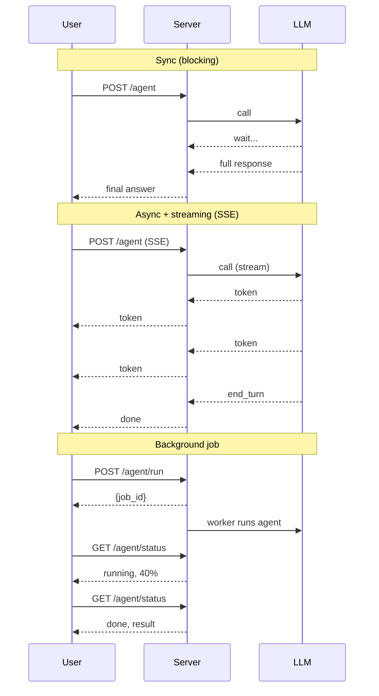

# Serving Modes: Sync, Async, Streaming, Background

Four execution modes shape how your agent server is structured. Pick wrong and you either burn money on cold starts or have a sync server that can't multiplex.

!!! tip "Rapid Recall"
    **Sync** for dev or single-user; **async** mandatory at any concurrent scale (parallel tool calls + multiplexed users); **streaming** drops TTFT from full latency to ~200ms for chat UIs; **background jobs** for anything over 30 seconds. The 2026 stack: **FastAPI (async) + LangGraph with PostgresSaver + Server-Sent Events for stream + a worker queue (Celery / RQ / Temporal) for long jobs**. Persistence via durable checkpointing is what lets you pause for HITL, recover from crashes, and time-travel for debugging.

## The four execution modes

| Mode | What | When to use |
|---|---|---|
| **Sync (blocking)** | Call → wait → return | One agent, one user, simple chatbot |
| **Async** | Call → yield → other work → resume | Parallel tool calls; concurrent users; mixing slow I/O |
| **Streaming** | Server emits tokens / events as they happen | Chat UIs (TTFT matters); long agents (show progress) |
| **Background jobs** | Submit → return immediately → poll / webhook later | Long-running agents (research, code generation runs of minutes-to-hours) |

### Sync vs async vs streaming vs background — sequence diagrams



## Why async matters for agents specifically

Two cases where sync is *measurably* worse:

### 1. Parallel tool calls

When an LLM emits three independent tool calls in one turn (`get_weather(Delhi)`, `get_weather(Mumbai)`, `get_weather(Bangalore)`), executing them sequentially means waiting 3x the per-call latency. With async (`asyncio.gather`), they run concurrently, total time ≈ max of the three.

3x speedup on N=3, scales linearly with the number of independent tool calls.

### 2. Concurrent users on one server

A sync FastAPI server with one worker handles one request at a time. While Agent A is waiting on a tool response, Agent B can't even start. With async, the server multiplexes, Agent A waits on its tool, Agent B's LLM call is in flight, Agent C's response is streaming back.

**At any meaningful production scale, your agent server is async.** It's not optional.

## When sync is fine

- **Dev / debugging**, sync is easier to reason about.
- **Notebooks**, Jupyter has its own event loop quirks. Sync demos run cleanly.
- **One-off scripts**, batch processing where you process items in a loop.

## Streaming — orthogonal to sync/async

Streaming is about *the response format*, not the execution model. You can stream from sync code (chunked HTTP) or async code (SSE, WebSockets). The thing that streaming buys you:

- **Time-to-first-token (TTFT)** drops from full latency to ~200ms, users feel the agent is "thinking" instead of frozen.
- **Progress visibility** on long agents, show which subagent is running, what tool was just called.
- **Cancellation**, user can hit stop mid-stream and abort the agent.

LangGraph supports three stream "modes":

1. `stream_mode="values"`, emit full state snapshots after each node.
2. `stream_mode="updates"`, emit only the state diff per node (lighter).
3. `astream_events()`, emit fine-grained events (tokens, tool calls, completions).

## Background jobs — for when latency budget is "minutes"

A research agent that hits 50 web pages and writes a report doesn't fit in a request-response. Pattern:

```
POST /agent/run  →  returns {"job_id": "abc"} immediately
                    backend kicks off the agent in a worker

GET /agent/status/abc  →  returns {"state": "running", "progress": 0.4}
GET /agent/status/abc  →  returns {"state": "done", "result": {...}}
```

LangGraph's checkpointer plus a job queue (Celery, RQ, Temporal) is the standard recipe.

## State stores and durable execution

LangGraph's checkpointing makes state durable across requests:

- **In-process (`MemorySaver`)** for dev.
- **`SqliteSaver`** for local apps.
- **`PostgresSaver`** for production.

With a durable checkpointer:

- A pause for HITL can last hours; the server doesn't hold a connection.
- A crash mid-run resumes from the last superstep on next invocation with same `thread_id`.
- Time travel is free: every superstep is a snapshot.

See [LangGraph Persistence](../langgraph/persistence-streaming.md) for the full mechanism.

## Execution Modes (the matrix)

| Property | Sync | Async | Streaming | Background |
|---|---|---|---|---|
| Returns | Final answer | Final answer | Tokens as they arrive | Job ID, poll later |
| Holds connection | Yes | Yes | Yes (long-lived SSE) | No |
| Multiplexes users | No (per worker) | Yes | Yes | Yes (via worker queue) |
| Best for | Dev, single user | Production chat | Chat UIs | Research, code-gen, anything >30s |
| Server style | Flask sync | FastAPI async | FastAPI + SSE | FastAPI + Celery/RQ |

## The 2026 production pattern

```
FastAPI (async)
  ├── /chat                  → async + streaming via SSE
  ├── /agent/run             → submit to background queue, return job_id
  ├── /agent/status/{id}     → poll
  └── LangGraph with PostgresSaver checkpointer
       ├── thread_id per conversation
       └── interrupt() pauses for HITL approval, fully durable
```

!!! note "Interview note"
    *"Sync or async for a multi-user agent backend?"* Always async, plus streaming for the user-facing channel, plus background jobs for anything >30s. The 2026 stack: FastAPI (async) + LangGraph with PostgresSaver + Server-Sent Events for stream + a worker queue for long jobs.

### The terminology trap — "synchronous" is overloaded

"Synchronous" actually means two different things, and conflating them is where most confusion starts. It means both "held-open blocking connection" AND "non-streaming." Streaming is a **separate axis**.

| Mode | Connection | Delivery | Good for |
|---|---|---|---|
| Sync request-response | Held open, blocks | One final result | Fast bounded jobs (<~30s) |
| Sync streaming | Held open | Incremental | Chat — bounded but live tokens |
| Async (job queue) | Submit + poll | Poll for final | Long agent runs, batch |
| Async streaming (pub/sub) | Submit + subscribe | Incremental | Long runs + live progress |

### Why agent runtime is variable

An agent is a loop: think → tool → observe → think → … The number of iterations is data-dependent. Simple query = 1 call = 2s; complex = 15 tool calls + retries = 5 minutes. **Unbounded and input-dependent.**

### Why load balancers kill long sync connections

This is the concrete reason async is mandatory at any production scale:

- **Idle / read timeouts** (30–60s default) terminate held-open connections → client gets 504 even though the server is still working.
- **Streaming only partly helps**. Most LB timeouts are *idle* timeouts; streaming tokens resets the timer — but a 90s silent "thinking" phase still fires it.
- **Connection exhaustion**: each long sync connection ties up a worker slot for the whole job.
- **Deploys / autoscaling drain connections** → a 4-minute-in agent run dies.
- **Retry storms**: timeout → client retries → two doomed 5-minute runs.

**The fix is to decouple job life from connection life.** `POST` → `202 + job_id` (connection closes in ms), worker runs the agent independent of any connection, client polls or subscribes via a *reconnectable* SSE or WebSocket. With async, the streaming connection is disposable; with sync, the connection *is* the job.

One line: sync is fine for bounded short jobs; the moment runtime is unbounded (agentic loops) you *must* submit → job-id → poll / subscribe, because LB idle / total timeouts, connection exhaustion, deploy drains, and retry storms all kill long held-open connections. **Streaming is a UX layer on top of either, not a substitute.**

## Multi-provider failover (production resilience)

For critical paths, design for provider outages:

1. **Primary provider** (e.g., Anthropic).
2. **Secondary provider** (e.g., OpenAI).
3. **Tertiary** (self-hosted Llama on vLLM).
4. **Circuit breakers + health checks**: if primary errors spike, route to secondary.
5. **Semantic cache as safety net**: serve cached response for common queries during outage.
6. **Alerting**: any sustained 5xx from primary triggers on-call.

```python
async def llm_call_with_failover(query, providers=[primary, secondary, tertiary]):
    for provider in providers:
        try:
            return await provider.complete(query)
        except (TimeoutError, ProviderError) as e:
            logger.warning(f"{provider} failed: {e}; trying next")
    raise AllProvidersDownError()
```

## Interview Questions

**Q15: Design a system that handles LLM provider outages gracefully.**

Multi-provider failover. Primary provider (e.g., Anthropic), secondary (e.g., OpenAI), tertiary (self-hosted). Health checks + circuit breakers: if primary errors spike, route to secondary. For each request, attempt primary first, on failure retry secondary with exponential backoff. Semantic cache as safety net, serve cached response for common queries during outage. For critical features, maintain warm self-hosted replica. Alerting: any sustained 5xx from primary triggers on-call. Communicate degraded experience to users if quality differs across providers.

---
