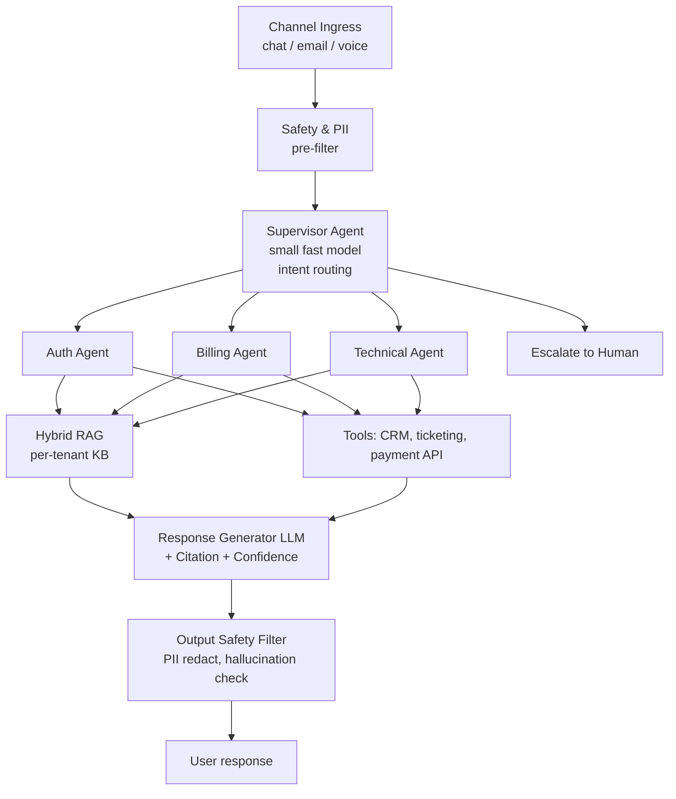

# Scenario A: AI Agent Platform for Customer Service

**Prompt:** "Design an AI agent platform for customer service. Assume a SaaS company with 10K enterprise customers, 1M support tickets/month, need 80% auto-resolution."

!!! tip "Rapid Recall"
    1M tickets/month ≈ 25 QPS average, 100 QPS peak. Per-tenant isolation, hybrid RAG over per-tenant KB, supervisor (small fast model) routes to specialist agents (researcher / billing / technical), LangGraph for durable sessions + HITL escalation. Confidence threshold gates escalation. Cost per ticket ~$0.016 well under $0.10 budget. Latency budget p95 < 2s decomposes: ingress 50ms + supervisor 300ms + retrieval+rerank 300ms + specialist+tools 800ms + generation+safety 400ms + network 150ms.

## 2.1 Clarify

- **Scale:** 1M tickets/month ≈ 25 QPS average, 100 QPS peak.
- **Latency:** chat p95 < 2s, voice p95 < 800ms if voice channel.
- **Accuracy:** 80% auto-resolution target. Escalate to human if confidence < threshold.
- **Cost:** budget of <$0.10 per resolved ticket.
- **Data:** per-tenant isolation required. SOC2, potentially HIPAA for healthcare customers.
- **Channels:** chat + email + voice (assume all three).

## 2.2 Functional Requirements

- Intent routing (password reset → auth flow, billing → billing agent, technical → technical agent).
- Knowledge retrieval from per-tenant KB.
- Tool execution (reset password, issue refund, create ticket).
- Conversation memory across session.
- Escalation to human with context handoff.
- Multi-language (English + top 3 customer languages).

## 2.3 Architecture

## 2.4 Component Choices

| Component | Choice | Why |
|---|---|---|
| Supervisor | Small fast model (Haiku-class) | Router needs speed, not depth |
| Specialist agents | Larger model (Sonnet-class) | Reasoning over retrieved context |
| Retrieval | Hybrid RAG (BM25 + dense) + rerank | Customer queries mix natural language and exact product codes |
| Vector DB | Qdrant with per-tenant filter | Strong metadata filtering for isolation |
| Memory | Short-term buffer + long-term per-user (opt-in) | Session continuity + returning customer recognition |
| Framework | LangGraph with Postgres checkpointer | Durable sessions, HITL for escalation |
| Observability | Langfuse + custom metrics | Trace every step for cost and quality analysis |

## 2.5 Critical Deep-Dives

### Per-tenant isolation

Separate Qdrant collection per tenant OR one collection with mandatory `tenant_id` filter. For 10K tenants, single collection + filter is manageable; isolate high-sensitivity tenants into dedicated collections.

### Confidence + escalation

Response generator outputs (answer, confidence). Confidence heuristics: retrieval score of top-1 doc, presence of "I don't know" patterns, self-reflection score. Below threshold (0.6) → escalate with full conversation context + summary.

### Cost math

1M tickets/month. Per ticket:

- Supervisor call: ~500 tokens in/out at $0.25/$1.25 per M = $0.0005
- Specialist call: ~2K tokens in, 500 out at $3/$15 per M = $0.014
- Embedding: $0.00002
- Rerank: $0.001
- Tools: free
- **Total ~$0.016/ticket** → $16K/month. Well under $0.10/ticket budget.

### Latency budget (p95 < 2s)

- Ingress + safety: 50ms
- Supervisor routing: 300ms
- Retrieval + rerank: 300ms
- Specialist agent + tool calls: 800ms (may include 1 tool)
- Generation + safety: 400ms
- Network + misc: 150ms
- **Total: ~2000ms p95**

If voice channel, budget collapses, see [Scenario C](c-voice-agent.md).

## 2.6 Gotchas Interviewers Probe

- **Handoff UX:** human agent needs full context; design the handoff payload.
- **Feedback loop:** thumbs up/down → retrieval traces → surface bad chunks for KB owners to fix.
- **Hallucination under pressure:** when retrieval is weak, does the agent gracefully say "I don't know" or make things up? Bake this into eval.
- **Multilingual:** separate specialist per language, or one multilingual model? (Usually one multilingual model + per-language BM25 tokenizer.)
- **Spike handling:** 100 QPS peak. Autoscale supervisor + specialists. Budget for rate limits on LLM provider.

## Related interview question

**Q6: Design per-tenant isolation for a multi-tenant LLM product with 10K tenants.**

Three levels, pick based on sensitivity. (1) Shared infrastructure + tenant_id filter on every query, cheap, works up to ~1000 tenants, some isolation risk. (2) Shared infrastructure + dedicated vector collections per tenant, stronger isolation, slightly more ops. (3) Dedicated deployments per tenant for highest-sensitivity (healthcare, defense), expensive, strong isolation. Most enterprises use (1) with (3) for specific customers. Critical: default-deny if `tenant_id` missing, audit trail per query.
