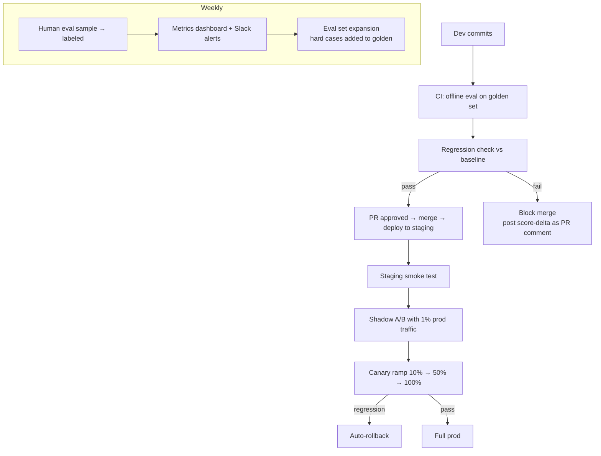

# Scenario B: LLM Evaluation Pipeline

**Prompt:** "Design an LLM evaluation pipeline for a RAG-based product assistant. Assume weekly model updates and 50 developers shipping changes."

!!! tip "Rapid Recall"
    Three planes: **offline (per-commit CI on golden set), online (A/B + canary), human (weekly sample review).** Golden set grows from 500 → 10K curated samples. CI: hard regressions (faithfulness drop >5%) block merge; soft regressions warn. Canary 1% → 10% → 50% → 100% with auto-rollback. **Elo + Agentic Functional Correctness** are the 2026 upgrades over absolute scoring. Watch the four traps: judge bias, golden set rot, overfitting, judge cost.

## 3.1 Clarify

- **What's evaluated:** retrieval quality, answer quality, safety, cost, latency.
- **Cadence:** offline (per-commit CI), online (A/B in prod), weekly full eval.
- **Scale:** 50 devs, ~20 changes/day. Eval set size? Assume starts at 500 curated, grows to 10K.
- **Automation:** how much of eval is auto vs human?

## 3.2 Three Eval Planes

### Offline (pre-deploy)

- **Golden set:** 500-10K curated query-answer pairs with labels.
- **Run on every PR:** check regression against baseline.
- **Cost:** dominated by LLM-as-judge calls on the golden set.

### Online (production)

- **Live metrics:** resolution rate, escalation rate, thumbs up/down, latency, cost per query.
- **A/B tests:** shadow traffic to candidate, compare metrics.
- **Canary:** ramp traffic 1% → 10% → 50% → 100% with auto-rollback on metric regression.

### Human-in-the-loop

- **Weekly reviews:** sample 100 random + 100 escalated + 100 low-confidence. Human labelers score.
- **Adversarial:** red-team prompts tested each release.

## 3.3 Metrics

### RAG-specific (RAGAS framework)

| Metric | What it measures |
|---|---|
| **Faithfulness** | Does the answer only use info from retrieved context? (Anti-hallucination) |
| **Answer Relevancy** | Does the answer address the query? |
| **Context Precision** | Are retrieved chunks actually relevant? |
| **Context Recall** | Did we retrieve all necessary information? |

Each computed by LLM-as-judge on `(query, retrieved, answer, ground-truth)` tuples.

### Standard NLP

- **BLEU/ROUGE:** n-gram overlap. Correlates weakly with quality. Use as sanity check only.
- **BERTScore:** semantic similarity via embeddings. Better than n-gram.
- **Perplexity:** only useful for fine-tuning eval, not end-to-end RAG.

### Production

- **Task completion rate:** did the user's goal succeed?
- **CSAT / thumbs ratio:** direct user feedback.
- **Deflection rate:** % queries resolved without human escalation.
- **Cost per query:** token spend normalized.
- **Latency:** p50, p95, p99.

### Human

- **Likert scales:** 1-5 quality scores.
- **Side-by-side (SBS):** preference between two variants. More sensitive than absolute scoring.
- **Elo ranking:** for multi-variant comparisons (A vs B, A vs C, B vs C). Standard in arena-style eval.

## 3.4 Architecture

## 3.5 Your Edge: Elo + Agentic Correctness

Standard eval is accuracy on static benchmarks. Two 2026 upgrades:

### Elo-based

Run candidate vs baseline head-to-head on many queries. LLM-as-judge picks winner per query. Aggregate to Elo rating. More sensitive than absolute scores because it captures "A is 60% preferred to B" even when both look fine on absolute metrics.

### Agentic Functional Correctness

For agentic features: measure actual task success, not text quality. "Book a flight" → did the flight get booked correctly? Binary outcome. Captures end-to-end correctness that text metrics miss. Implement as mock environment with instrumented tools that report success/failure.

## 3.6 CI/CD Integration

- PRs run offline eval on golden set (~10 min for 500 samples).
- Hard regressions (faithfulness drop >5%) block merge.
- Soft regressions (latency +10%) warn but allow merge.
- Eval metadata versioned alongside code.

## 3.7 Gotchas

- **Judge model bias:** same model that generates also judges → inflated scores. Use a stronger model as judge, or rotate judges.
- **Golden set rot:** set becomes stale as product evolves. Budget for weekly additions and pruning.
- **Overfitting to eval:** devs optimize for the golden set. Keep some held-out, rotate.
- **Cost of eval:** LLM-as-judge at scale is expensive. Batch, cache, sample intelligently.
- **Human labeler consistency:** inter-annotator agreement should be measured; disagreements are signal.

## Related interview question

**Q4: Design the A/B test for rolling out a new RAG embedding model.**

Shadow traffic first: 1% of queries go to both old and new embeddings, compare retrieval recall on held-out labels. If new wins, canary 10% with live traffic, monitor thumbs up/down, resolution rate, latency, cost. Ramp 10% → 25% → 50% → 100% over 1-2 weeks, auto-rollback on >5% regression in any key metric. Keep old index warm for 2 weeks post-ramp as rollback path.
