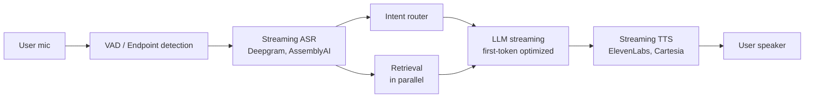

# Scenario C: Sub-800ms Voice Agent

**Prompt:** "Design a voice AI agent for a credit union with <800ms response latency."

!!! tip "Rapid Recall"
    800ms budget: ASR 150ms + VAD 50ms + retrieval 100ms + LLM first token 300ms + TTS first chunk 150ms + network 50ms = 800ms. **Stream everywhere; cut what you can't fit** (reranking, long context, complex tool chains). Smart endpointing (silence + semantic completion). Smallest acceptable model for LLM. Skip RAG for high-frequency intents by caching responses. Credit union specifics: voice biometrics + OTP before account ops, never speak full account/SSN, every call recorded for compliance.

## 4.1 The Hard Constraint

800ms end-to-end is brutal. Breaking it down:

| Stage | Budget |
|---|---|
| ASR (speech → text) | 150ms |
| VAD + endpointing | 50ms |
| Retrieval | 100ms |
| LLM generation (first token) | 300ms |
| TTS (text → speech) | 150ms |
| Network + misc | 50ms |
| **Total** | **800ms** |

Streaming everywhere. The user starts hearing the response before the LLM finishes generating.

## 4.2 Architecture

## 4.3 Key Optimizations

### Streaming ASR

Don't wait for user to stop talking. Transcribe as they speak. Use endpointing to know when utterance ends. Modern ASR (Deepgram Nova, AssemblyAI) do this with ~100ms lag.

### Smart endpointing

Silence detection alone fails on thoughtful pauses. Use a combined signal: silence duration + semantic completion (is the sentence grammatically complete?). Cartesia and Retell AI ship this as a feature.

### Parallel retrieval

Fire retrieval as soon as partial transcript is coherent. Don't wait for ASR endpoint. If query changes mid-utterance, retry.

### Streaming LLM

Use provider streaming. First token at ~200-300ms. Pipe tokens directly to TTS as they arrive.

### Streaming TTS

Modern TTS (Cartesia Sonic, ElevenLabs Flash) stream audio chunks as text arrives. First audio chunk at ~100-150ms after first text token.

### Model choice

- Prefer smaller models (Haiku, GPT-4o-mini) for speed.
- Distill task-specific models if quality suffices.
- Skip RAG entirely for high-frequency intents, cache responses.

## 4.4 Complexity Tradeoffs Cut

- **No reranking**, 50ms you don't have.
- **Shorter context**, long context slows TTFT.
- **Simpler tools**, complex tool chains kill latency.
- **Compromise on quality**, voice tolerates rougher answers than chat.

## 4.5 Credit Union Specifics

- **Authentication:** voice biometrics + OTP before any account operation.
- **PII safety:** never speak full account numbers, SSN, balances above a threshold without re-auth.
- **Audit:** every call recorded + transcribed + stored for compliance.
- **Handoff:** smooth escalation to human agent with full context.

## 4.6 Where It Breaks

- **Long answers:** "Tell me about my loan options" → 30-second response, user interrupts mid-way. Need interruption handling (barge-in).
- **Multi-turn context:** voice conversations drift topics. Memory + clarification prompts.
- **Ambient noise:** ASR degrades. Noise cancellation + confidence thresholds.
- **Regional accents:** ASR trained on standard English fails on Indian English, Southern US. Use region-specific models.

## Related interview question

**Q2: You're told "p95 latency must be under 800ms for a voice agent." Walk through the budget allocation.**

ASR streaming: 150ms. VAD + endpointing: 50ms. Retrieval: 100ms. LLM first token: 300ms. TTS first chunk: 150ms. Network + misc: 50ms. Total: 800ms. Every stage must stream, no waiting for previous to complete. Cut: reranking, long context, tool chains. Use smallest acceptable model for LLM. Skip RAG for high-frequency intents by caching.
