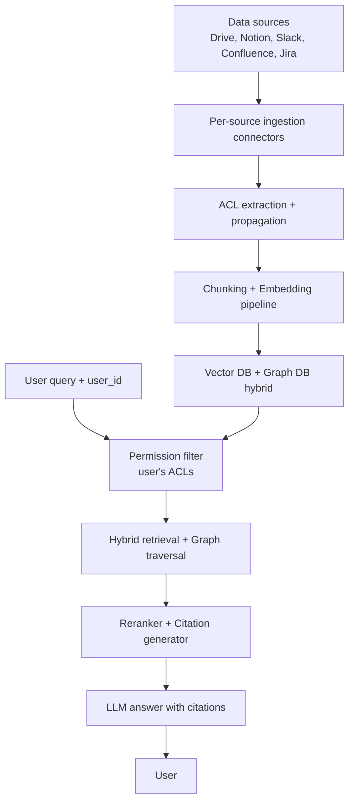

# Scenario D: Enterprise Knowledge Assistant

**Prompt:** "Design a knowledge assistant for a 5000-person enterprise with data in Google Drive, Notion, Slack, Confluence, and Jira."

!!! tip "Rapid Recall"
    The hard part is **ACL propagation**: every chunk stored with source-system ACLs, queries filter by user's effective permissions. Default-deny if ACL is missing or stale. Per-source ingestion connectors handle source-specific chunking and ACL extraction. Graph RAG layer for "who knows X?" queries. Citations are table stakes for trust. At 1M docs and 50K QPD, cost is negligible (~$2.50/day embedding, ~$450/day LLM); the hard cost is **ops and integration, not compute**. Top failure modes: ACL staleness, derived-doc leaks, default-deny missing.

## 5.1 Clarify

- **Scale:** 5K users, ~1M docs across systems, ~50K QPD.
- **Access control:** every query must respect source-system permissions (user A can't see user B's docs).
- **Freshness:** daily sync vs real-time?
- **Sensitivity:** PII, financial, legal docs all mixed in.

## 5.2 Architecture

## 5.3 Critical: ACL Propagation

**The hardest part.** Every chunk stored with its source-system ACL. Query filter uses user's effective permissions.

**Implementation:**

- Ingestion writes `{chunk, acl: [group_ids, user_ids]}` to vector DB.
- Query-time: fetch user's groups from SSO → filter vector search by `acl ∩ user_groups ≠ ∅`.
- Re-sync ACLs periodically (daily minimum, ideally real-time webhook-driven).
- **Default deny.** If ACL metadata is missing or stale, filter out the chunk.

**Stale ACL risk:** user leaves company, their old doc still retrievable until re-sync. Mitigations: real-time webhooks for user deprovisioning, mandatory TTL on ACL metadata.

## 5.4 Source-Specific Handling

| Source | Chunking | Special handling |
|---|---|---|
| Google Drive | PDF/Docs parsers, by section | Shared drives have different ACLs than owned files |
| Notion | By block/page | Relational database pages need metadata extraction |
| Slack | By thread | Private channels require membership check; DMs excluded by default |
| Confluence | By page | Space permissions are primary ACL |
| Jira | By ticket | Project membership + issue-level restrictions |

## 5.5 Graph RAG Layer

For "who knows X?" queries: build knowledge graph from extracted entities (people, projects, teams, tools). Query combines vector retrieval + graph traversal.

Example: "Who worked on the Q3 forecasting model?" → vector hits on "Q3 forecasting" docs, graph returns authors + commenters + assignees.

## 5.6 Citation & Trust

Every answer cites sources. Clicking citation opens source doc (in source system, respecting permissions). Without citations, users don't trust enterprise AI, this is table stakes.

## 5.7 Cost & Scaling

- 1M docs × avg 5 chunks/doc = 5M chunks.
- Embedding: 5M × 1024 dim × 2 bytes (fp16) = 10GB. Easily fits.
- Daily re-embed of updates: ~5% daily change = 250K chunks/day.
- At OpenAI prices: 250K chunks × 500 tokens × $0.02/M = $2.50/day embedding cost.
- LLM inference: 50K QPD × avg 3K tokens × $3/M = $450/day.

Tiny budget for a 5000-person company. The hard cost is ops and integration, not compute.

## 5.8 Gotchas

- **Compliance:** HIPAA/SOX require audit trails of every query + every doc accessed.
- **Data residency:** multinational companies need regional deployment.
- **Duplicate suppression:** same doc across Drive + Confluence; dedupe at retrieval time.
- **Stale content:** old meeting notes, deprecated policies. Recency boost + explicit deprecation tags.
- **Prompt injection via docs:** a malicious doc with "ignore previous instructions" can hijack the agent. Treat retrieved content as untrusted data.

## Related interview questions

**Q3: How do you prevent hallucination in an enterprise RAG system?**

Four layers. (1) Strong retrieval, hybrid BM25 + dense + reranker, high recall on held-out eval. (2) Faithfulness prompting, "answer only from provided context, say 'I don't know' otherwise." (3) Post-generation check, LLM-as-judge verifies claims are grounded in retrieved docs. (4) Citations, every claim linked to source; users and monitoring catch unsupported claims. For highest-stakes, add CRAG-style corrective loop with web fallback.

**Q5: Trap — candidate wants Graph RAG for the MVP of an enterprise assistant.**

Push back. Graph RAG has 10-50x the ingestion cost of vector RAG due to LLM entity/relation extraction. You're paying this before knowing if queries are entity-relational. Ship hybrid vector RAG first. Log queries for a month. If 20%+ of queries are clearly entity-relational ("who works on X," "what does team Y own"), then add Graph RAG as a secondary retrieval path. Premature sophistication kills velocity.

**Q10: Design a knowledge assistant that respects source-system ACLs perfectly. What are the failure modes?**

Ingestion captures ACL with each chunk; query-time filter by user's effective permissions. Failure modes: (1) ACL staleness, user deprovisioned but ACL metadata not updated. Fix: real-time webhooks + TTL. (2) ACL inference errors, especially in Slack where channel membership is fluid. (3) Derived docs, summary of restricted doc in an unrestricted space leaks info. Fix: inherit most-restrictive ACL in derived content. (4) Default behavior, if ACL missing, must be default-deny. Logs every denial. (5) Admin override bugs, "admin can see all" scope creep. Audit quarterly.

**Q7: How would you handle a prompt injection attack in a RAG system?**

Treat retrieved content as untrusted data. Use delimiters that separate system instructions from retrieved context (e.g., XML tags, unique random tokens). Never concatenate user query directly with system prompt. Add output filtering, detect if the model is "following" instructions that came from retrieved docs. For high-stakes systems, use an adversarial eval set of injection attempts and measure defense rate. Plus, monitor for anomalies (sudden change in behavior, leaking of system prompt).
