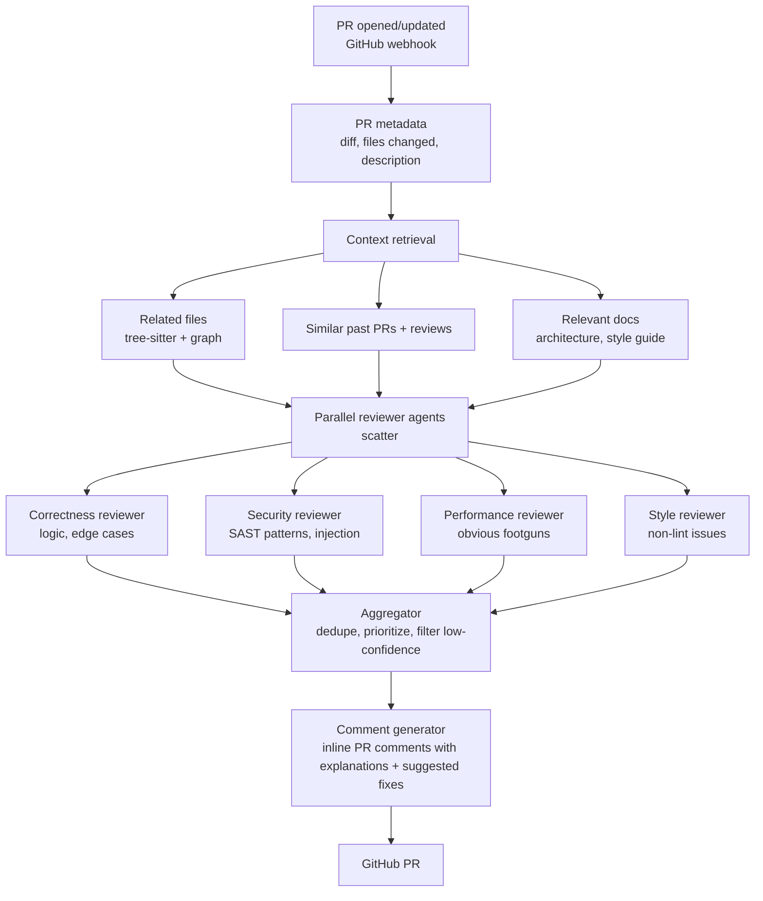

# Scenario E: Code Review Agent

**Prompt:** "Design an AI code review agent that comments on pull requests."

!!! tip "Rapid Recall"
    Webhook on PR open/update → context retrieval (diff + surrounding code + similar PRs + docs) → scatter to parallel reviewer agents per concern (correctness, security, performance, style) → aggregator deduplicates and prioritizes → only post comments above confidence threshold. **Target: >70% of comments actionable.** Dev tolerance is ~3-5 comments per PR before they stop reading. Few-shot examples from this team in the system prompt matter enormously. Cost at 50 PRs/day is ~$0.08/PR ≈ $120/month, negligible against engineer time.

## 6.1 Clarify

- **Scale:** how many PRs/day? Small team (50 PRs) vs large (10K PRs).
- **Depth:** surface linting + style, or semantic bugs + security?
- **Integration:** GitHub/GitLab webhook? IDE?
- **False positive tolerance:** noisy reviews get ignored. Target: >70% of comments actionable.

## 6.2 Architecture

## 6.3 Key Decisions

### Context strategy

Just the diff isn't enough — reviewer needs surrounding code. Stream the diff + N lines around each hunk + called functions + type definitions. Use tree-sitter to build a call graph; include symbols referenced in the diff.

### Scatter-gather by concern

Separate agents per concern (correctness, security, performance, style). Each focused prompt. Aggregator deduplicates. Better than one giant agent trying to do everything.

### Confidence gating

LLM review comments often low-confidence. Score each comment on:

- Is it rooted in the actual code? (cite line)
- Is it unique (not a duplicate of linter output)?
- Would a senior engineer agree?

Only post comments above threshold.

### Few-shot examples

Include 2-3 examples of good comments from this team in the system prompt. Drastically improves style match.

## 6.4 Evaluation

- **Actionability rate:** % of comments that lead to a code change.
- **False positive rate:** % of comments the author dismisses.
- **Coverage:** % of real bugs caught (measured by sampling post-merge regressions).
- **Noise tolerance:** devs tolerate ~3-5 comments per PR before they stop reading.

## 6.5 Cost

Assume 1000-line PR average, 50 PRs/day for a mid-size team.

- Retrieval: $0.002/PR
- 4 parallel reviewers: 4 × 5K tokens × $3/M = $0.06/PR
- Aggregator + formatter: $0.01/PR
- **~$0.08/PR × 50/day × 30 days = $120/month**

Negligible against engineer time saved if quality is good.

## 6.6 Gotchas

- **Language coverage:** polyglot codebases. Different linters, parsers, idioms per language.
- **Context limits:** large diffs (1000+ lines) exceed window. Need chunking strategy by file/hunk.
- **Style drift:** team's informal conventions (naming, structure) hard to capture. Few-shot + team-specific fine-tuning.
- **Developer trust:** one confidently wrong review tanks adoption. Conservative thresholds early, loosen as trust builds.
- **Security false negatives:** agent misses a real vulnerability. Should be paired with proper SAST, not replace it.

## Related

See also [Protocols & Coding Agents → Coding Agents](../protocols/coding-agents.md) for the four coding-agent paradigms (Devin / Cursor / Claude Code / Augment) and the canonical toolkit a reviewer agent shares with them.
