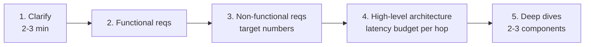

# End-to-End System Design

Whiteboard practice. Take the building blocks from RAG, Agents, LangGraph, Protocols, Eval, and Serving, and assemble full systems under interviewer pressure. Each scenario shows the question, the framework to attack it, the canonical answer, and the gotchas interviewers look for.

!!! tip "Rapid Recall"
    **The universal framework** (use before writing anything): (1) **Clarify** 2-3 min (scale, latency, accuracy, cost, data sensitivity, scope). (2) **Functional requirements**, prioritize MVP. (3) **Non-functional requirements** with target numbers. (4) **High-level architecture**, label latency budget per hop. (5) **Deep dives** on 2-3 components, have a number for every claim. **Never skip Clarify.** Interviewer judges you on what you ask, not just what you build.

## 1. The Universal Framework

Every LLM system design question collapses to the same five-step framework. Use this before you write anything.

### 1.1 Clarify (2-3 min)

Never skip this. Interviewer judges you on what you ask, not just what you build.

**Always ask:**

- **Scale:** QPS? Concurrent users? Data volume?
- **Latency targets:** p50, p95, p99. Chat (<2s) vs voice (<800ms) vs batch (minutes).
- **Accuracy bar:** what's "good enough"? Hallucination tolerance? Safety constraints?
- **Cost constraints:** budget per query? Per month?
- **Data sensitivity:** PII? Regulated (HIPAA, SOC2)? Multi-tenant?
- **Scope:** MVP vs production? What's in/out?

### 1.2 Functional Requirements

List what the system does in bullets. Prioritize. MVP first, stretch after.

### 1.3 Non-Functional Requirements

Latency, cost, availability, accuracy, safety, compliance. Each with a target number.

### 1.4 High-Level Architecture

Draw the boxes and arrows. Start from user → ingress → processing → response. Name every component. Label latency budgets on each hop.

### 1.5 Deep Dives

Interviewer picks 2-3 components to drill. Be ready on: retrieval, memory, safety, evaluation, cost optimization. Have a number for every claim.

## The five scenarios

| Page | Prompt |
|---|---|
| [A. Customer Service Agent](a-customer-service.md) | "Design an AI agent platform for customer service. 10K enterprise customers, 1M support tickets/month, need 80% auto-resolution." |
| [B. LLM Eval Pipeline](b-llm-eval-pipeline.md) | "Design an LLM evaluation pipeline for a RAG-based product assistant. Weekly model updates and 50 developers shipping changes." |
| [C. Sub-800ms Voice Agent](c-voice-agent.md) | "Design a voice AI agent for a credit union with <800ms response latency." |
| [D. Enterprise Knowledge Assistant](d-enterprise-ka.md) | "Design a knowledge assistant for a 5000-person enterprise with data in Google Drive, Notion, Slack, Confluence, and Jira." |
| [E. Code Review Agent](e-code-review.md) | "Design an AI code review agent that comments on pull requests." |

## Layer Checklist

- [ ] Can you execute the five-step framework on any LLM system design prompt?
- [ ] Can you draw and defend an architecture diagram with latency budgets?
- [ ] Can you calculate cost per query and per month with real numbers?
- [ ] Can you design per-tenant isolation at three sensitivity levels?
- [ ] Can you allocate 800ms across a voice agent stack?
- [ ] Can you design an A/B and canary rollout for an LLM feature?
- [ ] Can you list 5 levers to reduce system cost 10x?
- [ ] Can you defend against prompt injection in a RAG system?
- [ ] Can you design ACL propagation for an enterprise knowledge system?
- [ ] Can you design eval for a multi-agent system (per-agent, trajectory, interaction)?

## Interview Questions

**Q1: An interviewer asks you to design a customer service agent. You have 45 minutes. What do you spend each 15 minutes on?**

Minutes 0-10: clarify (scale, latency, accuracy, cost, channels, data sensitivity, MVP scope). Minutes 10-25: functional + non-functional requirements, high-level architecture with latency budget per hop. Minutes 25-40: deep-dive on 2-3 components the interviewer probes (usually retrieval, safety, escalation). Minutes 40-45: address gotchas, trade-offs you'd revisit, open questions. Never skip clarify.

**Q8: The interviewer says "now reduce the cost by 10x." What are your levers?**

Seven levers in order of typical impact: (1) **Model routing**, cheap model for simple queries, expensive for complex (Haiku vs Sonnet). Usually 3-5x savings. (2) **Prompt caching**, cache system prompts; providers charge 10-90% less for cached tokens. (3) **Semantic caching**, hit cache for paraphrased queries. (4) **Shorter context**, aggressive retrieval filtering, smaller top-K. (5) **Batch processing**, for async workloads, batch APIs give 50% discount. (6) **Smaller embeddings**, Matryoshka truncation or quantization. (7) **Distillation**, fine-tune small model on big model's outputs for high-volume tasks.
