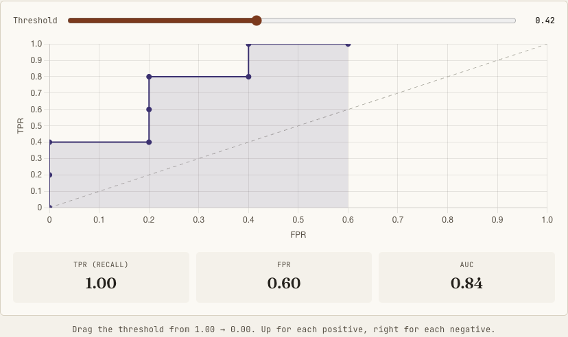
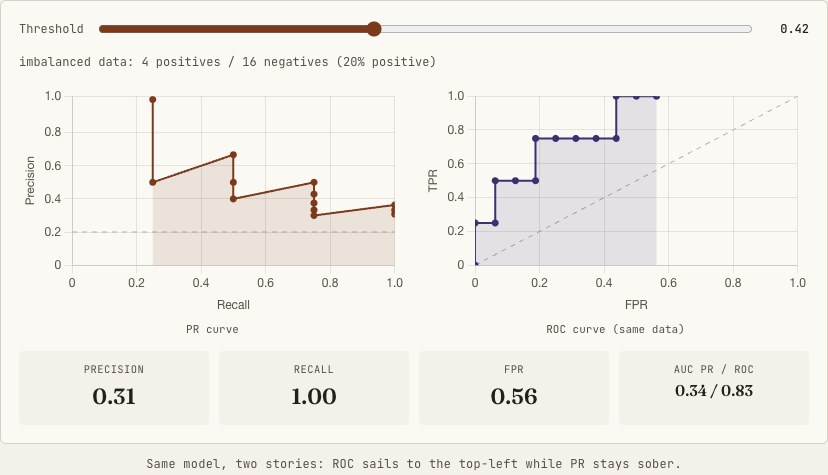

# Classification & Threshold Metrics

Every classification metric is a single ratio pulled from one 2x2 confusion matrix, and the metrics split by which direction they read it and whether they freeze a threshold. This page covers the threshold-dependent family (accuracy, precision, recall, F1, specificity, MCC, log loss) and the threshold-independent curves (AUC-ROC, AUC-PR), with the depth needed to defend the rare-positive case.

!!! tip "Rapid Recall"
    Precision lives in the predicted-positive column, recall in the actual-positive row, and they trade off through the one threshold knob. Accuracy lies under imbalance; F1 balances precision and recall via the harmonic mean, and MCC is the only basic metric using all four cells. AUC-ROC is the probability a random positive outranks a random negative, threshold-free but optimistic under imbalance because FPR's denominator is dominated by true negatives. AUC-PR ignores true negatives, so it stays honest when positives are rare, but its baseline is the positive prevalence, not 0.5. Log loss rewards calibrated probabilities and punishes confident-and-wrong.

## §1 The confusion matrix: foundation for everything

Classification is about predicting categories. But "did my model get it right?" has many flavors depending on what "right" means to your business. A cancer screening model that catches 99% of cancers but flags 50% of healthy people as sick is great at recall but terrible at precision. Every classification metric is a different lens on the same confusion matrix.

```
                    Predicted
                 Positive  Negative
Actual Positive [   TP   |   FN   ]
Actual Negative [   FP   |   TN   ]
```

- **TP (True Positive):** Correctly predicted positive
- **TN (True Negative):** Correctly predicted negative
- **FP (False Positive):** Incorrectly predicted positive (Type I error)
- **FN (False Negative):** Incorrectly predicted negative (Type II error)

Every classification metric below is just a different ratio of these four numbers. The metrics split into two camps based on *which direction* they read that table, and the same TP cell is shared but the denominator is the whole point.

<figure class="diagram diagram-light" markdown="0">
<svg aria-label="Confusion matrix showing recall reads across the row, precision reads down the column" role="img" viewBox="0 0 680 430" width="100%">
<defs><marker id="ar" markerHeight="6" markerWidth="6" orient="auto-start-reverse" refX="8" refY="5" viewBox="0 0 10 10"><path d="M2 1L8 5L2 9" fill="none" stroke="context-stroke" stroke-linecap="round" stroke-linejoin="round" stroke-width="1.5"></path></marker></defs>
<text fill="#564f44" font-family="JetBrains Mono,monospace" font-size="12" text-anchor="middle" x="240" y="52">Predicted positive</text>
<text fill="#564f44" font-family="JetBrains Mono,monospace" font-size="12" text-anchor="middle" x="400" y="52">Predicted negative</text>
<rect fill="#dcefe6" height="96" rx="6" stroke="#1d6e56" stroke-width="1" width="160" x="160" y="70"></rect>
<text fill="#0f5840" font-family="Fraunces,serif" font-size="20" font-weight="600" text-anchor="middle" x="240" y="108">TP</text>
<text fill="#0f5840" font-family="JetBrains Mono,monospace" font-size="11" text-anchor="middle" x="240" y="132">true positive</text>
<rect fill="#f7dede" height="96" rx="6" stroke="#a32d2d" stroke-width="1" width="160" x="320" y="70"></rect>
<text fill="#7a1f1f" font-family="Fraunces,serif" font-size="20" font-weight="600" text-anchor="middle" x="400" y="108">FN</text>
<text fill="#7a1f1f" font-family="JetBrains Mono,monospace" font-size="11" text-anchor="middle" x="400" y="132">type II error</text>
<rect fill="#f7dede" height="96" rx="6" stroke="#a32d2d" stroke-width="1" width="160" x="160" y="166"></rect>
<text fill="#7a1f1f" font-family="Fraunces,serif" font-size="20" font-weight="600" text-anchor="middle" x="240" y="204">FP</text>
<text fill="#7a1f1f" font-family="JetBrains Mono,monospace" font-size="11" text-anchor="middle" x="240" y="228">type I error</text>
<rect fill="#dcefe6" height="96" rx="6" stroke="#1d6e56" stroke-width="1" width="160" x="320" y="166"></rect>
<text fill="#0f5840" font-family="Fraunces,serif" font-size="20" font-weight="600" text-anchor="middle" x="400" y="204">TN</text>
<text fill="#0f5840" font-family="JetBrains Mono,monospace" font-size="11" text-anchor="middle" x="400" y="228">true negative</text>
<text fill="#564f44" font-family="JetBrains Mono,monospace" font-size="11" text-anchor="middle" x="105" y="114">Actual</text>
<text fill="#564f44" font-family="JetBrains Mono,monospace" font-size="11" text-anchor="middle" x="105" y="130">positive</text>
<text fill="#564f44" font-family="JetBrains Mono,monospace" font-size="11" text-anchor="middle" x="105" y="210">Actual</text>
<text fill="#564f44" font-family="JetBrains Mono,monospace" font-size="11" text-anchor="middle" x="105" y="226">negative</text>
<line marker-end="url(#ar)" stroke="#1d6e56" stroke-width="2" x1="160" x2="480" y1="300" y2="300"></line>
<text fill="#0f5840" font-family="Fraunces,serif" font-size="15" font-weight="600" text-anchor="middle" x="320" y="324">RECALL reads ACROSS the actual-positive row</text>
<text fill="#564f44" font-family="JetBrains Mono,monospace" font-size="11.5" text-anchor="middle" x="320" y="344">TP / (TP + FN) — of the real positives, how many caught?</text>
<line marker-end="url(#ar)" stroke="#3b3170" stroke-width="2" x1="240" x2="240" y1="70" y2="290"></line>
<text fill="#3b3170" font-family="Fraunces,serif" font-size="15" font-weight="600" text-anchor="middle" x="320" y="384">PRECISION reads DOWN the predicted-positive column</text>
<text fill="#564f44" font-family="JetBrains Mono,monospace" font-size="11.5" text-anchor="middle" x="320" y="404">TP / (TP + FP) — of my alarms, how many were right?</text>
</svg>
<figcaption>The same TP cell feeds both precision and recall; only the denominator differs. Recall reads down the actual-positive row, precision down the predicted-positive column.</figcaption>
</figure>

$$\text{Recall} = \frac{TP}{TP + FN}\quad(\text{the actual-positive row}),\qquad \text{Precision} = \frac{TP}{TP + FP}\quad(\text{the predicted-positive column})$$

!!! note "The mnemonic that ends the confusion"
    Recall lives in the *row*, precision lives in the *column*. Recall = "of the **R**eal positives" (R-R). Precision = "of my **P**redictions" (P-P). You can only hurt recall by missing real positives (FN); you can only hurt precision by raising false alarms (FP).

There is one knob: the decision threshold on the score. Slide it down → predict positive more aggressively → catch more real positives (recall up) but fire more false alarms (precision down). They move in opposition *by construction*. That is why a single balancing number (F1) exists and why threshold-free summaries (AUC) exist. This organizes the whole family:

| Species | Metrics | What it judges |
| --- | --- | --- |
| **Threshold-dependent** (one frozen cutoff) | accuracy, precision, recall, F1, specificity, MCC | Point estimates from one frozen confusion matrix |
| **Threshold-independent** (sweep and summarize) | AUC-ROC, AUC-PR, log loss | Ranking quality / calibration of the raw scores, before any threshold |

!!! note "The asymmetry to remember"
    Precision, recall, and F1 *never touch TN*. That is their blind spot under imbalance. MCC is the only basic metric using all four cells, which is why it is the most honest single number when classes are skewed.

## §2 Accuracy

**Intuition:** The most naive question: "What fraction of predictions did I get right?" It treats every correct prediction equally, whether it's a positive or negative.

$$\text{Accuracy} = \frac{TP + TN}{TP + TN + FP + FN}$$

**When to use:** Only when classes are roughly balanced AND the cost of false positives is about the cost of false negatives. Example: predicting if a coin flip is heads or tails.

**When it lies to you:** Imbalanced datasets destroy accuracy's meaning. If 99% of emails are not spam, a model that predicts "not spam" for everything gets 99% accuracy but catches zero spam. This is the single most important gotcha in all of ML metrics.

!!! warning "The \"95% accuracy\" trap"
    Accuracy is a single frozen point that hides both the threshold choice and the class balance. If an interviewer asks "your model has 95% accuracy, is it good?" the correct reflex is always "it depends on the class distribution." This is a trap question.

## §3 Precision

**Intuition:** Of all the things I flagged as positive, how many were actually positive? Precision answers: "When I raise an alarm, can you trust me?"

$$\text{Precision} = \frac{TP}{TP + FP}$$

**When to use:** When false positives are expensive. A spam filter marking a legitimate email as spam (FP) means your user misses an important email, so you'd rather let some spam through than eat real emails. Recommender systems: recommending irrelevant products erodes trust.

**Relationship to other metrics:** Precision is in tension with recall. You can trivially get perfect precision by only predicting positive when you're 100% sure, but then you'll miss a ton of actual positives (low recall). This tradeoff is the heart of the precision-recall curve.

## §4 Recall (Sensitivity / True Positive Rate)

**Intuition:** Of all the actual positives in the data, how many did I catch? Recall answers: "Am I missing things that matter?"

$$\text{Recall} = \frac{TP}{TP + FN}$$

**When to use:** When false negatives are expensive. Cancer screening: missing a cancer diagnosis (FN) is catastrophic, so you'd rather have extra false positives (unnecessary biopsies) than miss a real case. Fraud detection: missing a fraudulent transaction is worse than flagging some legitimate ones.

**Precision vs recall (the core tradeoff):**

- **High precision, low recall:** The model is conservative. It only flags things it's very sure about, so it misses a lot.
- **High recall, low precision:** The model is aggressive. It catches almost everything but also flags a lot of noise.
- You can always trade one for the other by adjusting the classification threshold.

## §5 F1 score

**Intuition:** You want a single number that balances precision and recall. A simple average would let one dominate (precision=1.0, recall=0.01, average=0.505 looks fine but is terrible). The harmonic mean punishes imbalance, so the F1 score is only high when BOTH precision and recall are high.

$$F_1 = \frac{2\,\text{Precision}\cdot\text{Recall}}{\text{Precision}+\text{Recall}} = \frac{2\,TP}{2\,TP + FP + FN}$$

**Why harmonic mean, not arithmetic mean?** Arithmetic mean of (1.0, 0.01) = 0.505 (misleadingly high); harmonic mean of (1.0, 0.01) = 0.0198 (correctly reflects the disaster). The harmonic mean is always at most the arithmetic mean, and equals it only when both values are identical. It gravitates toward the smaller value.

**When to use:** When you want a balanced view and classes are imbalanced. It's the default go-to metric for imbalanced classification when you don't have a clear business preference between precision and recall.

**Generalization (F-beta score):**

$$F_\beta = \frac{(1+\beta^2)\,\text{Precision}\cdot\text{Recall}}{\beta^2\,\text{Precision}+\text{Recall}}$$

- β = 1: Standard F1, equal weight.
- β = 2: F2 score, weights recall 2x more than precision (use when missing positives is costly).
- β = 0.5: F0.5 score, weights precision 2x more than recall (use when false alarms are costly).

## §6 AUC-ROC: the threshold sweep

**Intuition:** A classifier outputs a *score*, not a decision. Turning a score into a label needs a threshold, and every threshold gives a different confusion matrix. ROC sidesteps "which threshold?" by asking: across *all* thresholds, how well do my scores separate positives from negatives? It judges the ranking, not any one cutoff.

$$\text{TPR} = \text{Recall} = \frac{TP}{TP+FN}\ (y\text{-axis}),\qquad \text{FPR} = \frac{FP}{FP+TN} = 1 - \text{Specificity}\ (x\text{-axis})$$

**How the curve is actually plotted** (forget the integral): score every example, sort by score highest first, start the threshold at \(+\infty\) so nothing is positive, point (0,0). Lower the threshold one example at a time: each crossed example flips to predicted positive, stepping **up** if it is actually positive (TP up, TPR increases) or **right** if actually negative (FP up, FPR increases). Threshold below every score puts everything positive, point (1,1). So ROC is a **staircase**: up for every positive, right for every negative. A perfect model scores all positives above all negatives, hugging the top-left corner.

<figure class="diagram diagram-light" markdown>

<figcaption>Drag the threshold from 1.00 to 0.00. The curve steps up for each positive and right for each negative; the shaded area is the AUC.</figcaption>
</figure>

**The math, what AUC actually equals.** The integral \(\text{AUC}=\int_0^1\text{TPR}\,d(\text{FPR})\) is correct but least useful. The interpretation that wins interviews:

$$\text{AUC} = P(s^+ > s^-) = \frac{1}{P\cdot N}\sum_{i\in\text{pos}}\sum_{j\in\text{neg}}\mathbb{1}[s_i > s_j]$$

The double sum counts every (positive, negative) pair where the positive outscored the negative, divided by the total number of pairs \(P\cdot N\). The area under the staircase *is* this count: each up-step (a positive) sweeps across the fraction of negatives already ranked below it.

!!! note "Depth signal"
    AUC is a normalized *Mann-Whitney U statistic* (equivalently the Wilcoxon rank-sum). Dropping this connection signals real understanding.

**Reading the key values:** AUC = 1.0 is perfect ranking; AUC = 0.5 is the diagonal, meaning *random*, not "wrong"; AUC = 0.3 is informative with flipped labels (invert predictions to get 0.7). It is threshold-free, its superpower, and under imbalance its weakness.

**When it lies to you:** When classes are heavily imbalanced. With 99.9% negatives, even a small FPR like 0.01 means a huge number of false positives in absolute terms. The ROC curve doesn't show this because FPR is a rate, not a count. In such cases, use AUC-PR.

## §7 AUC-PR: telling the truth under imbalance

**Intuition:** Same machinery as ROC, sweep the threshold and plot two quantities, but one axis is swapped, and that single swap changes everything when positives are rare.

$$\text{Precision} = \frac{TP}{TP+FP}\ (y\text{-axis}),\qquad \text{Recall} = \frac{TP}{TP+FN}\ (x\text{-axis})$$

**Why the curve behaves so differently.** Look at the denominators, this is the entire story. ROC's x-axis (FPR) has denominator FP + TN, both negative-class cells, and TN is enormous when negatives dominate. PR's y-axis (precision) has denominator TP + FP, so it **never touches TN**. In a fraud problem with 99.9% legitimate transactions, the giant pile of correctly-ignored legit transactions inflates ROC but is invisible to PR.

!!! note "Structural difference"
    ROC always runs (0,0) to (1,1) monotonically, a clean staircase. The PR curve is *not monotonic*: as the threshold drops, recall only increases, but precision *jiggles*, up when you cross a real positive, down when you cross a false positive. PR sawtooths downward.

<figure class="diagram diagram-light" markdown>

<figcaption>Same model, two stories: on 20% positives the ROC sails toward the top-left while the PR curve stays sober against its prevalence baseline.</figcaption>
</figure>

**The baseline, the most testable contrast.** ROC's random baseline is the diagonal, AUC = 0.5, *always*, regardless of class balance. PR's random baseline is a horizontal line at precision = positive prevalence; if positives are 0.1% of data, random AUC-PR is about 0.001. Consequence: AUC-PR is **not comparable across datasets with different prevalence**. ROC's fixed 0.5 baseline is comparable across datasets but blind to imbalance.

**Why ROC lies under imbalance, concretely.** 1,000,000 transactions, 1,000 fraud (0.1%). Model flags 2,000, catches 900 real ones. Recall = 900/1000 = 0.90 (looks great); FPR = 1100/999000 about 0.0011 (looks incredible, ROC sits top-left); Precision = 900/2000 = 0.45 (fewer than half your fraud alarms are real). ROC's FPR was diluted to near-zero by the 999,000-strong TN denominator; precision, ignoring TN, exposed the truth.

**The math behind AUC-PR.** Unlike AUC-ROC there is no clean probabilistic interpretation. It is computed two ways, and the distinction is a trap. Trapezoidal `auc(recall, precision)` connects points with straight lines and is known to be *optimistic*, because linear interpolation in PR space is not achievable by any real classifier. **Average Precision (AP)** is the right way, what `average_precision_score` computes:

$$\text{AP} = \sum_n (R_n - R_{n-1})\cdot P_n$$

A weighted mean of precisions, weighted by the increase in recall at each threshold. "I use `average_precision_score`, not trapezoidal AUC, because trapezoidal interpolation in PR space is optimistic" is a strong signal.

!!! note "Sharper decision rule than \"under 5% positive\""
    The test isn't just "is it imbalanced," it's *do I care about true negatives at all?* If the negatives are a vast uninteresting background (fraud, rare disease, retrieval, anomaly detection) and all your value is in the positive class, use PR. If you genuinely care about correctly clearing negatives, ROC is meaningful.

## §8 Log loss (cross-entropy loss)

**Intuition:** Accuracy asks "were you right or wrong?" Log loss asks "how confident were you, and were you right to be?" A model that says "90% spam" on a spam email is better than one that says "51% spam." Log loss rewards well-calibrated probabilities.

$$\text{Log Loss} = -\frac{1}{N}\sum_i\big[y_i\log\hat{y}_i + (1-y_i)\log(1-\hat{y}_i)\big]$$

where \(y_i\in\{0,1\}\) is the true label and \(\hat{y}_i\in(0,1)\) the predicted probability.

**Why the log?** If true label = 1 and you predict 0.99, loss is about 0.01 (tiny). If you predict 0.01, loss is about 4.6 (massive). The log creates an asymmetric, explosive penalty for confident-and-wrong predictions; it's infinitely bad to predict 0.0 for a true positive.

**When to use:** When you care about probability calibration, not just the final label. Common in logistic regression training and any system where the probability itself is used downstream (ranking by confidence, expected value). Accuracy ignores how confident the model is; a model predicting 0.51 for everything gets the same accuracy as one predicting 0.99 at the same threshold, but log loss correctly prefers the better-calibrated one.

## §9 Specificity (True Negative Rate)

**Intuition:** Of all the actual negatives, how many did I correctly identify as negative? It's recall for the negative class.

$$\text{Specificity} = \frac{TN}{TN + FP}$$

Recall is how good you are at finding positives; specificity is how good you are at leaving negatives alone; and FPR = 1 - Specificity, which is why the ROC x-axis is sometimes labeled "1 - Specificity." Used in medical screening: of all healthy people, how many did the test correctly clear? Low specificity means lots of healthy people get unnecessary follow-up.

## §10 Matthew's Correlation Coefficient (MCC)

**Intuition:** Accuracy, precision, recall, and F1 all have blind spots. MCC is a correlation coefficient between the observed and predicted binary classifications that uses ALL FOUR confusion matrix values. It's the most balanced metric for binary classification, especially with imbalanced classes.

$$\text{MCC} = \frac{TP\cdot TN - FP\cdot FN}{\sqrt{(TP+FP)(TP+FN)(TN+FP)(TN+FN)}}$$

**Range:** \([-1, +1]\). MCC = +1 is perfect, 0 is random, -1 is total disagreement (labels flipped).

**Why MCC over F1?** F1 ignores true negatives entirely, so a model that correctly identifies negatives gets no credit, and in extreme imbalance F1 can be high even when the model is poor at negatives. MCC considers all four quadrants and catches this. Papers in bioinformatics and medical ML increasingly prefer MCC over F1.

**Gotcha:** MCC is undefined when any row or column of the confusion matrix sums to zero (denominator = 0). This happens when the model predicts only one class.

## Comparison table

| Metric | Handles Imbalance? | Threshold-Independent? | Considers TN? | Best For |
|--------|-------------------|----------------------|---------------|----------|
| Accuracy | No | No | Yes | Balanced problems only |
| Precision | Somewhat | No | No | False positives are costly |
| Recall | Somewhat | No | No | False negatives are costly |
| F1 | Somewhat | No | No | Balance of precision/recall |
| AUC-ROC | Poorly | Yes | Indirectly (via FPR) | Model comparison, balanced data |
| AUC-PR | Yes | Yes | No | Imbalanced data, rare positives |
| Log Loss | Yes | Yes (probability-based) | Yes | Calibrated probabilities |
| MCC | Yes | No | Yes | Most robust single metric |

## Interview questions

**Q1: Precision versus recall, and how do you remember which is which?**
Precision is TP over TP plus FP, the predicted-positive column, answering "when I raise an alarm, can you trust me," so it matters when false positives are costly. Recall is TP over TP plus FN, the actual-positive row, answering "am I missing things," so it matters when false negatives are costly. The mnemonic: recall is "of the Real positives," precision is "of my Predictions." They trade off through the single threshold knob.

**Q2: What is AUC, in the interpretation that wins interviews?**
AUC is the probability that a randomly chosen positive is scored higher than a randomly chosen negative, equivalently a normalized Mann-Whitney U statistic. The ROC curve is a staircase that steps up for each positive and right for each negative as you lower the threshold, and the area under it equals that pairwise ranking probability. So 1.0 is perfect ranking and 0.5 is random, and it is threshold-independent.

**Q3: Why does AUC-ROC mislead under heavy imbalance, and what do you use instead?**
Because ROC's x-axis is FPR, whose denominator FP plus TN is dominated by the huge true-negative count when positives are rare, so a model can have a tiny FPR and a great-looking ROC while still having terrible precision. AUC-PR fixes this because precision's denominator is TP plus FP and never touches true negatives, so it stays honest. The catch is the PR baseline is the positive prevalence, not 0.5, so AUC-PR is not comparable across datasets with different base rates, and you should report average precision rather than optimistic trapezoidal AUC.

**Q4: Why prefer MCC over F1 for imbalanced binary classification?**
Because F1 is built only from TP, FP, and FN and ignores true negatives entirely, so it can look high even when the model handles negatives poorly under skew. MCC is a correlation coefficient that uses all four confusion-matrix cells, giving the most honest single number, ranging from minus one to plus one. Its one caveat is that it is undefined when the model predicts only one class, since a row or column of the matrix then sums to zero.
