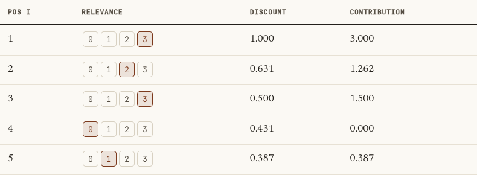

# Ranking & Recommendation Metrics

Recommendation systems produce ordered lists, not classifications, and the position of an item matters enormously: the right movie at position 1 is worth far more than at position 50. This page covers the position-aware metrics NDCG, the precision@k to AP to MAP ladder, MRR, and the online business metrics they ultimately serve.

!!! tip "Rapid Recall"
    NDCG handles graded relevance and discounts each item's gain by a log of its position, then normalizes by the ideal DCG so it lands in [0,1] and is comparable across queries. MAP is for binary relevance: average precision samples precision@k only at the ranks where a relevant item appears, rewarding putting relevant items early, and MAP averages that over queries, so "average" appears twice. MRR cares only about the rank of the first relevant hit. Offline metrics like NDCG and MAP measure ranking quality; online metrics like CTR and conversion measure business impact, and the offline-online gap is real.

## §1 NDCG: position-aware ranking

The name is the recipe read backwards: **Gain → Cumulative Gain → Discounted Cumulative Gain → Normalized DCG.** Each word adds one idea.

**Layer 1, Gain.** Gain is the relevance of one item. The key shift from classification: relevance is **graded** (a 5-star result has more gain than a 3-star), not binary. That's the first thing distinguishing NDCG from MAP.

**Layer 2, Cumulative Gain (CG)** just sums the relevance scores, ignoring position:

$$\text{CG@K} = \sum_{i=1}^{K} rel_i$$

Fatal flaw: **CG is position-blind.** [3,2,0] and [0,2,3] have identical CG, yet the first is far better. We need to punish good items for sitting low.

**Layer 3, Discounted Cumulative Gain (DCG)**, the position-aware part:

$$\text{DCG@K} = \sum_{i=1}^{K} \frac{rel_i}{\log_2(i+1)}$$

Why \(\log_2(i+1)\)? Walk the discounts: position 1 gives \(1/\log_2 2 = 1.00\); position 2 gives 0.63; position 3 gives 0.50; position 10 gives 0.29. The **log** makes the decay *gentle*: the 1 to 2 drop is big, the 9 to 10 drop is tiny, matching how user attention actually falls off. A linear \(1/i\) discount would punish lower ranks too harshly. The common alternative used by most libraries and the original web-search papers weights high relevance exponentially:

$$\text{DCG@K} = \sum_{i=1}^{K}\frac{2^{rel_i}-1}{\log_2(i+1)}$$

**Layer 4, Normalize to NDCG.** DCG is unbounded and incomparable across queries (a query with more relevant docs racks up more gain regardless of ranking quality). Divide by the best possible DCG for that query:

$$\text{NDCG@K} = \frac{\text{DCG@K}}{\text{IDCG@K}}$$

IDCG is the DCG of the ideal ordering (all items sorted by relevance, best first), the ceiling for that query. Now bounded in [0,1], and comparable across queries because each is normalized against its own ideal.

<figure class="diagram diagram-light" markdown>

<figcaption>Each position's contribution is its graded relevance times the log-position discount; NDCG hits 1.0 only when your order already matches the ideal relevance order.</figcaption>
</figure>

**When to use:** when relevance is graded (not binary). Search engines, Netflix recommendations, any top-K list where items have different quality levels. This is THE standard metric for learning-to-rank systems. When relevance is binary, use MAP.

## §2 Precision@k, AP, and MAP

These form a ladder, and the confusion comes from collapsing its rungs. The word "average" appears twice in "mean average precision" for a reason.

### Rung 1: Precision@k (one cutoff, one query)

$$\text{Precision@k} = \frac{\text{relevant items in top } k}{k}$$

For list [✓, ✗, ✓, ✗, ✓]: P@1 = 1.0, P@3 = 2/3 = 0.67, P@5 = 0.60. One list, one cutoff, one number.

!!! note "The limitation the next rung fixes"
    Precision@k is *position-blind within the top k*. [✓,✓,✗] and [✗,✓,✓] both score P@3 = 0.67, it can't see that the first front-loaded the relevant items.

### Rung 2: Average Precision (AP) (one full ranked list)

AP is **not** precision at one k. It is the average of precision@k values, computed *only at the positions where a relevant item appears*, for a single query:

$$\text{AP} = \frac{1}{R}\sum_{k=1}^{n} \text{Precision@k}\cdot rel(k)$$

where \(R\) is the total relevant items and \(rel(k)=1\) only if position \(k\) holds a relevant item. Walk-through on [✓, ✗, ✓, ✗, ✓] with \(R=3\): position 1 ✓ gives P@1 = 1.00; position 3 ✓ gives P@3 = 0.67; position 5 ✓ gives P@5 = 0.60; the rest skipped. So:

$$\text{AP} = \frac{1.00 + 0.67 + 0.60}{3} = 0.756$$

!!! note "The sentence that resolves the confusion"
    Each time you hit a relevant item, AP takes a snapshot of how clean the list has been up to that point. A relevant item near the top is measured while precision is still high, a big contribution; one buried at the bottom is measured after junk piles up, a small contribution. So AP *rewards putting relevant items early*, exactly the position-awareness precision@k lacks.

### Rung 3: Mean Average Precision (MAP) (across queries)

$$\text{MAP} = \frac{1}{|Q|}\sum_{q\in Q}\text{AP}_q$$

| Metric | Scope | Position-aware? |
| --- | --- | --- |
| Precision@k | one cutoff, one query | No, blind inside top k |
| AP (or AP@k) | one query, all relevant hits | Yes, via precision at hits |
| MAP | averaged across all queries | Yes |

!!! note "Why \"average\" twice"
    MAP = *mean* (over queries) of *average* (over relevant positions) precision. Two stacked averages. Confusing MAP with precision@k means collapsing those two averaging steps.

## §3 MRR (Mean Reciprocal Rank)

**Intuition:** "How far down the list do I have to scroll to find the FIRST relevant result?" MRR only cares about the first hit. If the first relevant result is at position 1, that's perfect; at position 5 you score 1/5 = 0.2.

$$\text{MRR} = \frac{1}{|Q|}\sum_i \frac{1}{\text{rank}_i}$$

where \(\text{rank}_i\) is the position of the first relevant result for query \(i\). **When to use:** when only the top result matters, question answering ("did the correct answer appear first?"), voice search (the device reads only the top result), autocomplete. **When not to use:** when multiple relevant results matter (use MAP or NDCG); MRR ignores everything after the first hit.

### NDCG vs MAP, when to use which

The deciding question: **is your relevance binary or graded?**

|  | MAP | NDCG |
| --- | --- | --- |
| Relevance | Binary (relevant / not) | Graded (0-5, stars) |
| Position handling | Implicit, via precision@k at hits | Explicit, via log discount |
| Normalization | Divide by R | Divide by IDCG |
| Natural home | Document retrieval, yes/no relevance | Recommendations, learning-to-rank with quality grades |

## §4 Online and business metrics

These are what your product manager actually cares about. Offline metrics tell you about ranking quality; online metrics tell you about business impact.

**CTR (Click-Through Rate)** = Clicks / Impressions. Measures "did users engage with what we showed them?" Gotcha: high CTR doesn't mean high satisfaction; clickbait has high CTR.

**Conversion Rate** = Desired Actions / Total Visitors (or Clicks). Measures "did users do the thing we wanted?" (purchase, signup). More meaningful than CTR because it captures downstream value.

**Dwell Time / Session Length** measures "how long did users engage with the recommended content?" A proxy for satisfaction, though long dwell time on a confusing page is bad UX, not good content.

**Connection between offline and online:** you optimize offline metrics during model development, then A/B test to see if improvements in NDCG/MAP actually translate to CTR/conversion improvements. Sometimes they don't, the offline-online gap, which is one of the hardest problems in recommender systems.

## Interview questions

**Q1: Why does NDCG use a log discount and a normalization step?**
The log discount, dividing each item's relevance by log base 2 of its position plus one, makes the decay gentle so top positions matter much more than later ones while later positions still contribute, matching how user attention falls off; a linear discount would punish lower ranks too harshly. The normalization divides DCG by the ideal DCG, the score of the perfect relevance-sorted ranking, which bounds NDCG in zero to one and makes queries with different numbers of relevant items comparable.

**Q2: Why is "average precision" two averages, and what does AP reward?**
Average precision averages precision@k taken only at the ranks where a relevant item appears, for a single query, which rewards front-loading relevant items because each relevant hit is measured against how clean the list is up to that point. Mean average precision then averages AP across queries. So MAP is a mean over queries of an average over relevant positions, two stacked averages, which is why confusing it with a single precision@k collapses the rungs.

**Q3: When do you choose NDCG, MAP, or MRR?**
The deciding question is the relevance type and how many hits matter. Use NDCG when relevance is graded, like star ratings, since it both uses the grades and discounts by position. Use MAP when relevance is binary and you care about all relevant results, since AP samples precision at every relevant hit. Use MRR when only the first relevant result matters, like question answering or voice search, since it scores the reciprocal rank of that first hit and ignores the rest.

**Q4: Why optimize offline metrics if business cares about online metrics?**
Because online metrics like CTR and conversion require a live A/B test, which is slow and expensive, so you use offline metrics like NDCG and MAP to iterate on the model quickly during development. You then validate the winning model with an A/B test, because improvements in offline ranking quality do not always translate into online engagement, the offline-online gap, which is one of the hardest problems in recommender systems.
