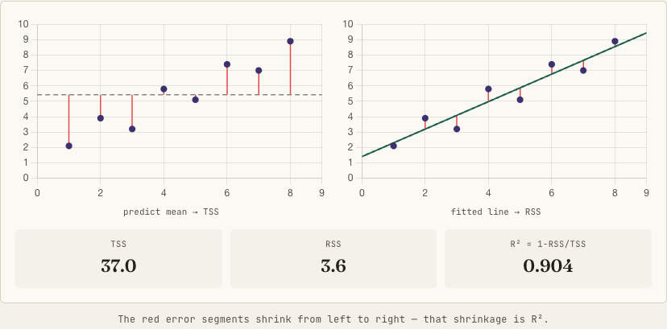

# Regression Metrics

Regression always asks "how far off was my prediction?", but there are many ways to define "far off": some metrics punish big errors more, some treat all errors equally, some are scale-independent, and one tells you about explained variance. This page covers them all, with the R² decomposition in depth.

!!! tip "Rapid Recall"
    MSE squares errors so it punishes large ones and gives smooth gradients, RMSE is just MSE in original units, and MAE is linear so it is robust to outliers; minimizing MSE targets the mean while minimizing MAE targets the median. MAPE is scale-independent but blows up at zero and is asymmetric. R² is one minus RSS over TSS, the fraction of the mean-model's error you removed, scale-free and comparable across problems, but it never decreases when you add features, so use adjusted R² to compare models of different complexity. Report RMSE for error magnitude and R² for explained variance.

## §1 MSE (Mean Squared Error)

**Intuition:** Average the squared differences between predicted and actual values. Squaring makes all errors positive and amplifies large errors disproportionately. A prediction off by 10 contributes 100 to MSE, while one off by 1 contributes only 1.

$$\text{MSE} = \frac{1}{N}\sum_i (y_i - \hat{y}_i)^2$$

**Why squared, not just absolute?** Squaring is differentiable everywhere (smooth gradient), making it easy to optimize with gradient descent, while the absolute value has a kink at zero. Squaring also heavily penalizes outlier predictions, which can be a feature (you want the model to avoid big errors) or a bug (a single outlier dominates the metric).

**When to use:** The default for regression when large errors are genuinely worse than small ones, or when training with gradient descent. **When not to use:** when outliers exist in the target and you don't want them dominating (use MAE or Huber), or when you need interpretable units (use RMSE).

## §2 RMSE (Root Mean Squared Error)

**Intuition:** MSE gives squared units (predicting prices in rupees gives MSE in rupees-squared). RMSE takes the square root to bring it back to the original units. Same behavior as MSE, just interpretable.

$$\text{RMSE} = \sqrt{\text{MSE}} = \sqrt{\frac{1}{N}\sum_i (y_i - \hat{y}_i)^2}$$

**RMSE vs MAE:** RMSE is always at least MAE (by Jensen's inequality), and the gap tells you about error variance: if RMSE is much larger than MAE, you have some very large errors mixed in with small ones. They are equal only when all errors are the same magnitude. Report RMSE when you want MSE's behavior in the original unit: "average error is 2.3 lakhs" beats "MSE is 5.29 lakh-squared."

## §3 MAE (Mean Absolute Error)

**Intuition:** The simplest possible error metric, just average the absolute differences. Unlike MSE, MAE treats all errors linearly, so a prediction off by 10 is exactly 10x worse than one off by 1, not 100x.

$$\text{MAE} = \frac{1}{N}\sum_i |y_i - \hat{y}_i|$$

| Property | MSE/RMSE | MAE |
| --- | --- | --- |
| Outlier sensitivity | High (squares amplify outliers) | Low (linear penalty) |
| Differentiability | Smooth everywhere | Kink at zero (not differentiable) |
| Gradient behavior | Gradient proportional to error size | Constant gradient magnitude |
| Interpretation | Squared units (MSE) or original (RMSE) | Original units |
| Optimal prediction | Mean of target distribution | Median of target distribution |

**Key insight for interviews:** The "optimal prediction" row is gold. Minimizing MSE drives the model toward predicting the mean; minimizing MAE drives it toward the median. This matters when the target distribution is skewed. Use MAE when outliers exist and you want robust, median-like behavior, common in financial forecasting.

## §4 MAPE (Mean Absolute Percentage Error)

**Intuition:** "What percentage was I off by, on average?" This makes errors scale-independent. Being off by 100 on a 1,000 item (10%) is worse than being off by 100 on a 10,000 item (1%).

$$\text{MAPE} = \frac{100}{N}\sum_i \frac{|y_i - \hat{y}_i|}{|y_i|}$$

**When to use:** When you need a scale-independent metric, common in supply-chain and sales forecasting where stakeholders think in percentages. **When it lies to you:**

1. **Division by zero:** if any actual value is 0, MAPE blows up to infinity. Demand forecasting with zero-sales days makes MAPE useless.
2. **Asymmetric penalty:** MAPE penalizes over-predictions more than under-predictions for the same absolute error in many regimes.
3. **Biased toward under-forecasting:** because of the asymmetry, models optimized on MAPE tend to systematically under-predict.

SMAPE (Symmetric MAPE) tries to fix the asymmetry but introduces its own issues; WMAPE (Weighted MAPE) aggregates better across series.

## §5 R² (Coefficient of Determination)

**Intuition:** "How much of the variance in the data does my model explain?" R² compares your model's error to the dumbest possible baseline: always predicting the mean. The dumbest model ignores all features and always predicts \(\bar{y}\).

$$\text{TSS} = \sum_i (y_i - \bar{y})^2,\qquad \text{RSS} = \sum_i (y_i - \hat{y}_i)^2,\qquad R^2 = 1 - \frac{\text{RSS}}{\text{TSS}}$$

TSS is the error of the mean-model (the variance you're stuck with); RSS is the error of your actual model. Read it plainly: *of the variance the mean-model left on the table, what fraction did my model remove?* RSS/TSS is the error you failed to remove; 1 minus that is the error you did remove.

- **R² = 1** — RSS = 0, perfect predictions.
- **R² = 0** — exactly as good as predicting the mean.
- **R² < 0** — *worse* than the mean. R² is **not** bounded in [0,1]; on test data or a mis-specified model, RSS can exceed TSS.

<figure class="diagram diagram-light" markdown>

<figcaption>Left, the residuals from predicting the mean give TSS; right, the residuals from the fitted line give RSS. The shrinkage of the red error segments is R².</figcaption>
</figure>

!!! note "Is R² like accuracy? Half right."
    **Valid parallel:** both are normalized, unitless, higher-is-better scores with an interpretable ceiling, so both compare across problems without worrying about units. RMSE of "2.3" means nothing without scale; R² of 0.92 is interpretable alone. R² is the *scale-free* regression metric the way accuracy is the scale-free classification metric. **Where it breaks:** accuracy has a fixed floor and ceiling, but R²'s baseline is *your own dataset's variance*, so R² is relative to how hard your specific problem is. High R² can be trivial (tiny target variance, or autocorrelated time series); low R² can be excellent (in noisy domains like individual stock returns, R² = 0.05 may be genuinely valuable).

| Metric | Units | Scale-free? | Best at | Fails when |
| --- | --- | --- | --- | --- |
| MSE / RMSE | y² / y | No | Training (smooth gradient), penalizing big errors | Not comparable across datasets |
| MAE | y | No | Robust to outliers, interpretable miss | Non-smooth gradient; not scale-free |
| MAPE | % | Yes | Stakeholder comms ("off by 12%") | Blows up at y=0; asymmetric |
| **R²** | none | **Yes** | Quality vs baseline, comparing across problems | Inflated by features; misleads on low-variance / time series |

Honest summary: **R² is the best communication and comparison metric; RMSE/MAE are the better optimization and error-magnitude metrics.** Report both: "RMSE is 2.3L and the model explains 88% of price variance."

### Adjusted R² and the real reason it exists

!!! warning "The core problem"
    R² can never decrease when you add a feature, even pure noise. OLS finds some tiny coefficient that fits the residuals, RSS drops slightly, R² ticks up. So raw R² rewards complexity for free and is useless for comparing models with different feature counts.

$$R^2_{\text{adj}} = 1 - \frac{\text{RSS}/(n-p-1)}{\text{TSS}/(n-1)} = 1 - (1-R^2)\,\frac{n-1}{n-p-1}$$

The mechanism: compare sums of squares *per degree of freedom*. Add a feature → \(p\) rises → \((n-p-1)\) shrinks → the penalized RSS term inflates. A new feature only raises adjusted R² if it cuts RSS *more than enough* to overcome that shrinking-degrees-of-freedom penalty. A noise feature can't pay for itself, so adjusted R² *drops*. It can decrease and go negative, the \((n-1)/(n-p-1)\) factor is a poor-man's out-of-sample correction, and it is a *model-selection tool*, not a reporting metric: use it to pick features, still report plain R² (or RMSE) for final quality.

## §6 Huber Loss (Smooth L1 Loss)

**Intuition:** MSE is great for small errors but gets wrecked by outliers. MAE is robust to outliers but has a kink at zero. Huber loss is the best of both: it behaves like MSE for small errors (smooth, easy to optimize) and like MAE for large errors (doesn't blow up).

$$L_\delta(y,\hat{y}) = \begin{cases} \tfrac{1}{2}(y-\hat{y})^2 & \text{if } |y-\hat{y}|\le\delta \\ \delta\,|y-\hat{y}| - \tfrac{1}{2}\delta^2 & \text{if } |y-\hat{y}| > \delta \end{cases}$$

Picture the MSE parabola for the center of the curve, smoothly transitioning to straight MAE lines on both sides, no kinks. **When to use:** when your data has outliers but you still want smooth gradients, used extensively in object detection (Smooth L1 Loss in Faster R-CNN) and robust regression. The hyperparameter \(\delta\) controls the crossover: smaller is more MAE-like (more robust), larger is more MSE-like (typical default \(\delta = 1.0\)).

| Metric | Outlier Robust? | Scale-Independent? | Differentiable? | Optimal Prediction |
|--------|----------------|-------------------|-----------------|-------------------|
| MSE | No | No | Yes | Mean |
| RMSE | No | No | Yes | Mean |
| MAE | Yes | No | No (kink at 0) | Median |
| MAPE | Yes | Yes | No | Weighted median |
| R² | No | Somewhat (0-1) | Yes | Mean |
| Huber | Configurable (δ) | No | Yes | Between mean and median |

## Interview questions

**Q1: RMSE versus MAE, and why does the choice matter beyond units?**
RMSE squares errors before averaging and rooting, so it penalizes large errors more and is sensitive to outliers, while MAE is linear and robust. The deeper point is the optimal prediction: minimizing squared error drives the model toward the mean of the target distribution, while minimizing absolute error drives it toward the median. So on a skewed target the two metrics prefer genuinely different models, and the RMSE-minus-MAE gap reveals how much error variance you have.

**Q2: What does R² actually measure, and can it be negative?**
R² is one minus RSS over TSS, where TSS is the error of always predicting the mean and RSS is your model's error, so it is the fraction of the mean-model's error that your model removed. R² = 1 is perfect, 0 is no better than the mean, and yes it can be negative when the model is worse than the mean, since RSS can exceed TSS on test data or a mis-specified model. Its strength is being scale-free and comparable across problems.

**Q3: Why does R² mislead when comparing models, and what fixes it?**
Because R² never decreases when you add a feature, even a pure-noise one, since OLS finds a tiny coefficient that nudges RSS down. Adjusted R² fixes this by comparing sums of squares per degree of freedom, dividing RSS by n minus p minus one, so adding a feature shrinks the denominator and a feature must cut RSS enough to overcome that penalty or adjusted R² drops. It is a model-selection tool; you still report plain R² or RMSE for final quality.

**Q4: When would you use Huber loss over MSE or MAE?**
When the data has outliers but you still want smooth gradients for optimization. Huber behaves like MSE inside a threshold delta, giving the smooth quadratic gradient near zero, and like MAE beyond delta, giving a bounded linear penalty that outliers cannot blow up. It is the standard choice in object detection as Smooth L1 loss and in robust regression, with delta tuning how MSE-like versus MAE-like it is.
