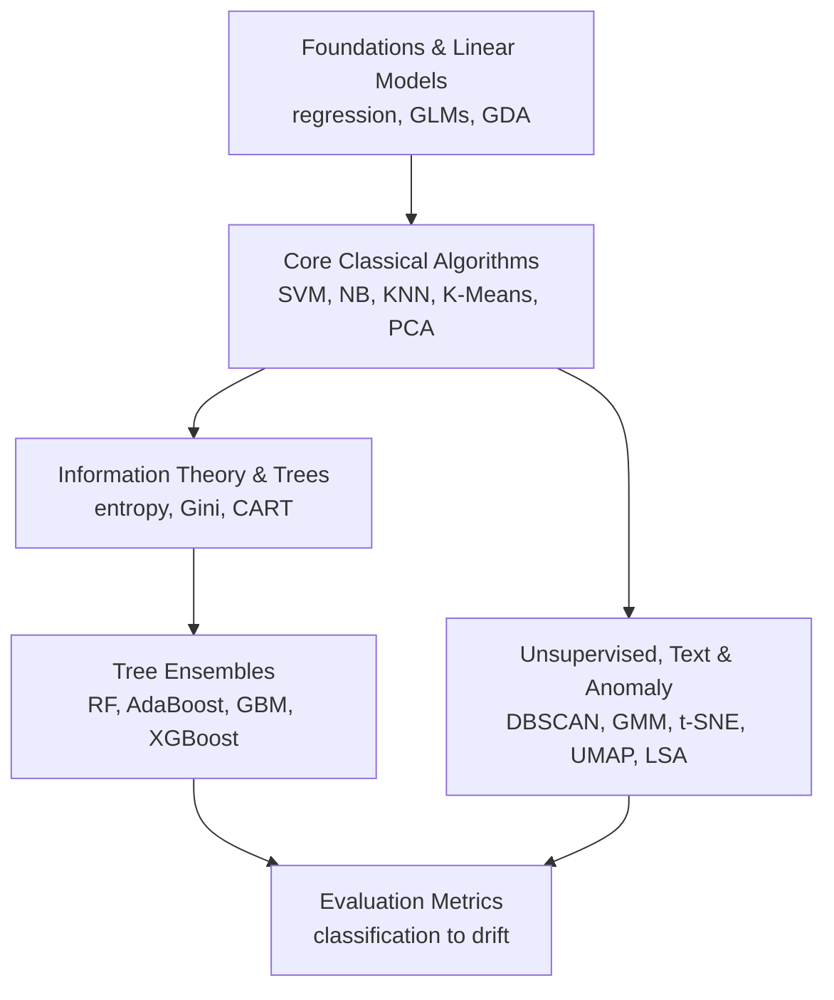

# Classical ML Study Notes

Interview-ready notes on classical machine learning, built for fast recall and deep defense. Every page pairs a short Rapid Recall callout for the ten minutes before a screen with the full derivation underneath for when an interviewer pushes. The material runs as one continuous arc: linear models, the information theory behind splits, single trees, the ensembles that grew from them, unsupervised learning, and the metrics that judge all of it.

!!! tip "Rapid Recall"
    Six topic tracks, one arc. Start with linear models for the optimization and probabilistic foundations, move through information theory and single trees, then tree ensembles. Branch into unsupervised learning for clustering, embeddings, text, and anomaly detection. Close with evaluation metrics, the layer that scores every model above. Each page is self-contained: a framing sentence, a Rapid Recall, the full math, diagrams, and interview questions.

## How the material connects

## Recommended reading order

1. **[Foundations & Linear Models](foundations/index.md)** for the supervised arc: least squares, gradient descent, regularization, logistic regression, GLMs, and GDA.
2. **[Core Classical Algorithms](core-algorithms/index.md)** for SVM, Naive Bayes, KNN, K-Means, and PCA.
3. **[Information Theory & Decision Trees](info-trees/index.md)** for entropy, cross-entropy, KL, Gini, and how a tree is built.
4. **[Tree Ensembles](ensembles/index.md)** to extend trees into bagging, random forests, boosting, GBM, and XGBoost.
5. **[Unsupervised, Text & Anomaly](unsupervised/index.md)** for DBSCAN, hierarchical clustering, GMM/EM, t-SNE, UMAP, TF-IDF, LSA, and Isolation Forest.
6. **[Evaluation Metrics](evaluation/index.md)** as the cross-cutting reference for classification, regression, ranking, generative, vision, RL, clustering, and drift.

## How to use this site

Read the Rapid Recall callout at the top of any page for the compressed version. Drop into the numbered sections when you need the derivation. Diagrams sit next to the paragraph that explains them, and each page ends with interview questions drawn from its own content. Math renders with MathJax, so equations stay selectable and searchable.
