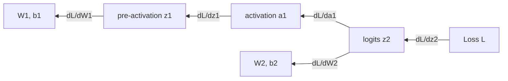

# Backpropagation

The forward pass produced one scalar loss. Now we need to know how to change every weight in the network to reduce that loss. The naive approach is computationally impossible at scale. Backpropagation is the clever algorithm that makes it feasible, and it is nothing more than the chain rule applied through the computational graph, organized so nothing is recomputed.

!!! tip "Rapid Recall"
    We want $\partial L/\partial w$ for every weight. Finite differences could estimate each, but at two forward passes per weight it would take longer than the age of the universe for a large model. Backprop computes all gradients in roughly twice the cost of one forward pass, independent of parameter count, by reusing shared subproblems (it is reverse-mode automatic differentiation, a dynamic-programming use of the chain rule). The mental unlock: treat every operation as a tiny box that knows its forward output and how to turn an upstream gradient into downstream gradients. Chain those local rules in reverse and backprop works for any architecture; shapes force where the transposes go.

## §1 The problem

We have a loss $L$ that depends on every weight. There may be thousands of weights in a small network, billions in a large language model. We want $\partial L/\partial w$ for every weight: "if I increase this weight by a tiny amount, by how much does the loss change?" Once we have all those numbers, the optimizer subtracts them (scaled by the learning rate) and we've taken one training step.

### The naive approach: finite differences

There is a perfectly valid way to estimate any derivative called *finite differences*. Perturb the weight by a tiny amount $\varepsilon$, compute the loss again, take the ratio.

| Symbol | Meaning |
| --- | --- |
| $L(w)$ | Loss as a function of one weight, with all other weights fixed. |
| $\varepsilon$ | A tiny positive number, typically $10^{-5}$ or $10^{-6}$. |
| $\partial L/\partial w$ | The partial derivative we want. |

$$
\begin{aligned}
\text{Forward difference:}\quad & \frac{\partial L}{\partial w} \approx \frac{L(w + \varepsilon) - L(w)}{\varepsilon} \\[6pt]
\text{Central difference (more accurate):}\quad & \frac{\partial L}{\partial w} \approx \frac{L(w + \varepsilon) - L(w - \varepsilon)}{2\varepsilon}
\end{aligned}
$$

This works. It is the ground truth we will use to verify backprop. But it has a fatal cost. Each weight needs two forward passes. For $N$ weights, that is $2N$ forward passes per training step.

For a 1000-parameter toy network, that's 2000 forward passes per step. For a 7-billion-parameter language model, it's 14 billion forward passes per step. Training a modern model would take longer than the age of the universe.

### What backprop promises

Backpropagation computes the gradient with respect to *every parameter* in roughly twice the cost of *one* forward pass. The cost is independent of how many parameters there are. This is what makes deep learning possible.

The trick is exploiting the structure of how the loss depends on the weights. The loss is not an arbitrary function of all weights, it has a specific compositional structure (the forward pass). We use the chain rule of calculus to compute all gradients by walking the computational graph backwards exactly once.

### Why backprop is dynamic programming

Dynamic programming solves a complex problem by breaking it into overlapping subproblems and reusing solutions. Backpropagation organizes the chain rule so each intermediate gradient is computed exactly once, then reused for everything downstream.

The gradient with respect to a layer-1 weight involves the chain rule going all the way from the loss back to that weight, multiplying local derivatives at every step. The gradient with respect to a layer-2 weight involves almost the same chain, it shares all the steps from the loss down to layer 2. Backprop walks backwards from the loss to layer $L$, then $L-1$, then $L-2$, and so on, maintaining a "running upstream gradient" at each step. The shared subproblem (the upstream gradient) is computed once.

This is the same algorithmic pattern as Bellman equations in RL, Viterbi for HMMs, or Floyd-Warshall for all-pairs shortest paths. The technical name is *reverse-mode automatic differentiation*.

### The chain rule, the only calculus you need

$$
\begin{aligned}
\text{If } y = f(g(x)):\quad & \frac{dy}{dx} = \frac{dy}{dg} \cdot \frac{dg}{dx} \\[6pt]
\text{For a chain of length } n:\quad & \frac{dy}{dx} = \frac{dy}{df_n} \cdot \frac{df_n}{df_{n-1}} \cdots \frac{df_2}{df_1} \cdot \frac{df_1}{dx}
\end{aligned}
$$

The chain rule composes local rates of change. If $y$ changes at twice the rate of $g$, and $g$ changes at three times the rate of $x$, then $y$ changes at six times the rate of $x$. Product of local rates equals total rate.

That is it. Backpropagation is the chain rule, applied repeatedly through the computational graph, organized so nothing is recomputed.

!!! note "Finite differences is your verifier"
    Backprop is only correct if it agrees with finite differences. When you implement backprop from scratch, sanity-check by computing one or two gradients with central differences and comparing. Relative error should be around $10^{-7}$ to $10^{-9}$ (limited only by floating-point precision). If you get $10^{-1}$, you have a bug, usually a missing transpose or sign error. The [full derivation](backprop-derivation.md) page walks a complete numerical verification.

## §2 Local rules for each operation

The mental shift that unlocks backpropagation for any architecture: stop thinking about the whole network. Think of each operation as a tiny black box that knows two things, its output given inputs (forward), and how to turn an incoming gradient into outgoing gradients for each input (backward).

If every operation knows how to do these two things locally, you can chain them into any network and backprop works. PyTorch's autograd, JAX's grad, TensorFlow's GradientTape are all clever implementations of this. For each operation, "backward" means: given the upstream gradient $\partial L/\partial \text{output}$ (already computed when we reach this operation walking backwards), produce the downstream gradients $\partial L/\partial \text{input}$ for each input the operation took.

### Multiply: z = a · b

$$
\begin{aligned}
\textbf{Forward:}\quad & z = a \cdot b \\[4pt]
\textbf{Backward (given } \tfrac{\partial L}{\partial z}\text{):}\quad
& \frac{\partial L}{\partial a} = \frac{\partial L}{\partial z} \cdot b \quad \text{(gradient uses the OTHER input)} \\
& \frac{\partial L}{\partial b} = \frac{\partial L}{\partial z} \cdot a \quad \text{(gradient uses the OTHER input)}
\end{aligned}
$$

The derivative of $a \cdot b$ with respect to $a$ is just $b$ (treating $b$ as a constant from $a$'s perspective). Chain rule multiplies by the upstream gradient. Pattern: **each input's gradient is the upstream gradient times the OTHER input.** This same pattern appears in matrix multiplication with transposes.

### Add: z = a + b

$$
\textbf{Backward:}\quad \frac{\partial L}{\partial a} = \frac{\partial L}{\partial z}, \qquad \frac{\partial L}{\partial b} = \frac{\partial L}{\partial z}
$$

Derivative of $a + b$ with respect to $a$ is 1. **Addition distributes the gradient** to both inputs unchanged. This is why bias gradients in a linear layer just sum the upstream gradient over the batch.

### ReLU: a = max(0, z)

$$
\textbf{Backward:}\quad \frac{\partial L}{\partial z} = \frac{\partial L}{\partial a} \cdot \mathbb{1}[z > 0] \quad \text{(1 where active, 0 where dead)}
$$

ReLU passes positive values through unchanged (slope 1) and clamps negative values to zero (slope 0). **ReLU acts as a gradient gate**, gradients flow through if the unit was firing, blocked if it was dormant.

### Sigmoid: σ(z) = 1 / (1 + e⁻ᶻ)

$$
a = \sigma(z) = \frac{1}{1 + e^{-z}}, \qquad \sigma'(z) = \sigma(z)\,(1 - \sigma(z)) = a\,(1 - a), \qquad \frac{\partial L}{\partial z} = \frac{\partial L}{\partial a} \cdot a\,(1 - a)
$$

The derivative is largest when $\sigma(z) = 0.5$ (where it equals 0.25), and approaches zero when $\sigma(z)$ is near 0 or 1. This 0.25 maximum is the source of [vanishing gradients](../gradient-flow/vanishing-gradients.md) with sigmoid.

### Tanh

$$
\tanh'(z) = 1 - \tanh(z)^2 \quad \text{(max derivative} = 1 \text{ at } z = 0)
$$

Slightly better than sigmoid for vanishing gradients because peak derivative is 1, not 0.25. But still saturates for large $|z|$.

### MSE loss: L = (ŷ − y)²

$$
\textbf{Backward (upstream } \tfrac{\partial L}{\partial L} = 1\text{):}\quad \frac{\partial L}{\partial \hat{y}} = 2\,(\hat{y} - y)
$$

### Matrix multiplication: Y = X · W

The most important one, and where transposes confuse people. Let me motivate, then state.

| Symbol | Meaning |
| --- | --- |
| $X$ | Input matrix. Shape $(B, D_{in})$. $B$ = batch size, $D_{in}$ = input features. |
| $W$ | Weight matrix. Shape $(D_{in}, D_{out})$. |
| $Y$ | Output matrix. Shape $(B, D_{out})$. Computed as $Y = X \cdot W$. |
| $\partial L/\partial Y$ | Upstream gradient. Shape $(B, D_{out})$, same shape as $Y$. |

Gradients always have the same shape as the variable they are gradients of. Just like in scalar multiplication, each gradient is the upstream gradient combined with the OTHER input. But now we need matrix multiplication with appropriate transposes.

$$
\begin{aligned}
\textbf{Forward:}\quad & Y = X \cdot W && (B, D_{in}) \cdot (D_{in}, D_{out}) \to (B, D_{out}) \\[4pt]
\textbf{Backward:}\quad & \frac{\partial L}{\partial X} = \frac{\partial L}{\partial Y} \cdot W^{\top} && (B, D_{out}) \cdot (D_{out}, D_{in}) \to (B, D_{in}) \\
& \frac{\partial L}{\partial W} = X^{\top} \cdot \frac{\partial L}{\partial Y} && (D_{in}, B) \cdot (B, D_{out}) \to (D_{in}, D_{out})
\end{aligned}
$$

!!! note "The transpose trick, never memorize, derive from shapes"
    You don't need to memorize where transposes go. Write the shapes; transposes are forced. $\partial L/\partial X$ must be $(B, D_{in})$. You have $\partial L/\partial Y$ of shape $(B, D_{out})$ and $W$ of shape $(D_{in}, D_{out})$. The only matmul that produces $(B, D_{in})$ is $\partial L/\partial Y \cdot W^{\top}$. Same for $\partial L/\partial W$. **Shapes determine the formula.** Under interview pressure, just write the shapes.

### Composing operations

To backprop through a whole network, chain these local backwards in reverse order of the forward pass. Output of one backward becomes upstream gradient for the next. Walk backwards, multiplying by each operation's local Jacobian.

### Weight sharing: gradients sum

If the same parameter appears multiple times in the graph, the same weight matrix used at every RNN time step, the same convolution kernel applied at every spatial location, what does its gradient look like?

**The gradients sum.** Total gradient with respect to a shared parameter is the sum of its gradients at each occurrence. This follows from linearity of differentiation: if the loss depends on a parameter through multiple paths, total derivative = sum of derivatives along each path.

This is why RNN training accumulates gradients through time. The same recurrent $W_h$ is used at every time step, so backprop-through-time adds up contributions from every step. CNN kernel gradients similarly sum across spatial positions.

## Interview Questions

**Q1: If a weight is shared across the network, how do gradients combine?**

They sum. Differentiation is linear, so a shared parameter's total gradient is the sum of its gradients computed at each occurrence in the computational graph. This is why RNN gradients sum across time steps (same recurrent weight matrix used at every step) and CNN kernel gradients sum across spatial positions (same kernel applied at every spatial location).
