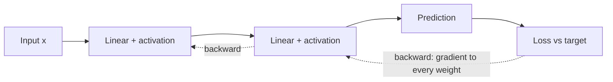

# Foundations

This section is the mechanical core of everything else on the site: what a neural network actually computes, how it makes a prediction, how it measures error, and how it assigns blame to every weight so it can improve. Read it first, because optimization, normalization, losses, and the vision and sequence architectures all assume this machinery.

!!! tip "Rapid Recall"
    A neural network is a stack of learned transformations, and training is just two passes repeated millions of times: a forward pass to predict and measure error, and a backward pass to figure out how to change every weight to shrink that error. Each layer is a linear transformation (matrix multiply plus bias) followed by a nonlinearity; without the nonlinearity the whole stack collapses to a single linear layer. A loss function turns "how wrong was the prediction" into one scalar, and the optimizer nudges every knob to make it smaller. Almost every concept you will meet fits one of five buckets: predicting, assigning blame, taking the step, staying stable, and not overfitting.

## §1 What a neural network actually is, mechanically

Before any equation, here is the one-sentence summary everything else hangs off of: **a neural network is a stack of learned transformations, and training is just two passes repeated millions of times**, a forward pass to make a prediction and measure error, and a backward pass to figure out how to change every weight to make the error smaller.

Picture a factory assembly line. Raw materials (your input, say an image or a sentence) enter at one end. They pass through stations called *layers*. Each station does two things in sequence: it applies a *linear transformation* (a matrix multiplication plus a bias offset), and then a *nonlinear function* (an activation like ReLU or GELU). After the last station, a final product (the prediction) emerges.

Every station has knobs on it. Those knobs are the *weights* and *biases*, the learnable parameters. A small network has thousands of them. A large language model has billions. Training is the process of turning those knobs to minimize the error.

How does the network know what error means? A *loss function* sits at the end of the assembly line and compares the prediction to the correct answer, outputting a single number measuring how wrong it was. Training nudges every knob in the direction that makes this number smaller. One mini-batch at a time. Millions of times.

### Why it is called "neural"

The biological inspiration is historical and largely metaphorical. Each unit in a layer takes weighted inputs, sums them, applies a nonlinearity, and passes the result on, which loosely resembles a biological neuron firing when its inputs exceed a threshold. In practice, modern neural networks have almost nothing to do with biology. They are matrix operations on GPUs. Treat the word "neuron" as a quaint label for "one row of a matrix multiplication."

## §2 The five buckets every concept lives in

If you can place any technique you encounter into one of these five buckets, you understand why it exists:

- **Making predictions (forward pass).** Input goes through layers of linear + activation pairs. Without activations, the entire stack collapses to a single linear transformation. We prove this on the [Forward Pass](forward-pass.md) page.
- **Assigning blame (backpropagation).** Given that the prediction was wrong by some amount, how much is each weight responsible? Backpropagation computes the partial derivative of the loss with respect to every weight in roughly the cost of one extra forward pass. See [Backpropagation](backpropagation.md).
- **Taking the step (optimizers).** Once we know each weight's gradient, how do we update it? Subtracting the gradient is the simplest answer (SGD); doing it smarter (Momentum, RMSProp, Adam, AdamW) is the entire [optimizer family](../optimization/index.md).
- **Keeping it stable (normalization, clipping, residuals, good init, warmup).** Deep networks have a fundamental gradient-flow problem. Gradients can vanish to zero or explode to infinity as they propagate through depth. Every technique in the [Gradient Flow](../gradient-flow/index.md) section exists to prevent that.
- **Not overfitting (dropout, weight decay, early stopping, label smoothing).** A network with enough parameters can memorize the training data perfectly while failing on new data. These [regularization](../regularization/regularization.md) techniques trade a small amount of training fit for better generalization.

!!! note "The single unifying insight"
    Almost every loss function is the negative log-likelihood of an assumed probability distribution. Mean squared error assumes Gaussian noise on targets. Cross-entropy assumes Bernoulli or categorical outputs. Mean absolute error assumes Laplacian noise. And L2 weight decay is MAP estimation with a Gaussian prior on the weights. **Choosing your loss and your regularizer is implicitly choosing your generative model of the data.** Once you see this, the field becomes much less arbitrary. The [Loss Functions](../losses/index.md) section develops this fully.

The rest of this section walks the first two buckets in full: the [forward pass](forward-pass.md), the [training loop](training-loop.md) that wraps it, [why backpropagation exists](backpropagation.md), the [full 2-layer derivation](backprop-derivation.md), and a [complete training pipeline](training-pipeline.md) that ties everything together in runnable code.
