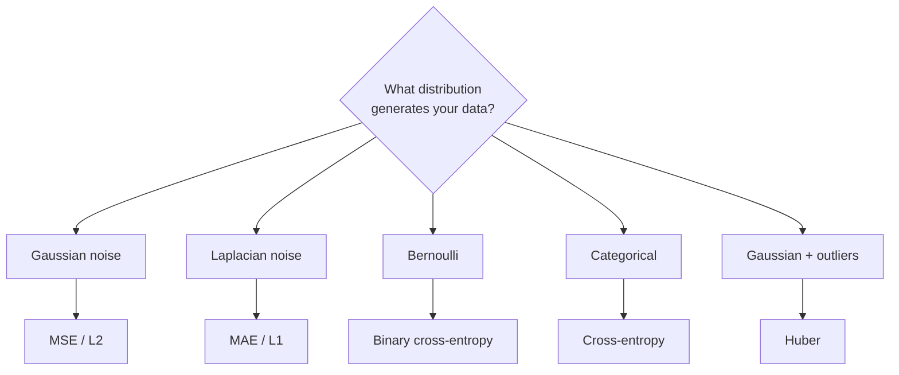

# Loss Functions

The loss encodes what you want the model to learn. The unifying insight that makes the whole field click: **almost every standard loss is the negative log-likelihood of an assumed probability distribution.** Once you see that, you stop memorizing losses and start deriving them from the distribution your data follows.

!!! tip "Rapid Recall"
    Pick a distribution for how your data is generated, write its log-likelihood, negate it, and that is your loss; minimizing it is maximum likelihood under that distribution. Gaussian noise gives MSE (predicts the mean), Laplacian gives MAE (predicts the median), Bernoulli gives binary cross-entropy, categorical gives cross-entropy. Three things pick your loss: task type, the output distribution assumption, and practical concerns like outliers, imbalance, and calibration. Your loss is your generative model of the data; your regularizer is your prior on the weights.

## §1 The big picture

A loss function maps (prediction, target) → scalar. Three things determine your choice:

- **Task type**, regression, classification, ranking, generation, embedding.
- **Output distribution assumption**, what probability model are you implicitly assuming?
- **Practical concerns**, outliers, class imbalance, calibration, gradient behavior.

## §2 The unifying frame

Pick a distribution that describes how your data is generated. Write down its log-likelihood. Take the negative. Use that as your loss. Minimizing this loss is equivalent to maximum likelihood estimation under that distribution.

$$
\begin{aligned}
\textbf{Maximum likelihood:}\quad & \text{maximize } P(\text{data} \mid \theta) = \prod_i P(y_i \mid x_i, \theta) \\[4pt]
\textbf{Taking log (monotonic):}\quad & \text{maximize } \sum_i \log P(y_i \mid x_i, \theta) \\[4pt]
\textbf{Equivalently:}\quad & \text{minimize } \underbrace{-\sum_i \log P(y_i \mid x_i, \theta)}_{\text{negative log-likelihood (NLL), your loss}}
\end{aligned}
$$

## §3 The distribution-to-loss mapping

| Assumption on data | Loss it implies | What model predicts |
| --- | --- | --- |
| $y = \hat{y} + $ Gaussian noise | MSE / L2 | Mean of conditional distribution |
| $y = \hat{y} + $ Laplacian noise | MAE / L1 | Median of conditional distribution |
| $y$ is Bernoulli | Binary cross-entropy | $P(y=1 \mid x)$ |
| $y$ is Categorical | Cross-entropy | $P(\text{class} = c \mid x)$ for each $c$ |
| Multiple Bernoullis (multi-label) | BCE per label | $P(\text{each label is positive})$ |
| Robust noise (Gaussian + outliers) | Huber | Mean-like, outlier-robust |
| Asymmetric Laplacian | Quantile (pinball) | An arbitrary quantile |

This is the same pattern as L2 weight decay = MAP estimation with a Gaussian prior on weights. **Your loss is your generative model of the data; your regularizer is your prior on the weights.**

!!! note "The realization"
    Once you see this, you stop memorizing losses as arbitrary functions. Instead you ask: what is the distribution I think my data follows? Heavy-tailed? Use MAE. Asymmetric? Use quantile loss. Discrete categories? Use cross-entropy. The loss falls out of the model assumption.

## §4 The families in this section

- [Regression losses](regression-losses.md): MSE, MAE, Huber, Quantile.
- [Classification losses](classification-losses.md): BCE, categorical cross-entropy, focal, hinge, label smoothing, KL and JS divergence.
- [Ranking and metric learning](ranking-losses.md): triplet, contrastive, InfoNCE/NT-Xent, pairwise ranking.
- [LLM and generation losses](llm-losses.md): next-token cross-entropy, MLM, RLHF/PPO, DPO, GRPO.

!!! warning "Common loss traps"
    **Why not accuracy as a loss?** Not differentiable. A step function with zero gradient almost everywhere. **MSE vs MAE, which to use?** Depends on outlier philosophy. MSE = mean = "all errors matter, big ones more." MAE = median = "extreme outliers do not dominate." **Why does cross-entropy + softmax give such a clean gradient?** The exp in softmax and the log in cross-entropy cancel, the derivative reduces to $\hat{y} - y$. **What is wrong with using MSE for classification?** Vanishing gradients when sigmoid saturates; cross-entropy was designed to keep gradients large when the model is confidently wrong. **How does label smoothing affect calibration?** Improves it.

## Interview Questions

**Q1: Why not use accuracy as a loss function?**

Not differentiable. Accuracy is a step function, argmax produces a discrete output, and the loss either improves by $1/N$ (got one more right) or doesn't change. The gradient is zero almost everywhere and undefined at the threshold. You cannot do gradient descent on it. Cross-entropy is the differentiable surrogate that we minimize instead. It produces calibrated probabilities that, when argmax'd, give the same classification decisions, but with smooth gradients that can be optimized.
