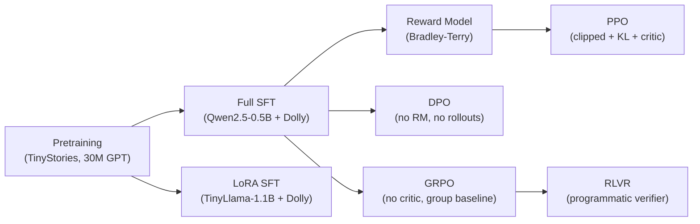

# Build From Scratch

Three notebook walkthroughs that together cover the full LLM lifecycle in pure PyTorch on a free Colab T4: pretrain a small decoder-only transformer, supervised-fine-tune it (full SFT + LoRA), then align it with four different RL methods (RM, PPO, DPO, GRPO) plus RLVR.

!!! tip "Rapid Recall"
    The three notebooks compose into the same pipeline a frontier lab runs at scale: pretraining → SFT → alignment. The pretraining notebook builds a 30M-param GPT-style model on TinyStories with RoPE, RMSNorm, SwiGLU, weight tying, AdamW with 8-bit and paged variants, cosine LR with warmup, mixed precision, and checkpointing. The SFT notebook shows both full SFT (Qwen2.5-0.5B) and LoRA SFT (TinyLlama-1.1B) on Dolly-15K, with assistant-only loss masking as the central concept. The alignment notebook implements RM with Bradley-Terry, PPO with clipped surrogate plus KL, DPO from preference pairs (no rollouts), GRPO with group-relative advantage, and RLVR with a deterministic verifier — all on the same vowel-count toy task so the methods are directly comparable.

## Why a toy task for alignment?

A toy environment where the reward is `count_vowels(continuation)` makes every alignment method directly comparable on one model. You can run hundreds of rollouts in minutes, watch mean reward climb in real time, and inspect outputs by eye. The same code generalizes to real verifiable rewards (math correctness, code passing tests) by swapping the reward function — that is exactly the RLVR recipe DeepSeek-R1 used.

## The pipeline

## Reading order

1. **[Pretraining on TinyStories](pretraining-tinystories.md)** — the most code-heavy page. Builds every block of the model from scratch and trains it.
2. **[SFT Walkthrough](sft-walkthrough.md)** — chat templates, assistant-only loss masking, padding collator, full SFT, then LoRA SFT, then a peek at TRL's production shortcut.
3. **[Alignment Walkthrough](alignment-walkthrough.md)** — RM, PPO, DPO, GRPO, RLVR on one toy task with a side-by-side comparison plot.

## What you can claim after this

- "I wrote every line of a decoder-only transformer in PyTorch: RoPE, RMSNorm, SwiGLU, weight tying, scaled init."
- "I trained a custom BPE tokenizer, packed sequences for efficient training, and used cosine LR with warmup."
- "I compared standard AdamW vs 8-bit vs paged optimizers and understood the memory tradeoff."
- "I built full SFT and LoRA SFT side by side and can explain why the LR is 20× higher for LoRA."
- "I implemented PPO, DPO, GRPO, and RLVR from scratch on the same toy task and can speak to when each wins."
