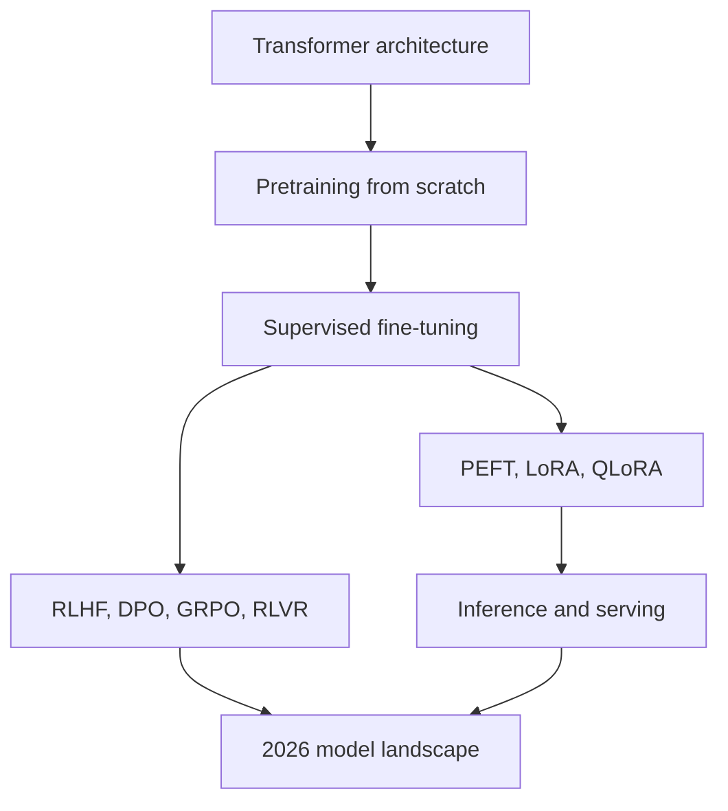

# LLM Study Notes

Interview-ready deep dives across the modern LLM stack, written for AI engineering and AI PM roles in 2026. Every page leads with a Rapid Recall callout for the night before a screen, then the full canonical prose for true study, with interview questions at the end of each topic.

## Three reading paths

Pick the path that matches what you are trying to do today. All three reuse the same pages, just in different orders.

### 1. Build From Scratch (hands-on)

Pretrain a small decoder-only transformer, fine-tune it, then align it. All in pure PyTorch on a free Colab T4.

- [Pretraining on TinyStories](build-from-scratch/pretraining-tinystories.md)
- [SFT walkthrough (Qwen full + TinyLlama LoRA)](build-from-scratch/sft-walkthrough.md)
- [Alignment walkthrough (RM, PPO, DPO, GRPO, RLVR on a toy task)](build-from-scratch/alignment-walkthrough.md)

### 2. Interview Explainer

Concept-first, math-second, code last. Each page follows a repeatable shape: Rapid Recall, story, math, tradeoffs, interview questions.

- [Foundations: Transformer Architecture](foundations/index.md)
- [Post-Training: SFT](sft/index.md)
- [PEFT: LoRA and QLoRA](peft/index.md)
- [Inference and Serving](serving/index.md)
- [2026 Landscape](landscape/index.md)

### 3. HTML Deep-Dive

The longest derivations and the most complete failure-mode catalogs. Read these when you want to be the person in the room who actually understands the math.

- [Attention, normalization, positional encodings](foundations/attention.md)
- [MLE, MAP, Bradley-Terry, PPO, DPO, GRPO, RLVR](alignment/index.md)
- [LoRA mechanics, NF4 math, paged optimizers](peft/index.md)
- [Prefill vs decode, KV-cache, Flash Attention, MoE, MLA](inference-arch/index.md)

## Section graph

## How each page is organized

Every content page follows the same rigid shape so you can navigate by muscle memory.

1. **One-paragraph framing** at the top tells you what this page is and why it matters.
2. **Rapid Recall** is the dense TL;DR for fast revision. Three to six sentences, no fluff.
3. **The body** is the deep canonical source, reformatted with H2 and H3 headings so the page TOC gives jump-to-section anchors. Diagrams sit inline next to the paragraph that explains them.
4. **Interview Questions** at the bottom are distributed per topic. The hard ones are flagged as traps.

Cross-links between pages use plain relative paths. If a concept appears in two places, the version that does the deepest job is canonical; the other links to it.
