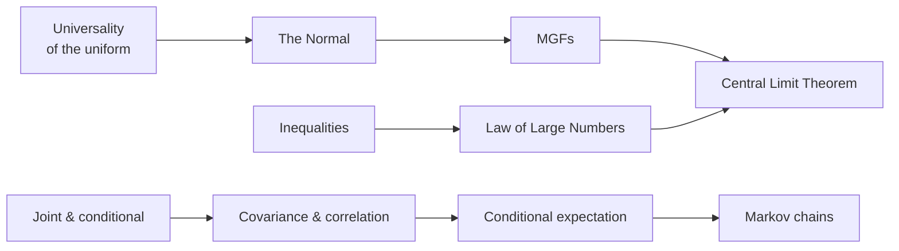

# Advanced Probability

The deepest layer of the probability track: how a single uniform generates every distribution, why the
normal is inevitable, the moment-generating function as a distribution's fingerprint, multivariate
probability and covariance, the inequalities that bound the unknown, the limit theorems at the heart of
statistics, and Markov chains. Intuition first, with every derivation intact.

!!! tip "Rapid Recall"
    The universality of the uniform says any distribution is a warped uniform via its inverse CDF, which is
    why one RNG simulates anything. The normal's bell shape is forced by symmetry and decay, with its
    $\sqrt{2\pi}$ constant pinned by the Gaussian integral. The MGF $E(e^{tX})$ stores every moment and turns
    independent sums into products. Joint, marginal, and conditional distributions are one landscape seen
    three ways; covariance measures linear co-movement and correlation standardizes it. The inequalities
    (Cauchy-Schwarz, Jensen, Markov, Chebyshev) bound probabilities under partial knowledge. The law of large
    numbers gives the destination and the central limit theorem gives the shape of the approach. Markov chains
    hop between states where only the present matters, and their stationary distribution is a left
    eigenvector.

## What this section covers

- [Universality of the Uniform & the Normal](uniform-normal.md): simulation and flattening, and the Gaussian from scratch.
- [Moment-Generating Functions](mgf.md): the fingerprint that stores every moment and proves sums.
- [Joint Distributions & Covariance](joint-covariance.md): joint, marginal, conditional, covariance, and correlation.
- [Conditional Expectation & Inequalities](conditional-inequalities.md): the best predictor, Adam's and Eve's laws, and the four inequalities.
- [Law of Large Numbers & CLT](lln-clt.md): the two halves of the heart of statistics.
- [Markov Chains](markov-chains.md): transition matrices, evolution, and the stationary distribution.

## The arc of the section

