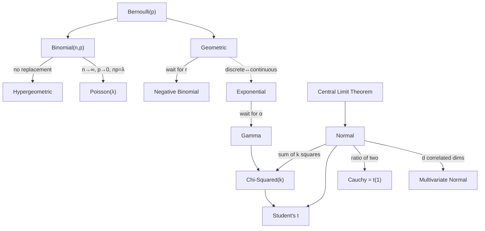

# Distribution Cheat Sheet

Every distribution worth knowing, in one comparable grid: what it models, when to reach for it, its PMF or
PDF, and its mean and variance. This is a lookup companion to the probability track, intuition first and
formulas as scaffolding. The real memory trick is not eighteen islands but one family tree.

!!! tip "Rapid Recall"
    Discrete distributions carry probability in a mass function (height is probability); continuous ones
    carry it in a density (area is probability, a single point has probability zero). Almost everything
    sprouts from Bernoulli trials and the Normal: sum Bernoullis to get a binomial, drop replacement for the
    hypergeometric, push trials high and probability low for the Poisson. Geometric and exponential are the
    memoryless twins, negative binomial and gamma are their "wait for the rth event" generalizations, and
    squared normals build the chi-squared, which feeds Student's t and the F. The central limit theorem is
    the grand unifier that bends sums of many small effects toward the Normal.

## What this section covers

- [Discrete Distributions](discrete.md): the eight integer-outcome distributions, from Bernoulli to the multinomial.
- [Continuous Distributions](continuous.md): the ten real-valued distributions, from the uniform to the multivariate normal.
- [Big Ideas](big-ideas.md): the threads that compress the whole grid into a few reusable rules.

## How they all connect

This map is the real memory trick. Do not memorize 18 islands, memorize one family tree. Almost everything
sprouts from Bernoulli trials and the Normal.

- Sum of $n$ independent **Bernoulli(p)** trials equals **Binomial(n,p)**.
- **Binomial** done *without* replacement becomes **Hypergeometric**.
- **Binomial** with $n$ huge, $p$ tiny, $np=\lambda$ fixed limits to **Poisson($\lambda$)**.
- **Geometric** is wait for the 1st success; **Negative Binomial** is wait for the $r$-th success (Geometric is NB with $r=1$).
- **Geometric** is the *discrete* memoryless distribution; **Exponential** is the *continuous* one, same idea, different clock.
- **Exponential** is wait for the 1st event; **Gamma** is wait for the $\alpha$-th event (a sum of $\alpha$ exponentials). Exponential is Gamma with $\alpha=1$.
- Sum of $k$ squared standard **Normals** equals **Chi-Squared($k$)**, which is itself a special **Gamma**.
- A standard **Normal** divided by $\sqrt{\chi^2/\nu}$ equals **Student's t($\nu$)**; as $\nu\to\infty$, t goes to Normal.
- Ratio of two standard **Normals** equals **Cauchy** equals Student's t with $\nu=1$.
- **Multinomial** generalizes **Binomial** to $k$ categories; **Multivariate Normal** generalizes **Normal** to $d$ correlated dimensions.
- **Beta** is the conjugate prior for **Binomial**; **Gamma** is the conjugate prior for **Poisson**. (Bayesian pairings.)
- The grand unifier, the **Central Limit Theorem**: the average of many independent things, whatever their distribution, drifts toward the **Normal**. (Cauchy is the famous exception, because it has no mean.)

